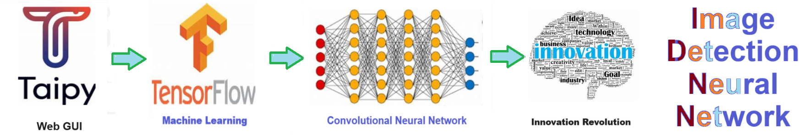

# Taipy Web Gui - Machine learning with Taipy web GUI and tensorflow ML
Machine learning with Taipy web GUI and tensorflow ML



## Overview of taipy_web_gui.ipynb

Here’s a **README.md** file for the **Taipy Web GUI and TensorFlow ML** project in the `taipy_web_gui.ipynb` repository:

---

# Machine Learning with Taipy Web GUI and TensorFlow

This project demonstrates how to use **Taipy** to build a **web-based graphical user interface (GUI)** that integrates with **TensorFlow** machine learning models. The notebook `taipy_web_gui.ipynb` showcases how you can design interactive applications with Taipy, allowing users to interact with ML models through a web interface, making the machine learning workflow more accessible and intuitive.

## Table of Contents
- [Introduction](#introduction)
- [Features](#features)
- [Installation](#installation)
- [Usage](#usage)
- [Project Overview](#project-overview)
- [Taipy Workflow](#taipy-workflow)
- [TensorFlow Integration](#tensorflow-integration)
- [Contributing](#contributing)

## Introduction

The goal of this project is to demonstrate how **Taipy** can be used to create dynamic, web-based applications that interact seamlessly with **TensorFlow** models. This allows for real-time data visualization, model predictions, and easy interaction with machine learning processes, all within a browser-based GUI.

**Taipy** is a Python framework for creating interactive applications, dashboards, and user interfaces. Combined with **TensorFlow**, this enables developers to build machine learning models and deploy them in a user-friendly web interface without requiring deep web development expertise.

## Features

- Web-based user interface built using **Taipy**.
- Integration with **TensorFlow** for machine learning predictions.
- Real-time data visualization and model output in the browser.
- Easy-to-understand interface for interacting with machine learning models.
- Customizable for different machine learning tasks, such as classification or regression.

## Installation

1. **Clone the Repository**:

   ```bash
   git clone https://github.com/yourusername/taipy_web_gui.git
   cd taipy_web_gui
   ```

2. **Install Dependencies**:

   Install the necessary Python packages via `pip`:

   ```bash
   pip install -r requirements.txt
   ```

   **Key Dependencies**:
   - **Taipy**
   - **TensorFlow**
   - **Pandas**
   - **Matplotlib**

   Ensure you have a compatible version of Python (3.7+ recommended).

## Usage

1. **Run the Jupyter Notebook**:

   Launch the Jupyter Notebook:

   ```bash
   jupyter notebook taipy_web_gui.ipynb
   ```

2. **Start the Taipy Web Application**:

   Follow the instructions in the notebook to initialize and run the Taipy web server. This will allow you to interact with the TensorFlow models through a web-based GUI in your browser.

3. **Interact with the ML Models**:

   Use the web GUI to upload datasets, modify model parameters, and view predictions in real-time. The interface will allow you to visualize data, train models, and make predictions using TensorFlow models integrated into the backend.

## Project Overview

This project integrates **Taipy** and **TensorFlow** into a single solution, where:

- **Taipy** handles the frontend, providing a web-based interface for users.
- **TensorFlow** performs machine learning tasks such as training and prediction in the backend.
- The notebook walks you through the steps of creating a machine learning model in TensorFlow and deploying it via Taipy for user interaction.

## Taipy Workflow

Taipy is used in this project to:

- Create a **dynamic GUI** that allows users to upload data and interact with machine learning models.
- Build a **dashboard** to display real-time visualizations of input data and model performance.
- Run **interactive model predictions** based on user inputs.

## TensorFlow Integration

- The **TensorFlow** models in this project handle machine learning tasks such as classification or regression. You can train, test, and deploy TensorFlow models using the Taipy interface.
- TensorFlow’s flexible architecture makes it possible to integrate a wide range of models, from simple linear regressions to deep neural networks, which are controlled via the Taipy GUI.

## Contributing

Contributions are welcome! To contribute:

1. Fork the repository.
2. Create a new branch (`git checkout -b feature-branch`).
3. Make your changes and commit (`git commit -m 'Add new feature'`).
4. Push to the branch (`git push origin feature-branch`).
5. Open a pull request.

---

This **README.md** file provides a clear and concise guide for users to understand and get started with the project, highlighting the integration between **Taipy** and **TensorFlow** for creating interactive machine learning applications.


 


# Taipy Web Gui - Machine learning with Taipy web GUI and tensorflow ML
Machine learning with Taipy web GUI and tensorflow ML


## Overview of taipy_web_gui.ipynb

Here’s a **README.md** file for the **Taipy Web GUI and TensorFlow ML** project in the `taipy_web_gui.ipynb` repository:

---

# Machine Learning with Taipy Web GUI and TensorFlow

This project demonstrates how to use **Taipy** to build a **web-based graphical user interface (GUI)** that integrates with **TensorFlow** machine learning models. The notebook `taipy_web_gui.ipynb` showcases how you can design interactive applications with Taipy, allowing users to interact with ML models through a web interface, making the machine learning workflow more accessible and intuitive.

## Table of Contents
- [Introduction](#introduction)
- [Features](#features)
- [Installation](#installation)
- [Usage](#usage)
- [Project Overview](#project-overview)
- [Taipy Workflow](#taipy-workflow)
- [TensorFlow Integration](#tensorflow-integration)
- [Contributing](#contributing)

## Introduction

The goal of this project is to demonstrate how **Taipy** can be used to create dynamic, web-based applications that interact seamlessly with **TensorFlow** models. This allows for real-time data visualization, model predictions, and easy interaction with machine learning processes, all within a browser-based GUI.

**Taipy** is a Python framework for creating interactive applications, dashboards, and user interfaces. Combined with **TensorFlow**, this enables developers to build machine learning models and deploy them in a user-friendly web interface without requiring deep web development expertise.

## Features

- Web-based user interface built using **Taipy**.
- Integration with **TensorFlow** for machine learning predictions.
- Real-time data visualization and model output in the browser.
- Easy-to-understand interface for interacting with machine learning models.
- Customizable for different machine learning tasks, such as classification or regression.

## Installation

1. **Clone the Repository**:

   ```bash
   git clone https://github.com/yourusername/taipy_web_gui.git
   cd taipy_web_gui
   ```

2. **Install Dependencies**:

   Install the necessary Python packages via `pip`:

   ```bash
   pip install -r requirements.txt
   ```

   **Key Dependencies**:
   - **Taipy**
   - **TensorFlow**
   - **Pandas**
   - **Matplotlib**

   Ensure you have a compatible version of Python (3.7+ recommended).

## Usage

1. **Run the Jupyter Notebook**:

   Launch the Jupyter Notebook:

   ```bash
   jupyter notebook taipy_web_gui.ipynb
   ```

2. **Start the Taipy Web Application**:

   Follow the instructions in the notebook to initialize and run the Taipy web server. This will allow you to interact with the TensorFlow models through a web-based GUI in your browser.

3. **Interact with the ML Models**:

   Use the web GUI to upload datasets, modify model parameters, and view predictions in real-time. The interface will allow you to visualize data, train models, and make predictions using TensorFlow models integrated into the backend.

## Project Overview

This project integrates **Taipy** and **TensorFlow** into a single solution, where:

- **Taipy** handles the frontend, providing a web-based interface for users.
- **TensorFlow** performs machine learning tasks such as training and prediction in the backend.
- The notebook walks you through the steps of creating a machine learning model in TensorFlow and deploying it via Taipy for user interaction.

## Taipy Workflow

Taipy is used in this project to:

- Create a **dynamic GUI** that allows users to upload data and interact with machine learning models.
- Build a **dashboard** to display real-time visualizations of input data and model performance.
- Run **interactive model predictions** based on user inputs.

## TensorFlow Integration

- The **TensorFlow** models in this project handle machine learning tasks such as classification or regression. You can train, test, and deploy TensorFlow models using the Taipy interface.
- TensorFlow’s flexible architecture makes it possible to integrate a wide range of models, from simple linear regressions to deep neural networks, which are controlled via the Taipy GUI.

## Contributing

Contributions are welcome! To contribute:

1. Fork the repository.
2. Create a new branch (`git checkout -b feature-branch`).
3. Make your changes and commit (`git commit -m 'Add new feature'`).
4. Push to the branch (`git push origin feature-branch`).
5. Open a pull request.

---

This **README.md** file provides a clear and concise guide for users to understand and get started with the project, highlighting the integration between **Taipy** and **TensorFlow** for creating interactive machine learning applications.


 


# Taipy Web Gui - Machine learning with Taipy web GUI and tensorflow ML
Machine learning with Taipy web GUI and tensorflow ML


## Overview of taipy_web_gui.ipynb

Here’s a **README.md** file for the **Taipy Web GUI and TensorFlow ML** project in the `taipy_web_gui.ipynb` repository:

---

# Machine Learning with Taipy Web GUI and TensorFlow

This project demonstrates how to use **Taipy** to build a **web-based graphical user interface (GUI)** that integrates with **TensorFlow** machine learning models. The notebook `taipy_web_gui.ipynb` showcases how you can design interactive applications with Taipy, allowing users to interact with ML models through a web interface, making the machine learning workflow more accessible and intuitive.

## Table of Contents
- [Introduction](#introduction)
- [Features](#features)
- [Installation](#installation)
- [Usage](#usage)
- [Project Overview](#project-overview)
- [Taipy Workflow](#taipy-workflow)
- [TensorFlow Integration](#tensorflow-integration)
- [Contributing](#contributing)

## Introduction

The goal of this project is to demonstrate how **Taipy** can be used to create dynamic, web-based applications that interact seamlessly with **TensorFlow** models. This allows for real-time data visualization, model predictions, and easy interaction with machine learning processes, all within a browser-based GUI.

**Taipy** is a Python framework for creating interactive applications, dashboards, and user interfaces. Combined with **TensorFlow**, this enables developers to build machine learning models and deploy them in a user-friendly web interface without requiring deep web development expertise.

## Features

- Web-based user interface built using **Taipy**.
- Integration with **TensorFlow** for machine learning predictions.
- Real-time data visualization and model output in the browser.
- Easy-to-understand interface for interacting with machine learning models.
- Customizable for different machine learning tasks, such as classification or regression.

## Installation

1. **Clone the Repository**:

   ```bash
   git clone https://github.com/yourusername/taipy_web_gui.git
   cd taipy_web_gui
   ```

2. **Install Dependencies**:

   Install the necessary Python packages via `pip`:

   ```bash
   pip install -r requirements.txt
   ```

   **Key Dependencies**:
   - **Taipy**
   - **TensorFlow**
   - **Pandas**
   - **Matplotlib**

   Ensure you have a compatible version of Python (3.7+ recommended).

## Usage

1. **Run the Jupyter Notebook**:

   Launch the Jupyter Notebook:

   ```bash
   jupyter notebook taipy_web_gui.ipynb
   ```

2. **Start the Taipy Web Application**:

   Follow the instructions in the notebook to initialize and run the Taipy web server. This will allow you to interact with the TensorFlow models through a web-based GUI in your browser.

3. **Interact with the ML Models**:

   Use the web GUI to upload datasets, modify model parameters, and view predictions in real-time. The interface will allow you to visualize data, train models, and make predictions using TensorFlow models integrated into the backend.

## Project Overview

This project integrates **Taipy** and **TensorFlow** into a single solution, where:

- **Taipy** handles the frontend, providing a web-based interface for users.
- **TensorFlow** performs machine learning tasks such as training and prediction in the backend.
- The notebook walks you through the steps of creating a machine learning model in TensorFlow and deploying it via Taipy for user interaction.

## Taipy Workflow

Taipy is used in this project to:

- Create a **dynamic GUI** that allows users to upload data and interact with machine learning models.
- Build a **dashboard** to display real-time visualizations of input data and model performance.
- Run **interactive model predictions** based on user inputs.

## TensorFlow Integration

- The **TensorFlow** models in this project handle machine learning tasks such as classification or regression. You can train, test, and deploy TensorFlow models using the Taipy interface.
- TensorFlow’s flexible architecture makes it possible to integrate a wide range of models, from simple linear regressions to deep neural networks, which are controlled via the Taipy GUI.

## Contributing

Contributions are welcome! To contribute:

1. Fork the repository.
2. Create a new branch (`git checkout -b feature-branch`).
3. Make your changes and commit (`git commit -m 'Add new feature'`).
4. Push to the branch (`git push origin feature-branch`).
5. Open a pull request.

---

This **README.md** file provides a clear and concise guide for users to understand and get started with the project, highlighting the integration between **Taipy** and **TensorFlow** for creating interactive machine learning applications.


 


# Taipy Web Gui - Machine learning with Taipy web GUI and tensorflow ML
Machine learning with Taipy web GUI and tensorflow ML


## Overview of taipy_web_gui.ipynb

Here’s a **README.md** file for the **Taipy Web GUI and TensorFlow ML** project in the `taipy_web_gui.ipynb` repository:

---

# Machine Learning with Taipy Web GUI and TensorFlow

This project demonstrates how to use **Taipy** to build a **web-based graphical user interface (GUI)** that integrates with **TensorFlow** machine learning models. The notebook `taipy_web_gui.ipynb` showcases how you can design interactive applications with Taipy, allowing users to interact with ML models through a web interface, making the machine learning workflow more accessible and intuitive.

## Table of Contents
- [Introduction](#introduction)
- [Features](#features)
- [Installation](#installation)
- [Usage](#usage)
- [Project Overview](#project-overview)
- [Taipy Workflow](#taipy-workflow)
- [TensorFlow Integration](#tensorflow-integration)
- [Contributing](#contributing)

## Introduction

The goal of this project is to demonstrate how **Taipy** can be used to create dynamic, web-based applications that interact seamlessly with **TensorFlow** models. This allows for real-time data visualization, model predictions, and easy interaction with machine learning processes, all within a browser-based GUI.

**Taipy** is a Python framework for creating interactive applications, dashboards, and user interfaces. Combined with **TensorFlow**, this enables developers to build machine learning models and deploy them in a user-friendly web interface without requiring deep web development expertise.

## Features

- Web-based user interface built using **Taipy**.
- Integration with **TensorFlow** for machine learning predictions.
- Real-time data visualization and model output in the browser.
- Easy-to-understand interface for interacting with machine learning models.
- Customizable for different machine learning tasks, such as classification or regression.

## Installation

1. **Clone the Repository**:

   ```bash
   git clone https://github.com/yourusername/taipy_web_gui.git
   cd taipy_web_gui
   ```

2. **Install Dependencies**:

   Install the necessary Python packages via `pip`:

   ```bash
   pip install -r requirements.txt
   ```

   **Key Dependencies**:
   - **Taipy**
   - **TensorFlow**
   - **Pandas**
   - **Matplotlib**

   Ensure you have a compatible version of Python (3.7+ recommended).

## Usage

1. **Run the Jupyter Notebook**:

   Launch the Jupyter Notebook:

   ```bash
   jupyter notebook taipy_web_gui.ipynb
   ```

2. **Start the Taipy Web Application**:

   Follow the instructions in the notebook to initialize and run the Taipy web server. This will allow you to interact with the TensorFlow models through a web-based GUI in your browser.

3. **Interact with the ML Models**:

   Use the web GUI to upload datasets, modify model parameters, and view predictions in real-time. The interface will allow you to visualize data, train models, and make predictions using TensorFlow models integrated into the backend.

## Project Overview

This project integrates **Taipy** and **TensorFlow** into a single solution, where:

- **Taipy** handles the frontend, providing a web-based interface for users.
- **TensorFlow** performs machine learning tasks such as training and prediction in the backend.
- The notebook walks you through the steps of creating a machine learning model in TensorFlow and deploying it via Taipy for user interaction.

## Taipy Workflow

Taipy is used in this project to:

- Create a **dynamic GUI** that allows users to upload data and interact with machine learning models.
- Build a **dashboard** to display real-time visualizations of input data and model performance.
- Run **interactive model predictions** based on user inputs.

## TensorFlow Integration

- The **TensorFlow** models in this project handle machine learning tasks such as classification or regression. You can train, test, and deploy TensorFlow models using the Taipy interface.
- TensorFlow’s flexible architecture makes it possible to integrate a wide range of models, from simple linear regressions to deep neural networks, which are controlled via the Taipy GUI.

## Contributing

Contributions are welcome! To contribute:

1. Fork the repository.
2. Create a new branch (`git checkout -b feature-branch`).
3. Make your changes and commit (`git commit -m 'Add new feature'`).
4. Push to the branch (`git push origin feature-branch`).
5. Open a pull request.

---

This **README.md** file provides a clear and concise guide for users to understand and get started with the project, highlighting the integration between **Taipy** and **TensorFlow** for creating interactive machine learning applications.


 


# Taipy Web Gui - Machine learning with Taipy web GUI and tensorflow ML
Machine learning with Taipy web GUI and tensorflow ML


## Overview of taipy_web_gui.ipynb

Here’s a **README.md** file for the **Taipy Web GUI and TensorFlow ML** project in the `taipy_web_gui.ipynb` repository:

---

# Machine Learning with Taipy Web GUI and TensorFlow

This project demonstrates how to use **Taipy** to build a **web-based graphical user interface (GUI)** that integrates with **TensorFlow** machine learning models. The notebook `taipy_web_gui.ipynb` showcases how you can design interactive applications with Taipy, allowing users to interact with ML models through a web interface, making the machine learning workflow more accessible and intuitive.

## Table of Contents
- [Introduction](#introduction)
- [Features](#features)
- [Installation](#installation)
- [Usage](#usage)
- [Project Overview](#project-overview)
- [Taipy Workflow](#taipy-workflow)
- [TensorFlow Integration](#tensorflow-integration)
- [Contributing](#contributing)

## Introduction

The goal of this project is to demonstrate how **Taipy** can be used to create dynamic, web-based applications that interact seamlessly with **TensorFlow** models. This allows for real-time data visualization, model predictions, and easy interaction with machine learning processes, all within a browser-based GUI.

**Taipy** is a Python framework for creating interactive applications, dashboards, and user interfaces. Combined with **TensorFlow**, this enables developers to build machine learning models and deploy them in a user-friendly web interface without requiring deep web development expertise.

## Features

- Web-based user interface built using **Taipy**.
- Integration with **TensorFlow** for machine learning predictions.
- Real-time data visualization and model output in the browser.
- Easy-to-understand interface for interacting with machine learning models.
- Customizable for different machine learning tasks, such as classification or regression.

## Installation

1. **Clone the Repository**:

   ```bash
   git clone https://github.com/yourusername/taipy_web_gui.git
   cd taipy_web_gui
   ```

2. **Install Dependencies**:

   Install the necessary Python packages via `pip`:

   ```bash
   pip install -r requirements.txt
   ```

   **Key Dependencies**:
   - **Taipy**
   - **TensorFlow**
   - **Pandas**
   - **Matplotlib**

   Ensure you have a compatible version of Python (3.7+ recommended).

## Usage

1. **Run the Jupyter Notebook**:

   Launch the Jupyter Notebook:

   ```bash
   jupyter notebook taipy_web_gui.ipynb
   ```

2. **Start the Taipy Web Application**:

   Follow the instructions in the notebook to initialize and run the Taipy web server. This will allow you to interact with the TensorFlow models through a web-based GUI in your browser.

3. **Interact with the ML Models**:

   Use the web GUI to upload datasets, modify model parameters, and view predictions in real-time. The interface will allow you to visualize data, train models, and make predictions using TensorFlow models integrated into the backend.

## Project Overview

This project integrates **Taipy** and **TensorFlow** into a single solution, where:

- **Taipy** handles the frontend, providing a web-based interface for users.
- **TensorFlow** performs machine learning tasks such as training and prediction in the backend.
- The notebook walks you through the steps of creating a machine learning model in TensorFlow and deploying it via Taipy for user interaction.

## Taipy Workflow

Taipy is used in this project to:

- Create a **dynamic GUI** that allows users to upload data and interact with machine learning models.
- Build a **dashboard** to display real-time visualizations of input data and model performance.
- Run **interactive model predictions** based on user inputs.

## TensorFlow Integration

- The **TensorFlow** models in this project handle machine learning tasks such as classification or regression. You can train, test, and deploy TensorFlow models using the Taipy interface.
- TensorFlow’s flexible architecture makes it possible to integrate a wide range of models, from simple linear regressions to deep neural networks, which are controlled via the Taipy GUI.

## Contributing

Contributions are welcome! To contribute:

1. Fork the repository.
2. Create a new branch (`git checkout -b feature-branch`).
3. Make your changes and commit (`git commit -m 'Add new feature'`).
4. Push to the branch (`git push origin feature-branch`).
5. Open a pull request.

---

This **README.md** file provides a clear and concise guide for users to understand and get started with the project, highlighting the integration between **Taipy** and **TensorFlow** for creating interactive machine learning applications.


 


# Taipy Web Gui - Machine learning with Taipy web GUI and tensorflow ML
Machine learning with Taipy web GUI and tensorflow ML


## Overview of taipy_web_gui.ipynb

Here’s a **README.md** file for the **Taipy Web GUI and TensorFlow ML** project in the `taipy_web_gui.ipynb` repository:

---

# Machine Learning with Taipy Web GUI and TensorFlow

This project demonstrates how to use **Taipy** to build a **web-based graphical user interface (GUI)** that integrates with **TensorFlow** machine learning models. The notebook `taipy_web_gui.ipynb` showcases how you can design interactive applications with Taipy, allowing users to interact with ML models through a web interface, making the machine learning workflow more accessible and intuitive.

## Table of Contents
- [Introduction](#introduction)
- [Features](#features)
- [Installation](#installation)
- [Usage](#usage)
- [Project Overview](#project-overview)
- [Taipy Workflow](#taipy-workflow)
- [TensorFlow Integration](#tensorflow-integration)
- [Contributing](#contributing)

## Introduction

The goal of this project is to demonstrate how **Taipy** can be used to create dynamic, web-based applications that interact seamlessly with **TensorFlow** models. This allows for real-time data visualization, model predictions, and easy interaction with machine learning processes, all within a browser-based GUI.

**Taipy** is a Python framework for creating interactive applications, dashboards, and user interfaces. Combined with **TensorFlow**, this enables developers to build machine learning models and deploy them in a user-friendly web interface without requiring deep web development expertise.

## Features

- Web-based user interface built using **Taipy**.
- Integration with **TensorFlow** for machine learning predictions.
- Real-time data visualization and model output in the browser.
- Easy-to-understand interface for interacting with machine learning models.
- Customizable for different machine learning tasks, such as classification or regression.

## Installation

1. **Clone the Repository**:

   ```bash
   git clone https://github.com/yourusername/taipy_web_gui.git
   cd taipy_web_gui
   ```

2. **Install Dependencies**:

   Install the necessary Python packages via `pip`:

   ```bash
   pip install -r requirements.txt
   ```

   **Key Dependencies**:
   - **Taipy**
   - **TensorFlow**
   - **Pandas**
   - **Matplotlib**

   Ensure you have a compatible version of Python (3.7+ recommended).

## Usage

1. **Run the Jupyter Notebook**:

   Launch the Jupyter Notebook:

   ```bash
   jupyter notebook taipy_web_gui.ipynb
   ```

2. **Start the Taipy Web Application**:

   Follow the instructions in the notebook to initialize and run the Taipy web server. This will allow you to interact with the TensorFlow models through a web-based GUI in your browser.

3. **Interact with the ML Models**:

   Use the web GUI to upload datasets, modify model parameters, and view predictions in real-time. The interface will allow you to visualize data, train models, and make predictions using TensorFlow models integrated into the backend.

## Project Overview

This project integrates **Taipy** and **TensorFlow** into a single solution, where:

- **Taipy** handles the frontend, providing a web-based interface for users.
- **TensorFlow** performs machine learning tasks such as training and prediction in the backend.
- The notebook walks you through the steps of creating a machine learning model in TensorFlow and deploying it via Taipy for user interaction.

## Taipy Workflow

Taipy is used in this project to:

- Create a **dynamic GUI** that allows users to upload data and interact with machine learning models.
- Build a **dashboard** to display real-time visualizations of input data and model performance.
- Run **interactive model predictions** based on user inputs.

## TensorFlow Integration

- The **TensorFlow** models in this project handle machine learning tasks such as classification or regression. You can train, test, and deploy TensorFlow models using the Taipy interface.
- TensorFlow’s flexible architecture makes it possible to integrate a wide range of models, from simple linear regressions to deep neural networks, which are controlled via the Taipy GUI.

## Contributing

Contributions are welcome! To contribute:

1. Fork the repository.
2. Create a new branch (`git checkout -b feature-branch`).
3. Make your changes and commit (`git commit -m 'Add new feature'`).
4. Push to the branch (`git push origin feature-branch`).
5. Open a pull request.

---

This **README.md** file provides a clear and concise guide for users to understand and get started with the project, highlighting the integration between **Taipy** and **TensorFlow** for creating interactive machine learning applications.


 


# Taipy Web Gui - Machine learning with Taipy web GUI and tensorflow ML
Machine learning with Taipy web GUI and tensorflow ML


## Overview of taipy_web_gui.ipynb

Here’s a **README.md** file for the **Taipy Web GUI and TensorFlow ML** project in the `taipy_web_gui.ipynb` repository:

---

# Machine Learning with Taipy Web GUI and TensorFlow

This project demonstrates how to use **Taipy** to build a **web-based graphical user interface (GUI)** that integrates with **TensorFlow** machine learning models. The notebook `taipy_web_gui.ipynb` showcases how you can design interactive applications with Taipy, allowing users to interact with ML models through a web interface, making the machine learning workflow more accessible and intuitive.

## Table of Contents
- [Introduction](#introduction)
- [Features](#features)
- [Installation](#installation)
- [Usage](#usage)
- [Project Overview](#project-overview)
- [Taipy Workflow](#taipy-workflow)
- [TensorFlow Integration](#tensorflow-integration)
- [Contributing](#contributing)

## Introduction

The goal of this project is to demonstrate how **Taipy** can be used to create dynamic, web-based applications that interact seamlessly with **TensorFlow** models. This allows for real-time data visualization, model predictions, and easy interaction with machine learning processes, all within a browser-based GUI.

**Taipy** is a Python framework for creating interactive applications, dashboards, and user interfaces. Combined with **TensorFlow**, this enables developers to build machine learning models and deploy them in a user-friendly web interface without requiring deep web development expertise.

## Features

- Web-based user interface built using **Taipy**.
- Integration with **TensorFlow** for machine learning predictions.
- Real-time data visualization and model output in the browser.
- Easy-to-understand interface for interacting with machine learning models.
- Customizable for different machine learning tasks, such as classification or regression.

## Installation

1. **Clone the Repository**:

   ```bash
   git clone https://github.com/yourusername/taipy_web_gui.git
   cd taipy_web_gui
   ```

2. **Install Dependencies**:

   Install the necessary Python packages via `pip`:

   ```bash
   pip install -r requirements.txt
   ```

   **Key Dependencies**:
   - **Taipy**
   - **TensorFlow**
   - **Pandas**
   - **Matplotlib**

   Ensure you have a compatible version of Python (3.7+ recommended).

## Usage

1. **Run the Jupyter Notebook**:

   Launch the Jupyter Notebook:

   ```bash
   jupyter notebook taipy_web_gui.ipynb
   ```

2. **Start the Taipy Web Application**:

   Follow the instructions in the notebook to initialize and run the Taipy web server. This will allow you to interact with the TensorFlow models through a web-based GUI in your browser.

3. **Interact with the ML Models**:

   Use the web GUI to upload datasets, modify model parameters, and view predictions in real-time. The interface will allow you to visualize data, train models, and make predictions using TensorFlow models integrated into the backend.

## Project Overview

This project integrates **Taipy** and **TensorFlow** into a single solution, where:

- **Taipy** handles the frontend, providing a web-based interface for users.
- **TensorFlow** performs machine learning tasks such as training and prediction in the backend.
- The notebook walks you through the steps of creating a machine learning model in TensorFlow and deploying it via Taipy for user interaction.

## Taipy Workflow

Taipy is used in this project to:

- Create a **dynamic GUI** that allows users to upload data and interact with machine learning models.
- Build a **dashboard** to display real-time visualizations of input data and model performance.
- Run **interactive model predictions** based on user inputs.

## TensorFlow Integration

- The **TensorFlow** models in this project handle machine learning tasks such as classification or regression. You can train, test, and deploy TensorFlow models using the Taipy interface.
- TensorFlow’s flexible architecture makes it possible to integrate a wide range of models, from simple linear regressions to deep neural networks, which are controlled via the Taipy GUI.

## Contributing

Contributions are welcome! To contribute:

1. Fork the repository.
2. Create a new branch (`git checkout -b feature-branch`).
3. Make your changes and commit (`git commit -m 'Add new feature'`).
4. Push to the branch (`git push origin feature-branch`).
5. Open a pull request.

---

This **README.md** file provides a clear and concise guide for users to understand and get started with the project, highlighting the integration between **Taipy** and **TensorFlow** for creating interactive machine learning applications.


 


# Taipy Web Gui - Machine learning with Taipy web GUI and tensorflow ML
Machine learning with Taipy web GUI and tensorflow ML


## Overview of taipy_web_gui.ipynb

Here’s a **README.md** file for the **Taipy Web GUI and TensorFlow ML** project in the `taipy_web_gui.ipynb` repository:

---

# Machine Learning with Taipy Web GUI and TensorFlow

This project demonstrates how to use **Taipy** to build a **web-based graphical user interface (GUI)** that integrates with **TensorFlow** machine learning models. The notebook `taipy_web_gui.ipynb` showcases how you can design interactive applications with Taipy, allowing users to interact with ML models through a web interface, making the machine learning workflow more accessible and intuitive.

## Table of Contents
- [Introduction](#introduction)
- [Features](#features)
- [Installation](#installation)
- [Usage](#usage)
- [Project Overview](#project-overview)
- [Taipy Workflow](#taipy-workflow)
- [TensorFlow Integration](#tensorflow-integration)
- [Contributing](#contributing)

## Introduction

The goal of this project is to demonstrate how **Taipy** can be used to create dynamic, web-based applications that interact seamlessly with **TensorFlow** models. This allows for real-time data visualization, model predictions, and easy interaction with machine learning processes, all within a browser-based GUI.

**Taipy** is a Python framework for creating interactive applications, dashboards, and user interfaces. Combined with **TensorFlow**, this enables developers to build machine learning models and deploy them in a user-friendly web interface without requiring deep web development expertise.

## Features

- Web-based user interface built using **Taipy**.
- Integration with **TensorFlow** for machine learning predictions.
- Real-time data visualization and model output in the browser.
- Easy-to-understand interface for interacting with machine learning models.
- Customizable for different machine learning tasks, such as classification or regression.

## Installation

1. **Clone the Repository**:

   ```bash
   git clone https://github.com/yourusername/taipy_web_gui.git
   cd taipy_web_gui
   ```

2. **Install Dependencies**:

   Install the necessary Python packages via `pip`:

   ```bash
   pip install -r requirements.txt
   ```

   **Key Dependencies**:
   - **Taipy**
   - **TensorFlow**
   - **Pandas**
   - **Matplotlib**

   Ensure you have a compatible version of Python (3.7+ recommended).

## Usage

1. **Run the Jupyter Notebook**:

   Launch the Jupyter Notebook:

   ```bash
   jupyter notebook taipy_web_gui.ipynb
   ```

2. **Start the Taipy Web Application**:

   Follow the instructions in the notebook to initialize and run the Taipy web server. This will allow you to interact with the TensorFlow models through a web-based GUI in your browser.

3. **Interact with the ML Models**:

   Use the web GUI to upload datasets, modify model parameters, and view predictions in real-time. The interface will allow you to visualize data, train models, and make predictions using TensorFlow models integrated into the backend.

## Project Overview

This project integrates **Taipy** and **TensorFlow** into a single solution, where:

- **Taipy** handles the frontend, providing a web-based interface for users.
- **TensorFlow** performs machine learning tasks such as training and prediction in the backend.
- The notebook walks you through the steps of creating a machine learning model in TensorFlow and deploying it via Taipy for user interaction.

## Taipy Workflow

Taipy is used in this project to:

- Create a **dynamic GUI** that allows users to upload data and interact with machine learning models.
- Build a **dashboard** to display real-time visualizations of input data and model performance.
- Run **interactive model predictions** based on user inputs.

## TensorFlow Integration

- The **TensorFlow** models in this project handle machine learning tasks such as classification or regression. You can train, test, and deploy TensorFlow models using the Taipy interface.
- TensorFlow’s flexible architecture makes it possible to integrate a wide range of models, from simple linear regressions to deep neural networks, which are controlled via the Taipy GUI.

## Contributing

Contributions are welcome! To contribute:

1. Fork the repository.
2. Create a new branch (`git checkout -b feature-branch`).
3. Make your changes and commit (`git commit -m 'Add new feature'`).
4. Push to the branch (`git push origin feature-branch`).
5. Open a pull request.

---

This **README.md** file provides a clear and concise guide for users to understand and get started with the project, highlighting the integration between **Taipy** and **TensorFlow** for creating interactive machine learning applications.


 


# Taipy Web Gui - Machine learning with Taipy web GUI and tensorflow ML
Machine learning with Taipy web GUI and tensorflow ML


## Overview of taipy_web_gui.ipynb

Here’s a **README.md** file for the **Taipy Web GUI and TensorFlow ML** project in the `taipy_web_gui.ipynb` repository:

---

# Machine Learning with Taipy Web GUI and TensorFlow

This project demonstrates how to use **Taipy** to build a **web-based graphical user interface (GUI)** that integrates with **TensorFlow** machine learning models. The notebook `taipy_web_gui.ipynb` showcases how you can design interactive applications with Taipy, allowing users to interact with ML models through a web interface, making the machine learning workflow more accessible and intuitive.

## Table of Contents
- [Introduction](#introduction)
- [Features](#features)
- [Installation](#installation)
- [Usage](#usage)
- [Project Overview](#project-overview)
- [Taipy Workflow](#taipy-workflow)
- [TensorFlow Integration](#tensorflow-integration)
- [Contributing](#contributing)

## Introduction

The goal of this project is to demonstrate how **Taipy** can be used to create dynamic, web-based applications that interact seamlessly with **TensorFlow** models. This allows for real-time data visualization, model predictions, and easy interaction with machine learning processes, all within a browser-based GUI.

**Taipy** is a Python framework for creating interactive applications, dashboards, and user interfaces. Combined with **TensorFlow**, this enables developers to build machine learning models and deploy them in a user-friendly web interface without requiring deep web development expertise.

## Features

- Web-based user interface built using **Taipy**.
- Integration with **TensorFlow** for machine learning predictions.
- Real-time data visualization and model output in the browser.
- Easy-to-understand interface for interacting with machine learning models.
- Customizable for different machine learning tasks, such as classification or regression.

## Installation

1. **Clone the Repository**:

   ```bash
   git clone https://github.com/yourusername/taipy_web_gui.git
   cd taipy_web_gui
   ```

2. **Install Dependencies**:

   Install the necessary Python packages via `pip`:

   ```bash
   pip install -r requirements.txt
   ```

   **Key Dependencies**:
   - **Taipy**
   - **TensorFlow**
   - **Pandas**
   - **Matplotlib**

   Ensure you have a compatible version of Python (3.7+ recommended).

## Usage

1. **Run the Jupyter Notebook**:

   Launch the Jupyter Notebook:

   ```bash
   jupyter notebook taipy_web_gui.ipynb
   ```

2. **Start the Taipy Web Application**:

   Follow the instructions in the notebook to initialize and run the Taipy web server. This will allow you to interact with the TensorFlow models through a web-based GUI in your browser.

3. **Interact with the ML Models**:

   Use the web GUI to upload datasets, modify model parameters, and view predictions in real-time. The interface will allow you to visualize data, train models, and make predictions using TensorFlow models integrated into the backend.

## Project Overview

This project integrates **Taipy** and **TensorFlow** into a single solution, where:

- **Taipy** handles the frontend, providing a web-based interface for users.
- **TensorFlow** performs machine learning tasks such as training and prediction in the backend.
- The notebook walks you through the steps of creating a machine learning model in TensorFlow and deploying it via Taipy for user interaction.

## Taipy Workflow

Taipy is used in this project to:

- Create a **dynamic GUI** that allows users to upload data and interact with machine learning models.
- Build a **dashboard** to display real-time visualizations of input data and model performance.
- Run **interactive model predictions** based on user inputs.

## TensorFlow Integration

- The **TensorFlow** models in this project handle machine learning tasks such as classification or regression. You can train, test, and deploy TensorFlow models using the Taipy interface.
- TensorFlow’s flexible architecture makes it possible to integrate a wide range of models, from simple linear regressions to deep neural networks, which are controlled via the Taipy GUI.

## Contributing

Contributions are welcome! To contribute:

1. Fork the repository.
2. Create a new branch (`git checkout -b feature-branch`).
3. Make your changes and commit (`git commit -m 'Add new feature'`).
4. Push to the branch (`git push origin feature-branch`).
5. Open a pull request.

---

This **README.md** file provides a clear and concise guide for users to understand and get started with the project, highlighting the integration between **Taipy** and **TensorFlow** for creating interactive machine learning applications.


 


# Taipy Web Gui - Machine learning with Taipy web GUI and tensorflow ML
Machine learning with Taipy web GUI and tensorflow ML


## Overview of taipy_web_gui.ipynb

Here’s a **README.md** file for the **Taipy Web GUI and TensorFlow ML** project in the `taipy_web_gui.ipynb` repository:

---

# Machine Learning with Taipy Web GUI and TensorFlow

This project demonstrates how to use **Taipy** to build a **web-based graphical user interface (GUI)** that integrates with **TensorFlow** machine learning models. The notebook `taipy_web_gui.ipynb` showcases how you can design interactive applications with Taipy, allowing users to interact with ML models through a web interface, making the machine learning workflow more accessible and intuitive.

## Table of Contents
- [Introduction](#introduction)
- [Features](#features)
- [Installation](#installation)
- [Usage](#usage)
- [Project Overview](#project-overview)
- [Taipy Workflow](#taipy-workflow)
- [TensorFlow Integration](#tensorflow-integration)
- [Contributing](#contributing)

## Introduction

The goal of this project is to demonstrate how **Taipy** can be used to create dynamic, web-based applications that interact seamlessly with **TensorFlow** models. This allows for real-time data visualization, model predictions, and easy interaction with machine learning processes, all within a browser-based GUI.

**Taipy** is a Python framework for creating interactive applications, dashboards, and user interfaces. Combined with **TensorFlow**, this enables developers to build machine learning models and deploy them in a user-friendly web interface without requiring deep web development expertise.

## Features

- Web-based user interface built using **Taipy**.
- Integration with **TensorFlow** for machine learning predictions.
- Real-time data visualization and model output in the browser.
- Easy-to-understand interface for interacting with machine learning models.
- Customizable for different machine learning tasks, such as classification or regression.

## Installation

1. **Clone the Repository**:

   ```bash
   git clone https://github.com/yourusername/taipy_web_gui.git
   cd taipy_web_gui
   ```

2. **Install Dependencies**:

   Install the necessary Python packages via `pip`:

   ```bash
   pip install -r requirements.txt
   ```

   **Key Dependencies**:
   - **Taipy**
   - **TensorFlow**
   - **Pandas**
   - **Matplotlib**

   Ensure you have a compatible version of Python (3.7+ recommended).

## Usage

1. **Run the Jupyter Notebook**:

   Launch the Jupyter Notebook:

   ```bash
   jupyter notebook taipy_web_gui.ipynb
   ```

2. **Start the Taipy Web Application**:

   Follow the instructions in the notebook to initialize and run the Taipy web server. This will allow you to interact with the TensorFlow models through a web-based GUI in your browser.

3. **Interact with the ML Models**:

   Use the web GUI to upload datasets, modify model parameters, and view predictions in real-time. The interface will allow you to visualize data, train models, and make predictions using TensorFlow models integrated into the backend.

## Project Overview

This project integrates **Taipy** and **TensorFlow** into a single solution, where:

- **Taipy** handles the frontend, providing a web-based interface for users.
- **TensorFlow** performs machine learning tasks such as training and prediction in the backend.
- The notebook walks you through the steps of creating a machine learning model in TensorFlow and deploying it via Taipy for user interaction.

## Taipy Workflow

Taipy is used in this project to:

- Create a **dynamic GUI** that allows users to upload data and interact with machine learning models.
- Build a **dashboard** to display real-time visualizations of input data and model performance.
- Run **interactive model predictions** based on user inputs.

## TensorFlow Integration

- The **TensorFlow** models in this project handle machine learning tasks such as classification or regression. You can train, test, and deploy TensorFlow models using the Taipy interface.
- TensorFlow’s flexible architecture makes it possible to integrate a wide range of models, from simple linear regressions to deep neural networks, which are controlled via the Taipy GUI.

## Contributing

Contributions are welcome! To contribute:

1. Fork the repository.
2. Create a new branch (`git checkout -b feature-branch`).
3. Make your changes and commit (`git commit -m 'Add new feature'`).
4. Push to the branch (`git push origin feature-branch`).
5. Open a pull request.

---

This **README.md** file provides a clear and concise guide for users to understand and get started with the project, highlighting the integration between **Taipy** and **TensorFlow** for creating interactive machine learning applications.


 


# Taipy Web Gui - Machine learning with Taipy web GUI and tensorflow ML
Machine learning with Taipy web GUI and tensorflow ML


## Overview of taipy_web_gui.ipynb

Here’s a **README.md** file for the **Taipy Web GUI and TensorFlow ML** project in the `taipy_web_gui.ipynb` repository:

---

# Machine Learning with Taipy Web GUI and TensorFlow

This project demonstrates how to use **Taipy** to build a **web-based graphical user interface (GUI)** that integrates with **TensorFlow** machine learning models. The notebook `taipy_web_gui.ipynb` showcases how you can design interactive applications with Taipy, allowing users to interact with ML models through a web interface, making the machine learning workflow more accessible and intuitive.

## Table of Contents
- [Introduction](#introduction)
- [Features](#features)
- [Installation](#installation)
- [Usage](#usage)
- [Project Overview](#project-overview)
- [Taipy Workflow](#taipy-workflow)
- [TensorFlow Integration](#tensorflow-integration)
- [Contributing](#contributing)

## Introduction

The goal of this project is to demonstrate how **Taipy** can be used to create dynamic, web-based applications that interact seamlessly with **TensorFlow** models. This allows for real-time data visualization, model predictions, and easy interaction with machine learning processes, all within a browser-based GUI.

**Taipy** is a Python framework for creating interactive applications, dashboards, and user interfaces. Combined with **TensorFlow**, this enables developers to build machine learning models and deploy them in a user-friendly web interface without requiring deep web development expertise.

## Features

- Web-based user interface built using **Taipy**.
- Integration with **TensorFlow** for machine learning predictions.
- Real-time data visualization and model output in the browser.
- Easy-to-understand interface for interacting with machine learning models.
- Customizable for different machine learning tasks, such as classification or regression.

## Installation

1. **Clone the Repository**:

   ```bash
   git clone https://github.com/yourusername/taipy_web_gui.git
   cd taipy_web_gui
   ```

2. **Install Dependencies**:

   Install the necessary Python packages via `pip`:

   ```bash
   pip install -r requirements.txt
   ```

   **Key Dependencies**:
   - **Taipy**
   - **TensorFlow**
   - **Pandas**
   - **Matplotlib**

   Ensure you have a compatible version of Python (3.7+ recommended).

## Usage

1. **Run the Jupyter Notebook**:

   Launch the Jupyter Notebook:

   ```bash
   jupyter notebook taipy_web_gui.ipynb
   ```

2. **Start the Taipy Web Application**:

   Follow the instructions in the notebook to initialize and run the Taipy web server. This will allow you to interact with the TensorFlow models through a web-based GUI in your browser.

3. **Interact with the ML Models**:

   Use the web GUI to upload datasets, modify model parameters, and view predictions in real-time. The interface will allow you to visualize data, train models, and make predictions using TensorFlow models integrated into the backend.

## Project Overview

This project integrates **Taipy** and **TensorFlow** into a single solution, where:

- **Taipy** handles the frontend, providing a web-based interface for users.
- **TensorFlow** performs machine learning tasks such as training and prediction in the backend.
- The notebook walks you through the steps of creating a machine learning model in TensorFlow and deploying it via Taipy for user interaction.

## Taipy Workflow

Taipy is used in this project to:

- Create a **dynamic GUI** that allows users to upload data and interact with machine learning models.
- Build a **dashboard** to display real-time visualizations of input data and model performance.
- Run **interactive model predictions** based on user inputs.

## TensorFlow Integration

- The **TensorFlow** models in this project handle machine learning tasks such as classification or regression. You can train, test, and deploy TensorFlow models using the Taipy interface.
- TensorFlow’s flexible architecture makes it possible to integrate a wide range of models, from simple linear regressions to deep neural networks, which are controlled via the Taipy GUI.

## Contributing

Contributions are welcome! To contribute:

1. Fork the repository.
2. Create a new branch (`git checkout -b feature-branch`).
3. Make your changes and commit (`git commit -m 'Add new feature'`).
4. Push to the branch (`git push origin feature-branch`).
5. Open a pull request.

---

This **README.md** file provides a clear and concise guide for users to understand and get started with the project, highlighting the integration between **Taipy** and **TensorFlow** for creating interactive machine learning applications.


 


# Taipy Web Gui - Machine learning with Taipy web GUI and tensorflow ML
Machine learning with Taipy web GUI and tensorflow ML


## Overview of taipy_web_gui.ipynb

Here’s a **README.md** file for the **Taipy Web GUI and TensorFlow ML** project in the `taipy_web_gui.ipynb` repository:

---

# Machine Learning with Taipy Web GUI and TensorFlow

This project demonstrates how to use **Taipy** to build a **web-based graphical user interface (GUI)** that integrates with **TensorFlow** machine learning models. The notebook `taipy_web_gui.ipynb` showcases how you can design interactive applications with Taipy, allowing users to interact with ML models through a web interface, making the machine learning workflow more accessible and intuitive.

## Table of Contents
- [Introduction](#introduction)
- [Features](#features)
- [Installation](#installation)
- [Usage](#usage)
- [Project Overview](#project-overview)
- [Taipy Workflow](#taipy-workflow)
- [TensorFlow Integration](#tensorflow-integration)
- [Contributing](#contributing)

## Introduction

The goal of this project is to demonstrate how **Taipy** can be used to create dynamic, web-based applications that interact seamlessly with **TensorFlow** models. This allows for real-time data visualization, model predictions, and easy interaction with machine learning processes, all within a browser-based GUI.

**Taipy** is a Python framework for creating interactive applications, dashboards, and user interfaces. Combined with **TensorFlow**, this enables developers to build machine learning models and deploy them in a user-friendly web interface without requiring deep web development expertise.

## Features

- Web-based user interface built using **Taipy**.
- Integration with **TensorFlow** for machine learning predictions.
- Real-time data visualization and model output in the browser.
- Easy-to-understand interface for interacting with machine learning models.
- Customizable for different machine learning tasks, such as classification or regression.

## Installation

1. **Clone the Repository**:

   ```bash
   git clone https://github.com/yourusername/taipy_web_gui.git
   cd taipy_web_gui
   ```

2. **Install Dependencies**:

   Install the necessary Python packages via `pip`:

   ```bash
   pip install -r requirements.txt
   ```

   **Key Dependencies**:
   - **Taipy**
   - **TensorFlow**
   - **Pandas**
   - **Matplotlib**

   Ensure you have a compatible version of Python (3.7+ recommended).

## Usage

1. **Run the Jupyter Notebook**:

   Launch the Jupyter Notebook:

   ```bash
   jupyter notebook taipy_web_gui.ipynb
   ```

2. **Start the Taipy Web Application**:

   Follow the instructions in the notebook to initialize and run the Taipy web server. This will allow you to interact with the TensorFlow models through a web-based GUI in your browser.

3. **Interact with the ML Models**:

   Use the web GUI to upload datasets, modify model parameters, and view predictions in real-time. The interface will allow you to visualize data, train models, and make predictions using TensorFlow models integrated into the backend.

## Project Overview

This project integrates **Taipy** and **TensorFlow** into a single solution, where:

- **Taipy** handles the frontend, providing a web-based interface for users.
- **TensorFlow** performs machine learning tasks such as training and prediction in the backend.
- The notebook walks you through the steps of creating a machine learning model in TensorFlow and deploying it via Taipy for user interaction.

## Taipy Workflow

Taipy is used in this project to:

- Create a **dynamic GUI** that allows users to upload data and interact with machine learning models.
- Build a **dashboard** to display real-time visualizations of input data and model performance.
- Run **interactive model predictions** based on user inputs.

## TensorFlow Integration

- The **TensorFlow** models in this project handle machine learning tasks such as classification or regression. You can train, test, and deploy TensorFlow models using the Taipy interface.
- TensorFlow’s flexible architecture makes it possible to integrate a wide range of models, from simple linear regressions to deep neural networks, which are controlled via the Taipy GUI.

## Contributing

Contributions are welcome! To contribute:

1. Fork the repository.
2. Create a new branch (`git checkout -b feature-branch`).
3. Make your changes and commit (`git commit -m 'Add new feature'`).
4. Push to the branch (`git push origin feature-branch`).
5. Open a pull request.

---

This **README.md** file provides a clear and concise guide for users to understand and get started with the project, highlighting the integration between **Taipy** and **TensorFlow** for creating interactive machine learning applications.


 


# Taipy Web Gui - Machine learning with Taipy web GUI and tensorflow ML
Machine learning with Taipy web GUI and tensorflow ML


## Overview of taipy_web_gui.ipynb

Here’s a **README.md** file for the **Taipy Web GUI and TensorFlow ML** project in the `taipy_web_gui.ipynb` repository:

---

# Machine Learning with Taipy Web GUI and TensorFlow

This project demonstrates how to use **Taipy** to build a **web-based graphical user interface (GUI)** that integrates with **TensorFlow** machine learning models. The notebook `taipy_web_gui.ipynb` showcases how you can design interactive applications with Taipy, allowing users to interact with ML models through a web interface, making the machine learning workflow more accessible and intuitive.

## Table of Contents
- [Introduction](#introduction)
- [Features](#features)
- [Installation](#installation)
- [Usage](#usage)
- [Project Overview](#project-overview)
- [Taipy Workflow](#taipy-workflow)
- [TensorFlow Integration](#tensorflow-integration)
- [Contributing](#contributing)

## Introduction

The goal of this project is to demonstrate how **Taipy** can be used to create dynamic, web-based applications that interact seamlessly with **TensorFlow** models. This allows for real-time data visualization, model predictions, and easy interaction with machine learning processes, all within a browser-based GUI.

**Taipy** is a Python framework for creating interactive applications, dashboards, and user interfaces. Combined with **TensorFlow**, this enables developers to build machine learning models and deploy them in a user-friendly web interface without requiring deep web development expertise.

## Features

- Web-based user interface built using **Taipy**.
- Integration with **TensorFlow** for machine learning predictions.
- Real-time data visualization and model output in the browser.
- Easy-to-understand interface for interacting with machine learning models.
- Customizable for different machine learning tasks, such as classification or regression.

## Installation

1. **Clone the Repository**:

   ```bash
   git clone https://github.com/yourusername/taipy_web_gui.git
   cd taipy_web_gui
   ```

2. **Install Dependencies**:

   Install the necessary Python packages via `pip`:

   ```bash
   pip install -r requirements.txt
   ```

   **Key Dependencies**:
   - **Taipy**
   - **TensorFlow**
   - **Pandas**
   - **Matplotlib**

   Ensure you have a compatible version of Python (3.7+ recommended).

## Usage

1. **Run the Jupyter Notebook**:

   Launch the Jupyter Notebook:

   ```bash
   jupyter notebook taipy_web_gui.ipynb
   ```

2. **Start the Taipy Web Application**:

   Follow the instructions in the notebook to initialize and run the Taipy web server. This will allow you to interact with the TensorFlow models through a web-based GUI in your browser.

3. **Interact with the ML Models**:

   Use the web GUI to upload datasets, modify model parameters, and view predictions in real-time. The interface will allow you to visualize data, train models, and make predictions using TensorFlow models integrated into the backend.

## Project Overview

This project integrates **Taipy** and **TensorFlow** into a single solution, where:

- **Taipy** handles the frontend, providing a web-based interface for users.
- **TensorFlow** performs machine learning tasks such as training and prediction in the backend.
- The notebook walks you through the steps of creating a machine learning model in TensorFlow and deploying it via Taipy for user interaction.

## Taipy Workflow

Taipy is used in this project to:

- Create a **dynamic GUI** that allows users to upload data and interact with machine learning models.
- Build a **dashboard** to display real-time visualizations of input data and model performance.
- Run **interactive model predictions** based on user inputs.

## TensorFlow Integration

- The **TensorFlow** models in this project handle machine learning tasks such as classification or regression. You can train, test, and deploy TensorFlow models using the Taipy interface.
- TensorFlow’s flexible architecture makes it possible to integrate a wide range of models, from simple linear regressions to deep neural networks, which are controlled via the Taipy GUI.

## Contributing

Contributions are welcome! To contribute:

1. Fork the repository.
2. Create a new branch (`git checkout -b feature-branch`).
3. Make your changes and commit (`git commit -m 'Add new feature'`).
4. Push to the branch (`git push origin feature-branch`).
5. Open a pull request.

---

This **README.md** file provides a clear and concise guide for users to understand and get started with the project, highlighting the integration between **Taipy** and **TensorFlow** for creating interactive machine learning applications.


 


# Taipy Web Gui - Machine learning with Taipy web GUI and tensorflow ML
Machine learning with Taipy web GUI and tensorflow ML


## Overview of taipy_web_gui.ipynb

Here’s a **README.md** file for the **Taipy Web GUI and TensorFlow ML** project in the `taipy_web_gui.ipynb` repository:

---

# Machine Learning with Taipy Web GUI and TensorFlow

This project demonstrates how to use **Taipy** to build a **web-based graphical user interface (GUI)** that integrates with **TensorFlow** machine learning models. The notebook `taipy_web_gui.ipynb` showcases how you can design interactive applications with Taipy, allowing users to interact with ML models through a web interface, making the machine learning workflow more accessible and intuitive.

## Table of Contents
- [Introduction](#introduction)
- [Features](#features)
- [Installation](#installation)
- [Usage](#usage)
- [Project Overview](#project-overview)
- [Taipy Workflow](#taipy-workflow)
- [TensorFlow Integration](#tensorflow-integration)
- [Contributing](#contributing)

## Introduction

The goal of this project is to demonstrate how **Taipy** can be used to create dynamic, web-based applications that interact seamlessly with **TensorFlow** models. This allows for real-time data visualization, model predictions, and easy interaction with machine learning processes, all within a browser-based GUI.

**Taipy** is a Python framework for creating interactive applications, dashboards, and user interfaces. Combined with **TensorFlow**, this enables developers to build machine learning models and deploy them in a user-friendly web interface without requiring deep web development expertise.

## Features

- Web-based user interface built using **Taipy**.
- Integration with **TensorFlow** for machine learning predictions.
- Real-time data visualization and model output in the browser.
- Easy-to-understand interface for interacting with machine learning models.
- Customizable for different machine learning tasks, such as classification or regression.

## Installation

1. **Clone the Repository**:

   ```bash
   git clone https://github.com/yourusername/taipy_web_gui.git
   cd taipy_web_gui
   ```

2. **Install Dependencies**:

   Install the necessary Python packages via `pip`:

   ```bash
   pip install -r requirements.txt
   ```

   **Key Dependencies**:
   - **Taipy**
   - **TensorFlow**
   - **Pandas**
   - **Matplotlib**

   Ensure you have a compatible version of Python (3.7+ recommended).

## Usage

1. **Run the Jupyter Notebook**:

   Launch the Jupyter Notebook:

   ```bash
   jupyter notebook taipy_web_gui.ipynb
   ```

2. **Start the Taipy Web Application**:

   Follow the instructions in the notebook to initialize and run the Taipy web server. This will allow you to interact with the TensorFlow models through a web-based GUI in your browser.

3. **Interact with the ML Models**:

   Use the web GUI to upload datasets, modify model parameters, and view predictions in real-time. The interface will allow you to visualize data, train models, and make predictions using TensorFlow models integrated into the backend.

## Project Overview

This project integrates **Taipy** and **TensorFlow** into a single solution, where:

- **Taipy** handles the frontend, providing a web-based interface for users.
- **TensorFlow** performs machine learning tasks such as training and prediction in the backend.
- The notebook walks you through the steps of creating a machine learning model in TensorFlow and deploying it via Taipy for user interaction.

## Taipy Workflow

Taipy is used in this project to:

- Create a **dynamic GUI** that allows users to upload data and interact with machine learning models.
- Build a **dashboard** to display real-time visualizations of input data and model performance.
- Run **interactive model predictions** based on user inputs.

## TensorFlow Integration

- The **TensorFlow** models in this project handle machine learning tasks such as classification or regression. You can train, test, and deploy TensorFlow models using the Taipy interface.
- TensorFlow’s flexible architecture makes it possible to integrate a wide range of models, from simple linear regressions to deep neural networks, which are controlled via the Taipy GUI.

## Contributing

Contributions are welcome! To contribute:

1. Fork the repository.
2. Create a new branch (`git checkout -b feature-branch`).
3. Make your changes and commit (`git commit -m 'Add new feature'`).
4. Push to the branch (`git push origin feature-branch`).
5. Open a pull request.

---

This **README.md** file provides a clear and concise guide for users to understand and get started with the project, highlighting the integration between **Taipy** and **TensorFlow** for creating interactive machine learning applications.


 


# Taipy Web Gui - Machine learning with Taipy web GUI and tensorflow ML
Machine learning with Taipy web GUI and tensorflow ML


## Overview of taipy_web_gui.ipynb

Here’s a **README.md** file for the **Taipy Web GUI and TensorFlow ML** project in the `taipy_web_gui.ipynb` repository:

---

# Machine Learning with Taipy Web GUI and TensorFlow

This project demonstrates how to use **Taipy** to build a **web-based graphical user interface (GUI)** that integrates with **TensorFlow** machine learning models. The notebook `taipy_web_gui.ipynb` showcases how you can design interactive applications with Taipy, allowing users to interact with ML models through a web interface, making the machine learning workflow more accessible and intuitive.

## Table of Contents
- [Introduction](#introduction)
- [Features](#features)
- [Installation](#installation)
- [Usage](#usage)
- [Project Overview](#project-overview)
- [Taipy Workflow](#taipy-workflow)
- [TensorFlow Integration](#tensorflow-integration)
- [Contributing](#contributing)

## Introduction

The goal of this project is to demonstrate how **Taipy** can be used to create dynamic, web-based applications that interact seamlessly with **TensorFlow** models. This allows for real-time data visualization, model predictions, and easy interaction with machine learning processes, all within a browser-based GUI.

**Taipy** is a Python framework for creating interactive applications, dashboards, and user interfaces. Combined with **TensorFlow**, this enables developers to build machine learning models and deploy them in a user-friendly web interface without requiring deep web development expertise.

## Features

- Web-based user interface built using **Taipy**.
- Integration with **TensorFlow** for machine learning predictions.
- Real-time data visualization and model output in the browser.
- Easy-to-understand interface for interacting with machine learning models.
- Customizable for different machine learning tasks, such as classification or regression.

## Installation

1. **Clone the Repository**:

   ```bash
   git clone https://github.com/yourusername/taipy_web_gui.git
   cd taipy_web_gui
   ```

2. **Install Dependencies**:

   Install the necessary Python packages via `pip`:

   ```bash
   pip install -r requirements.txt
   ```

   **Key Dependencies**:
   - **Taipy**
   - **TensorFlow**
   - **Pandas**
   - **Matplotlib**

   Ensure you have a compatible version of Python (3.7+ recommended).

## Usage

1. **Run the Jupyter Notebook**:

   Launch the Jupyter Notebook:

   ```bash
   jupyter notebook taipy_web_gui.ipynb
   ```

2. **Start the Taipy Web Application**:

   Follow the instructions in the notebook to initialize and run the Taipy web server. This will allow you to interact with the TensorFlow models through a web-based GUI in your browser.

3. **Interact with the ML Models**:

   Use the web GUI to upload datasets, modify model parameters, and view predictions in real-time. The interface will allow you to visualize data, train models, and make predictions using TensorFlow models integrated into the backend.

## Project Overview

This project integrates **Taipy** and **TensorFlow** into a single solution, where:

- **Taipy** handles the frontend, providing a web-based interface for users.
- **TensorFlow** performs machine learning tasks such as training and prediction in the backend.
- The notebook walks you through the steps of creating a machine learning model in TensorFlow and deploying it via Taipy for user interaction.

## Taipy Workflow

Taipy is used in this project to:

- Create a **dynamic GUI** that allows users to upload data and interact with machine learning models.
- Build a **dashboard** to display real-time visualizations of input data and model performance.
- Run **interactive model predictions** based on user inputs.

## TensorFlow Integration

- The **TensorFlow** models in this project handle machine learning tasks such as classification or regression. You can train, test, and deploy TensorFlow models using the Taipy interface.
- TensorFlow’s flexible architecture makes it possible to integrate a wide range of models, from simple linear regressions to deep neural networks, which are controlled via the Taipy GUI.

## Contributing

Contributions are welcome! To contribute:

1. Fork the repository.
2. Create a new branch (`git checkout -b feature-branch`).
3. Make your changes and commit (`git commit -m 'Add new feature'`).
4. Push to the branch (`git push origin feature-branch`).
5. Open a pull request.

---

This **README.md** file provides a clear and concise guide for users to understand and get started with the project, highlighting the integration between **Taipy** and **TensorFlow** for creating interactive machine learning applications.


 


# Taipy Web Gui - Machine learning with Taipy web GUI and tensorflow ML
Machine learning with Taipy web GUI and tensorflow ML


## Overview of taipy_web_gui.ipynb

Here’s a **README.md** file for the **Taipy Web GUI and TensorFlow ML** project in the `taipy_web_gui.ipynb` repository:

---

# Machine Learning with Taipy Web GUI and TensorFlow

This project demonstrates how to use **Taipy** to build a **web-based graphical user interface (GUI)** that integrates with **TensorFlow** machine learning models. The notebook `taipy_web_gui.ipynb` showcases how you can design interactive applications with Taipy, allowing users to interact with ML models through a web interface, making the machine learning workflow more accessible and intuitive.

## Table of Contents
- [Introduction](#introduction)
- [Features](#features)
- [Installation](#installation)
- [Usage](#usage)
- [Project Overview](#project-overview)
- [Taipy Workflow](#taipy-workflow)
- [TensorFlow Integration](#tensorflow-integration)
- [Contributing](#contributing)

## Introduction

The goal of this project is to demonstrate how **Taipy** can be used to create dynamic, web-based applications that interact seamlessly with **TensorFlow** models. This allows for real-time data visualization, model predictions, and easy interaction with machine learning processes, all within a browser-based GUI.

**Taipy** is a Python framework for creating interactive applications, dashboards, and user interfaces. Combined with **TensorFlow**, this enables developers to build machine learning models and deploy them in a user-friendly web interface without requiring deep web development expertise.

## Features

- Web-based user interface built using **Taipy**.
- Integration with **TensorFlow** for machine learning predictions.
- Real-time data visualization and model output in the browser.
- Easy-to-understand interface for interacting with machine learning models.
- Customizable for different machine learning tasks, such as classification or regression.

## Installation

1. **Clone the Repository**:

   ```bash
   git clone https://github.com/yourusername/taipy_web_gui.git
   cd taipy_web_gui
   ```

2. **Install Dependencies**:

   Install the necessary Python packages via `pip`:

   ```bash
   pip install -r requirements.txt
   ```

   **Key Dependencies**:
   - **Taipy**
   - **TensorFlow**
   - **Pandas**
   - **Matplotlib**

   Ensure you have a compatible version of Python (3.7+ recommended).

## Usage

1. **Run the Jupyter Notebook**:

   Launch the Jupyter Notebook:

   ```bash
   jupyter notebook taipy_web_gui.ipynb
   ```

2. **Start the Taipy Web Application**:

   Follow the instructions in the notebook to initialize and run the Taipy web server. This will allow you to interact with the TensorFlow models through a web-based GUI in your browser.

3. **Interact with the ML Models**:

   Use the web GUI to upload datasets, modify model parameters, and view predictions in real-time. The interface will allow you to visualize data, train models, and make predictions using TensorFlow models integrated into the backend.

## Project Overview

This project integrates **Taipy** and **TensorFlow** into a single solution, where:

- **Taipy** handles the frontend, providing a web-based interface for users.
- **TensorFlow** performs machine learning tasks such as training and prediction in the backend.
- The notebook walks you through the steps of creating a machine learning model in TensorFlow and deploying it via Taipy for user interaction.

## Taipy Workflow

Taipy is used in this project to:

- Create a **dynamic GUI** that allows users to upload data and interact with machine learning models.
- Build a **dashboard** to display real-time visualizations of input data and model performance.
- Run **interactive model predictions** based on user inputs.

## TensorFlow Integration

- The **TensorFlow** models in this project handle machine learning tasks such as classification or regression. You can train, test, and deploy TensorFlow models using the Taipy interface.
- TensorFlow’s flexible architecture makes it possible to integrate a wide range of models, from simple linear regressions to deep neural networks, which are controlled via the Taipy GUI.

## Contributing

Contributions are welcome! To contribute:

1. Fork the repository.
2. Create a new branch (`git checkout -b feature-branch`).
3. Make your changes and commit (`git commit -m 'Add new feature'`).
4. Push to the branch (`git push origin feature-branch`).
5. Open a pull request.

---

This **README.md** file provides a clear and concise guide for users to understand and get started with the project, highlighting the integration between **Taipy** and **TensorFlow** for creating interactive machine learning applications.


 


# Taipy Web Gui - Machine learning with Taipy web GUI and tensorflow ML
Machine learning with Taipy web GUI and tensorflow ML


## Overview of taipy_web_gui.ipynb

Here’s a **README.md** file for the **Taipy Web GUI and TensorFlow ML** project in the `taipy_web_gui.ipynb` repository:

---

# Machine Learning with Taipy Web GUI and TensorFlow

This project demonstrates how to use **Taipy** to build a **web-based graphical user interface (GUI)** that integrates with **TensorFlow** machine learning models. The notebook `taipy_web_gui.ipynb` showcases how you can design interactive applications with Taipy, allowing users to interact with ML models through a web interface, making the machine learning workflow more accessible and intuitive.

## Table of Contents
- [Introduction](#introduction)
- [Features](#features)
- [Installation](#installation)
- [Usage](#usage)
- [Project Overview](#project-overview)
- [Taipy Workflow](#taipy-workflow)
- [TensorFlow Integration](#tensorflow-integration)
- [Contributing](#contributing)

## Introduction

The goal of this project is to demonstrate how **Taipy** can be used to create dynamic, web-based applications that interact seamlessly with **TensorFlow** models. This allows for real-time data visualization, model predictions, and easy interaction with machine learning processes, all within a browser-based GUI.

**Taipy** is a Python framework for creating interactive applications, dashboards, and user interfaces. Combined with **TensorFlow**, this enables developers to build machine learning models and deploy them in a user-friendly web interface without requiring deep web development expertise.

## Features

- Web-based user interface built using **Taipy**.
- Integration with **TensorFlow** for machine learning predictions.
- Real-time data visualization and model output in the browser.
- Easy-to-understand interface for interacting with machine learning models.
- Customizable for different machine learning tasks, such as classification or regression.

## Installation

1. **Clone the Repository**:

   ```bash
   git clone https://github.com/yourusername/taipy_web_gui.git
   cd taipy_web_gui
   ```

2. **Install Dependencies**:

   Install the necessary Python packages via `pip`:

   ```bash
   pip install -r requirements.txt
   ```

   **Key Dependencies**:
   - **Taipy**
   - **TensorFlow**
   - **Pandas**
   - **Matplotlib**

   Ensure you have a compatible version of Python (3.7+ recommended).

## Usage

1. **Run the Jupyter Notebook**:

   Launch the Jupyter Notebook:

   ```bash
   jupyter notebook taipy_web_gui.ipynb
   ```

2. **Start the Taipy Web Application**:

   Follow the instructions in the notebook to initialize and run the Taipy web server. This will allow you to interact with the TensorFlow models through a web-based GUI in your browser.

3. **Interact with the ML Models**:

   Use the web GUI to upload datasets, modify model parameters, and view predictions in real-time. The interface will allow you to visualize data, train models, and make predictions using TensorFlow models integrated into the backend.

## Project Overview

This project integrates **Taipy** and **TensorFlow** into a single solution, where:

- **Taipy** handles the frontend, providing a web-based interface for users.
- **TensorFlow** performs machine learning tasks such as training and prediction in the backend.
- The notebook walks you through the steps of creating a machine learning model in TensorFlow and deploying it via Taipy for user interaction.

## Taipy Workflow

Taipy is used in this project to:

- Create a **dynamic GUI** that allows users to upload data and interact with machine learning models.
- Build a **dashboard** to display real-time visualizations of input data and model performance.
- Run **interactive model predictions** based on user inputs.

## TensorFlow Integration

- The **TensorFlow** models in this project handle machine learning tasks such as classification or regression. You can train, test, and deploy TensorFlow models using the Taipy interface.
- TensorFlow’s flexible architecture makes it possible to integrate a wide range of models, from simple linear regressions to deep neural networks, which are controlled via the Taipy GUI.

## Contributing

Contributions are welcome! To contribute:

1. Fork the repository.
2. Create a new branch (`git checkout -b feature-branch`).
3. Make your changes and commit (`git commit -m 'Add new feature'`).
4. Push to the branch (`git push origin feature-branch`).
5. Open a pull request.

---

This **README.md** file provides a clear and concise guide for users to understand and get started with the project, highlighting the integration between **Taipy** and **TensorFlow** for creating interactive machine learning applications.


 


# Taipy Web Gui - Machine learning with Taipy web GUI and tensorflow ML
Machine learning with Taipy web GUI and tensorflow ML


## Overview of taipy_web_gui.ipynb

Here’s a **README.md** file for the **Taipy Web GUI and TensorFlow ML** project in the `taipy_web_gui.ipynb` repository:

---

# Machine Learning with Taipy Web GUI and TensorFlow

This project demonstrates how to use **Taipy** to build a **web-based graphical user interface (GUI)** that integrates with **TensorFlow** machine learning models. The notebook `taipy_web_gui.ipynb` showcases how you can design interactive applications with Taipy, allowing users to interact with ML models through a web interface, making the machine learning workflow more accessible and intuitive.

## Table of Contents
- [Introduction](#introduction)
- [Features](#features)
- [Installation](#installation)
- [Usage](#usage)
- [Project Overview](#project-overview)
- [Taipy Workflow](#taipy-workflow)
- [TensorFlow Integration](#tensorflow-integration)
- [Contributing](#contributing)

## Introduction

The goal of this project is to demonstrate how **Taipy** can be used to create dynamic, web-based applications that interact seamlessly with **TensorFlow** models. This allows for real-time data visualization, model predictions, and easy interaction with machine learning processes, all within a browser-based GUI.

**Taipy** is a Python framework for creating interactive applications, dashboards, and user interfaces. Combined with **TensorFlow**, this enables developers to build machine learning models and deploy them in a user-friendly web interface without requiring deep web development expertise.

## Features

- Web-based user interface built using **Taipy**.
- Integration with **TensorFlow** for machine learning predictions.
- Real-time data visualization and model output in the browser.
- Easy-to-understand interface for interacting with machine learning models.
- Customizable for different machine learning tasks, such as classification or regression.

## Installation

1. **Clone the Repository**:

   ```bash
   git clone https://github.com/yourusername/taipy_web_gui.git
   cd taipy_web_gui
   ```

2. **Install Dependencies**:

   Install the necessary Python packages via `pip`:

   ```bash
   pip install -r requirements.txt
   ```

   **Key Dependencies**:
   - **Taipy**
   - **TensorFlow**
   - **Pandas**
   - **Matplotlib**

   Ensure you have a compatible version of Python (3.7+ recommended).

## Usage

1. **Run the Jupyter Notebook**:

   Launch the Jupyter Notebook:

   ```bash
   jupyter notebook taipy_web_gui.ipynb
   ```

2. **Start the Taipy Web Application**:

   Follow the instructions in the notebook to initialize and run the Taipy web server. This will allow you to interact with the TensorFlow models through a web-based GUI in your browser.

3. **Interact with the ML Models**:

   Use the web GUI to upload datasets, modify model parameters, and view predictions in real-time. The interface will allow you to visualize data, train models, and make predictions using TensorFlow models integrated into the backend.

## Project Overview

This project integrates **Taipy** and **TensorFlow** into a single solution, where:

- **Taipy** handles the frontend, providing a web-based interface for users.
- **TensorFlow** performs machine learning tasks such as training and prediction in the backend.
- The notebook walks you through the steps of creating a machine learning model in TensorFlow and deploying it via Taipy for user interaction.

## Taipy Workflow

Taipy is used in this project to:

- Create a **dynamic GUI** that allows users to upload data and interact with machine learning models.
- Build a **dashboard** to display real-time visualizations of input data and model performance.
- Run **interactive model predictions** based on user inputs.

## TensorFlow Integration

- The **TensorFlow** models in this project handle machine learning tasks such as classification or regression. You can train, test, and deploy TensorFlow models using the Taipy interface.
- TensorFlow’s flexible architecture makes it possible to integrate a wide range of models, from simple linear regressions to deep neural networks, which are controlled via the Taipy GUI.

## Contributing

Contributions are welcome! To contribute:

1. Fork the repository.
2. Create a new branch (`git checkout -b feature-branch`).
3. Make your changes and commit (`git commit -m 'Add new feature'`).
4. Push to the branch (`git push origin feature-branch`).
5. Open a pull request.

---

This **README.md** file provides a clear and concise guide for users to understand and get started with the project, highlighting the integration between **Taipy** and **TensorFlow** for creating interactive machine learning applications.


 


# Taipy Web Gui - Machine learning with Taipy web GUI and tensorflow ML
Machine learning with Taipy web GUI and tensorflow ML


## Overview of taipy_web_gui.ipynb

Here’s a **README.md** file for the **Taipy Web GUI and TensorFlow ML** project in the `taipy_web_gui.ipynb` repository:

---

# Machine Learning with Taipy Web GUI and TensorFlow

This project demonstrates how to use **Taipy** to build a **web-based graphical user interface (GUI)** that integrates with **TensorFlow** machine learning models. The notebook `taipy_web_gui.ipynb` showcases how you can design interactive applications with Taipy, allowing users to interact with ML models through a web interface, making the machine learning workflow more accessible and intuitive.

## Table of Contents
- [Introduction](#introduction)
- [Features](#features)
- [Installation](#installation)
- [Usage](#usage)
- [Project Overview](#project-overview)
- [Taipy Workflow](#taipy-workflow)
- [TensorFlow Integration](#tensorflow-integration)
- [Contributing](#contributing)

## Introduction

The goal of this project is to demonstrate how **Taipy** can be used to create dynamic, web-based applications that interact seamlessly with **TensorFlow** models. This allows for real-time data visualization, model predictions, and easy interaction with machine learning processes, all within a browser-based GUI.

**Taipy** is a Python framework for creating interactive applications, dashboards, and user interfaces. Combined with **TensorFlow**, this enables developers to build machine learning models and deploy them in a user-friendly web interface without requiring deep web development expertise.

## Features

- Web-based user interface built using **Taipy**.
- Integration with **TensorFlow** for machine learning predictions.
- Real-time data visualization and model output in the browser.
- Easy-to-understand interface for interacting with machine learning models.
- Customizable for different machine learning tasks, such as classification or regression.

## Installation

1. **Clone the Repository**:

   ```bash
   git clone https://github.com/yourusername/taipy_web_gui.git
   cd taipy_web_gui
   ```

2. **Install Dependencies**:

   Install the necessary Python packages via `pip`:

   ```bash
   pip install -r requirements.txt
   ```

   **Key Dependencies**:
   - **Taipy**
   - **TensorFlow**
   - **Pandas**
   - **Matplotlib**

   Ensure you have a compatible version of Python (3.7+ recommended).

## Usage

1. **Run the Jupyter Notebook**:

   Launch the Jupyter Notebook:

   ```bash
   jupyter notebook taipy_web_gui.ipynb
   ```

2. **Start the Taipy Web Application**:

   Follow the instructions in the notebook to initialize and run the Taipy web server. This will allow you to interact with the TensorFlow models through a web-based GUI in your browser.

3. **Interact with the ML Models**:

   Use the web GUI to upload datasets, modify model parameters, and view predictions in real-time. The interface will allow you to visualize data, train models, and make predictions using TensorFlow models integrated into the backend.

## Project Overview

This project integrates **Taipy** and **TensorFlow** into a single solution, where:

- **Taipy** handles the frontend, providing a web-based interface for users.
- **TensorFlow** performs machine learning tasks such as training and prediction in the backend.
- The notebook walks you through the steps of creating a machine learning model in TensorFlow and deploying it via Taipy for user interaction.

## Taipy Workflow

Taipy is used in this project to:

- Create a **dynamic GUI** that allows users to upload data and interact with machine learning models.
- Build a **dashboard** to display real-time visualizations of input data and model performance.
- Run **interactive model predictions** based on user inputs.

## TensorFlow Integration

- The **TensorFlow** models in this project handle machine learning tasks such as classification or regression. You can train, test, and deploy TensorFlow models using the Taipy interface.
- TensorFlow’s flexible architecture makes it possible to integrate a wide range of models, from simple linear regressions to deep neural networks, which are controlled via the Taipy GUI.

## Contributing

Contributions are welcome! To contribute:

1. Fork the repository.
2. Create a new branch (`git checkout -b feature-branch`).
3. Make your changes and commit (`git commit -m 'Add new feature'`).
4. Push to the branch (`git push origin feature-branch`).
5. Open a pull request.

---

This **README.md** file provides a clear and concise guide for users to understand and get started with the project, highlighting the integration between **Taipy** and **TensorFlow** for creating interactive machine learning applications.


 


# Taipy Web Gui - Machine learning with Taipy web GUI and tensorflow ML
Machine learning with Taipy web GUI and tensorflow ML


## Overview of taipy_web_gui.ipynb

Here’s a **README.md** file for the **Taipy Web GUI and TensorFlow ML** project in the `taipy_web_gui.ipynb` repository:

---

# Machine Learning with Taipy Web GUI and TensorFlow

This project demonstrates how to use **Taipy** to build a **web-based graphical user interface (GUI)** that integrates with **TensorFlow** machine learning models. The notebook `taipy_web_gui.ipynb` showcases how you can design interactive applications with Taipy, allowing users to interact with ML models through a web interface, making the machine learning workflow more accessible and intuitive.

## Table of Contents
- [Introduction](#introduction)
- [Features](#features)
- [Installation](#installation)
- [Usage](#usage)
- [Project Overview](#project-overview)
- [Taipy Workflow](#taipy-workflow)
- [TensorFlow Integration](#tensorflow-integration)
- [Contributing](#contributing)

## Introduction

The goal of this project is to demonstrate how **Taipy** can be used to create dynamic, web-based applications that interact seamlessly with **TensorFlow** models. This allows for real-time data visualization, model predictions, and easy interaction with machine learning processes, all within a browser-based GUI.

**Taipy** is a Python framework for creating interactive applications, dashboards, and user interfaces. Combined with **TensorFlow**, this enables developers to build machine learning models and deploy them in a user-friendly web interface without requiring deep web development expertise.

## Features

- Web-based user interface built using **Taipy**.
- Integration with **TensorFlow** for machine learning predictions.
- Real-time data visualization and model output in the browser.
- Easy-to-understand interface for interacting with machine learning models.
- Customizable for different machine learning tasks, such as classification or regression.

## Installation

1. **Clone the Repository**:

   ```bash
   git clone https://github.com/yourusername/taipy_web_gui.git
   cd taipy_web_gui
   ```

2. **Install Dependencies**:

   Install the necessary Python packages via `pip`:

   ```bash
   pip install -r requirements.txt
   ```

   **Key Dependencies**:
   - **Taipy**
   - **TensorFlow**
   - **Pandas**
   - **Matplotlib**

   Ensure you have a compatible version of Python (3.7+ recommended).

## Usage

1. **Run the Jupyter Notebook**:

   Launch the Jupyter Notebook:

   ```bash
   jupyter notebook taipy_web_gui.ipynb
   ```

2. **Start the Taipy Web Application**:

   Follow the instructions in the notebook to initialize and run the Taipy web server. This will allow you to interact with the TensorFlow models through a web-based GUI in your browser.

3. **Interact with the ML Models**:

   Use the web GUI to upload datasets, modify model parameters, and view predictions in real-time. The interface will allow you to visualize data, train models, and make predictions using TensorFlow models integrated into the backend.

## Project Overview

This project integrates **Taipy** and **TensorFlow** into a single solution, where:

- **Taipy** handles the frontend, providing a web-based interface for users.
- **TensorFlow** performs machine learning tasks such as training and prediction in the backend.
- The notebook walks you through the steps of creating a machine learning model in TensorFlow and deploying it via Taipy for user interaction.

## Taipy Workflow

Taipy is used in this project to:

- Create a **dynamic GUI** that allows users to upload data and interact with machine learning models.
- Build a **dashboard** to display real-time visualizations of input data and model performance.
- Run **interactive model predictions** based on user inputs.

## TensorFlow Integration

- The **TensorFlow** models in this project handle machine learning tasks such as classification or regression. You can train, test, and deploy TensorFlow models using the Taipy interface.
- TensorFlow’s flexible architecture makes it possible to integrate a wide range of models, from simple linear regressions to deep neural networks, which are controlled via the Taipy GUI.

## Contributing

Contributions are welcome! To contribute:

1. Fork the repository.
2. Create a new branch (`git checkout -b feature-branch`).
3. Make your changes and commit (`git commit -m 'Add new feature'`).
4. Push to the branch (`git push origin feature-branch`).
5. Open a pull request.

---

This **README.md** file provides a clear and concise guide for users to understand and get started with the project, highlighting the integration between **Taipy** and **TensorFlow** for creating interactive machine learning applications.


 


# Taipy Web Gui - Machine learning with Taipy web GUI and tensorflow ML
Machine learning with Taipy web GUI and tensorflow ML


## Overview of taipy_web_gui.ipynb

Here’s a **README.md** file for the **Taipy Web GUI and TensorFlow ML** project in the `taipy_web_gui.ipynb` repository:

---

# Machine Learning with Taipy Web GUI and TensorFlow

This project demonstrates how to use **Taipy** to build a **web-based graphical user interface (GUI)** that integrates with **TensorFlow** machine learning models. The notebook `taipy_web_gui.ipynb` showcases how you can design interactive applications with Taipy, allowing users to interact with ML models through a web interface, making the machine learning workflow more accessible and intuitive.

## Table of Contents
- [Introduction](#introduction)
- [Features](#features)
- [Installation](#installation)
- [Usage](#usage)
- [Project Overview](#project-overview)
- [Taipy Workflow](#taipy-workflow)
- [TensorFlow Integration](#tensorflow-integration)
- [Contributing](#contributing)

## Introduction

The goal of this project is to demonstrate how **Taipy** can be used to create dynamic, web-based applications that interact seamlessly with **TensorFlow** models. This allows for real-time data visualization, model predictions, and easy interaction with machine learning processes, all within a browser-based GUI.

**Taipy** is a Python framework for creating interactive applications, dashboards, and user interfaces. Combined with **TensorFlow**, this enables developers to build machine learning models and deploy them in a user-friendly web interface without requiring deep web development expertise.

## Features

- Web-based user interface built using **Taipy**.
- Integration with **TensorFlow** for machine learning predictions.
- Real-time data visualization and model output in the browser.
- Easy-to-understand interface for interacting with machine learning models.
- Customizable for different machine learning tasks, such as classification or regression.

## Installation

1. **Clone the Repository**:

   ```bash
   git clone https://github.com/yourusername/taipy_web_gui.git
   cd taipy_web_gui
   ```

2. **Install Dependencies**:

   Install the necessary Python packages via `pip`:

   ```bash
   pip install -r requirements.txt
   ```

   **Key Dependencies**:
   - **Taipy**
   - **TensorFlow**
   - **Pandas**
   - **Matplotlib**

   Ensure you have a compatible version of Python (3.7+ recommended).

## Usage

1. **Run the Jupyter Notebook**:

   Launch the Jupyter Notebook:

   ```bash
   jupyter notebook taipy_web_gui.ipynb
   ```

2. **Start the Taipy Web Application**:

   Follow the instructions in the notebook to initialize and run the Taipy web server. This will allow you to interact with the TensorFlow models through a web-based GUI in your browser.

3. **Interact with the ML Models**:

   Use the web GUI to upload datasets, modify model parameters, and view predictions in real-time. The interface will allow you to visualize data, train models, and make predictions using TensorFlow models integrated into the backend.

## Project Overview

This project integrates **Taipy** and **TensorFlow** into a single solution, where:

- **Taipy** handles the frontend, providing a web-based interface for users.
- **TensorFlow** performs machine learning tasks such as training and prediction in the backend.
- The notebook walks you through the steps of creating a machine learning model in TensorFlow and deploying it via Taipy for user interaction.

## Taipy Workflow

Taipy is used in this project to:

- Create a **dynamic GUI** that allows users to upload data and interact with machine learning models.
- Build a **dashboard** to display real-time visualizations of input data and model performance.
- Run **interactive model predictions** based on user inputs.

## TensorFlow Integration

- The **TensorFlow** models in this project handle machine learning tasks such as classification or regression. You can train, test, and deploy TensorFlow models using the Taipy interface.
- TensorFlow’s flexible architecture makes it possible to integrate a wide range of models, from simple linear regressions to deep neural networks, which are controlled via the Taipy GUI.

## Contributing

Contributions are welcome! To contribute:

1. Fork the repository.
2. Create a new branch (`git checkout -b feature-branch`).
3. Make your changes and commit (`git commit -m 'Add new feature'`).
4. Push to the branch (`git push origin feature-branch`).
5. Open a pull request.

---

This **README.md** file provides a clear and concise guide for users to understand and get started with the project, highlighting the integration between **Taipy** and **TensorFlow** for creating interactive machine learning applications.


 


# Taipy Web Gui - Machine learning with Taipy web GUI and tensorflow ML
Machine learning with Taipy web GUI and tensorflow ML


## Overview of taipy_web_gui.ipynb

Here’s a **README.md** file for the **Taipy Web GUI and TensorFlow ML** project in the `taipy_web_gui.ipynb` repository:

---

# Machine Learning with Taipy Web GUI and TensorFlow

This project demonstrates how to use **Taipy** to build a **web-based graphical user interface (GUI)** that integrates with **TensorFlow** machine learning models. The notebook `taipy_web_gui.ipynb` showcases how you can design interactive applications with Taipy, allowing users to interact with ML models through a web interface, making the machine learning workflow more accessible and intuitive.

## Table of Contents
- [Introduction](#introduction)
- [Features](#features)
- [Installation](#installation)
- [Usage](#usage)
- [Project Overview](#project-overview)
- [Taipy Workflow](#taipy-workflow)
- [TensorFlow Integration](#tensorflow-integration)
- [Contributing](#contributing)

## Introduction

The goal of this project is to demonstrate how **Taipy** can be used to create dynamic, web-based applications that interact seamlessly with **TensorFlow** models. This allows for real-time data visualization, model predictions, and easy interaction with machine learning processes, all within a browser-based GUI.

**Taipy** is a Python framework for creating interactive applications, dashboards, and user interfaces. Combined with **TensorFlow**, this enables developers to build machine learning models and deploy them in a user-friendly web interface without requiring deep web development expertise.

## Features

- Web-based user interface built using **Taipy**.
- Integration with **TensorFlow** for machine learning predictions.
- Real-time data visualization and model output in the browser.
- Easy-to-understand interface for interacting with machine learning models.
- Customizable for different machine learning tasks, such as classification or regression.

## Installation

1. **Clone the Repository**:

   ```bash
   git clone https://github.com/yourusername/taipy_web_gui.git
   cd taipy_web_gui
   ```

2. **Install Dependencies**:

   Install the necessary Python packages via `pip`:

   ```bash
   pip install -r requirements.txt
   ```

   **Key Dependencies**:
   - **Taipy**
   - **TensorFlow**
   - **Pandas**
   - **Matplotlib**

   Ensure you have a compatible version of Python (3.7+ recommended).

## Usage

1. **Run the Jupyter Notebook**:

   Launch the Jupyter Notebook:

   ```bash
   jupyter notebook taipy_web_gui.ipynb
   ```

2. **Start the Taipy Web Application**:

   Follow the instructions in the notebook to initialize and run the Taipy web server. This will allow you to interact with the TensorFlow models through a web-based GUI in your browser.

3. **Interact with the ML Models**:

   Use the web GUI to upload datasets, modify model parameters, and view predictions in real-time. The interface will allow you to visualize data, train models, and make predictions using TensorFlow models integrated into the backend.

## Project Overview

This project integrates **Taipy** and **TensorFlow** into a single solution, where:

- **Taipy** handles the frontend, providing a web-based interface for users.
- **TensorFlow** performs machine learning tasks such as training and prediction in the backend.
- The notebook walks you through the steps of creating a machine learning model in TensorFlow and deploying it via Taipy for user interaction.

## Taipy Workflow

Taipy is used in this project to:

- Create a **dynamic GUI** that allows users to upload data and interact with machine learning models.
- Build a **dashboard** to display real-time visualizations of input data and model performance.
- Run **interactive model predictions** based on user inputs.

## TensorFlow Integration

- The **TensorFlow** models in this project handle machine learning tasks such as classification or regression. You can train, test, and deploy TensorFlow models using the Taipy interface.
- TensorFlow’s flexible architecture makes it possible to integrate a wide range of models, from simple linear regressions to deep neural networks, which are controlled via the Taipy GUI.

## Contributing

Contributions are welcome! To contribute:

1. Fork the repository.
2. Create a new branch (`git checkout -b feature-branch`).
3. Make your changes and commit (`git commit -m 'Add new feature'`).
4. Push to the branch (`git push origin feature-branch`).
5. Open a pull request.

---

This **README.md** file provides a clear and concise guide for users to understand and get started with the project, highlighting the integration between **Taipy** and **TensorFlow** for creating interactive machine learning applications.


 


# Taipy Web Gui - Machine learning with Taipy web GUI and tensorflow ML
Machine learning with Taipy web GUI and tensorflow ML


## Overview of taipy_web_gui.ipynb

Here’s a **README.md** file for the **Taipy Web GUI and TensorFlow ML** project in the `taipy_web_gui.ipynb` repository:

---

# Machine Learning with Taipy Web GUI and TensorFlow

This project demonstrates how to use **Taipy** to build a **web-based graphical user interface (GUI)** that integrates with **TensorFlow** machine learning models. The notebook `taipy_web_gui.ipynb` showcases how you can design interactive applications with Taipy, allowing users to interact with ML models through a web interface, making the machine learning workflow more accessible and intuitive.

## Table of Contents
- [Introduction](#introduction)
- [Features](#features)
- [Installation](#installation)
- [Usage](#usage)
- [Project Overview](#project-overview)
- [Taipy Workflow](#taipy-workflow)
- [TensorFlow Integration](#tensorflow-integration)
- [Contributing](#contributing)

## Introduction

The goal of this project is to demonstrate how **Taipy** can be used to create dynamic, web-based applications that interact seamlessly with **TensorFlow** models. This allows for real-time data visualization, model predictions, and easy interaction with machine learning processes, all within a browser-based GUI.

**Taipy** is a Python framework for creating interactive applications, dashboards, and user interfaces. Combined with **TensorFlow**, this enables developers to build machine learning models and deploy them in a user-friendly web interface without requiring deep web development expertise.

## Features

- Web-based user interface built using **Taipy**.
- Integration with **TensorFlow** for machine learning predictions.
- Real-time data visualization and model output in the browser.
- Easy-to-understand interface for interacting with machine learning models.
- Customizable for different machine learning tasks, such as classification or regression.

## Installation

1. **Clone the Repository**:

   ```bash
   git clone https://github.com/yourusername/taipy_web_gui.git
   cd taipy_web_gui
   ```

2. **Install Dependencies**:

   Install the necessary Python packages via `pip`:

   ```bash
   pip install -r requirements.txt
   ```

   **Key Dependencies**:
   - **Taipy**
   - **TensorFlow**
   - **Pandas**
   - **Matplotlib**

   Ensure you have a compatible version of Python (3.7+ recommended).

## Usage

1. **Run the Jupyter Notebook**:

   Launch the Jupyter Notebook:

   ```bash
   jupyter notebook taipy_web_gui.ipynb
   ```

2. **Start the Taipy Web Application**:

   Follow the instructions in the notebook to initialize and run the Taipy web server. This will allow you to interact with the TensorFlow models through a web-based GUI in your browser.

3. **Interact with the ML Models**:

   Use the web GUI to upload datasets, modify model parameters, and view predictions in real-time. The interface will allow you to visualize data, train models, and make predictions using TensorFlow models integrated into the backend.

## Project Overview

This project integrates **Taipy** and **TensorFlow** into a single solution, where:

- **Taipy** handles the frontend, providing a web-based interface for users.
- **TensorFlow** performs machine learning tasks such as training and prediction in the backend.
- The notebook walks you through the steps of creating a machine learning model in TensorFlow and deploying it via Taipy for user interaction.

## Taipy Workflow

Taipy is used in this project to:

- Create a **dynamic GUI** that allows users to upload data and interact with machine learning models.
- Build a **dashboard** to display real-time visualizations of input data and model performance.
- Run **interactive model predictions** based on user inputs.

## TensorFlow Integration

- The **TensorFlow** models in this project handle machine learning tasks such as classification or regression. You can train, test, and deploy TensorFlow models using the Taipy interface.
- TensorFlow’s flexible architecture makes it possible to integrate a wide range of models, from simple linear regressions to deep neural networks, which are controlled via the Taipy GUI.

## Contributing

Contributions are welcome! To contribute:

1. Fork the repository.
2. Create a new branch (`git checkout -b feature-branch`).
3. Make your changes and commit (`git commit -m 'Add new feature'`).
4. Push to the branch (`git push origin feature-branch`).
5. Open a pull request.

---

This **README.md** file provides a clear and concise guide for users to understand and get started with the project, highlighting the integration between **Taipy** and **TensorFlow** for creating interactive machine learning applications.


 


# Taipy Web Gui - Machine learning with Taipy web GUI and tensorflow ML
Machine learning with Taipy web GUI and tensorflow ML


## Overview of taipy_web_gui.ipynb

Here’s a **README.md** file for the **Taipy Web GUI and TensorFlow ML** project in the `taipy_web_gui.ipynb` repository:

---

# Machine Learning with Taipy Web GUI and TensorFlow

This project demonstrates how to use **Taipy** to build a **web-based graphical user interface (GUI)** that integrates with **TensorFlow** machine learning models. The notebook `taipy_web_gui.ipynb` showcases how you can design interactive applications with Taipy, allowing users to interact with ML models through a web interface, making the machine learning workflow more accessible and intuitive.

## Table of Contents
- [Introduction](#introduction)
- [Features](#features)
- [Installation](#installation)
- [Usage](#usage)
- [Project Overview](#project-overview)
- [Taipy Workflow](#taipy-workflow)
- [TensorFlow Integration](#tensorflow-integration)
- [Contributing](#contributing)

## Introduction

The goal of this project is to demonstrate how **Taipy** can be used to create dynamic, web-based applications that interact seamlessly with **TensorFlow** models. This allows for real-time data visualization, model predictions, and easy interaction with machine learning processes, all within a browser-based GUI.

**Taipy** is a Python framework for creating interactive applications, dashboards, and user interfaces. Combined with **TensorFlow**, this enables developers to build machine learning models and deploy them in a user-friendly web interface without requiring deep web development expertise.

## Features

- Web-based user interface built using **Taipy**.
- Integration with **TensorFlow** for machine learning predictions.
- Real-time data visualization and model output in the browser.
- Easy-to-understand interface for interacting with machine learning models.
- Customizable for different machine learning tasks, such as classification or regression.

## Installation

1. **Clone the Repository**:

   ```bash
   git clone https://github.com/yourusername/taipy_web_gui.git
   cd taipy_web_gui
   ```

2. **Install Dependencies**:

   Install the necessary Python packages via `pip`:

   ```bash
   pip install -r requirements.txt
   ```

   **Key Dependencies**:
   - **Taipy**
   - **TensorFlow**
   - **Pandas**
   - **Matplotlib**

   Ensure you have a compatible version of Python (3.7+ recommended).

## Usage

1. **Run the Jupyter Notebook**:

   Launch the Jupyter Notebook:

   ```bash
   jupyter notebook taipy_web_gui.ipynb
   ```

2. **Start the Taipy Web Application**:

   Follow the instructions in the notebook to initialize and run the Taipy web server. This will allow you to interact with the TensorFlow models through a web-based GUI in your browser.

3. **Interact with the ML Models**:

   Use the web GUI to upload datasets, modify model parameters, and view predictions in real-time. The interface will allow you to visualize data, train models, and make predictions using TensorFlow models integrated into the backend.

## Project Overview

This project integrates **Taipy** and **TensorFlow** into a single solution, where:

- **Taipy** handles the frontend, providing a web-based interface for users.
- **TensorFlow** performs machine learning tasks such as training and prediction in the backend.
- The notebook walks you through the steps of creating a machine learning model in TensorFlow and deploying it via Taipy for user interaction.

## Taipy Workflow

Taipy is used in this project to:

- Create a **dynamic GUI** that allows users to upload data and interact with machine learning models.
- Build a **dashboard** to display real-time visualizations of input data and model performance.
- Run **interactive model predictions** based on user inputs.

## TensorFlow Integration

- The **TensorFlow** models in this project handle machine learning tasks such as classification or regression. You can train, test, and deploy TensorFlow models using the Taipy interface.
- TensorFlow’s flexible architecture makes it possible to integrate a wide range of models, from simple linear regressions to deep neural networks, which are controlled via the Taipy GUI.

## Contributing

Contributions are welcome! To contribute:

1. Fork the repository.
2. Create a new branch (`git checkout -b feature-branch`).
3. Make your changes and commit (`git commit -m 'Add new feature'`).
4. Push to the branch (`git push origin feature-branch`).
5. Open a pull request.

---

This **README.md** file provides a clear and concise guide for users to understand and get started with the project, highlighting the integration between **Taipy** and **TensorFlow** for creating interactive machine learning applications.


 


# Taipy Web Gui - Machine learning with Taipy web GUI and tensorflow ML
Machine learning with Taipy web GUI and tensorflow ML


## Overview of taipy_web_gui.ipynb

Here’s a **README.md** file for the **Taipy Web GUI and TensorFlow ML** project in the `taipy_web_gui.ipynb` repository:

---

# Machine Learning with Taipy Web GUI and TensorFlow

This project demonstrates how to use **Taipy** to build a **web-based graphical user interface (GUI)** that integrates with **TensorFlow** machine learning models. The notebook `taipy_web_gui.ipynb` showcases how you can design interactive applications with Taipy, allowing users to interact with ML models through a web interface, making the machine learning workflow more accessible and intuitive.

## Table of Contents
- [Introduction](#introduction)
- [Features](#features)
- [Installation](#installation)
- [Usage](#usage)
- [Project Overview](#project-overview)
- [Taipy Workflow](#taipy-workflow)
- [TensorFlow Integration](#tensorflow-integration)
- [Contributing](#contributing)

## Introduction

The goal of this project is to demonstrate how **Taipy** can be used to create dynamic, web-based applications that interact seamlessly with **TensorFlow** models. This allows for real-time data visualization, model predictions, and easy interaction with machine learning processes, all within a browser-based GUI.

**Taipy** is a Python framework for creating interactive applications, dashboards, and user interfaces. Combined with **TensorFlow**, this enables developers to build machine learning models and deploy them in a user-friendly web interface without requiring deep web development expertise.

## Features

- Web-based user interface built using **Taipy**.
- Integration with **TensorFlow** for machine learning predictions.
- Real-time data visualization and model output in the browser.
- Easy-to-understand interface for interacting with machine learning models.
- Customizable for different machine learning tasks, such as classification or regression.

## Installation

1. **Clone the Repository**:

   ```bash
   git clone https://github.com/yourusername/taipy_web_gui.git
   cd taipy_web_gui
   ```

2. **Install Dependencies**:

   Install the necessary Python packages via `pip`:

   ```bash
   pip install -r requirements.txt
   ```

   **Key Dependencies**:
   - **Taipy**
   - **TensorFlow**
   - **Pandas**
   - **Matplotlib**

   Ensure you have a compatible version of Python (3.7+ recommended).

## Usage

1. **Run the Jupyter Notebook**:

   Launch the Jupyter Notebook:

   ```bash
   jupyter notebook taipy_web_gui.ipynb
   ```

2. **Start the Taipy Web Application**:

   Follow the instructions in the notebook to initialize and run the Taipy web server. This will allow you to interact with the TensorFlow models through a web-based GUI in your browser.

3. **Interact with the ML Models**:

   Use the web GUI to upload datasets, modify model parameters, and view predictions in real-time. The interface will allow you to visualize data, train models, and make predictions using TensorFlow models integrated into the backend.

## Project Overview

This project integrates **Taipy** and **TensorFlow** into a single solution, where:

- **Taipy** handles the frontend, providing a web-based interface for users.
- **TensorFlow** performs machine learning tasks such as training and prediction in the backend.
- The notebook walks you through the steps of creating a machine learning model in TensorFlow and deploying it via Taipy for user interaction.

## Taipy Workflow

Taipy is used in this project to:

- Create a **dynamic GUI** that allows users to upload data and interact with machine learning models.
- Build a **dashboard** to display real-time visualizations of input data and model performance.
- Run **interactive model predictions** based on user inputs.

## TensorFlow Integration

- The **TensorFlow** models in this project handle machine learning tasks such as classification or regression. You can train, test, and deploy TensorFlow models using the Taipy interface.
- TensorFlow’s flexible architecture makes it possible to integrate a wide range of models, from simple linear regressions to deep neural networks, which are controlled via the Taipy GUI.

## Contributing

Contributions are welcome! To contribute:

1. Fork the repository.
2. Create a new branch (`git checkout -b feature-branch`).
3. Make your changes and commit (`git commit -m 'Add new feature'`).
4. Push to the branch (`git push origin feature-branch`).
5. Open a pull request.

---

This **README.md** file provides a clear and concise guide for users to understand and get started with the project, highlighting the integration between **Taipy** and **TensorFlow** for creating interactive machine learning applications.


 


# Taipy Web Gui - Machine learning with Taipy web GUI and tensorflow ML
Machine learning with Taipy web GUI and tensorflow ML


## Overview of taipy_web_gui.ipynb

Here’s a **README.md** file for the **Taipy Web GUI and TensorFlow ML** project in the `taipy_web_gui.ipynb` repository:

---

# Machine Learning with Taipy Web GUI and TensorFlow

This project demonstrates how to use **Taipy** to build a **web-based graphical user interface (GUI)** that integrates with **TensorFlow** machine learning models. The notebook `taipy_web_gui.ipynb` showcases how you can design interactive applications with Taipy, allowing users to interact with ML models through a web interface, making the machine learning workflow more accessible and intuitive.

## Table of Contents
- [Introduction](#introduction)
- [Features](#features)
- [Installation](#installation)
- [Usage](#usage)
- [Project Overview](#project-overview)
- [Taipy Workflow](#taipy-workflow)
- [TensorFlow Integration](#tensorflow-integration)
- [Contributing](#contributing)

## Introduction

The goal of this project is to demonstrate how **Taipy** can be used to create dynamic, web-based applications that interact seamlessly with **TensorFlow** models. This allows for real-time data visualization, model predictions, and easy interaction with machine learning processes, all within a browser-based GUI.

**Taipy** is a Python framework for creating interactive applications, dashboards, and user interfaces. Combined with **TensorFlow**, this enables developers to build machine learning models and deploy them in a user-friendly web interface without requiring deep web development expertise.

## Features

- Web-based user interface built using **Taipy**.
- Integration with **TensorFlow** for machine learning predictions.
- Real-time data visualization and model output in the browser.
- Easy-to-understand interface for interacting with machine learning models.
- Customizable for different machine learning tasks, such as classification or regression.

## Installation

1. **Clone the Repository**:

   ```bash
   git clone https://github.com/yourusername/taipy_web_gui.git
   cd taipy_web_gui
   ```

2. **Install Dependencies**:

   Install the necessary Python packages via `pip`:

   ```bash
   pip install -r requirements.txt
   ```

   **Key Dependencies**:
   - **Taipy**
   - **TensorFlow**
   - **Pandas**
   - **Matplotlib**

   Ensure you have a compatible version of Python (3.7+ recommended).

## Usage

1. **Run the Jupyter Notebook**:

   Launch the Jupyter Notebook:

   ```bash
   jupyter notebook taipy_web_gui.ipynb
   ```

2. **Start the Taipy Web Application**:

   Follow the instructions in the notebook to initialize and run the Taipy web server. This will allow you to interact with the TensorFlow models through a web-based GUI in your browser.

3. **Interact with the ML Models**:

   Use the web GUI to upload datasets, modify model parameters, and view predictions in real-time. The interface will allow you to visualize data, train models, and make predictions using TensorFlow models integrated into the backend.

## Project Overview

This project integrates **Taipy** and **TensorFlow** into a single solution, where:

- **Taipy** handles the frontend, providing a web-based interface for users.
- **TensorFlow** performs machine learning tasks such as training and prediction in the backend.
- The notebook walks you through the steps of creating a machine learning model in TensorFlow and deploying it via Taipy for user interaction.

## Taipy Workflow

Taipy is used in this project to:

- Create a **dynamic GUI** that allows users to upload data and interact with machine learning models.
- Build a **dashboard** to display real-time visualizations of input data and model performance.
- Run **interactive model predictions** based on user inputs.

## TensorFlow Integration

- The **TensorFlow** models in this project handle machine learning tasks such as classification or regression. You can train, test, and deploy TensorFlow models using the Taipy interface.
- TensorFlow’s flexible architecture makes it possible to integrate a wide range of models, from simple linear regressions to deep neural networks, which are controlled via the Taipy GUI.

## Contributing

Contributions are welcome! To contribute:

1. Fork the repository.
2. Create a new branch (`git checkout -b feature-branch`).
3. Make your changes and commit (`git commit -m 'Add new feature'`).
4. Push to the branch (`git push origin feature-branch`).
5. Open a pull request.

---

This **README.md** file provides a clear and concise guide for users to understand and get started with the project, highlighting the integration between **Taipy** and **TensorFlow** for creating interactive machine learning applications.


 


# Taipy Web Gui - Machine learning with Taipy web GUI and tensorflow ML
Machine learning with Taipy web GUI and tensorflow ML


## Overview of taipy_web_gui.ipynb

Here’s a **README.md** file for the **Taipy Web GUI and TensorFlow ML** project in the `taipy_web_gui.ipynb` repository:

---

# Machine Learning with Taipy Web GUI and TensorFlow

This project demonstrates how to use **Taipy** to build a **web-based graphical user interface (GUI)** that integrates with **TensorFlow** machine learning models. The notebook `taipy_web_gui.ipynb` showcases how you can design interactive applications with Taipy, allowing users to interact with ML models through a web interface, making the machine learning workflow more accessible and intuitive.

## Table of Contents
- [Introduction](#introduction)
- [Features](#features)
- [Installation](#installation)
- [Usage](#usage)
- [Project Overview](#project-overview)
- [Taipy Workflow](#taipy-workflow)
- [TensorFlow Integration](#tensorflow-integration)
- [Contributing](#contributing)

## Introduction

The goal of this project is to demonstrate how **Taipy** can be used to create dynamic, web-based applications that interact seamlessly with **TensorFlow** models. This allows for real-time data visualization, model predictions, and easy interaction with machine learning processes, all within a browser-based GUI.

**Taipy** is a Python framework for creating interactive applications, dashboards, and user interfaces. Combined with **TensorFlow**, this enables developers to build machine learning models and deploy them in a user-friendly web interface without requiring deep web development expertise.

## Features

- Web-based user interface built using **Taipy**.
- Integration with **TensorFlow** for machine learning predictions.
- Real-time data visualization and model output in the browser.
- Easy-to-understand interface for interacting with machine learning models.
- Customizable for different machine learning tasks, such as classification or regression.

## Installation

1. **Clone the Repository**:

   ```bash
   git clone https://github.com/yourusername/taipy_web_gui.git
   cd taipy_web_gui
   ```

2. **Install Dependencies**:

   Install the necessary Python packages via `pip`:

   ```bash
   pip install -r requirements.txt
   ```

   **Key Dependencies**:
   - **Taipy**
   - **TensorFlow**
   - **Pandas**
   - **Matplotlib**

   Ensure you have a compatible version of Python (3.7+ recommended).

## Usage

1. **Run the Jupyter Notebook**:

   Launch the Jupyter Notebook:

   ```bash
   jupyter notebook taipy_web_gui.ipynb
   ```

2. **Start the Taipy Web Application**:

   Follow the instructions in the notebook to initialize and run the Taipy web server. This will allow you to interact with the TensorFlow models through a web-based GUI in your browser.

3. **Interact with the ML Models**:

   Use the web GUI to upload datasets, modify model parameters, and view predictions in real-time. The interface will allow you to visualize data, train models, and make predictions using TensorFlow models integrated into the backend.

## Project Overview

This project integrates **Taipy** and **TensorFlow** into a single solution, where:

- **Taipy** handles the frontend, providing a web-based interface for users.
- **TensorFlow** performs machine learning tasks such as training and prediction in the backend.
- The notebook walks you through the steps of creating a machine learning model in TensorFlow and deploying it via Taipy for user interaction.

## Taipy Workflow

Taipy is used in this project to:

- Create a **dynamic GUI** that allows users to upload data and interact with machine learning models.
- Build a **dashboard** to display real-time visualizations of input data and model performance.
- Run **interactive model predictions** based on user inputs.

## TensorFlow Integration

- The **TensorFlow** models in this project handle machine learning tasks such as classification or regression. You can train, test, and deploy TensorFlow models using the Taipy interface.
- TensorFlow’s flexible architecture makes it possible to integrate a wide range of models, from simple linear regressions to deep neural networks, which are controlled via the Taipy GUI.

## Contributing

Contributions are welcome! To contribute:

1. Fork the repository.
2. Create a new branch (`git checkout -b feature-branch`).
3. Make your changes and commit (`git commit -m 'Add new feature'`).
4. Push to the branch (`git push origin feature-branch`).
5. Open a pull request.

---

This **README.md** file provides a clear and concise guide for users to understand and get started with the project, highlighting the integration between **Taipy** and **TensorFlow** for creating interactive machine learning applications.


 


# Taipy Web Gui - Machine learning with Taipy web GUI and tensorflow ML
Machine learning with Taipy web GUI and tensorflow ML


## Overview of taipy_web_gui.ipynb

Here’s a **README.md** file for the **Taipy Web GUI and TensorFlow ML** project in the `taipy_web_gui.ipynb` repository:

---

# Machine Learning with Taipy Web GUI and TensorFlow

This project demonstrates how to use **Taipy** to build a **web-based graphical user interface (GUI)** that integrates with **TensorFlow** machine learning models. The notebook `taipy_web_gui.ipynb` showcases how you can design interactive applications with Taipy, allowing users to interact with ML models through a web interface, making the machine learning workflow more accessible and intuitive.

## Table of Contents
- [Introduction](#introduction)
- [Features](#features)
- [Installation](#installation)
- [Usage](#usage)
- [Project Overview](#project-overview)
- [Taipy Workflow](#taipy-workflow)
- [TensorFlow Integration](#tensorflow-integration)
- [Contributing](#contributing)

## Introduction

The goal of this project is to demonstrate how **Taipy** can be used to create dynamic, web-based applications that interact seamlessly with **TensorFlow** models. This allows for real-time data visualization, model predictions, and easy interaction with machine learning processes, all within a browser-based GUI.

**Taipy** is a Python framework for creating interactive applications, dashboards, and user interfaces. Combined with **TensorFlow**, this enables developers to build machine learning models and deploy them in a user-friendly web interface without requiring deep web development expertise.

## Features

- Web-based user interface built using **Taipy**.
- Integration with **TensorFlow** for machine learning predictions.
- Real-time data visualization and model output in the browser.
- Easy-to-understand interface for interacting with machine learning models.
- Customizable for different machine learning tasks, such as classification or regression.

## Installation

1. **Clone the Repository**:

   ```bash
   git clone https://github.com/yourusername/taipy_web_gui.git
   cd taipy_web_gui
   ```

2. **Install Dependencies**:

   Install the necessary Python packages via `pip`:

   ```bash
   pip install -r requirements.txt
   ```

   **Key Dependencies**:
   - **Taipy**
   - **TensorFlow**
   - **Pandas**
   - **Matplotlib**

   Ensure you have a compatible version of Python (3.7+ recommended).

## Usage

1. **Run the Jupyter Notebook**:

   Launch the Jupyter Notebook:

   ```bash
   jupyter notebook taipy_web_gui.ipynb
   ```

2. **Start the Taipy Web Application**:

   Follow the instructions in the notebook to initialize and run the Taipy web server. This will allow you to interact with the TensorFlow models through a web-based GUI in your browser.

3. **Interact with the ML Models**:

   Use the web GUI to upload datasets, modify model parameters, and view predictions in real-time. The interface will allow you to visualize data, train models, and make predictions using TensorFlow models integrated into the backend.

## Project Overview

This project integrates **Taipy** and **TensorFlow** into a single solution, where:

- **Taipy** handles the frontend, providing a web-based interface for users.
- **TensorFlow** performs machine learning tasks such as training and prediction in the backend.
- The notebook walks you through the steps of creating a machine learning model in TensorFlow and deploying it via Taipy for user interaction.

## Taipy Workflow

Taipy is used in this project to:

- Create a **dynamic GUI** that allows users to upload data and interact with machine learning models.
- Build a **dashboard** to display real-time visualizations of input data and model performance.
- Run **interactive model predictions** based on user inputs.

## TensorFlow Integration

- The **TensorFlow** models in this project handle machine learning tasks such as classification or regression. You can train, test, and deploy TensorFlow models using the Taipy interface.
- TensorFlow’s flexible architecture makes it possible to integrate a wide range of models, from simple linear regressions to deep neural networks, which are controlled via the Taipy GUI.

## Contributing

Contributions are welcome! To contribute:

1. Fork the repository.
2. Create a new branch (`git checkout -b feature-branch`).
3. Make your changes and commit (`git commit -m 'Add new feature'`).
4. Push to the branch (`git push origin feature-branch`).
5. Open a pull request.

---

This **README.md** file provides a clear and concise guide for users to understand and get started with the project, highlighting the integration between **Taipy** and **TensorFlow** for creating interactive machine learning applications.


 


# Taipy Web Gui - Machine learning with Taipy web GUI and tensorflow ML
Machine learning with Taipy web GUI and tensorflow ML


## Overview of taipy_web_gui.ipynb

Here’s a **README.md** file for the **Taipy Web GUI and TensorFlow ML** project in the `taipy_web_gui.ipynb` repository:

---

# Machine Learning with Taipy Web GUI and TensorFlow

This project demonstrates how to use **Taipy** to build a **web-based graphical user interface (GUI)** that integrates with **TensorFlow** machine learning models. The notebook `taipy_web_gui.ipynb` showcases how you can design interactive applications with Taipy, allowing users to interact with ML models through a web interface, making the machine learning workflow more accessible and intuitive.

## Table of Contents
- [Introduction](#introduction)
- [Features](#features)
- [Installation](#installation)
- [Usage](#usage)
- [Project Overview](#project-overview)
- [Taipy Workflow](#taipy-workflow)
- [TensorFlow Integration](#tensorflow-integration)
- [Contributing](#contributing)

## Introduction

The goal of this project is to demonstrate how **Taipy** can be used to create dynamic, web-based applications that interact seamlessly with **TensorFlow** models. This allows for real-time data visualization, model predictions, and easy interaction with machine learning processes, all within a browser-based GUI.

**Taipy** is a Python framework for creating interactive applications, dashboards, and user interfaces. Combined with **TensorFlow**, this enables developers to build machine learning models and deploy them in a user-friendly web interface without requiring deep web development expertise.

## Features

- Web-based user interface built using **Taipy**.
- Integration with **TensorFlow** for machine learning predictions.
- Real-time data visualization and model output in the browser.
- Easy-to-understand interface for interacting with machine learning models.
- Customizable for different machine learning tasks, such as classification or regression.

## Installation

1. **Clone the Repository**:

   ```bash
   git clone https://github.com/yourusername/taipy_web_gui.git
   cd taipy_web_gui
   ```

2. **Install Dependencies**:

   Install the necessary Python packages via `pip`:

   ```bash
   pip install -r requirements.txt
   ```

   **Key Dependencies**:
   - **Taipy**
   - **TensorFlow**
   - **Pandas**
   - **Matplotlib**

   Ensure you have a compatible version of Python (3.7+ recommended).

## Usage

1. **Run the Jupyter Notebook**:

   Launch the Jupyter Notebook:

   ```bash
   jupyter notebook taipy_web_gui.ipynb
   ```

2. **Start the Taipy Web Application**:

   Follow the instructions in the notebook to initialize and run the Taipy web server. This will allow you to interact with the TensorFlow models through a web-based GUI in your browser.

3. **Interact with the ML Models**:

   Use the web GUI to upload datasets, modify model parameters, and view predictions in real-time. The interface will allow you to visualize data, train models, and make predictions using TensorFlow models integrated into the backend.

## Project Overview

This project integrates **Taipy** and **TensorFlow** into a single solution, where:

- **Taipy** handles the frontend, providing a web-based interface for users.
- **TensorFlow** performs machine learning tasks such as training and prediction in the backend.
- The notebook walks you through the steps of creating a machine learning model in TensorFlow and deploying it via Taipy for user interaction.

## Taipy Workflow

Taipy is used in this project to:

- Create a **dynamic GUI** that allows users to upload data and interact with machine learning models.
- Build a **dashboard** to display real-time visualizations of input data and model performance.
- Run **interactive model predictions** based on user inputs.

## TensorFlow Integration

- The **TensorFlow** models in this project handle machine learning tasks such as classification or regression. You can train, test, and deploy TensorFlow models using the Taipy interface.
- TensorFlow’s flexible architecture makes it possible to integrate a wide range of models, from simple linear regressions to deep neural networks, which are controlled via the Taipy GUI.

## Contributing

Contributions are welcome! To contribute:

1. Fork the repository.
2. Create a new branch (`git checkout -b feature-branch`).
3. Make your changes and commit (`git commit -m 'Add new feature'`).
4. Push to the branch (`git push origin feature-branch`).
5. Open a pull request.

---

This **README.md** file provides a clear and concise guide for users to understand and get started with the project, highlighting the integration between **Taipy** and **TensorFlow** for creating interactive machine learning applications.


 


# Taipy Web Gui - Machine learning with Taipy web GUI and tensorflow ML
Machine learning with Taipy web GUI and tensorflow ML


## Overview of taipy_web_gui.ipynb

Here’s a **README.md** file for the **Taipy Web GUI and TensorFlow ML** project in the `taipy_web_gui.ipynb` repository:

---

# Machine Learning with Taipy Web GUI and TensorFlow

This project demonstrates how to use **Taipy** to build a **web-based graphical user interface (GUI)** that integrates with **TensorFlow** machine learning models. The notebook `taipy_web_gui.ipynb` showcases how you can design interactive applications with Taipy, allowing users to interact with ML models through a web interface, making the machine learning workflow more accessible and intuitive.

## Table of Contents
- [Introduction](#introduction)
- [Features](#features)
- [Installation](#installation)
- [Usage](#usage)
- [Project Overview](#project-overview)
- [Taipy Workflow](#taipy-workflow)
- [TensorFlow Integration](#tensorflow-integration)
- [Contributing](#contributing)

## Introduction

The goal of this project is to demonstrate how **Taipy** can be used to create dynamic, web-based applications that interact seamlessly with **TensorFlow** models. This allows for real-time data visualization, model predictions, and easy interaction with machine learning processes, all within a browser-based GUI.

**Taipy** is a Python framework for creating interactive applications, dashboards, and user interfaces. Combined with **TensorFlow**, this enables developers to build machine learning models and deploy them in a user-friendly web interface without requiring deep web development expertise.

## Features

- Web-based user interface built using **Taipy**.
- Integration with **TensorFlow** for machine learning predictions.
- Real-time data visualization and model output in the browser.
- Easy-to-understand interface for interacting with machine learning models.
- Customizable for different machine learning tasks, such as classification or regression.

## Installation

1. **Clone the Repository**:

   ```bash
   git clone https://github.com/yourusername/taipy_web_gui.git
   cd taipy_web_gui
   ```

2. **Install Dependencies**:

   Install the necessary Python packages via `pip`:

   ```bash
   pip install -r requirements.txt
   ```

   **Key Dependencies**:
   - **Taipy**
   - **TensorFlow**
   - **Pandas**
   - **Matplotlib**

   Ensure you have a compatible version of Python (3.7+ recommended).

## Usage

1. **Run the Jupyter Notebook**:

   Launch the Jupyter Notebook:

   ```bash
   jupyter notebook taipy_web_gui.ipynb
   ```

2. **Start the Taipy Web Application**:

   Follow the instructions in the notebook to initialize and run the Taipy web server. This will allow you to interact with the TensorFlow models through a web-based GUI in your browser.

3. **Interact with the ML Models**:

   Use the web GUI to upload datasets, modify model parameters, and view predictions in real-time. The interface will allow you to visualize data, train models, and make predictions using TensorFlow models integrated into the backend.

## Project Overview

This project integrates **Taipy** and **TensorFlow** into a single solution, where:

- **Taipy** handles the frontend, providing a web-based interface for users.
- **TensorFlow** performs machine learning tasks such as training and prediction in the backend.
- The notebook walks you through the steps of creating a machine learning model in TensorFlow and deploying it via Taipy for user interaction.

## Taipy Workflow

Taipy is used in this project to:

- Create a **dynamic GUI** that allows users to upload data and interact with machine learning models.
- Build a **dashboard** to display real-time visualizations of input data and model performance.
- Run **interactive model predictions** based on user inputs.

## TensorFlow Integration

- The **TensorFlow** models in this project handle machine learning tasks such as classification or regression. You can train, test, and deploy TensorFlow models using the Taipy interface.
- TensorFlow’s flexible architecture makes it possible to integrate a wide range of models, from simple linear regressions to deep neural networks, which are controlled via the Taipy GUI.

## Contributing

Contributions are welcome! To contribute:

1. Fork the repository.
2. Create a new branch (`git checkout -b feature-branch`).
3. Make your changes and commit (`git commit -m 'Add new feature'`).
4. Push to the branch (`git push origin feature-branch`).
5. Open a pull request.

---

This **README.md** file provides a clear and concise guide for users to understand and get started with the project, highlighting the integration between **Taipy** and **TensorFlow** for creating interactive machine learning applications.


 


# Taipy Web Gui - Machine learning with Taipy web GUI and tensorflow ML
Machine learning with Taipy web GUI and tensorflow ML


## Overview of taipy_web_gui.ipynb

Here’s a **README.md** file for the **Taipy Web GUI and TensorFlow ML** project in the `taipy_web_gui.ipynb` repository:

---

# Machine Learning with Taipy Web GUI and TensorFlow

This project demonstrates how to use **Taipy** to build a **web-based graphical user interface (GUI)** that integrates with **TensorFlow** machine learning models. The notebook `taipy_web_gui.ipynb` showcases how you can design interactive applications with Taipy, allowing users to interact with ML models through a web interface, making the machine learning workflow more accessible and intuitive.

## Table of Contents
- [Introduction](#introduction)
- [Features](#features)
- [Installation](#installation)
- [Usage](#usage)
- [Project Overview](#project-overview)
- [Taipy Workflow](#taipy-workflow)
- [TensorFlow Integration](#tensorflow-integration)
- [Contributing](#contributing)

## Introduction

The goal of this project is to demonstrate how **Taipy** can be used to create dynamic, web-based applications that interact seamlessly with **TensorFlow** models. This allows for real-time data visualization, model predictions, and easy interaction with machine learning processes, all within a browser-based GUI.

**Taipy** is a Python framework for creating interactive applications, dashboards, and user interfaces. Combined with **TensorFlow**, this enables developers to build machine learning models and deploy them in a user-friendly web interface without requiring deep web development expertise.

## Features

- Web-based user interface built using **Taipy**.
- Integration with **TensorFlow** for machine learning predictions.
- Real-time data visualization and model output in the browser.
- Easy-to-understand interface for interacting with machine learning models.
- Customizable for different machine learning tasks, such as classification or regression.

## Installation

1. **Clone the Repository**:

   ```bash
   git clone https://github.com/yourusername/taipy_web_gui.git
   cd taipy_web_gui
   ```

2. **Install Dependencies**:

   Install the necessary Python packages via `pip`:

   ```bash
   pip install -r requirements.txt
   ```

   **Key Dependencies**:
   - **Taipy**
   - **TensorFlow**
   - **Pandas**
   - **Matplotlib**

   Ensure you have a compatible version of Python (3.7+ recommended).

## Usage

1. **Run the Jupyter Notebook**:

   Launch the Jupyter Notebook:

   ```bash
   jupyter notebook taipy_web_gui.ipynb
   ```

2. **Start the Taipy Web Application**:

   Follow the instructions in the notebook to initialize and run the Taipy web server. This will allow you to interact with the TensorFlow models through a web-based GUI in your browser.

3. **Interact with the ML Models**:

   Use the web GUI to upload datasets, modify model parameters, and view predictions in real-time. The interface will allow you to visualize data, train models, and make predictions using TensorFlow models integrated into the backend.

## Project Overview

This project integrates **Taipy** and **TensorFlow** into a single solution, where:

- **Taipy** handles the frontend, providing a web-based interface for users.
- **TensorFlow** performs machine learning tasks such as training and prediction in the backend.
- The notebook walks you through the steps of creating a machine learning model in TensorFlow and deploying it via Taipy for user interaction.

## Taipy Workflow

Taipy is used in this project to:

- Create a **dynamic GUI** that allows users to upload data and interact with machine learning models.
- Build a **dashboard** to display real-time visualizations of input data and model performance.
- Run **interactive model predictions** based on user inputs.

## TensorFlow Integration

- The **TensorFlow** models in this project handle machine learning tasks such as classification or regression. You can train, test, and deploy TensorFlow models using the Taipy interface.
- TensorFlow’s flexible architecture makes it possible to integrate a wide range of models, from simple linear regressions to deep neural networks, which are controlled via the Taipy GUI.

## Contributing

Contributions are welcome! To contribute:

1. Fork the repository.
2. Create a new branch (`git checkout -b feature-branch`).
3. Make your changes and commit (`git commit -m 'Add new feature'`).
4. Push to the branch (`git push origin feature-branch`).
5. Open a pull request.

---

This **README.md** file provides a clear and concise guide for users to understand and get started with the project, highlighting the integration between **Taipy** and **TensorFlow** for creating interactive machine learning applications.


 


# Taipy Web Gui - Machine learning with Taipy web GUI and tensorflow ML
Machine learning with Taipy web GUI and tensorflow ML


## Overview of taipy_web_gui.ipynb

Here’s a **README.md** file for the **Taipy Web GUI and TensorFlow ML** project in the `taipy_web_gui.ipynb` repository:

---

# Machine Learning with Taipy Web GUI and TensorFlow

This project demonstrates how to use **Taipy** to build a **web-based graphical user interface (GUI)** that integrates with **TensorFlow** machine learning models. The notebook `taipy_web_gui.ipynb` showcases how you can design interactive applications with Taipy, allowing users to interact with ML models through a web interface, making the machine learning workflow more accessible and intuitive.

## Table of Contents
- [Introduction](#introduction)
- [Features](#features)
- [Installation](#installation)
- [Usage](#usage)
- [Project Overview](#project-overview)
- [Taipy Workflow](#taipy-workflow)
- [TensorFlow Integration](#tensorflow-integration)
- [Contributing](#contributing)

## Introduction

The goal of this project is to demonstrate how **Taipy** can be used to create dynamic, web-based applications that interact seamlessly with **TensorFlow** models. This allows for real-time data visualization, model predictions, and easy interaction with machine learning processes, all within a browser-based GUI.

**Taipy** is a Python framework for creating interactive applications, dashboards, and user interfaces. Combined with **TensorFlow**, this enables developers to build machine learning models and deploy them in a user-friendly web interface without requiring deep web development expertise.

## Features

- Web-based user interface built using **Taipy**.
- Integration with **TensorFlow** for machine learning predictions.
- Real-time data visualization and model output in the browser.
- Easy-to-understand interface for interacting with machine learning models.
- Customizable for different machine learning tasks, such as classification or regression.

## Installation

1. **Clone the Repository**:

   ```bash
   git clone https://github.com/yourusername/taipy_web_gui.git
   cd taipy_web_gui
   ```

2. **Install Dependencies**:

   Install the necessary Python packages via `pip`:

   ```bash
   pip install -r requirements.txt
   ```

   **Key Dependencies**:
   - **Taipy**
   - **TensorFlow**
   - **Pandas**
   - **Matplotlib**

   Ensure you have a compatible version of Python (3.7+ recommended).

## Usage

1. **Run the Jupyter Notebook**:

   Launch the Jupyter Notebook:

   ```bash
   jupyter notebook taipy_web_gui.ipynb
   ```

2. **Start the Taipy Web Application**:

   Follow the instructions in the notebook to initialize and run the Taipy web server. This will allow you to interact with the TensorFlow models through a web-based GUI in your browser.

3. **Interact with the ML Models**:

   Use the web GUI to upload datasets, modify model parameters, and view predictions in real-time. The interface will allow you to visualize data, train models, and make predictions using TensorFlow models integrated into the backend.

## Project Overview

This project integrates **Taipy** and **TensorFlow** into a single solution, where:

- **Taipy** handles the frontend, providing a web-based interface for users.
- **TensorFlow** performs machine learning tasks such as training and prediction in the backend.
- The notebook walks you through the steps of creating a machine learning model in TensorFlow and deploying it via Taipy for user interaction.

## Taipy Workflow

Taipy is used in this project to:

- Create a **dynamic GUI** that allows users to upload data and interact with machine learning models.
- Build a **dashboard** to display real-time visualizations of input data and model performance.
- Run **interactive model predictions** based on user inputs.

## TensorFlow Integration

- The **TensorFlow** models in this project handle machine learning tasks such as classification or regression. You can train, test, and deploy TensorFlow models using the Taipy interface.
- TensorFlow’s flexible architecture makes it possible to integrate a wide range of models, from simple linear regressions to deep neural networks, which are controlled via the Taipy GUI.

## Contributing

Contributions are welcome! To contribute:

1. Fork the repository.
2. Create a new branch (`git checkout -b feature-branch`).
3. Make your changes and commit (`git commit -m 'Add new feature'`).
4. Push to the branch (`git push origin feature-branch`).
5. Open a pull request.

---

This **README.md** file provides a clear and concise guide for users to understand and get started with the project, highlighting the integration between **Taipy** and **TensorFlow** for creating interactive machine learning applications.


 


# Taipy Web Gui - Machine learning with Taipy web GUI and tensorflow ML
Machine learning with Taipy web GUI and tensorflow ML


## Overview of taipy_web_gui.ipynb

Here’s a **README.md** file for the **Taipy Web GUI and TensorFlow ML** project in the `taipy_web_gui.ipynb` repository:

---

# Machine Learning with Taipy Web GUI and TensorFlow

This project demonstrates how to use **Taipy** to build a **web-based graphical user interface (GUI)** that integrates with **TensorFlow** machine learning models. The notebook `taipy_web_gui.ipynb` showcases how you can design interactive applications with Taipy, allowing users to interact with ML models through a web interface, making the machine learning workflow more accessible and intuitive.

## Table of Contents
- [Introduction](#introduction)
- [Features](#features)
- [Installation](#installation)
- [Usage](#usage)
- [Project Overview](#project-overview)
- [Taipy Workflow](#taipy-workflow)
- [TensorFlow Integration](#tensorflow-integration)
- [Contributing](#contributing)

## Introduction

The goal of this project is to demonstrate how **Taipy** can be used to create dynamic, web-based applications that interact seamlessly with **TensorFlow** models. This allows for real-time data visualization, model predictions, and easy interaction with machine learning processes, all within a browser-based GUI.

**Taipy** is a Python framework for creating interactive applications, dashboards, and user interfaces. Combined with **TensorFlow**, this enables developers to build machine learning models and deploy them in a user-friendly web interface without requiring deep web development expertise.

## Features

- Web-based user interface built using **Taipy**.
- Integration with **TensorFlow** for machine learning predictions.
- Real-time data visualization and model output in the browser.
- Easy-to-understand interface for interacting with machine learning models.
- Customizable for different machine learning tasks, such as classification or regression.

## Installation

1. **Clone the Repository**:

   ```bash
   git clone https://github.com/yourusername/taipy_web_gui.git
   cd taipy_web_gui
   ```

2. **Install Dependencies**:

   Install the necessary Python packages via `pip`:

   ```bash
   pip install -r requirements.txt
   ```

   **Key Dependencies**:
   - **Taipy**
   - **TensorFlow**
   - **Pandas**
   - **Matplotlib**

   Ensure you have a compatible version of Python (3.7+ recommended).

## Usage

1. **Run the Jupyter Notebook**:

   Launch the Jupyter Notebook:

   ```bash
   jupyter notebook taipy_web_gui.ipynb
   ```

2. **Start the Taipy Web Application**:

   Follow the instructions in the notebook to initialize and run the Taipy web server. This will allow you to interact with the TensorFlow models through a web-based GUI in your browser.

3. **Interact with the ML Models**:

   Use the web GUI to upload datasets, modify model parameters, and view predictions in real-time. The interface will allow you to visualize data, train models, and make predictions using TensorFlow models integrated into the backend.

## Project Overview

This project integrates **Taipy** and **TensorFlow** into a single solution, where:

- **Taipy** handles the frontend, providing a web-based interface for users.
- **TensorFlow** performs machine learning tasks such as training and prediction in the backend.
- The notebook walks you through the steps of creating a machine learning model in TensorFlow and deploying it via Taipy for user interaction.

## Taipy Workflow

Taipy is used in this project to:

- Create a **dynamic GUI** that allows users to upload data and interact with machine learning models.
- Build a **dashboard** to display real-time visualizations of input data and model performance.
- Run **interactive model predictions** based on user inputs.

## TensorFlow Integration

- The **TensorFlow** models in this project handle machine learning tasks such as classification or regression. You can train, test, and deploy TensorFlow models using the Taipy interface.
- TensorFlow’s flexible architecture makes it possible to integrate a wide range of models, from simple linear regressions to deep neural networks, which are controlled via the Taipy GUI.

## Contributing

Contributions are welcome! To contribute:

1. Fork the repository.
2. Create a new branch (`git checkout -b feature-branch`).
3. Make your changes and commit (`git commit -m 'Add new feature'`).
4. Push to the branch (`git push origin feature-branch`).
5. Open a pull request.

---

This **README.md** file provides a clear and concise guide for users to understand and get started with the project, highlighting the integration between **Taipy** and **TensorFlow** for creating interactive machine learning applications.


 


# Taipy Web Gui - Machine learning with Taipy web GUI and tensorflow ML
Machine learning with Taipy web GUI and tensorflow ML


## Overview of taipy_web_gui.ipynb

Here’s a **README.md** file for the **Taipy Web GUI and TensorFlow ML** project in the `taipy_web_gui.ipynb` repository:

---

# Machine Learning with Taipy Web GUI and TensorFlow

This project demonstrates how to use **Taipy** to build a **web-based graphical user interface (GUI)** that integrates with **TensorFlow** machine learning models. The notebook `taipy_web_gui.ipynb` showcases how you can design interactive applications with Taipy, allowing users to interact with ML models through a web interface, making the machine learning workflow more accessible and intuitive.

## Table of Contents
- [Introduction](#introduction)
- [Features](#features)
- [Installation](#installation)
- [Usage](#usage)
- [Project Overview](#project-overview)
- [Taipy Workflow](#taipy-workflow)
- [TensorFlow Integration](#tensorflow-integration)
- [Contributing](#contributing)

## Introduction

The goal of this project is to demonstrate how **Taipy** can be used to create dynamic, web-based applications that interact seamlessly with **TensorFlow** models. This allows for real-time data visualization, model predictions, and easy interaction with machine learning processes, all within a browser-based GUI.

**Taipy** is a Python framework for creating interactive applications, dashboards, and user interfaces. Combined with **TensorFlow**, this enables developers to build machine learning models and deploy them in a user-friendly web interface without requiring deep web development expertise.

## Features

- Web-based user interface built using **Taipy**.
- Integration with **TensorFlow** for machine learning predictions.
- Real-time data visualization and model output in the browser.
- Easy-to-understand interface for interacting with machine learning models.
- Customizable for different machine learning tasks, such as classification or regression.

## Installation

1. **Clone the Repository**:

   ```bash
   git clone https://github.com/yourusername/taipy_web_gui.git
   cd taipy_web_gui
   ```

2. **Install Dependencies**:

   Install the necessary Python packages via `pip`:

   ```bash
   pip install -r requirements.txt
   ```

   **Key Dependencies**:
   - **Taipy**
   - **TensorFlow**
   - **Pandas**
   - **Matplotlib**

   Ensure you have a compatible version of Python (3.7+ recommended).

## Usage

1. **Run the Jupyter Notebook**:

   Launch the Jupyter Notebook:

   ```bash
   jupyter notebook taipy_web_gui.ipynb
   ```

2. **Start the Taipy Web Application**:

   Follow the instructions in the notebook to initialize and run the Taipy web server. This will allow you to interact with the TensorFlow models through a web-based GUI in your browser.

3. **Interact with the ML Models**:

   Use the web GUI to upload datasets, modify model parameters, and view predictions in real-time. The interface will allow you to visualize data, train models, and make predictions using TensorFlow models integrated into the backend.

## Project Overview

This project integrates **Taipy** and **TensorFlow** into a single solution, where:

- **Taipy** handles the frontend, providing a web-based interface for users.
- **TensorFlow** performs machine learning tasks such as training and prediction in the backend.
- The notebook walks you through the steps of creating a machine learning model in TensorFlow and deploying it via Taipy for user interaction.

## Taipy Workflow

Taipy is used in this project to:

- Create a **dynamic GUI** that allows users to upload data and interact with machine learning models.
- Build a **dashboard** to display real-time visualizations of input data and model performance.
- Run **interactive model predictions** based on user inputs.

## TensorFlow Integration

- The **TensorFlow** models in this project handle machine learning tasks such as classification or regression. You can train, test, and deploy TensorFlow models using the Taipy interface.
- TensorFlow’s flexible architecture makes it possible to integrate a wide range of models, from simple linear regressions to deep neural networks, which are controlled via the Taipy GUI.

## Contributing

Contributions are welcome! To contribute:

1. Fork the repository.
2. Create a new branch (`git checkout -b feature-branch`).
3. Make your changes and commit (`git commit -m 'Add new feature'`).
4. Push to the branch (`git push origin feature-branch`).
5. Open a pull request.

---

This **README.md** file provides a clear and concise guide for users to understand and get started with the project, highlighting the integration between **Taipy** and **TensorFlow** for creating interactive machine learning applications.


 


# Taipy Web Gui - Machine learning with Taipy web GUI and tensorflow ML
Machine learning with Taipy web GUI and tensorflow ML


## Overview of taipy_web_gui.ipynb

Here’s a **README.md** file for the **Taipy Web GUI and TensorFlow ML** project in the `taipy_web_gui.ipynb` repository:

---

# Machine Learning with Taipy Web GUI and TensorFlow

This project demonstrates how to use **Taipy** to build a **web-based graphical user interface (GUI)** that integrates with **TensorFlow** machine learning models. The notebook `taipy_web_gui.ipynb` showcases how you can design interactive applications with Taipy, allowing users to interact with ML models through a web interface, making the machine learning workflow more accessible and intuitive.

## Table of Contents
- [Introduction](#introduction)
- [Features](#features)
- [Installation](#installation)
- [Usage](#usage)
- [Project Overview](#project-overview)
- [Taipy Workflow](#taipy-workflow)
- [TensorFlow Integration](#tensorflow-integration)
- [Contributing](#contributing)

## Introduction

The goal of this project is to demonstrate how **Taipy** can be used to create dynamic, web-based applications that interact seamlessly with **TensorFlow** models. This allows for real-time data visualization, model predictions, and easy interaction with machine learning processes, all within a browser-based GUI.

**Taipy** is a Python framework for creating interactive applications, dashboards, and user interfaces. Combined with **TensorFlow**, this enables developers to build machine learning models and deploy them in a user-friendly web interface without requiring deep web development expertise.

## Features

- Web-based user interface built using **Taipy**.
- Integration with **TensorFlow** for machine learning predictions.
- Real-time data visualization and model output in the browser.
- Easy-to-understand interface for interacting with machine learning models.
- Customizable for different machine learning tasks, such as classification or regression.

## Installation

1. **Clone the Repository**:

   ```bash
   git clone https://github.com/yourusername/taipy_web_gui.git
   cd taipy_web_gui
   ```

2. **Install Dependencies**:

   Install the necessary Python packages via `pip`:

   ```bash
   pip install -r requirements.txt
   ```

   **Key Dependencies**:
   - **Taipy**
   - **TensorFlow**
   - **Pandas**
   - **Matplotlib**

   Ensure you have a compatible version of Python (3.7+ recommended).

## Usage

1. **Run the Jupyter Notebook**:

   Launch the Jupyter Notebook:

   ```bash
   jupyter notebook taipy_web_gui.ipynb
   ```

2. **Start the Taipy Web Application**:

   Follow the instructions in the notebook to initialize and run the Taipy web server. This will allow you to interact with the TensorFlow models through a web-based GUI in your browser.

3. **Interact with the ML Models**:

   Use the web GUI to upload datasets, modify model parameters, and view predictions in real-time. The interface will allow you to visualize data, train models, and make predictions using TensorFlow models integrated into the backend.

## Project Overview

This project integrates **Taipy** and **TensorFlow** into a single solution, where:

- **Taipy** handles the frontend, providing a web-based interface for users.
- **TensorFlow** performs machine learning tasks such as training and prediction in the backend.
- The notebook walks you through the steps of creating a machine learning model in TensorFlow and deploying it via Taipy for user interaction.

## Taipy Workflow

Taipy is used in this project to:

- Create a **dynamic GUI** that allows users to upload data and interact with machine learning models.
- Build a **dashboard** to display real-time visualizations of input data and model performance.
- Run **interactive model predictions** based on user inputs.

## TensorFlow Integration

- The **TensorFlow** models in this project handle machine learning tasks such as classification or regression. You can train, test, and deploy TensorFlow models using the Taipy interface.
- TensorFlow’s flexible architecture makes it possible to integrate a wide range of models, from simple linear regressions to deep neural networks, which are controlled via the Taipy GUI.

## Contributing

Contributions are welcome! To contribute:

1. Fork the repository.
2. Create a new branch (`git checkout -b feature-branch`).
3. Make your changes and commit (`git commit -m 'Add new feature'`).
4. Push to the branch (`git push origin feature-branch`).
5. Open a pull request.

---

This **README.md** file provides a clear and concise guide for users to understand and get started with the project, highlighting the integration between **Taipy** and **TensorFlow** for creating interactive machine learning applications.


 


# Taipy Web Gui - Machine learning with Taipy web GUI and tensorflow ML
Machine learning with Taipy web GUI and tensorflow ML


## Overview of taipy_web_gui.ipynb

Here’s a **README.md** file for the **Taipy Web GUI and TensorFlow ML** project in the `taipy_web_gui.ipynb` repository:

---

# Machine Learning with Taipy Web GUI and TensorFlow

This project demonstrates how to use **Taipy** to build a **web-based graphical user interface (GUI)** that integrates with **TensorFlow** machine learning models. The notebook `taipy_web_gui.ipynb` showcases how you can design interactive applications with Taipy, allowing users to interact with ML models through a web interface, making the machine learning workflow more accessible and intuitive.

## Table of Contents
- [Introduction](#introduction)
- [Features](#features)
- [Installation](#installation)
- [Usage](#usage)
- [Project Overview](#project-overview)
- [Taipy Workflow](#taipy-workflow)
- [TensorFlow Integration](#tensorflow-integration)
- [Contributing](#contributing)

## Introduction

The goal of this project is to demonstrate how **Taipy** can be used to create dynamic, web-based applications that interact seamlessly with **TensorFlow** models. This allows for real-time data visualization, model predictions, and easy interaction with machine learning processes, all within a browser-based GUI.

**Taipy** is a Python framework for creating interactive applications, dashboards, and user interfaces. Combined with **TensorFlow**, this enables developers to build machine learning models and deploy them in a user-friendly web interface without requiring deep web development expertise.

## Features

- Web-based user interface built using **Taipy**.
- Integration with **TensorFlow** for machine learning predictions.
- Real-time data visualization and model output in the browser.
- Easy-to-understand interface for interacting with machine learning models.
- Customizable for different machine learning tasks, such as classification or regression.

## Installation

1. **Clone the Repository**:

   ```bash
   git clone https://github.com/yourusername/taipy_web_gui.git
   cd taipy_web_gui
   ```

2. **Install Dependencies**:

   Install the necessary Python packages via `pip`:

   ```bash
   pip install -r requirements.txt
   ```

   **Key Dependencies**:
   - **Taipy**
   - **TensorFlow**
   - **Pandas**
   - **Matplotlib**

   Ensure you have a compatible version of Python (3.7+ recommended).

## Usage

1. **Run the Jupyter Notebook**:

   Launch the Jupyter Notebook:

   ```bash
   jupyter notebook taipy_web_gui.ipynb
   ```

2. **Start the Taipy Web Application**:

   Follow the instructions in the notebook to initialize and run the Taipy web server. This will allow you to interact with the TensorFlow models through a web-based GUI in your browser.

3. **Interact with the ML Models**:

   Use the web GUI to upload datasets, modify model parameters, and view predictions in real-time. The interface will allow you to visualize data, train models, and make predictions using TensorFlow models integrated into the backend.

## Project Overview

This project integrates **Taipy** and **TensorFlow** into a single solution, where:

- **Taipy** handles the frontend, providing a web-based interface for users.
- **TensorFlow** performs machine learning tasks such as training and prediction in the backend.
- The notebook walks you through the steps of creating a machine learning model in TensorFlow and deploying it via Taipy for user interaction.

## Taipy Workflow

Taipy is used in this project to:

- Create a **dynamic GUI** that allows users to upload data and interact with machine learning models.
- Build a **dashboard** to display real-time visualizations of input data and model performance.
- Run **interactive model predictions** based on user inputs.

## TensorFlow Integration

- The **TensorFlow** models in this project handle machine learning tasks such as classification or regression. You can train, test, and deploy TensorFlow models using the Taipy interface.
- TensorFlow’s flexible architecture makes it possible to integrate a wide range of models, from simple linear regressions to deep neural networks, which are controlled via the Taipy GUI.

## Contributing

Contributions are welcome! To contribute:

1. Fork the repository.
2. Create a new branch (`git checkout -b feature-branch`).
3. Make your changes and commit (`git commit -m 'Add new feature'`).
4. Push to the branch (`git push origin feature-branch`).
5. Open a pull request.

---

This **README.md** file provides a clear and concise guide for users to understand and get started with the project, highlighting the integration between **Taipy** and **TensorFlow** for creating interactive machine learning applications.


 


# Taipy Web Gui - Machine learning with Taipy web GUI and tensorflow ML
Machine learning with Taipy web GUI and tensorflow ML


## Overview of taipy_web_gui.ipynb

Here’s a **README.md** file for the **Taipy Web GUI and TensorFlow ML** project in the `taipy_web_gui.ipynb` repository:

---

# Machine Learning with Taipy Web GUI and TensorFlow

This project demonstrates how to use **Taipy** to build a **web-based graphical user interface (GUI)** that integrates with **TensorFlow** machine learning models. The notebook `taipy_web_gui.ipynb` showcases how you can design interactive applications with Taipy, allowing users to interact with ML models through a web interface, making the machine learning workflow more accessible and intuitive.

## Table of Contents
- [Introduction](#introduction)
- [Features](#features)
- [Installation](#installation)
- [Usage](#usage)
- [Project Overview](#project-overview)
- [Taipy Workflow](#taipy-workflow)
- [TensorFlow Integration](#tensorflow-integration)
- [Contributing](#contributing)

## Introduction

The goal of this project is to demonstrate how **Taipy** can be used to create dynamic, web-based applications that interact seamlessly with **TensorFlow** models. This allows for real-time data visualization, model predictions, and easy interaction with machine learning processes, all within a browser-based GUI.

**Taipy** is a Python framework for creating interactive applications, dashboards, and user interfaces. Combined with **TensorFlow**, this enables developers to build machine learning models and deploy them in a user-friendly web interface without requiring deep web development expertise.

## Features

- Web-based user interface built using **Taipy**.
- Integration with **TensorFlow** for machine learning predictions.
- Real-time data visualization and model output in the browser.
- Easy-to-understand interface for interacting with machine learning models.
- Customizable for different machine learning tasks, such as classification or regression.

## Installation

1. **Clone the Repository**:

   ```bash
   git clone https://github.com/yourusername/taipy_web_gui.git
   cd taipy_web_gui
   ```

2. **Install Dependencies**:

   Install the necessary Python packages via `pip`:

   ```bash
   pip install -r requirements.txt
   ```

   **Key Dependencies**:
   - **Taipy**
   - **TensorFlow**
   - **Pandas**
   - **Matplotlib**

   Ensure you have a compatible version of Python (3.7+ recommended).

## Usage

1. **Run the Jupyter Notebook**:

   Launch the Jupyter Notebook:

   ```bash
   jupyter notebook taipy_web_gui.ipynb
   ```

2. **Start the Taipy Web Application**:

   Follow the instructions in the notebook to initialize and run the Taipy web server. This will allow you to interact with the TensorFlow models through a web-based GUI in your browser.

3. **Interact with the ML Models**:

   Use the web GUI to upload datasets, modify model parameters, and view predictions in real-time. The interface will allow you to visualize data, train models, and make predictions using TensorFlow models integrated into the backend.

## Project Overview

This project integrates **Taipy** and **TensorFlow** into a single solution, where:

- **Taipy** handles the frontend, providing a web-based interface for users.
- **TensorFlow** performs machine learning tasks such as training and prediction in the backend.
- The notebook walks you through the steps of creating a machine learning model in TensorFlow and deploying it via Taipy for user interaction.

## Taipy Workflow

Taipy is used in this project to:

- Create a **dynamic GUI** that allows users to upload data and interact with machine learning models.
- Build a **dashboard** to display real-time visualizations of input data and model performance.
- Run **interactive model predictions** based on user inputs.

## TensorFlow Integration

- The **TensorFlow** models in this project handle machine learning tasks such as classification or regression. You can train, test, and deploy TensorFlow models using the Taipy interface.
- TensorFlow’s flexible architecture makes it possible to integrate a wide range of models, from simple linear regressions to deep neural networks, which are controlled via the Taipy GUI.

## Contributing

Contributions are welcome! To contribute:

1. Fork the repository.
2. Create a new branch (`git checkout -b feature-branch`).
3. Make your changes and commit (`git commit -m 'Add new feature'`).
4. Push to the branch (`git push origin feature-branch`).
5. Open a pull request.

---

This **README.md** file provides a clear and concise guide for users to understand and get started with the project, highlighting the integration between **Taipy** and **TensorFlow** for creating interactive machine learning applications.


 


# Taipy Web Gui - Machine learning with Taipy web GUI and tensorflow ML
Machine learning with Taipy web GUI and tensorflow ML


## Overview of taipy_web_gui.ipynb

Here’s a **README.md** file for the **Taipy Web GUI and TensorFlow ML** project in the `taipy_web_gui.ipynb` repository:

---

# Machine Learning with Taipy Web GUI and TensorFlow

This project demonstrates how to use **Taipy** to build a **web-based graphical user interface (GUI)** that integrates with **TensorFlow** machine learning models. The notebook `taipy_web_gui.ipynb` showcases how you can design interactive applications with Taipy, allowing users to interact with ML models through a web interface, making the machine learning workflow more accessible and intuitive.

## Table of Contents
- [Introduction](#introduction)
- [Features](#features)
- [Installation](#installation)
- [Usage](#usage)
- [Project Overview](#project-overview)
- [Taipy Workflow](#taipy-workflow)
- [TensorFlow Integration](#tensorflow-integration)
- [Contributing](#contributing)

## Introduction

The goal of this project is to demonstrate how **Taipy** can be used to create dynamic, web-based applications that interact seamlessly with **TensorFlow** models. This allows for real-time data visualization, model predictions, and easy interaction with machine learning processes, all within a browser-based GUI.

**Taipy** is a Python framework for creating interactive applications, dashboards, and user interfaces. Combined with **TensorFlow**, this enables developers to build machine learning models and deploy them in a user-friendly web interface without requiring deep web development expertise.

## Features

- Web-based user interface built using **Taipy**.
- Integration with **TensorFlow** for machine learning predictions.
- Real-time data visualization and model output in the browser.
- Easy-to-understand interface for interacting with machine learning models.
- Customizable for different machine learning tasks, such as classification or regression.

## Installation

1. **Clone the Repository**:

   ```bash
   git clone https://github.com/yourusername/taipy_web_gui.git
   cd taipy_web_gui
   ```

2. **Install Dependencies**:

   Install the necessary Python packages via `pip`:

   ```bash
   pip install -r requirements.txt
   ```

   **Key Dependencies**:
   - **Taipy**
   - **TensorFlow**
   - **Pandas**
   - **Matplotlib**

   Ensure you have a compatible version of Python (3.7+ recommended).

## Usage

1. **Run the Jupyter Notebook**:

   Launch the Jupyter Notebook:

   ```bash
   jupyter notebook taipy_web_gui.ipynb
   ```

2. **Start the Taipy Web Application**:

   Follow the instructions in the notebook to initialize and run the Taipy web server. This will allow you to interact with the TensorFlow models through a web-based GUI in your browser.

3. **Interact with the ML Models**:

   Use the web GUI to upload datasets, modify model parameters, and view predictions in real-time. The interface will allow you to visualize data, train models, and make predictions using TensorFlow models integrated into the backend.

## Project Overview

This project integrates **Taipy** and **TensorFlow** into a single solution, where:

- **Taipy** handles the frontend, providing a web-based interface for users.
- **TensorFlow** performs machine learning tasks such as training and prediction in the backend.
- The notebook walks you through the steps of creating a machine learning model in TensorFlow and deploying it via Taipy for user interaction.

## Taipy Workflow

Taipy is used in this project to:

- Create a **dynamic GUI** that allows users to upload data and interact with machine learning models.
- Build a **dashboard** to display real-time visualizations of input data and model performance.
- Run **interactive model predictions** based on user inputs.

## TensorFlow Integration

- The **TensorFlow** models in this project handle machine learning tasks such as classification or regression. You can train, test, and deploy TensorFlow models using the Taipy interface.
- TensorFlow’s flexible architecture makes it possible to integrate a wide range of models, from simple linear regressions to deep neural networks, which are controlled via the Taipy GUI.

## Contributing

Contributions are welcome! To contribute:

1. Fork the repository.
2. Create a new branch (`git checkout -b feature-branch`).
3. Make your changes and commit (`git commit -m 'Add new feature'`).
4. Push to the branch (`git push origin feature-branch`).
5. Open a pull request.

---

This **README.md** file provides a clear and concise guide for users to understand and get started with the project, highlighting the integration between **Taipy** and **TensorFlow** for creating interactive machine learning applications.


 


# Taipy Web Gui - Machine learning with Taipy web GUI and tensorflow ML
Machine learning with Taipy web GUI and tensorflow ML


## Overview of taipy_web_gui.ipynb

Here’s a **README.md** file for the **Taipy Web GUI and TensorFlow ML** project in the `taipy_web_gui.ipynb` repository:

---

# Machine Learning with Taipy Web GUI and TensorFlow

This project demonstrates how to use **Taipy** to build a **web-based graphical user interface (GUI)** that integrates with **TensorFlow** machine learning models. The notebook `taipy_web_gui.ipynb` showcases how you can design interactive applications with Taipy, allowing users to interact with ML models through a web interface, making the machine learning workflow more accessible and intuitive.

## Table of Contents
- [Introduction](#introduction)
- [Features](#features)
- [Installation](#installation)
- [Usage](#usage)
- [Project Overview](#project-overview)
- [Taipy Workflow](#taipy-workflow)
- [TensorFlow Integration](#tensorflow-integration)
- [Contributing](#contributing)

## Introduction

The goal of this project is to demonstrate how **Taipy** can be used to create dynamic, web-based applications that interact seamlessly with **TensorFlow** models. This allows for real-time data visualization, model predictions, and easy interaction with machine learning processes, all within a browser-based GUI.

**Taipy** is a Python framework for creating interactive applications, dashboards, and user interfaces. Combined with **TensorFlow**, this enables developers to build machine learning models and deploy them in a user-friendly web interface without requiring deep web development expertise.

## Features

- Web-based user interface built using **Taipy**.
- Integration with **TensorFlow** for machine learning predictions.
- Real-time data visualization and model output in the browser.
- Easy-to-understand interface for interacting with machine learning models.
- Customizable for different machine learning tasks, such as classification or regression.

## Installation

1. **Clone the Repository**:

   ```bash
   git clone https://github.com/yourusername/taipy_web_gui.git
   cd taipy_web_gui
   ```

2. **Install Dependencies**:

   Install the necessary Python packages via `pip`:

   ```bash
   pip install -r requirements.txt
   ```

   **Key Dependencies**:
   - **Taipy**
   - **TensorFlow**
   - **Pandas**
   - **Matplotlib**

   Ensure you have a compatible version of Python (3.7+ recommended).

## Usage

1. **Run the Jupyter Notebook**:

   Launch the Jupyter Notebook:

   ```bash
   jupyter notebook taipy_web_gui.ipynb
   ```

2. **Start the Taipy Web Application**:

   Follow the instructions in the notebook to initialize and run the Taipy web server. This will allow you to interact with the TensorFlow models through a web-based GUI in your browser.

3. **Interact with the ML Models**:

   Use the web GUI to upload datasets, modify model parameters, and view predictions in real-time. The interface will allow you to visualize data, train models, and make predictions using TensorFlow models integrated into the backend.

## Project Overview

This project integrates **Taipy** and **TensorFlow** into a single solution, where:

- **Taipy** handles the frontend, providing a web-based interface for users.
- **TensorFlow** performs machine learning tasks such as training and prediction in the backend.
- The notebook walks you through the steps of creating a machine learning model in TensorFlow and deploying it via Taipy for user interaction.

## Taipy Workflow

Taipy is used in this project to:

- Create a **dynamic GUI** that allows users to upload data and interact with machine learning models.
- Build a **dashboard** to display real-time visualizations of input data and model performance.
- Run **interactive model predictions** based on user inputs.

## TensorFlow Integration

- The **TensorFlow** models in this project handle machine learning tasks such as classification or regression. You can train, test, and deploy TensorFlow models using the Taipy interface.
- TensorFlow’s flexible architecture makes it possible to integrate a wide range of models, from simple linear regressions to deep neural networks, which are controlled via the Taipy GUI.

## Contributing

Contributions are welcome! To contribute:

1. Fork the repository.
2. Create a new branch (`git checkout -b feature-branch`).
3. Make your changes and commit (`git commit -m 'Add new feature'`).
4. Push to the branch (`git push origin feature-branch`).
5. Open a pull request.

---

This **README.md** file provides a clear and concise guide for users to understand and get started with the project, highlighting the integration between **Taipy** and **TensorFlow** for creating interactive machine learning applications.


 


# Taipy Web Gui - Machine learning with Taipy web GUI and tensorflow ML
Machine learning with Taipy web GUI and tensorflow ML


## Overview of taipy_web_gui.ipynb

Here’s a **README.md** file for the **Taipy Web GUI and TensorFlow ML** project in the `taipy_web_gui.ipynb` repository:

---

# Machine Learning with Taipy Web GUI and TensorFlow

This project demonstrates how to use **Taipy** to build a **web-based graphical user interface (GUI)** that integrates with **TensorFlow** machine learning models. The notebook `taipy_web_gui.ipynb` showcases how you can design interactive applications with Taipy, allowing users to interact with ML models through a web interface, making the machine learning workflow more accessible and intuitive.

## Table of Contents
- [Introduction](#introduction)
- [Features](#features)
- [Installation](#installation)
- [Usage](#usage)
- [Project Overview](#project-overview)
- [Taipy Workflow](#taipy-workflow)
- [TensorFlow Integration](#tensorflow-integration)
- [Contributing](#contributing)

## Introduction

The goal of this project is to demonstrate how **Taipy** can be used to create dynamic, web-based applications that interact seamlessly with **TensorFlow** models. This allows for real-time data visualization, model predictions, and easy interaction with machine learning processes, all within a browser-based GUI.

**Taipy** is a Python framework for creating interactive applications, dashboards, and user interfaces. Combined with **TensorFlow**, this enables developers to build machine learning models and deploy them in a user-friendly web interface without requiring deep web development expertise.

## Features

- Web-based user interface built using **Taipy**.
- Integration with **TensorFlow** for machine learning predictions.
- Real-time data visualization and model output in the browser.
- Easy-to-understand interface for interacting with machine learning models.
- Customizable for different machine learning tasks, such as classification or regression.

## Installation

1. **Clone the Repository**:

   ```bash
   git clone https://github.com/yourusername/taipy_web_gui.git
   cd taipy_web_gui
   ```

2. **Install Dependencies**:

   Install the necessary Python packages via `pip`:

   ```bash
   pip install -r requirements.txt
   ```

   **Key Dependencies**:
   - **Taipy**
   - **TensorFlow**
   - **Pandas**
   - **Matplotlib**

   Ensure you have a compatible version of Python (3.7+ recommended).

## Usage

1. **Run the Jupyter Notebook**:

   Launch the Jupyter Notebook:

   ```bash
   jupyter notebook taipy_web_gui.ipynb
   ```

2. **Start the Taipy Web Application**:

   Follow the instructions in the notebook to initialize and run the Taipy web server. This will allow you to interact with the TensorFlow models through a web-based GUI in your browser.

3. **Interact with the ML Models**:

   Use the web GUI to upload datasets, modify model parameters, and view predictions in real-time. The interface will allow you to visualize data, train models, and make predictions using TensorFlow models integrated into the backend.

## Project Overview

This project integrates **Taipy** and **TensorFlow** into a single solution, where:

- **Taipy** handles the frontend, providing a web-based interface for users.
- **TensorFlow** performs machine learning tasks such as training and prediction in the backend.
- The notebook walks you through the steps of creating a machine learning model in TensorFlow and deploying it via Taipy for user interaction.

## Taipy Workflow

Taipy is used in this project to:

- Create a **dynamic GUI** that allows users to upload data and interact with machine learning models.
- Build a **dashboard** to display real-time visualizations of input data and model performance.
- Run **interactive model predictions** based on user inputs.

## TensorFlow Integration

- The **TensorFlow** models in this project handle machine learning tasks such as classification or regression. You can train, test, and deploy TensorFlow models using the Taipy interface.
- TensorFlow’s flexible architecture makes it possible to integrate a wide range of models, from simple linear regressions to deep neural networks, which are controlled via the Taipy GUI.

## Contributing

Contributions are welcome! To contribute:

1. Fork the repository.
2. Create a new branch (`git checkout -b feature-branch`).
3. Make your changes and commit (`git commit -m 'Add new feature'`).
4. Push to the branch (`git push origin feature-branch`).
5. Open a pull request.

---

This **README.md** file provides a clear and concise guide for users to understand and get started with the project, highlighting the integration between **Taipy** and **TensorFlow** for creating interactive machine learning applications.


 


# Taipy Web Gui - Machine learning with Taipy web GUI and tensorflow ML
Machine learning with Taipy web GUI and tensorflow ML


## Overview of taipy_web_gui.ipynb

Here’s a **README.md** file for the **Taipy Web GUI and TensorFlow ML** project in the `taipy_web_gui.ipynb` repository:

---

# Machine Learning with Taipy Web GUI and TensorFlow

This project demonstrates how to use **Taipy** to build a **web-based graphical user interface (GUI)** that integrates with **TensorFlow** machine learning models. The notebook `taipy_web_gui.ipynb` showcases how you can design interactive applications with Taipy, allowing users to interact with ML models through a web interface, making the machine learning workflow more accessible and intuitive.

## Table of Contents
- [Introduction](#introduction)
- [Features](#features)
- [Installation](#installation)
- [Usage](#usage)
- [Project Overview](#project-overview)
- [Taipy Workflow](#taipy-workflow)
- [TensorFlow Integration](#tensorflow-integration)
- [Contributing](#contributing)

## Introduction

The goal of this project is to demonstrate how **Taipy** can be used to create dynamic, web-based applications that interact seamlessly with **TensorFlow** models. This allows for real-time data visualization, model predictions, and easy interaction with machine learning processes, all within a browser-based GUI.

**Taipy** is a Python framework for creating interactive applications, dashboards, and user interfaces. Combined with **TensorFlow**, this enables developers to build machine learning models and deploy them in a user-friendly web interface without requiring deep web development expertise.

## Features

- Web-based user interface built using **Taipy**.
- Integration with **TensorFlow** for machine learning predictions.
- Real-time data visualization and model output in the browser.
- Easy-to-understand interface for interacting with machine learning models.
- Customizable for different machine learning tasks, such as classification or regression.

## Installation

1. **Clone the Repository**:

   ```bash
   git clone https://github.com/yourusername/taipy_web_gui.git
   cd taipy_web_gui
   ```

2. **Install Dependencies**:

   Install the necessary Python packages via `pip`:

   ```bash
   pip install -r requirements.txt
   ```

   **Key Dependencies**:
   - **Taipy**
   - **TensorFlow**
   - **Pandas**
   - **Matplotlib**

   Ensure you have a compatible version of Python (3.7+ recommended).

## Usage

1. **Run the Jupyter Notebook**:

   Launch the Jupyter Notebook:

   ```bash
   jupyter notebook taipy_web_gui.ipynb
   ```

2. **Start the Taipy Web Application**:

   Follow the instructions in the notebook to initialize and run the Taipy web server. This will allow you to interact with the TensorFlow models through a web-based GUI in your browser.

3. **Interact with the ML Models**:

   Use the web GUI to upload datasets, modify model parameters, and view predictions in real-time. The interface will allow you to visualize data, train models, and make predictions using TensorFlow models integrated into the backend.

## Project Overview

This project integrates **Taipy** and **TensorFlow** into a single solution, where:

- **Taipy** handles the frontend, providing a web-based interface for users.
- **TensorFlow** performs machine learning tasks such as training and prediction in the backend.
- The notebook walks you through the steps of creating a machine learning model in TensorFlow and deploying it via Taipy for user interaction.

## Taipy Workflow

Taipy is used in this project to:

- Create a **dynamic GUI** that allows users to upload data and interact with machine learning models.
- Build a **dashboard** to display real-time visualizations of input data and model performance.
- Run **interactive model predictions** based on user inputs.

## TensorFlow Integration

- The **TensorFlow** models in this project handle machine learning tasks such as classification or regression. You can train, test, and deploy TensorFlow models using the Taipy interface.
- TensorFlow’s flexible architecture makes it possible to integrate a wide range of models, from simple linear regressions to deep neural networks, which are controlled via the Taipy GUI.

## Contributing

Contributions are welcome! To contribute:

1. Fork the repository.
2. Create a new branch (`git checkout -b feature-branch`).
3. Make your changes and commit (`git commit -m 'Add new feature'`).
4. Push to the branch (`git push origin feature-branch`).
5. Open a pull request.

---

This **README.md** file provides a clear and concise guide for users to understand and get started with the project, highlighting the integration between **Taipy** and **TensorFlow** for creating interactive machine learning applications.


 


# Taipy Web Gui - Machine learning with Taipy web GUI and tensorflow ML
Machine learning with Taipy web GUI and tensorflow ML


## Overview of taipy_web_gui.ipynb

Here’s a **README.md** file for the **Taipy Web GUI and TensorFlow ML** project in the `taipy_web_gui.ipynb` repository:

---

# Machine Learning with Taipy Web GUI and TensorFlow

This project demonstrates how to use **Taipy** to build a **web-based graphical user interface (GUI)** that integrates with **TensorFlow** machine learning models. The notebook `taipy_web_gui.ipynb` showcases how you can design interactive applications with Taipy, allowing users to interact with ML models through a web interface, making the machine learning workflow more accessible and intuitive.

## Table of Contents
- [Introduction](#introduction)
- [Features](#features)
- [Installation](#installation)
- [Usage](#usage)
- [Project Overview](#project-overview)
- [Taipy Workflow](#taipy-workflow)
- [TensorFlow Integration](#tensorflow-integration)
- [Contributing](#contributing)

## Introduction

The goal of this project is to demonstrate how **Taipy** can be used to create dynamic, web-based applications that interact seamlessly with **TensorFlow** models. This allows for real-time data visualization, model predictions, and easy interaction with machine learning processes, all within a browser-based GUI.

**Taipy** is a Python framework for creating interactive applications, dashboards, and user interfaces. Combined with **TensorFlow**, this enables developers to build machine learning models and deploy them in a user-friendly web interface without requiring deep web development expertise.

## Features

- Web-based user interface built using **Taipy**.
- Integration with **TensorFlow** for machine learning predictions.
- Real-time data visualization and model output in the browser.
- Easy-to-understand interface for interacting with machine learning models.
- Customizable for different machine learning tasks, such as classification or regression.

## Installation

1. **Clone the Repository**:

   ```bash
   git clone https://github.com/yourusername/taipy_web_gui.git
   cd taipy_web_gui
   ```

2. **Install Dependencies**:

   Install the necessary Python packages via `pip`:

   ```bash
   pip install -r requirements.txt
   ```

   **Key Dependencies**:
   - **Taipy**
   - **TensorFlow**
   - **Pandas**
   - **Matplotlib**

   Ensure you have a compatible version of Python (3.7+ recommended).

## Usage

1. **Run the Jupyter Notebook**:

   Launch the Jupyter Notebook:

   ```bash
   jupyter notebook taipy_web_gui.ipynb
   ```

2. **Start the Taipy Web Application**:

   Follow the instructions in the notebook to initialize and run the Taipy web server. This will allow you to interact with the TensorFlow models through a web-based GUI in your browser.

3. **Interact with the ML Models**:

   Use the web GUI to upload datasets, modify model parameters, and view predictions in real-time. The interface will allow you to visualize data, train models, and make predictions using TensorFlow models integrated into the backend.

## Project Overview

This project integrates **Taipy** and **TensorFlow** into a single solution, where:

- **Taipy** handles the frontend, providing a web-based interface for users.
- **TensorFlow** performs machine learning tasks such as training and prediction in the backend.
- The notebook walks you through the steps of creating a machine learning model in TensorFlow and deploying it via Taipy for user interaction.

## Taipy Workflow

Taipy is used in this project to:

- Create a **dynamic GUI** that allows users to upload data and interact with machine learning models.
- Build a **dashboard** to display real-time visualizations of input data and model performance.
- Run **interactive model predictions** based on user inputs.

## TensorFlow Integration

- The **TensorFlow** models in this project handle machine learning tasks such as classification or regression. You can train, test, and deploy TensorFlow models using the Taipy interface.
- TensorFlow’s flexible architecture makes it possible to integrate a wide range of models, from simple linear regressions to deep neural networks, which are controlled via the Taipy GUI.

## Contributing

Contributions are welcome! To contribute:

1. Fork the repository.
2. Create a new branch (`git checkout -b feature-branch`).
3. Make your changes and commit (`git commit -m 'Add new feature'`).
4. Push to the branch (`git push origin feature-branch`).
5. Open a pull request.

---

This **README.md** file provides a clear and concise guide for users to understand and get started with the project, highlighting the integration between **Taipy** and **TensorFlow** for creating interactive machine learning applications.


 


# Taipy Web Gui - Machine learning with Taipy web GUI and tensorflow ML
Machine learning with Taipy web GUI and tensorflow ML


Welcome to the solution **Taipy Web Gui** - an example for your projects

Machine learning with Taipy web GUI and tensorflow ML

 


# Taipy Web Gui - Machine learning with Taipy web GUI and tensorflow ML
Machine learning with Taipy web GUI and tensorflow ML


Welcome to the solution **Taipy Web Gui** - an example for your projects

Machine learning with Taipy web GUI and tensorflow ML

 


# Taipy Web Gui - Machine learning with Taipy web GUI and tensorflow ML
Machine learning with Taipy web GUI and tensorflow ML


Welcome to the solution **Taipy Web Gui** - an example for your projects

Machine learning with Taipy web GUI and tensorflow ML

 


# Taipy Web Gui - Machine learning with Taipy web GUI and tensorflow ML
Machine learning with Taipy web GUI and tensorflow ML


Welcome to the solution **Taipy Web Gui** - an example for your projects

Machine learning with Taipy web GUI and tensorflow ML

 


# Taipy Web Gui - Machine learning with Taipy web GUI and tensorflow ML
Machine learning with Taipy web GUI and tensorflow ML


Welcome to the solution **Taipy Web Gui** - an example for your projects

Machine learning with Taipy web GUI and tensorflow ML

 


# Taipy Web Gui - Machine learning with Taipy web GUI and tensorflow ML
Machine learning with Taipy web GUI and tensorflow ML


Welcome to the solution **Taipy Web Gui** - an example for your projects

Machine learning with Taipy web GUI and tensorflow ML

 


# Taipy Web Gui - Machine learning with Taipy web GUI and tensorflow ML
Machine learning with Taipy web GUI and tensorflow ML


Welcome to the solution **Taipy Web Gui** - an example for your projects

Machine learning with Taipy web GUI and tensorflow ML

 


# Taipy Web Gui - Machine learning with Taipy web GUI and tensorflow ML
Machine learning with Taipy web GUI and tensorflow ML


Welcome to the solution **Taipy Web Gui** - an example for your projects

Machine learning with Taipy web GUI and tensorflow ML

 


# Taipy Web Gui - Machine learning with Taipy web GUI and tensorflow ML
Machine learning with Taipy web GUI and tensorflow ML


Welcome to the solution **Taipy Web Gui** - an example for your projects

Machine learning with Taipy web GUI and tensorflow ML

 


# Taipy Web Gui - Machine learning with Taipy web GUI and tensorflow ML
Machine learning with Taipy web GUI and tensorflow ML


Welcome to the solution **Taipy Web Gui** - an example for your projects

Machine learning with Taipy web GUI and tensorflow ML

 


# Taipy Web Gui - Machine learning with Taipy web GUI and tensorflow ML
Machine learning with Taipy web GUI and tensorflow ML


Welcome to the solution **Taipy Web Gui** - an example for your projects

Machine learning with Taipy web GUI and tensorflow ML

 


# Taipy Web Gui - Machine learning with Taipy web GUI and tensorflow ML
Machine learning with Taipy web GUI and tensorflow ML


Welcome to the solution **Taipy Web Gui** - an example for your projects

Machine learning with Taipy web GUI and tensorflow ML

 


# Taipy Web Gui - Machine learning with Taipy web GUI and tensorflow ML
Machine learning with Taipy web GUI and tensorflow ML


Welcome to the solution **Taipy Web Gui** - an example for your projects

Machine learning with Taipy web GUI and tensorflow ML

 


# Taipy Web Gui - Machine learning with Taipy web GUI and tensorflow ML
Machine learning with Taipy web GUI and tensorflow ML


Welcome to the solution **Taipy Web Gui** - an example for your projects

Machine learning with Taipy web GUI and tensorflow ML

 


# Taipy Web Gui - Machine learning with Taipy web GUI and tensorflow ML
Machine learning with Taipy web GUI and tensorflow ML


Welcome to the solution **Taipy Web Gui** - an example for your projects

Machine learning with Taipy web GUI and tensorflow ML

 


# Taipy Web Gui - Machine learning with Taipy web GUI and tensorflow ML
Machine learning with Taipy web GUI and tensorflow ML


Welcome to the solution **Taipy Web Gui** - an example for your projects

Machine learning with Taipy web GUI and tensorflow ML

 


# Taipy Web Gui - Machine learning with Taipy web GUI and tensorflow ML
Machine learning with Taipy web GUI and tensorflow ML


Welcome to the solution **Taipy Web Gui** - an example for your projects

Machine learning with Taipy web GUI and tensorflow ML

 


# Taipy Web Gui - Machine learning with Taipy web GUI and tensorflow ML
Machine learning with Taipy web GUI and tensorflow ML


Welcome to the solution **Taipy Web Gui** - an example for your projects

Machine learning with Taipy web GUI and tensorflow ML

 


# Taipy Web Gui - Machine learning with Taipy web GUI and tensorflow ML
Machine learning with Taipy web GUI and tensorflow ML


Welcome to the solution **Taipy Web Gui** - an example for your projects

Machine learning with Taipy web GUI and tensorflow ML

 


# Taipy Web Gui - Machine learning with Taipy web GUI and tensorflow ML
Machine learning with Taipy web GUI and tensorflow ML


Welcome to the solution **Taipy Web Gui** - an example for your projects

Machine learning with Taipy web GUI and tensorflow ML

 


# Taipy Web Gui - Machine learning with Taipy web GUI and tensorflow ML
Machine learning with Taipy web GUI and tensorflow ML


Welcome to the solution **Taipy Web Gui** - an example for your projects

Machine learning with Taipy web GUI and tensorflow ML

 


# Taipy Web Gui - Machine learning with Taipy web GUI and tensorflow ML
Machine learning with Taipy web GUI and tensorflow ML


Welcome to the solution **Taipy Web Gui** - an example for your projects

Machine learning with Taipy web GUI and tensorflow ML

 


# Taipy Web Gui - Machine learning with Taipy web GUI and tensorflow ML
Machine learning with Taipy web GUI and tensorflow ML


Welcome to the solution **Taipy Web Gui** - an example for your projects

Machine learning with Taipy web GUI and tensorflow ML

 


# Taipy Web Gui - Machine learning with Taipy web GUI and tensorflow ML
Machine learning with Taipy web GUI and tensorflow ML


Welcome to the solution **Taipy Web Gui** - an example for your projects

Machine learning with Taipy web GUI and tensorflow ML

 


# Taipy Web Gui - Machine learning with Taipy web GUI and tensorflow ML
Machine learning with Taipy web GUI and tensorflow ML


Welcome to the solution **Taipy Web Gui** - an example for your projects

Machine learning with Taipy web GUI and tensorflow ML

 


# Taipy Web Gui - Machine learning with Taipy web GUI and tensorflow ML
Machine learning with Taipy web GUI and tensorflow ML


Welcome to the solution **Taipy Web Gui** - an example for your projects

Machine learning with Taipy web GUI and tensorflow ML

 


# Taipy Web Gui - Machine learning with Taipy web GUI and tensorflow ML
Machine learning with Taipy web GUI and tensorflow ML


Welcome to the solution **Taipy Web Gui** - an example for your projects

Machine learning with Taipy web GUI and tensorflow ML

 


# Taipy Web Gui - Machine learning with Taipy web GUI and tensorflow ML
Machine learning with Taipy web GUI and tensorflow ML


Welcome to the solution **Taipy Web Gui** - an example for your projects

Machine learning with Taipy web GUI and tensorflow ML

 


# Taipy Web Gui - Machine learning with Taipy web GUI and tensorflow ML
Machine learning with Taipy web GUI and tensorflow ML


Welcome to the solution **Taipy Web Gui** - an example for your projects

Machine learning with Taipy web GUI and tensorflow ML

 


# Taipy Web Gui - Machine learning with Taipy web GUI and tensorflow ML
Machine learning with Taipy web GUI and tensorflow ML


Welcome to the solution **Taipy Web Gui** - an example for your projects

Machine learning with Taipy web GUI and tensorflow ML

 


# Taipy Web Gui - Machine learning with Taipy web GUI and tensorflow ML
Machine learning with Taipy web GUI and tensorflow ML


Welcome to the solution **Taipy Web Gui** - an example for your projects

Machine learning with Taipy web GUI and tensorflow ML

 


# Taipy Web Gui - Machine learning with Taipy web GUI and tensorflow ML
Machine learning with Taipy web GUI and tensorflow ML


Welcome to the solution **Taipy Web Gui** - an example for your projects

Machine learning with Taipy web GUI and tensorflow ML

 


# Taipy Web Gui - Machine learning with Taipy web GUI and tensorflow ML
Machine learning with Taipy web GUI and tensorflow ML


Welcome to the solution **Taipy Web Gui** - an example for your projects

Machine learning with Taipy web GUI and tensorflow ML

 


# Taipy Web Gui - Machine learning with Taipy web GUI and tensorflow ML
Machine learning with Taipy web GUI and tensorflow ML


Welcome to the solution **Taipy Web Gui** - an example for your projects

Machine learning with Taipy web GUI and tensorflow ML

 


# Taipy Web Gui - Machine learning with Taipy web GUI and tensorflow ML
Machine learning with Taipy web GUI and tensorflow ML


Welcome to the solution **Taipy Web Gui** - an example for your projects

Machine learning with Taipy web GUI and tensorflow ML

 


# Taipy Web Gui - Machine learning with Taipy web GUI and tensorflow ML
Machine learning with Taipy web GUI and tensorflow ML


Welcome to the solution **Taipy Web Gui** - an example for your projects

Machine learning with Taipy web GUI and tensorflow ML

 


# Taipy Web Gui - Machine learning with Taipy web GUI and tensorflow ML
Machine learning with Taipy web GUI and tensorflow ML


Welcome to the solution **Taipy Web Gui** - an example for your projects

Machine learning with Taipy web GUI and tensorflow ML

 


# Taipy Web Gui - Machine learning with Taipy web GUI and tensorflow ML
Machine learning with Taipy web GUI and tensorflow ML


Welcome to the solution **Taipy Web Gui** - an example for your projects

Machine learning with Taipy web GUI and tensorflow ML

 


# Taipy Web Gui - Machine learning with Taipy web GUI and tensorflow ML
Machine learning with Taipy web GUI and tensorflow ML


Welcome to the solution **Taipy Web Gui** - an example for your projects

Machine learning with Taipy web GUI and tensorflow ML

 


# Taipy Web Gui - Machine learning with Taipy web GUI and tensorflow ML
Machine learning with Taipy web GUI and tensorflow ML


Welcome to the solution **Taipy Web Gui** - an example for your projects

Machine learning with Taipy web GUI and tensorflow ML

 


# Taipy Web Gui - Machine learning with Taipy web GUI and tensorflow ML
Machine learning with Taipy web GUI and tensorflow ML


Welcome to the solution **Taipy Web Gui** - an example for your projects

Machine learning with Taipy web GUI and tensorflow ML

 


# Taipy Web Gui - Machine learning with Taipy web GUI and tensorflow ML
Machine learning with Taipy web GUI and tensorflow ML


Welcome to the solution **Taipy Web Gui** - an example for your projects

Machine learning with Taipy web GUI and tensorflow ML

 


# Taipy Web Gui - Machine learning with Taipy web GUI and tensorflow ML
Machine learning with Taipy web GUI and tensorflow ML


Welcome to the solution **Taipy Web Gui** - an example for your projects

Machine learning with Taipy web GUI and tensorflow ML

 


# Taipy Web Gui - Machine learning with Taipy web GUI and tensorflow ML
Machine learning with Taipy web GUI and tensorflow ML


Welcome to the solution **Taipy Web Gui** - an example for your projects

Machine learning with Taipy web GUI and tensorflow ML

 


# Taipy Web Gui - Machine learning with Taipy web GUI and tensorflow ML
Machine learning with Taipy web GUI and tensorflow ML


Welcome to the solution **Taipy Web Gui** - an example for your projects

Machine learning with Taipy web GUI and tensorflow ML

 


# Taipy Web Gui - Machine learning with Taipy web GUI and tensorflow ML
Machine learning with Taipy web GUI and tensorflow ML


Welcome to the solution **Taipy Web Gui** - an example for your projects

Machine learning with Taipy web GUI and tensorflow ML

 


# Taipy Web Gui - Machine learning with Taipy web GUI and tensorflow ML
Machine learning with Taipy web GUI and tensorflow ML


Welcome to the solution **Taipy Web Gui** - an example for your projects

Machine learning with Taipy web GUI and tensorflow ML

 


# Taipy Web Gui - Machine learning with Taipy web GUI and tensorflow ML
Machine learning with Taipy web GUI and tensorflow ML


Welcome to the solution **Taipy Web Gui** - an example for your projects

Machine learning with Taipy web GUI and tensorflow ML

 


# Taipy Web Gui - Machine learning with Taipy web GUI and tensorflow ML
Machine learning with Taipy web GUI and tensorflow ML


Welcome to the solution **Taipy Web Gui** - an example for your projects

Machine learning with Taipy web GUI and tensorflow ML

 


# Taipy Web Gui - Machine learning with Taipy web GUI and tensorflow ML
Machine learning with Taipy web GUI and tensorflow ML


Welcome to the solution **Taipy Web Gui** - an example for your projects

Machine learning with Taipy web GUI and tensorflow ML

 


# Taipy Web Gui - Machine learning with Taipy web GUI and tensorflow ML
Machine learning with Taipy web GUI and tensorflow ML


Welcome to the solution **Taipy Web Gui** - an example for your projects

Machine learning with Taipy web GUI and tensorflow ML

 


# Taipy Web Gui - Machine learning with Taipy web GUI and tensorflow ML
Machine learning with Taipy web GUI and tensorflow ML


Welcome to the solution **Taipy Web Gui** - an example for your projects

Machine learning with Taipy web GUI and tensorflow ML

 


# Taipy Web Gui - Machine learning with Taipy web GUI and tensorflow ML
Machine learning with Taipy web GUI and tensorflow ML


Welcome to the solution **Taipy Web Gui** - an example for your projects

Machine learning with Taipy web GUI and tensorflow ML

 


# Taipy Web Gui - Machine learning with Taipy web GUI and tensorflow ML
Machine learning with Taipy web GUI and tensorflow ML


Welcome to the solution **Taipy Web Gui** - an example for your projects

Machine learning with Taipy web GUI and tensorflow ML

 


# Taipy Web Gui - Machine learning with Taipy web GUI and tensorflow ML
Machine learning with Taipy web GUI and tensorflow ML


Welcome to the solution **Taipy Web Gui** - an example for your projects

Machine learning with Taipy web GUI and tensorflow ML

 


# Taipy Web Gui - Machine learning with Taipy web GUI and tensorflow ML
Machine learning with Taipy web GUI and tensorflow ML


Welcome to the solution **Taipy Web Gui** - an example for your projects

Machine learning with Taipy web GUI and tensorflow ML

 


# Taipy Web Gui - Machine learning with Taipy web GUI and tensorflow ML
Machine learning with Taipy web GUI and tensorflow ML


Welcome to the solution **Taipy Web Gui** - an example for your projects

Machine learning with Taipy web GUI and tensorflow ML

 


# Taipy Web Gui - Machine learning with Taipy web GUI and tensorflow ML
Machine learning with Taipy web GUI and tensorflow ML


Welcome to the solution **Taipy Web Gui** - an example for your projects

Machine learning with Taipy web GUI and tensorflow ML

 


# Taipy Web Gui - Machine learning with Taipy web GUI and tensorflow ML
Machine learning with Taipy web GUI and tensorflow ML


Welcome to the solution **Taipy Web Gui** - an example for your projects

Machine learning with Taipy web GUI and tensorflow ML

 


# Taipy Web Gui - Machine learning with Taipy web GUI and tensorflow ML
Machine learning with Taipy web GUI and tensorflow ML


Welcome to the solution **Taipy Web Gui** - an example for your projects

Machine learning with Taipy web GUI and tensorflow ML

 


# Taipy Web Gui - Machine learning with Taipy web GUI and tensorflow ML
Machine learning with Taipy web GUI and tensorflow ML


Welcome to the solution **Taipy Web Gui** - an example for your projects

Machine learning with Taipy web GUI and tensorflow ML

 


# Taipy Web Gui - Machine learning with Taipy web GUI and tensorflow ML
Machine learning with Taipy web GUI and tensorflow ML


Welcome to the solution **Taipy Web Gui** - an example for your projects

Machine learning with Taipy web GUI and tensorflow ML

 


# Taipy Web Gui - Machine learning with Taipy web GUI and tensorflow ML
Machine learning with Taipy web GUI and tensorflow ML


Welcome to the solution **Taipy Web Gui** - an example for your projects

Machine learning with Taipy web GUI and tensorflow ML

 


# Taipy Web Gui - Machine learning with Taipy web GUI and tensorflow ML
Machine learning with Taipy web GUI and tensorflow ML


Welcome to the solution **Taipy Web Gui** - an example for your projects

Machine learning with Taipy web GUI and tensorflow ML

 


# Taipy Web Gui - Machine learning with Taipy web GUI and tensorflow ML
Machine learning with Taipy web GUI and tensorflow ML


Welcome to the solution **Taipy Web Gui** - an example for your projects

Machine learning with Taipy web GUI and tensorflow ML

 


# Taipy Web Gui - Machine learning with Taipy web GUI and tensorflow ML
Machine learning with Taipy web GUI and tensorflow ML


Welcome to the solution **Taipy Web Gui** - an example for your projects

Machine learning with Taipy web GUI and tensorflow ML

 


# Taipy Web Gui - Machine learning with Taipy web GUI and tensorflow ML
Machine learning with Taipy web GUI and tensorflow ML


Welcome to the solution **Taipy Web Gui** - an example for your projects

Machine learning with Taipy web GUI and tensorflow ML

 


# Taipy Web Gui - Machine learning with Taipy web GUI and tensorflow ML
Machine learning with Taipy web GUI and tensorflow ML


Welcome to the solution **Taipy Web Gui** - an example for your projects

Machine learning with Taipy web GUI and tensorflow ML

 


# Taipy Web Gui - Machine learning with Taipy web GUI and tensorflow ML
Machine learning with Taipy web GUI and tensorflow ML


Welcome to the solution **Taipy Web Gui** - an example for your projects

Machine learning with Taipy web GUI and tensorflow ML

 


# Taipy Web Gui - Machine learning with Taipy web GUI and tensorflow ML
Machine learning with Taipy web GUI and tensorflow ML


Welcome to the solution **Taipy Web Gui** - an example for your projects

Machine learning with Taipy web GUI and tensorflow ML

 


# Taipy Web Gui - Machine learning with Taipy web GUI and tensorflow ML
Machine learning with Taipy web GUI and tensorflow ML


Welcome to the solution **Taipy Web Gui** - an example for your projects

Machine learning with Taipy web GUI and tensorflow ML

 


# Taipy Web Gui - Machine learning with Taipy web GUI and tensorflow ML
Machine learning with Taipy web GUI and tensorflow ML


Welcome to the solution **Taipy Web Gui** - an example for your projects

Machine learning with Taipy web GUI and tensorflow ML

 


# Taipy Web Gui - Machine learning with Taipy web GUI and tensorflow ML
Machine learning with Taipy web GUI and tensorflow ML


Welcome to the solution **Taipy Web Gui** - an example for your projects

Machine learning with Taipy web GUI and tensorflow ML

 


# Taipy Web Gui - Machine learning with Taipy web GUI and tensorflow ML
Machine learning with Taipy web GUI and tensorflow ML


Welcome to the solution **Taipy Web Gui** - an example for your projects

Machine learning with Taipy web GUI and tensorflow ML

 


# Taipy Web Gui - Machine learning with Taipy web GUI and tensorflow ML
Machine learning with Taipy web GUI and tensorflow ML


Welcome to the solution **Taipy Web Gui** - an example for your projects

Machine learning with Taipy web GUI and tensorflow ML

 


# Taipy Web Gui - Machine learning with Taipy web GUI and tensorflow ML
Machine learning with Taipy web GUI and tensorflow ML


Welcome to the solution **Taipy Web Gui** - an example for your projects

Machine learning with Taipy web GUI and tensorflow ML

 


# Taipy Web Gui - Machine learning with Taipy web GUI and tensorflow ML
Machine learning with Taipy web GUI and tensorflow ML


Welcome to the solution **Taipy Web Gui** - an example for your projects

Machine learning with Taipy web GUI and tensorflow ML

 


# Taipy Web Gui - Machine learning with Taipy web GUI and tensorflow ML
Machine learning with Taipy web GUI and tensorflow ML


Welcome to the solution **Taipy Web Gui** - an example for your projects

Machine learning with Taipy web GUI and tensorflow ML

 


# Taipy Web Gui - Machine learning with Taipy web GUI and tensorflow ML
Machine learning with Taipy web GUI and tensorflow ML


Welcome to the solution **Taipy Web Gui** - an example for your projects

Machine learning with Taipy web GUI and tensorflow ML

 


# Taipy Web Gui - Machine learning with Taipy web GUI and tensorflow ML
Machine learning with Taipy web GUI and tensorflow ML


Welcome to the solution **Taipy Web Gui** - an example for your projects

Machine learning with Taipy web GUI and tensorflow ML

 


# Taipy Web Gui - Machine learning with Taipy web GUI and tensorflow ML
Machine learning with Taipy web GUI and tensorflow ML


Welcome to the solution **Taipy Web Gui** - an example for your projects

Machine learning with Taipy web GUI and tensorflow ML

 


# Taipy Web Gui - Machine learning with Taipy web GUI and tensorflow ML
Machine learning with Taipy web GUI and tensorflow ML


Welcome to the solution **Taipy Web Gui** - an example for your projects

Machine learning with Taipy web GUI and tensorflow ML

 


# Taipy Web Gui - Machine learning with Taipy web GUI and tensorflow ML
Machine learning with Taipy web GUI and tensorflow ML


Welcome to the solution **Taipy Web Gui** - an example for your projects

Machine learning with Taipy web GUI and tensorflow ML

 


# Taipy Web Gui - Machine learning with Taipy web GUI and tensorflow ML
Machine learning with Taipy web GUI and tensorflow ML


Welcome to the solution **Taipy Web Gui** - an example for your projects

Machine learning with Taipy web GUI and tensorflow ML

 


# Taipy Web Gui - Machine learning with Taipy web GUI and tensorflow ML
Machine learning with Taipy web GUI and tensorflow ML


Welcome to the solution **Taipy Web Gui** - an example for your projects

Machine learning with Taipy web GUI and tensorflow ML

 


# Taipy Web Gui - Machine learning with Taipy web GUI and tensorflow ML
Machine learning with Taipy web GUI and tensorflow ML


Welcome to the solution **Taipy Web Gui** - an example for your projects

Machine learning with Taipy web GUI and tensorflow ML

 


# Taipy Web Gui - Machine learning with Taipy web GUI and tensorflow ML
Machine learning with Taipy web GUI and tensorflow ML


Welcome to the solution **Taipy Web Gui** - an example for your projects

Machine learning with Taipy web GUI and tensorflow ML

 


# Taipy Web Gui - Machine learning with Taipy web GUI and tensorflow ML
Machine learning with Taipy web GUI and tensorflow ML


Welcome to the solution **Taipy Web Gui** - an example for your projects

Machine learning with Taipy web GUI and tensorflow ML

 


# Taipy Web Gui - Machine learning with Taipy web GUI and tensorflow ML
Machine learning with Taipy web GUI and tensorflow ML


Welcome to the solution **Taipy Web Gui** - an example for your projects

Machine learning with Taipy web GUI and tensorflow ML

 


# Taipy Web Gui - Machine learning with Taipy web GUI and tensorflow ML
Machine learning with Taipy web GUI and tensorflow ML


Welcome to the solution **Taipy Web Gui** - an example for your projects

Machine learning with Taipy web GUI and tensorflow ML

 


# Taipy Web Gui - Machine learning with Taipy web GUI and tensorflow ML
Machine learning with Taipy web GUI and tensorflow ML


Welcome to the solution **Taipy Web Gui** - an example for your projects

Machine learning with Taipy web GUI and tensorflow ML

 


# Taipy Web Gui - Machine learning with Taipy web GUI and tensorflow ML
Machine learning with Taipy web GUI and tensorflow ML


Welcome to the solution **Taipy Web Gui** - an example for your projects

Machine learning with Taipy web GUI and tensorflow ML

 


# Taipy Web Gui - Machine learning with Taipy web GUI and tensorflow ML
Machine learning with Taipy web GUI and tensorflow ML


Welcome to the solution **Taipy Web Gui** - an example for your projects

Machine learning with Taipy web GUI and tensorflow ML

 


# Taipy Web Gui - Machine learning with Taipy web GUI and tensorflow ML
Machine learning with Taipy web GUI and tensorflow ML


Welcome to the solution **Taipy Web Gui** - an example for your projects

Machine learning with Taipy web GUI and tensorflow ML

 


# Taipy Web Gui - Machine learning with Taipy web GUI and tensorflow ML
Machine learning with Taipy web GUI and tensorflow ML


Welcome to the solution **Taipy Web Gui** - an example for your projects

Machine learning with Taipy web GUI and tensorflow ML

 


# Taipy Web Gui - Machine learning with Taipy web GUI and tensorflow ML
Machine learning with Taipy web GUI and tensorflow ML


Welcome to the solution **Taipy Web Gui** - an example for your projects

Machine learning with Taipy web GUI and tensorflow ML

 


# Taipy Web Gui - Machine learning with Taipy web GUI and tensorflow ML
Machine learning with Taipy web GUI and tensorflow ML


Welcome to the solution **Taipy Web Gui** - an example for your projects

Machine learning with Taipy web GUI and tensorflow ML

 


# Taipy Web Gui - Machine learning with Taipy web GUI and tensorflow ML
Machine learning with Taipy web GUI and tensorflow ML


Welcome to the solution **Taipy Web Gui** - an example for your projects

Machine learning with Taipy web GUI and tensorflow ML

 


# Taipy Web Gui - Machine learning with Taipy web GUI and tensorflow ML
Machine learning with Taipy web GUI and tensorflow ML


Welcome to the solution **Taipy Web Gui** - an example for your projects

Machine learning with Taipy web GUI and tensorflow ML

 


# Taipy Web Gui - Machine learning with Taipy web GUI and tensorflow ML
Machine learning with Taipy web GUI and tensorflow ML


Welcome to the solution **Taipy Web Gui** - an example for your projects

Machine learning with Taipy web GUI and tensorflow ML

 


# Taipy Web Gui - Machine learning with Taipy web GUI and tensorflow ML
Machine learning with Taipy web GUI and tensorflow ML


Welcome to the solution **Taipy Web Gui** - an example for your projects

Machine learning with Taipy web GUI and tensorflow ML

 


# Taipy Web Gui - Machine learning with Taipy web GUI and tensorflow ML
Machine learning with Taipy web GUI and tensorflow ML


Welcome to the solution **Taipy Web Gui** - an example for your projects

Machine learning with Taipy web GUI and tensorflow ML

 


# Taipy Web Gui - Machine learning with Taipy web GUI and tensorflow ML
Machine learning with Taipy web GUI and tensorflow ML


Welcome to the solution **Taipy Web Gui** - an example for your projects

Machine learning with Taipy web GUI and tensorflow ML

 


# Taipy Web Gui - Machine learning with Taipy web GUI and tensorflow ML
Machine learning with Taipy web GUI and tensorflow ML


Welcome to the solution **Taipy Web Gui** - an example for your projects

Machine learning with Taipy web GUI and tensorflow ML

 


# Taipy Web Gui - Machine learning with Taipy web GUI and tensorflow ML
Machine learning with Taipy web GUI and tensorflow ML


Welcome to the solution **Taipy Web Gui** - an example for your projects

Machine learning with Taipy web GUI and tensorflow ML

 


# Taipy Web Gui - Machine learning with Taipy web GUI and tensorflow ML
Machine learning with Taipy web GUI and tensorflow ML


Welcome to the solution **Taipy Web Gui** - an example for your projects

Machine learning with Taipy web GUI and tensorflow ML

 


# Taipy Web Gui - Machine learning with Taipy web GUI and tensorflow ML
Machine learning with Taipy web GUI and tensorflow ML


Welcome to the solution **Taipy Web Gui** - an example for your projects

Machine learning with Taipy web GUI and tensorflow ML

 


# Taipy Web Gui - Machine learning with Taipy web GUI and tensorflow ML
Machine learning with Taipy web GUI and tensorflow ML


Welcome to the solution **Taipy Web Gui** - an example for your projects

Machine learning with Taipy web GUI and tensorflow ML

 


# Taipy Web Gui - Machine learning with Taipy web GUI and tensorflow ML
Machine learning with Taipy web GUI and tensorflow ML


Welcome to the solution **Taipy Web Gui** - an example for your projects

Machine learning with Taipy web GUI and tensorflow ML

 


# Taipy Web Gui - Machine learning with Taipy web GUI and tensorflow ML
Machine learning with Taipy web GUI and tensorflow ML


Welcome to the solution **Taipy Web Gui** - an example for your projects

Machine learning with Taipy web GUI and tensorflow ML

 


# Taipy Web Gui - Machine learning with Taipy web GUI and tensorflow ML
Machine learning with Taipy web GUI and tensorflow ML


Welcome to the solution **Taipy Web Gui** - an example for your projects

Machine learning with Taipy web GUI and tensorflow ML

 


# Taipy Web Gui - Machine learning with Taipy web GUI and tensorflow ML
Machine learning with Taipy web GUI and tensorflow ML


Welcome to the solution **Taipy Web Gui** - an example for your projects

Machine learning with Taipy web GUI and tensorflow ML

 


# Taipy Web Gui - Machine learning with Taipy web GUI and tensorflow ML
Machine learning with Taipy web GUI and tensorflow ML


Welcome to the solution **Taipy Web Gui** - an example for your projects

Machine learning with Taipy web GUI and tensorflow ML

 


# Taipy Web Gui - Machine learning with Taipy web GUI and tensorflow ML
Machine learning with Taipy web GUI and tensorflow ML


Welcome to the solution **Taipy Web Gui** - an example for your projects

Machine learning with Taipy web GUI and tensorflow ML

 


# Taipy Web Gui - Machine learning with Taipy web GUI and tensorflow ML
Machine learning with Taipy web GUI and tensorflow ML


Welcome to the solution **Taipy Web Gui** - an example for your projects

Machine learning with Taipy web GUI and tensorflow ML

 


# Taipy Web Gui - Machine learning with Taipy web GUI and tensorflow ML
Machine learning with Taipy web GUI and tensorflow ML


Welcome to the solution **Taipy Web Gui** - an example for your projects

Machine learning with Taipy web GUI and tensorflow ML

 


# Taipy Web Gui - Machine learning with Taipy web GUI and tensorflow ML
Machine learning with Taipy web GUI and tensorflow ML


Welcome to the solution **Taipy Web Gui** - an example for your projects

Machine learning with Taipy web GUI and tensorflow ML

 


# Taipy Web Gui - Machine learning with Taipy web GUI and tensorflow ML
Machine learning with Taipy web GUI and tensorflow ML


Welcome to the solution **Taipy Web Gui** - an example for your projects

Machine learning with Taipy web GUI and tensorflow ML

 


# Taipy Web Gui - Machine learning with Taipy web GUI and tensorflow ML
Machine learning with Taipy web GUI and tensorflow ML


Welcome to the solution **Taipy Web Gui** - an example for your projects

Machine learning with Taipy web GUI and tensorflow ML

 


# Taipy Web Gui - Machine learning with Taipy web GUI and tensorflow ML
Machine learning with Taipy web GUI and tensorflow ML


Welcome to the solution **Taipy Web Gui** - an example for your projects

Machine learning with Taipy web GUI and tensorflow ML

 


# Taipy Web Gui - Machine learning with Taipy web GUI and tensorflow ML
Machine learning with Taipy web GUI and tensorflow ML


Welcome to the solution **Taipy Web Gui** - an example for your projects

Machine learning with Taipy web GUI and tensorflow ML

 


# Taipy Web Gui - Machine learning with Taipy web GUI and tensorflow ML
Machine learning with Taipy web GUI and tensorflow ML


Welcome to the solution **Taipy Web Gui** - an example for your projects

Machine learning with Taipy web GUI and tensorflow ML

 


# Taipy Web Gui - Machine learning with Taipy web GUI and tensorflow ML
Machine learning with Taipy web GUI and tensorflow ML


Welcome to the solution **Taipy Web Gui** - an example for your projects

Machine learning with Taipy web GUI and tensorflow ML

 


# Taipy Web Gui - Machine learning with Taipy web GUI and tensorflow ML
Machine learning with Taipy web GUI and tensorflow ML


Welcome to the solution **Taipy Web Gui** - an example for your projects

Machine learning with Taipy web GUI and tensorflow ML

 


# Taipy Web Gui - Machine learning with Taipy web GUI and tensorflow ML
Machine learning with Taipy web GUI and tensorflow ML


Welcome to the solution **Taipy Web Gui** - an example for your projects

Machine learning with Taipy web GUI and tensorflow ML

 


# Taipy Web Gui - Machine learning with Taipy web GUI and tensorflow ML
Machine learning with Taipy web GUI and tensorflow ML


Welcome to the solution **Taipy Web Gui** - an example for your projects

Machine learning with Taipy web GUI and tensorflow ML

 


# Taipy Web Gui - Machine learning with Taipy web GUI and tensorflow ML
Machine learning with Taipy web GUI and tensorflow ML


Welcome to the solution **Taipy Web Gui** - an example for your projects

Machine learning with Taipy web GUI and tensorflow ML

 


# Taipy Web Gui - Machine learning with Taipy web GUI and tensorflow ML
Machine learning with Taipy web GUI and tensorflow ML


Welcome to the solution **Taipy Web Gui** - an example for your projects

Machine learning with Taipy web GUI and tensorflow ML

 


# Taipy Web Gui - Machine learning with Taipy web GUI and tensorflow ML
Machine learning with Taipy web GUI and tensorflow ML


Welcome to the solution **Taipy Web Gui** - an example for your projects

Machine learning with Taipy web GUI and tensorflow ML

 


# Taipy Web Gui - Machine learning with Taipy web GUI and tensorflow ML
Machine learning with Taipy web GUI and tensorflow ML


Welcome to the solution **Taipy Web Gui** - an example for your projects

Machine learning with Taipy web GUI and tensorflow ML

 


# Taipy Web Gui - Machine learning with Taipy web GUI and tensorflow ML
Machine learning with Taipy web GUI and tensorflow ML


Welcome to the solution **Taipy Web Gui** - an example for your projects

Machine learning with Taipy web GUI and tensorflow ML

 


# Taipy Web Gui - Machine learning with Taipy web GUI and tensorflow ML
Machine learning with Taipy web GUI and tensorflow ML


Welcome to the solution **Taipy Web Gui** - an example for your projects

Machine learning with Taipy web GUI and tensorflow ML

 


# Taipy Web Gui - Machine learning with Taipy web GUI and tensorflow ML
Machine learning with Taipy web GUI and tensorflow ML


Welcome to the solution **Taipy Web Gui** - an example for your projects

Machine learning with Taipy web GUI and tensorflow ML

 


# Taipy Web Gui - Machine learning with Taipy web GUI and tensorflow ML
Machine learning with Taipy web GUI and tensorflow ML


Welcome to the solution **Taipy Web Gui** - an example for your projects

Machine learning with Taipy web GUI and tensorflow ML
## README 


# Taipy Web Gui - Machine learning with Taipy web GUI and tensorflow ML
Machine learning with Taipy web GUI and tensorflow ML


Welcome to the solution **Taipy Web Gui** - an example for your projects

Machine learning with Taipy web GUI and tensorflow ML
## README 


# Taipy Web Gui - Machine learning with Taipy web GUI and tensorflow ML
Machine learning with Taipy web GUI and tensorflow ML


Welcome to the solution **Taipy Web Gui** - an example for your projects

Machine learning with Taipy web GUI and tensorflow ML
## README 


# Taipy Web Gui - Machine learning with Taipy web GUI and tensorflow ML
Machine learning with Taipy web GUI and tensorflow ML


Welcome to the solution **Taipy Web Gui** - an example for your projects

Machine learning with Taipy web GUI and tensorflow ML
## README 


# Taipy Web Gui - Machine learning with Taipy web GUI and tensorflow ML
Machine learning with Taipy web GUI and tensorflow ML


Welcome to the solution **Taipy Web Gui** - an example for your projects

Machine learning with Taipy web GUI and tensorflow ML
## README 


# Taipy Web Gui - Machine learning with Taipy web GUI and tensorflow ML
Machine learning with Taipy web GUI and tensorflow ML


Welcome to the solution **Taipy Web Gui** - an example for your projects

Machine learning with Taipy web GUI and tensorflow ML
## README 


# Taipy Web Gui - Machine learning with Taipy web GUI and tensorflow ML
Machine learning with Taipy web GUI and tensorflow ML


Welcome to the solution **Taipy Web Gui** - an example for your projects

Machine learning with Taipy web GUI and tensorflow ML
## README 
# Taipy Web Gui - Machine learning with Taipy web GUI and tensorflow ML
Machine learning with Taipy web GUI and tensorflow ML


Welcome to the solution **Taipy Web Gui** - an example for your projects

Machine learning with Taipy web GUI and tensorflow ML
## README 
# Taipy Web Gui - Machine learning with Taipy web GUI and tensorflow ML
Machine learning with Taipy web GUI and tensorflow ML


Welcome to the solution **Taipy Web Gui** - an example for your projects

Machine learning with Taipy web GUI and tensorflow ML
## README 
# Taipy Web Gui - Machine learning with Taipy web GUI and tensorflow ML
Machine learning with Taipy web GUI and tensorflow ML


Welcome to the solution **Taipy Web Gui** - an example for your projects

Machine learning with Taipy web GUI and tensorflow ML
## README 
# Taipy Web Gui - Machine learning with Taipy web GUI and tensorflow ML
Machine learning with Taipy web GUI and tensorflow ML


Welcome to the solution **Taipy Web Gui** - an example for your projects

Machine learning with Taipy web GUI and tensorflow ML
## README 
# Taipy Web Gui - Machine learning with Taipy web GUI and tensorflow ML
Machine learning with Taipy web GUI and tensorflow ML


Welcome to the solution **Taipy Web Gui** - an example for your projects

Machine learning with Taipy web GUI and tensorflow ML
## README 
# Taipy Web Gui - Machine learning with Taipy web GUI and tensorflow ML
Machine learning with Taipy web GUI and tensorflow ML


Welcome to the solution **Taipy Web Gui** - an example for your projects

Machine learning with Taipy web GUI and tensorflow ML
## README 
# Taipy Web Gui - Machine learning with Taipy web GUI and tensorflow ML
Machine learning with Taipy web GUI and tensorflow ML


Welcome to the solution **Taipy Web Gui** - an example for your projects

Machine learning with Taipy web GUI and tensorflow ML
## README 
# Taipy Web Gui - Machine learning with Taipy web GUI and tensorflow ML
Machine learning with Taipy web GUI and tensorflow ML


Welcome to the solution **Taipy Web Gui** - an example for your projects

Machine learning with Taipy web GUI and tensorflow ML
## README 
# Taipy Web Gui - Machine learning with Taipy web GUI and tensorflow ML
Machine learning with Taipy web GUI and tensorflow ML


Welcome to the solution **Taipy Web Gui** - an example for your projects

Machine learning with Taipy web GUI and tensorflow ML
## README 
# Taipy Web Gui - Machine learning with Taipy web GUI and tensorflow ML
Machine learning with Taipy web GUI and tensorflow ML


Welcome to the solution **Taipy Web Gui** - an example for your projects

Machine learning with Taipy web GUI and tensorflow ML
## README 
# Taipy Web Gui - Machine learning with Taipy web GUI and tensorflow ML
Machine learning with Taipy web GUI and tensorflow ML


Welcome to the solution **Taipy Web Gui** - an example for your projects

Machine learning with Taipy web GUI and tensorflow ML
## README 
# Taipy Web Gui - Machine learning with Taipy web GUI and tensorflow ML
Machine learning with Taipy web GUI and tensorflow ML


Welcome to the solution **Taipy Web Gui** - an example for your projects

Machine learning with Taipy web GUI and tensorflow ML
## README 
# Taipy Web Gui - Machine learning with Taipy web GUI and tensorflow ML
Machine learning with Taipy web GUI and tensorflow ML


Welcome to the solution **Taipy Web Gui** - an example for your projects

Machine learning with Taipy web GUI and tensorflow ML
## README 
# Taipy Web Gui - Machine learning with Taipy web GUI and tensorflow ML
Machine learning with Taipy web GUI and tensorflow ML


Welcome to the solution **Taipy Web Gui** - an example for your projects

Machine learning with Taipy web GUI and tensorflow ML
## README 
# Taipy Web Gui - Machine learning with Taipy web GUI and tensorflow ML
Machine learning with Taipy web GUI and tensorflow ML


Welcome to the solution **Taipy Web Gui** - an example for your projects

Machine learning with Taipy web GUI and tensorflow ML
## README 
# Taipy Web Gui - Machine learning with Taipy web GUI and tensorflow ML
Machine learning with Taipy web GUI and tensorflow ML


Welcome to the solution **Taipy Web Gui** - an example for your projects

Machine learning with Taipy web GUI and tensorflow ML
## README 
# Taipy Web Gui - Machine learning with Taipy web GUI and tensorflow ML
Machine learning with Taipy web GUI and tensorflow ML


Welcome to the solution **Taipy Web Gui** - an example for your projects

Machine learning with Taipy web GUI and tensorflow ML
## README 
# Taipy Web Gui - Machine learning with Taipy web GUI and tensorflow ML
Machine learning with Taipy web GUI and tensorflow ML


Welcome to the solution **Taipy Web Gui** - an example for your projects

Machine learning with Taipy web GUI and tensorflow ML
## README 
# Taipy Web Gui - Machine learning with Taipy web GUI and tensorflow ML
Machine learning with Taipy web GUI and tensorflow ML


Welcome to the solution **Taipy Web Gui** - an example for your projects

Machine learning with Taipy web GUI and tensorflow ML
## README 
# Taipy Web Gui - Machine learning with Taipy web GUI and tensorflow ML
Machine learning with Taipy web GUI and tensorflow ML


Welcome to the solution **Taipy Web Gui** - an example for your projects

Machine learning with Taipy web GUI and tensorflow ML
## README 
# Taipy Web Gui - Machine learning with Taipy web GUI and tensorflow ML
Machine learning with Taipy web GUI and tensorflow ML


Welcome to the solution **Taipy Web Gui** - an example for your projects

Machine learning with Taipy web GUI and tensorflow ML
## README 
# Taipy Web Gui - Machine learning with Taipy web GUI and tensorflow ML
Machine learning with Taipy web GUI and tensorflow ML


Welcome to the solution **Taipy Web Gui** - an example for your projects

Machine learning with Taipy web GUI and tensorflow ML
## README 
# Taipy Web Gui - Machine learning with Taipy web GUI and tensorflow ML
Machine learning with Taipy web GUI and tensorflow ML


Welcome to the solution **Taipy Web Gui** - an example for your projects

Machine learning with Taipy web GUI and tensorflow ML
## README 
# Taipy Web Gui - Machine learning with Taipy web GUI and tensorflow ML
Machine learning with Taipy web GUI and tensorflow ML


Welcome to the solution **Taipy Web Gui** - an example for your projects

Machine learning with Taipy web GUI and tensorflow ML
## README 
# Taipy Web Gui - Machine learning with Taipy web GUI and tensorflow ML
Machine learning with Taipy web GUI and tensorflow ML


Welcome to the solution **Taipy Web Gui** - an example for your projects

Machine learning with Taipy web GUI and tensorflow ML
## README 
# Taipy Web Gui - Machine learning with Taipy web GUI and tensorflow ML
Machine learning with Taipy web GUI and tensorflow ML


Welcome to the solution **Taipy Web Gui** - an example for your projects

Machine learning with Taipy web GUI and tensorflow ML
## README 
# Taipy Web Gui - Machine learning with Taipy web GUI and tensorflow ML
Machine learning with Taipy web GUI and tensorflow ML


Welcome to the solution **Taipy Web Gui** - an example for your projects

Machine learning with Taipy web GUI and tensorflow ML
## README 
# Taipy Web Gui - Machine learning with Taipy web GUI and tensorflow ML
Machine learning with Taipy web GUI and tensorflow ML


Welcome to the solution **Taipy Web Gui** - an example for your projects

Machine learning with Taipy web GUI and tensorflow ML
## README 
# Taipy Web Gui - Machine learning with Taipy web GUI and tensorflow ML
Machine learning with Taipy web GUI and tensorflow ML


Welcome to the solution **Taipy Web Gui** - an example for your projects

Machine learning with Taipy web GUI and tensorflow ML
## README 
# Taipy Web Gui - Machine learning with Taipy web GUI and tensorflow ML
Machine learning with Taipy web GUI and tensorflow ML


Welcome to the solution **Taipy Web Gui** - an example for your projects

Machine learning with Taipy web GUI and tensorflow ML
## README 
# Taipy Web Gui - Machine learning with Taipy web GUI and tensorflow ML
Machine learning with Taipy web GUI and tensorflow ML


Welcome to the solution **Taipy Web Gui** - an example for your projects

Machine learning with Taipy web GUI and tensorflow ML
## README 
# Taipy Web Gui - Machine learning with Taipy web GUI and tensorflow ML
Machine learning with Taipy web GUI and tensorflow ML


Welcome to the solution **Taipy Web Gui** - an example for your projects

Machine learning with Taipy web GUI and tensorflow ML
## README 
# Taipy Web Gui - Machine learning with Taipy web GUI and tensorflow ML 


## Description

Welcome to the solution Taipy Web Gui - an example for your projects

Machine learning with Taipy web GUI and tensorflow ML 
    
## Features
- Easy to understand and use  
- Easily Configurable 
- Quickly start your project with pre-built templates
- Its Fast and Automated
    
## Notebook Features
- Self Documenting 
- Self Testing 
- Easily Configurable
- Includes Talking Code - The code explains itself
- Self Logging 
- Self Debugging 
- Low Code - or - No Code
- Educational 
    

    <br>


## Features
- Easy to understand and use  
- Easily Configurable 
- Quickly start your project with pre-built templates
- Its Fast and Automated

## Notebook Features
- **Self Documenting** - Automatically identifes major steps in notebook 
- **Self Testing** - Unit Testing for each ptyhon function
- **Easily Configurable** -easily modifyable with config.INI name value pairs
- **Includes Talking Code** - The code explains itself.
- **Self Logging** - enhanced python standard logging   
- **Self Debugging** - enhanced python standard debugging
- **Low Code - or - No Code** - Most solutions are under 50 lines of code
- **Educational** - Includes educational dialogue and background material
    
## Getting Started
To get started with the **Taipy Web Gui** solution repository, follow these steps:
1. Clone the repository to your local machine.
2. Install the required dependencies listed at the top of the notebook.
3. Explore the example code provided in the repository and experiment.
4. Run the notebook and make it your own - **EASY !**
    
## https://github.com/JoeEberle/ -- josepheberle@outlook.com 
    


      <br>  <br>  <br>  <br>  <br>  <br>  <br>  <br>  <br>  <br>  <br>  <br>  <br>  <br>  <br>  <br>  <br>  <br>  <br>  <br>  <br>  <br>  <br>  <br>  <br>  <br>  <br>  <br>  <br>  <br>  <br>  <br>  <br>  <br>  <br>  <br>  <br>  <br>  <br>  <br>  <br>  <br>  <br>  <br>  <br>  <br>  <br>  <br>  <br>  <br>  <br>  <br>  <br>  <br>  <br><br>


## Features
- Easy to understand and use  
- Easily Configurable 
- Quickly start your project with pre-built templates
- Its Fast and Automated

## Notebook Features
- **Self Documenting** - Automatically identifes major steps in notebook 
- **Self Testing** - Unit Testing for each ptyhon function
- **Easily Configurable** -easily modifyable with config.INI name value pairs
- **Includes Talking Code** - The code explains itself.
- **Self Logging** - enhanced python standard logging   
- **Self Debugging** - enhanced python standard debugging
- **Low Code - or - No Code** - Most solutions are under 50 lines of code
- **Educational** - Includes educational dialogue and background material
    
## Getting Started
To get started with the **Taipy Web Gui** solution repository, follow these steps:
1. Clone the repository to your local machine.
2. Install the required dependencies listed at the top of the notebook.
3. Explore the example code provided in the repository and experiment.
4. Run the notebook and make it your own - **EASY !**
    
## https://github.com/JoeEberle/ -- josepheberle@outlook.com 
    


      <br>  <br>  <br>  <br>  <br>  <br>  <br>  <br>  <br>  <br>  <br>  <br>  <br>  <br>  <br>  <br>  <br>  <br>  <br>  <br>  <br>  <br>  <br>  <br>  <br>  <br>  <br>  <br>  <br>  <br>  <br>  <br>  <br>  <br>  <br>  <br>  <br>  <br>  <br>  <br>  <br>  <br>  <br>  <br>  <br>  <br>  <br>  <br>  <br>  <br>  <br>  <br>  <br>  <br>  <br><br>


## Features
- Easy to understand and use  
- Easily Configurable 
- Quickly start your project with pre-built templates
- Its Fast and Automated

## Notebook Features
- **Self Documenting** - Automatically identifes major steps in notebook 
- **Self Testing** - Unit Testing for each ptyhon function
- **Easily Configurable** -easily modifyable with config.INI name value pairs
- **Includes Talking Code** - The code explains itself.
- **Self Logging** - enhanced python standard logging   
- **Self Debugging** - enhanced python standard debugging
- **Low Code - or - No Code** - Most solutions are under 50 lines of code
- **Educational** - Includes educational dialogue and background material
    
## Getting Started
To get started with the **Taipy Web Gui** solution repository, follow these steps:
1. Clone the repository to your local machine.
2. Install the required dependencies listed at the top of the notebook.
3. Explore the example code provided in the repository and experiment.
4. Run the notebook and make it your own - **EASY !**
    
## https://github.com/JoeEberle/ -- josepheberle@outlook.com 
    


      <br>  <br>  <br>  <br>  <br>  <br>  <br>  <br>  <br>  <br>  <br>  <br>  <br>  <br>  <br>  <br>  <br>  <br>  <br>  <br>  <br>  <br>  <br>  <br>  <br>  <br>  <br>  <br>  <br>  <br>  <br>  <br>  <br>  <br>  <br>  <br>  <br>  <br>  <br>  <br>  <br>  <br>  <br>  <br>  <br>  <br>  <br>  <br>  <br>  <br>  <br>  <br>  <br>  <br>  <br><br>


## Features
- Easy to understand and use  
- Easily Configurable 
- Quickly start your project with pre-built templates
- Its Fast and Automated

## Notebook Features
- **Self Documenting** - Automatically identifes major steps in notebook 
- **Self Testing** - Unit Testing for each ptyhon function
- **Easily Configurable** -easily modifyable with config.INI name value pairs
- **Includes Talking Code** - The code explains itself.
- **Self Logging** - enhanced python standard logging   
- **Self Debugging** - enhanced python standard debugging
- **Low Code - or - No Code** - Most solutions are under 50 lines of code
- **Educational** - Includes educational dialogue and background material
    
## Getting Started
To get started with the **Taipy Web Gui** solution repository, follow these steps:
1. Clone the repository to your local machine.
2. Install the required dependencies listed at the top of the notebook.
3. Explore the example code provided in the repository and experiment.
4. Run the notebook and make it your own - **EASY !**
    
## https://github.com/JoeEberle/ -- josepheberle@outlook.com 
    


      <br>  <br>  <br>  <br>  <br>  <br>  <br>  <br>  <br>  <br>  <br>  <br>  <br>  <br>  <br>  <br>  <br>  <br>  <br>  <br>  <br>  <br>  <br>  <br>  <br>  <br>  <br>  <br>  <br>  <br>  <br>  <br>  <br>  <br>  <br>  <br>  <br>  <br>  <br>  <br>  <br>  <br>  <br>  <br>  <br>  <br>  <br>  <br>  <br>  <br>  <br>  <br>  <br>  <br>  <br><br>


## Features
- Easy to understand and use  
- Easily Configurable 
- Quickly start your project with pre-built templates
- Its Fast and Automated

## Notebook Features
- **Self Documenting** - Automatically identifes major steps in notebook 
- **Self Testing** - Unit Testing for each ptyhon function
- **Easily Configurable** -easily modifyable with config.INI name value pairs
- **Includes Talking Code** - The code explains itself.
- **Self Logging** - enhanced python standard logging   
- **Self Debugging** - enhanced python standard debugging
- **Low Code - or - No Code** - Most solutions are under 50 lines of code
- **Educational** - Includes educational dialogue and background material
    
## Getting Started
To get started with the **Taipy Web Gui** solution repository, follow these steps:
1. Clone the repository to your local machine.
2. Install the required dependencies listed at the top of the notebook.
3. Explore the example code provided in the repository and experiment.
4. Run the notebook and make it your own - **EASY !**
    
## https://github.com/JoeEberle/ -- josepheberle@outlook.com 
    


      <br>  <br>  <br>  <br>  <br>  <br>  <br>  <br>  <br>  <br>  <br>  <br>  <br>  <br>  <br>  <br>  <br>  <br>  <br>  <br>  <br>  <br>  <br>  <br>  <br>  <br>  <br>  <br>  <br>  <br>  <br>  <br>  <br>  <br>  <br>  <br>  <br>  <br>  <br>  <br>  <br>  <br>  <br>  <br>  <br>  <br>  <br>  <br>  <br>  <br>  <br>  <br>  <br>  <br>  <br><br>


## Features
- Easy to understand and use  
- Easily Configurable 
- Quickly start your project with pre-built templates
- Its Fast and Automated

## Notebook Features
- **Self Documenting** - Automatically identifes major steps in notebook 
- **Self Testing** - Unit Testing for each ptyhon function
- **Easily Configurable** -easily modifyable with config.INI name value pairs
- **Includes Talking Code** - The code explains itself.
- **Self Logging** - enhanced python standard logging   
- **Self Debugging** - enhanced python standard debugging
- **Low Code - or - No Code** - Most solutions are under 50 lines of code
- **Educational** - Includes educational dialogue and background material
    
## Getting Started
To get started with the **Taipy Web Gui** solution repository, follow these steps:
1. Clone the repository to your local machine.
2. Install the required dependencies listed at the top of the notebook.
3. Explore the example code provided in the repository and experiment.
4. Run the notebook and make it your own - **EASY !**
    
## https://github.com/JoeEberle/ -- josepheberle@outlook.com 
    


      <br>  <br>  <br>  <br>  <br>  <br>  <br>  <br>  <br>  <br>  <br>  <br>  <br>  <br>  <br>  <br>  <br>  <br>  <br>  <br>  <br>  <br>  <br>  <br>  <br>  <br>  <br>  <br>  <br>  <br>  <br>  <br>  <br>  <br>  <br>  <br>  <br>  <br>  <br>  <br>  <br>  <br>  <br>  <br>  <br>  <br>  <br>  <br>  <br>  <br>  <br>  <br>  <br>  <br>  <br><br>


## Features
- Easy to understand and use  
- Easily Configurable 
- Quickly start your project with pre-built templates
- Its Fast and Automated

## Notebook Features
- **Self Documenting** - Automatically identifes major steps in notebook 
- **Self Testing** - Unit Testing for each ptyhon function
- **Easily Configurable** -easily modifyable with config.INI name value pairs
- **Includes Talking Code** - The code explains itself.
- **Self Logging** - enhanced python standard logging   
- **Self Debugging** - enhanced python standard debugging
- **Low Code - or - No Code** - Most solutions are under 50 lines of code
- **Educational** - Includes educational dialogue and background material
    
## Getting Started
To get started with the **Taipy Web Gui** solution repository, follow these steps:
1. Clone the repository to your local machine.
2. Install the required dependencies listed at the top of the notebook.
3. Explore the example code provided in the repository and experiment.
4. Run the notebook and make it your own - **EASY !**
    
## https://github.com/JoeEberle/ -- josepheberle@outlook.com 
    


      <br>  <br>  <br>  <br>  <br>  <br>  <br>  <br>  <br>  <br>  <br>  <br>  <br>  <br>  <br>  <br>  <br>  <br>  <br>  <br>  <br>  <br>  <br>  <br>  <br>  <br>  <br>  <br>  <br>  <br>  <br>  <br>  <br>  <br>  <br>  <br>  <br>  <br>  <br>  <br>  <br>  <br>  <br>  <br>  <br>  <br>  <br>  <br>  <br>  <br>  <br>  <br>  <br>  <br>  <br><br>


## Features
- Easy to understand and use  
- Easily Configurable 
- Quickly start your project with pre-built templates
- Its Fast and Automated

## Notebook Features
- **Self Documenting** - Automatically identifes major steps in notebook 
- **Self Testing** - Unit Testing for each ptyhon function
- **Easily Configurable** -easily modifyable with config.INI name value pairs
- **Includes Talking Code** - The code explains itself.
- **Self Logging** - enhanced python standard logging   
- **Self Debugging** - enhanced python standard debugging
- **Low Code - or - No Code** - Most solutions are under 50 lines of code
- **Educational** - Includes educational dialogue and background material
    
## Getting Started
To get started with the **Taipy Web Gui** solution repository, follow these steps:
1. Clone the repository to your local machine.
2. Install the required dependencies listed at the top of the notebook.
3. Explore the example code provided in the repository and experiment.
4. Run the notebook and make it your own - **EASY !**
    
## https://github.com/JoeEberle/ -- josepheberle@outlook.com 
    


      <br>  <br>  <br>  <br>  <br>  <br>  <br>  <br>  <br>  <br>  <br>  <br>  <br>  <br>  <br>  <br>  <br>  <br>  <br>  <br>  <br>  <br>  <br>  <br>  <br>  <br>  <br>  <br>  <br>  <br>  <br>  <br>  <br>  <br>  <br>  <br>  <br>  <br>  <br>  <br>  <br>  <br>  <br>  <br>  <br>  <br>  <br>  <br>  <br>  <br>  <br>  <br>  <br>  <br>  <br><br>


## Features
- Easy to understand and use  
- Easily Configurable 
- Quickly start your project with pre-built templates
- Its Fast and Automated

## Notebook Features
- **Self Documenting** - Automatically identifes major steps in notebook 
- **Self Testing** - Unit Testing for each ptyhon function
- **Easily Configurable** -easily modifyable with config.INI name value pairs
- **Includes Talking Code** - The code explains itself.
- **Self Logging** - enhanced python standard logging   
- **Self Debugging** - enhanced python standard debugging
- **Low Code - or - No Code** - Most solutions are under 50 lines of code
- **Educational** - Includes educational dialogue and background material
    
## Getting Started
To get started with the **Taipy Web Gui** solution repository, follow these steps:
1. Clone the repository to your local machine.
2. Install the required dependencies listed at the top of the notebook.
3. Explore the example code provided in the repository and experiment.
4. Run the notebook and make it your own - **EASY !**
    
## https://github.com/JoeEberle/ -- josepheberle@outlook.com 
    


      <br>  <br>  <br>  <br>  <br>  <br>  <br>  <br>  <br>  <br>  <br>  <br>  <br>  <br>  <br>  <br>  <br>  <br>  <br>  <br>  <br>  <br>  <br>  <br>  <br>  <br>  <br>  <br>  <br>  <br>  <br>  <br>  <br>  <br>  <br>  <br>  <br>  <br>  <br>  <br>  <br>  <br>  <br>  <br>  <br>  <br>  <br>  <br>  <br>  <br>  <br>  <br>  <br>  <br>  <br><br>


## Features
- Easy to understand and use  
- Easily Configurable 
- Quickly start your project with pre-built templates
- Its Fast and Automated

## Notebook Features
- **Self Documenting** - Automatically identifes major steps in notebook 
- **Self Testing** - Unit Testing for each ptyhon function
- **Easily Configurable** -easily modifyable with config.INI name value pairs
- **Includes Talking Code** - The code explains itself.
- **Self Logging** - enhanced python standard logging   
- **Self Debugging** - enhanced python standard debugging
- **Low Code - or - No Code** - Most solutions are under 50 lines of code
- **Educational** - Includes educational dialogue and background material
    
## Getting Started
To get started with the **Taipy Web Gui** solution repository, follow these steps:
1. Clone the repository to your local machine.
2. Install the required dependencies listed at the top of the notebook.
3. Explore the example code provided in the repository and experiment.
4. Run the notebook and make it your own - **EASY !**
    
## https://github.com/JoeEberle/ -- josepheberle@outlook.com 
    


      <br>  <br>  <br>  <br>  <br>  <br>  <br>  <br>  <br>  <br>  <br>  <br>  <br>  <br>  <br>  <br>  <br>  <br>  <br>  <br>  <br>  <br>  <br>  <br>  <br>  <br>  <br>  <br>  <br>  <br>  <br>  <br>  <br>  <br>  <br>  <br>  <br>  <br>  <br>  <br>  <br>  <br>  <br>  <br>  <br>  <br>  <br>  <br>  <br>  <br>  <br>  <br>  <br>  <br>  <br><br>


## Features
- Easy to understand and use  
- Easily Configurable 
- Quickly start your project with pre-built templates
- Its Fast and Automated

## Notebook Features
- **Self Documenting** - Automatically identifes major steps in notebook 
- **Self Testing** - Unit Testing for each ptyhon function
- **Easily Configurable** -easily modifyable with config.INI name value pairs
- **Includes Talking Code** - The code explains itself.
- **Self Logging** - enhanced python standard logging   
- **Self Debugging** - enhanced python standard debugging
- **Low Code - or - No Code** - Most solutions are under 50 lines of code
- **Educational** - Includes educational dialogue and background material
    
## Getting Started
To get started with the **Taipy Web Gui** solution repository, follow these steps:
1. Clone the repository to your local machine.
2. Install the required dependencies listed at the top of the notebook.
3. Explore the example code provided in the repository and experiment.
4. Run the notebook and make it your own - **EASY !**
    
## https://github.com/JoeEberle/ -- josepheberle@outlook.com 
    


      <br>  <br>  <br>  <br>  <br>  <br>  <br>  <br>  <br>  <br>  <br>  <br>  <br>  <br>  <br>  <br>  <br>  <br>  <br>  <br>  <br>  <br>  <br>  <br>  <br>  <br>  <br>  <br>  <br>  <br>  <br>  <br>  <br>  <br>  <br>  <br>  <br>  <br>  <br>  <br>  <br>  <br>  <br>  <br>  <br>  <br>  <br>  <br>  <br>  <br>  <br>  <br>  <br>  <br>  <br><br>


## Features
- Easy to understand and use  
- Easily Configurable 
- Quickly start your project with pre-built templates
- Its Fast and Automated

## Notebook Features
- **Self Documenting** - Automatically identifes major steps in notebook 
- **Self Testing** - Unit Testing for each ptyhon function
- **Easily Configurable** -easily modifyable with config.INI name value pairs
- **Includes Talking Code** - The code explains itself.
- **Self Logging** - enhanced python standard logging   
- **Self Debugging** - enhanced python standard debugging
- **Low Code - or - No Code** - Most solutions are under 50 lines of code
- **Educational** - Includes educational dialogue and background material
    
## Getting Started
To get started with the **Taipy Web Gui** solution repository, follow these steps:
1. Clone the repository to your local machine.
2. Install the required dependencies listed at the top of the notebook.
3. Explore the example code provided in the repository and experiment.
4. Run the notebook and make it your own - **EASY !**
    
## https://github.com/JoeEberle/ -- josepheberle@outlook.com 
    


      <br>  <br>  <br>  <br>  <br>  <br>  <br>  <br>  <br>  <br>  <br>  <br>  <br>  <br>  <br>  <br>  <br>  <br>  <br>  <br>  <br>  <br>  <br>  <br>  <br>  <br>  <br>  <br>  <br>  <br>  <br>  <br>  <br>  <br>  <br>  <br>  <br>  <br>  <br>  <br>  <br>  <br>  <br>  <br>  <br>  <br>  <br>  <br>  <br>  <br>  <br>  <br>  <br>  <br>  <br><br>


## Features
- Easy to understand and use  
- Easily Configurable 
- Quickly start your project with pre-built templates
- Its Fast and Automated

## Notebook Features
- **Self Documenting** - Automatically identifes major steps in notebook 
- **Self Testing** - Unit Testing for each ptyhon function
- **Easily Configurable** -easily modifyable with config.INI name value pairs
- **Includes Talking Code** - The code explains itself.
- **Self Logging** - enhanced python standard logging   
- **Self Debugging** - enhanced python standard debugging
- **Low Code - or - No Code** - Most solutions are under 50 lines of code
- **Educational** - Includes educational dialogue and background material
    
## Getting Started
To get started with the **Taipy Web Gui** solution repository, follow these steps:
1. Clone the repository to your local machine.
2. Install the required dependencies listed at the top of the notebook.
3. Explore the example code provided in the repository and experiment.
4. Run the notebook and make it your own - **EASY !**
    
## https://github.com/JoeEberle/ -- josepheberle@outlook.com 
    


      <br>  <br>  <br>  <br>  <br>  <br>  <br>  <br>  <br>  <br>  <br>  <br>  <br>  <br>  <br>  <br>  <br>  <br>  <br>  <br>  <br>  <br>  <br>  <br>  <br>  <br>  <br>  <br>  <br>  <br>  <br>  <br>  <br>  <br>  <br>  <br>  <br>  <br>  <br>  <br>  <br>  <br>  <br>  <br>  <br>  <br>  <br>  <br>  <br>  <br>  <br>  <br>  <br>  <br>  <br><br>


## Features
- Easy to understand and use  
- Easily Configurable 
- Quickly start your project with pre-built templates
- Its Fast and Automated

## Notebook Features
- **Self Documenting** - Automatically identifes major steps in notebook 
- **Self Testing** - Unit Testing for each ptyhon function
- **Easily Configurable** -easily modifyable with config.INI name value pairs
- **Includes Talking Code** - The code explains itself.
- **Self Logging** - enhanced python standard logging   
- **Self Debugging** - enhanced python standard debugging
- **Low Code - or - No Code** - Most solutions are under 50 lines of code
- **Educational** - Includes educational dialogue and background material
    
## Getting Started
To get started with the **Taipy Web Gui** solution repository, follow these steps:
1. Clone the repository to your local machine.
2. Install the required dependencies listed at the top of the notebook.
3. Explore the example code provided in the repository and experiment.
4. Run the notebook and make it your own - **EASY !**
    
## https://github.com/JoeEberle/ -- josepheberle@outlook.com 
    


      <br>  <br>  <br>  <br>  <br>  <br>  <br>  <br>  <br>  <br>  <br>  <br>  <br>  <br>  <br>  <br>  <br>  <br>  <br>  <br>  <br>  <br>  <br>  <br>  <br>  <br>  <br>  <br>  <br>  <br>  <br>  <br>  <br>  <br>  <br>  <br>  <br>  <br>  <br>  <br>  <br>  <br>  <br>  <br>  <br>  <br>  <br>  <br>  <br>  <br>  <br>  <br>  <br>  <br>  <br><br>


## Features
- Easy to understand and use  
- Easily Configurable 
- Quickly start your project with pre-built templates
- Its Fast and Automated

## Notebook Features
- **Self Documenting** - Automatically identifes major steps in notebook 
- **Self Testing** - Unit Testing for each ptyhon function
- **Easily Configurable** -easily modifyable with config.INI name value pairs
- **Includes Talking Code** - The code explains itself.
- **Self Logging** - enhanced python standard logging   
- **Self Debugging** - enhanced python standard debugging
- **Low Code - or - No Code** - Most solutions are under 50 lines of code
- **Educational** - Includes educational dialogue and background material
    
## Getting Started
To get started with the **Taipy Web Gui** solution repository, follow these steps:
1. Clone the repository to your local machine.
2. Install the required dependencies listed at the top of the notebook.
3. Explore the example code provided in the repository and experiment.
4. Run the notebook and make it your own - **EASY !**
    
## https://github.com/JoeEberle/ -- josepheberle@outlook.com 
    


      <br>  <br>  <br>  <br>  <br>  <br>  <br>  <br>  <br>  <br>  <br>  <br>  <br>  <br>  <br>  <br>  <br>  <br>  <br>  <br>  <br>  <br>  <br>  <br>  <br>  <br>  <br>  <br>  <br>  <br>  <br>  <br>  <br>  <br>  <br>  <br>  <br>  <br>  <br>  <br>  <br>  <br>  <br>  <br>  <br>  <br>  <br>  <br>  <br>  <br>  <br>  <br>  <br>  <br>  <br><br>


## Features
- Easy to understand and use  
- Easily Configurable 
- Quickly start your project with pre-built templates
- Its Fast and Automated

## Notebook Features
- **Self Documenting** - Automatically identifes major steps in notebook 
- **Self Testing** - Unit Testing for each ptyhon function
- **Easily Configurable** -easily modifyable with config.INI name value pairs
- **Includes Talking Code** - The code explains itself.
- **Self Logging** - enhanced python standard logging   
- **Self Debugging** - enhanced python standard debugging
- **Low Code - or - No Code** - Most solutions are under 50 lines of code
- **Educational** - Includes educational dialogue and background material
    
## Getting Started
To get started with the **Taipy Web Gui** solution repository, follow these steps:
1. Clone the repository to your local machine.
2. Install the required dependencies listed at the top of the notebook.
3. Explore the example code provided in the repository and experiment.
4. Run the notebook and make it your own - **EASY !**
    
## https://github.com/JoeEberle/ -- josepheberle@outlook.com 
    


      <br>  <br>  <br>  <br>  <br>  <br>  <br>  <br>  <br>  <br>  <br>  <br>  <br>  <br>  <br>  <br>  <br>  <br>  <br>  <br>  <br>  <br>  <br>  <br>  <br>  <br>  <br>  <br>  <br>  <br>  <br>  <br>  <br>  <br>  <br>  <br>  <br>  <br>  <br>  <br>  <br>  <br>  <br>  <br>  <br>  <br>  <br>  <br>  <br>  <br>  <br>  <br>  <br>  <br>  <br><br>


## Features
- Easy to understand and use  
- Easily Configurable 
- Quickly start your project with pre-built templates
- Its Fast and Automated

## Notebook Features
- **Self Documenting** - Automatically identifes major steps in notebook 
- **Self Testing** - Unit Testing for each ptyhon function
- **Easily Configurable** -easily modifyable with config.INI name value pairs
- **Includes Talking Code** - The code explains itself.
- **Self Logging** - enhanced python standard logging   
- **Self Debugging** - enhanced python standard debugging
- **Low Code - or - No Code** - Most solutions are under 50 lines of code
- **Educational** - Includes educational dialogue and background material
    
## Getting Started
To get started with the **Taipy Web Gui** solution repository, follow these steps:
1. Clone the repository to your local machine.
2. Install the required dependencies listed at the top of the notebook.
3. Explore the example code provided in the repository and experiment.
4. Run the notebook and make it your own - **EASY !**
    
## https://github.com/JoeEberle/ -- josepheberle@outlook.com 
    


      <br>  <br>  <br>  <br>  <br>  <br>  <br>  <br>  <br>  <br>  <br>  <br>  <br>  <br>  <br>  <br>  <br>  <br>  <br>  <br>  <br>  <br>  <br>  <br>  <br>  <br>  <br>  <br>  <br>  <br>  <br>  <br>  <br>  <br>  <br>  <br>  <br>  <br>  <br>  <br>  <br>  <br>  <br>  <br>  <br>  <br>  <br>  <br>  <br>  <br>  <br>  <br>  <br>  <br>  <br><br>


## Features
- Easy to understand and use  
- Easily Configurable 
- Quickly start your project with pre-built templates
- Its Fast and Automated

## Notebook Features
- **Self Documenting** - Automatically identifes major steps in notebook 
- **Self Testing** - Unit Testing for each ptyhon function
- **Easily Configurable** -easily modifyable with config.INI name value pairs
- **Includes Talking Code** - The code explains itself.
- **Self Logging** - enhanced python standard logging   
- **Self Debugging** - enhanced python standard debugging
- **Low Code - or - No Code** - Most solutions are under 50 lines of code
- **Educational** - Includes educational dialogue and background material
    
## Getting Started
To get started with the **Taipy Web Gui** solution repository, follow these steps:
1. Clone the repository to your local machine.
2. Install the required dependencies listed at the top of the notebook.
3. Explore the example code provided in the repository and experiment.
4. Run the notebook and make it your own - **EASY !**
    
## https://github.com/JoeEberle/ -- josepheberle@outlook.com 
    


      <br>  <br>  <br>  <br>  <br>  <br>  <br>  <br>  <br>  <br>  <br>  <br>  <br>  <br>  <br>  <br>  <br>  <br>  <br>  <br>  <br>  <br>  <br>  <br>  <br>  <br>  <br>  <br>  <br>  <br>  <br>  <br>  <br>  <br>  <br>  <br>  <br>  <br>  <br>  <br>  <br>  <br>  <br>  <br>  <br>  <br>  <br>  <br>  <br>  <br>  <br>  <br>  <br>  <br>  <br><br>


## Features
- Easy to understand and use  
- Easily Configurable 
- Quickly start your project with pre-built templates
- Its Fast and Automated

## Notebook Features
- **Self Documenting** - Automatically identifes major steps in notebook 
- **Self Testing** - Unit Testing for each ptyhon function
- **Easily Configurable** -easily modifyable with config.INI name value pairs
- **Includes Talking Code** - The code explains itself.
- **Self Logging** - enhanced python standard logging   
- **Self Debugging** - enhanced python standard debugging
- **Low Code - or - No Code** - Most solutions are under 50 lines of code
- **Educational** - Includes educational dialogue and background material
    
## Getting Started
To get started with the **Taipy Web Gui** solution repository, follow these steps:
1. Clone the repository to your local machine.
2. Install the required dependencies listed at the top of the notebook.
3. Explore the example code provided in the repository and experiment.
4. Run the notebook and make it your own - **EASY !**
    
## https://github.com/JoeEberle/ -- josepheberle@outlook.com 
    


      <br>  <br>  <br>  <br>  <br>  <br>  <br>  <br>  <br>  <br>  <br>  <br>  <br>  <br>  <br>  <br>  <br>  <br>  <br>  <br>  <br>  <br>  <br>  <br>  <br>  <br>  <br>  <br>  <br>  <br>  <br>  <br>  <br>  <br>  <br>  <br>  <br>  <br>  <br>  <br>  <br>  <br>  <br>  <br>  <br>  <br>  <br>  <br>  <br>  <br>  <br>  <br>  <br>  <br>  <br><br>


## Features
- Easy to understand and use  
- Easily Configurable 
- Quickly start your project with pre-built templates
- Its Fast and Automated

## Notebook Features
- **Self Documenting** - Automatically identifes major steps in notebook 
- **Self Testing** - Unit Testing for each ptyhon function
- **Easily Configurable** -easily modifyable with config.INI name value pairs
- **Includes Talking Code** - The code explains itself.
- **Self Logging** - enhanced python standard logging   
- **Self Debugging** - enhanced python standard debugging
- **Low Code - or - No Code** - Most solutions are under 50 lines of code
- **Educational** - Includes educational dialogue and background material
    
## Getting Started
To get started with the **Taipy Web Gui** solution repository, follow these steps:
1. Clone the repository to your local machine.
2. Install the required dependencies listed at the top of the notebook.
3. Explore the example code provided in the repository and experiment.
4. Run the notebook and make it your own - **EASY !**
    
## https://github.com/JoeEberle/ -- josepheberle@outlook.com 
    


      <br>  <br>  <br>  <br>  <br>  <br>  <br>  <br>  <br>  <br>  <br>  <br>  <br>  <br>  <br>  <br>  <br>  <br>  <br>  <br>  <br>  <br>  <br>  <br>  <br>  <br>  <br>  <br>  <br>  <br>  <br>  <br>  <br>  <br>  <br>  <br>  <br>  <br>  <br>  <br>  <br>  <br>  <br>  <br>  <br>  <br>  <br>  <br>  <br>  <br>  <br>  <br>  <br>  <br>  <br><br>


## Features
- Easy to understand and use  
- Easily Configurable 
- Quickly start your project with pre-built templates
- Its Fast and Automated

## Notebook Features
- **Self Documenting** - Automatically identifes major steps in notebook 
- **Self Testing** - Unit Testing for each ptyhon function
- **Easily Configurable** -easily modifyable with config.INI name value pairs
- **Includes Talking Code** - The code explains itself.
- **Self Logging** - enhanced python standard logging   
- **Self Debugging** - enhanced python standard debugging
- **Low Code - or - No Code** - Most solutions are under 50 lines of code
- **Educational** - Includes educational dialogue and background material
    
## Getting Started
To get started with the **Taipy Web Gui** solution repository, follow these steps:
1. Clone the repository to your local machine.
2. Install the required dependencies listed at the top of the notebook.
3. Explore the example code provided in the repository and experiment.
4. Run the notebook and make it your own - **EASY !**
    
## https://github.com/JoeEberle/ -- josepheberle@outlook.com 
    


      <br>  <br>  <br>  <br>  <br>  <br>  <br>  <br>  <br>  <br>  <br>  <br>  <br>  <br>  <br>  <br>  <br>  <br>  <br>  <br>  <br>  <br>  <br>  <br>  <br>  <br>  <br>  <br>  <br>  <br>  <br>  <br>  <br>  <br>  <br>  <br>  <br>  <br>  <br>  <br>  <br>  <br>  <br>  <br>  <br>  <br>  <br>  <br>  <br>  <br>  <br>  <br>  <br>  <br>  <br><br>


## Features
- Easy to understand and use  
- Easily Configurable 
- Quickly start your project with pre-built templates
- Its Fast and Automated

## Notebook Features
- **Self Documenting** - Automatically identifes major steps in notebook 
- **Self Testing** - Unit Testing for each function
- **Easily Configurable** -easily modifyable with config.INI name value pairs
- **Includes Talking Code** - The code explains itself 
- **Self Logging** - enhanced python standard logging   
- **Self Debugging** - enhanced python standard debugging
- **Low Code - or - No Code** - Most solutions are under 50 lines of code
- **Educational** - Includes educational dialogue and background material
    
## Getting Started
To get started with the **Taipy Web Gui** solution repository, follow these steps:
1. Clone the repository to your local machine.
2. Install the required dependencies listed at the top of the notebook.
3. Explore the example code provided in the repository and experiment.
4. Run the notebook and make it your own - **EASY !**
    
## https://github.com/JoeEberle/ -- josepheberle@outlook.com 
    


    ## Deliverables or Figures  <br>  <br>  <br>  <br>  <br>  <br>  <br>  <br>  <br>  <br>  <br>  <br>  <br>  <br>  <br>  <br>  <br>  <br>  <br>  <br>  <br>  <br>  <br>  <br>  <br>  <br>  <br>  <br>  <br>  <br>  <br>  <br>  <br>  <br>  <br>  <br>  <br>  <br>  <br>  <br>  <br>  <br>  <br>  <br>  <br>  <br>  <br>  <br>  <br>  <br>  <br>  <br>  <br>  <br>  <br><br>


## Features
- Easy to understand and use  
- Easily Configurable 
- Quickly start your project with pre-built templates
- Its Fast and Automated

## Notebook Features
- **Self Documenting** - Automatically identifes major steps in notebook 
- **Self Testing** - Unit Testing for each function
- **Easily Configurable** -easily modifyable with config.INI name value pairs
- **Includes Talking Code** - The code explains itself 
- **Self Logging** - enhanced python standard logging   
- **Self Debugging** - enhanced python standard debugging
- **Low Code - or - No Code** - Most solutions are under 50 lines of code
- **Educational** - Includes educational dialogue and background material
    
## Getting Started
To get started with the **Taipy Web Gui** solution repository, follow these steps:
1. Clone the repository to your local machine.
2. Install the required dependencies listed at the top of the notebook.
3. Explore the example code provided in the repository and experiment.
4. Run the notebook and make it your own - **EASY !**
    
## https://github.com/JoeEberle/ -- josepheberle@outlook.com 
    


    ## Deliverables or Figures  <br>  <br>  <br>  <br>  <br>  <br>  <br>  <br>  <br>  <br>  <br>  <br>  <br>  <br>  <br>  <br>  <br>  <br>  <br>  <br>  <br>  <br>  <br>  <br>  <br>  <br>  <br>  <br>  <br>  <br>  <br>  <br>  <br>  <br>  <br>  <br>  <br>  <br>  <br>  <br>  <br>  <br>  <br>  <br>  <br>  <br>  <br>  <br>  <br>  <br>  <br>  <br>  <br>  <br>  <br><br>


## Features
- Easy to understand and use  
- Easily Configurable 
- Quickly start your project with pre-built templates
- Its Fast and Automated

## Notebook Features
- **Self Documenting** - Automatically identifes major steps in notebook 
- **Self Testing** - Unit Testing for each function
- **Easily Configurable** -easily modifyable with config.INI name value pairs
- **Includes Talking Code** - The code explains itself 
- **Self Logging** - enhanced python standard logging   
- **Self Debugging** - enhanced python standard debugging
- **Low Code - or - No Code** - Most solutions are under 50 lines of code
- **Educational** - Includes educational dialogue and background material
    
## Getting Started
To get started with the **Taipy Web Gui** solution repository, follow these steps:
1. Clone the repository to your local machine.
2. Install the required dependencies listed at the top of the notebook.
3. Explore the example code provided in the repository and experiment.
4. Run the notebook and make it your own - **EASY !**
    
## https://github.com/JoeEberle/ -- josepheberle@outlook.com 
    


    ## Deliverables or Figures  <br>  <br>  <br>  <br>  <br>  <br>  <br>  <br>  <br>  <br>  <br>  <br>  <br>  <br>  <br>  <br>  <br>  <br>  <br>  <br>  <br>  <br>  <br>  <br>  <br>  <br>  <br>  <br>  <br>  <br>  <br>  <br>  <br>  <br>  <br>  <br>  <br>  <br>  <br>  <br>  <br>  <br>  <br>  <br>  <br>  <br>  <br>  <br>  <br>  <br>  <br>  <br>  <br>  <br>  <br><br>


## Features
- Easy to understand and use  
- Easily Configurable 
- Quickly start your project with pre-built templates
- Its Fast and Automated

## Notebook Features
- **Self Documenting** - Automatically identifes major steps in notebook 
- **Self Testing** - Unit Testing for each function
- **Easily Configurable** -easily modifyable with config.INI name value pairs
- **Includes Talking Code** - The code explains itself 
- **Self Logging** - enhanced python standard logging   
- **Self Debugging** - enhanced python standard debugging
- **Low Code - or - No Code** - Most solutions are under 50 lines of code
- **Educational** - Includes educational dialogue and background material
    
## Getting Started
To get started with the **Taipy Web Gui** solution repository, follow these steps:
1. Clone the repository to your local machine.
2. Install the required dependencies listed at the top of the notebook.
3. Explore the example code provided in the repository and experiment.
4. Run the notebook and make it your own - **EASY !**
    
## https://github.com/JoeEberle/ -- josepheberle@outlook.com 
    


    ## Deliverables or Figures  <br>  <br>  <br>  <br>  <br>  <br>  <br>  <br>  <br>  <br>  <br>  <br>  <br>  <br>  <br>  <br>  <br>  <br>  <br>  <br>  <br>  <br>  <br>  <br>  <br>  <br>  <br>  <br>  <br>  <br>  <br>  <br>  <br>  <br>  <br>  <br>  <br>  <br>  <br>  <br>  <br>  <br>  <br>  <br>  <br>  <br>  <br>  <br>  <br>  <br>  <br>  <br>  <br>  <br>  <br><br>


## Features
- Easy to understand and use  
- Easily Configurable 
- Quickly start your project with pre-built templates
- Its Fast and Automated

## Notebook Features
- **Self Documenting** - Automatically identifes major steps in notebook 
- **Self Testing** - Unit Testing for each function
- **Easily Configurable** -easily modifyable with config.INI name value pairs
- **Includes Talking Code** - The code explains itself 
- **Self Logging** - enhanced python standard logging   
- **Self Debugging** - enhanced python standard debugging
- **Low Code - or - No Code** - Most solutions are under 50 lines of code
- **Educational** - Includes educational dialogue and background material
    
## Getting Started
To get started with the **Taipy Web Gui** solution repository, follow these steps:
1. Clone the repository to your local machine.
2. Install the required dependencies listed at the top of the notebook.
3. Explore the example code provided in the repository and experiment.
4. Run the notebook and make it your own - **EASY !**
    
## https://github.com/JoeEberle/ -- josepheberle@outlook.com 
    


    ## Deliverables or Figures  <br>  <br>  <br>  <br>  <br>  <br>  <br>  <br>  <br>  <br>  <br>  <br>  <br>  <br>  <br>  <br>  <br>  <br>  <br>  <br>  <br>  <br>  <br>  <br>  <br>  <br>  <br>  <br>  <br>  <br>  <br>  <br>  <br>  <br>  <br>  <br>  <br>  <br>  <br>  <br>  <br>  <br>  <br>  <br>  <br>  <br>  <br>  <br>  <br>  <br>  <br>  <br>  <br>  <br>  <br>  <br>  <br><br>


## Features
- Easy to understand and use  
- Easily Configurable 
- Quickly start your project with pre-built templates
- Its Fast and Automated

## Notebook Features
- **Self Documenting** - Automatically identifes major steps in notebook 
- **Self Testing** - Unit Testing for each function
- **Easily Configurable** -easily modifyable with config.INI name value pairs
- **Includes Talking Code** - The code explains itself 
- **Self Logging** - enhanced python standard logging   
- **Self Debugging** - enhanced python standard debugging
- **Low Code - or - No Code** - Most solutions are under 50 lines of code
- **Educational** - Includes educational dialogue and background material
    
## Getting Started
To get started with the **Taipy Web Gui** solution repository, follow these steps:
1. Clone the repository to your local machine.
2. Install the required dependencies listed at the top of the notebook.
3. Explore the example code provided in the repository and experiment.
4. Run the notebook and make it your own - **EASY !**
    
## https://github.com/JoeEberle/ -- josepheberle@outlook.com 
    


    ## Deliverables or Figures  <br>  <br>  <br>  <br>  <br>  <br>  <br>  <br>  <br>  <br>  <br>  <br>  <br>  <br>  <br>  <br>  <br>  <br>  <br>  <br>  <br>  <br>  <br>  <br>  <br>  <br>  <br>  <br>  <br>  <br>  <br>  <br>  <br>  <br>  <br>  <br>  <br>  <br>  <br>  <br>  <br>  <br>  <br>  <br>  <br>  <br>  <br>  <br>  <br>  <br>  <br>  <br>  <br>  <br>  <br>  <br>  <br><br>


## Solution Features
- Easy to understand and use  
- Easily Configurable 
- Quickly start your project with pre-built templates
- Its Fast and Automated

## Notebook Features
- **Self Documenting** - Automatically identifes major steps in notebook 
- **Self Testing** - Unit Testing for each function
- **Easily Configurable** -easily modifyable with config.INI name value pairs
- **Includes Talking Code** - The code explains itself 
- **Self Logging** - enhanced python standard logging   
- **Self Debugging** - enhanced python standard debugging
- **Low Code - or - No Code** - Most solutions are under 50 lines of code
- **Educational** - Includes educational dialogue and background material
    
## Getting Started
To get started with the **Taipy Web Gui** solution repository, follow these steps:
1. Clone the repository to your local machine.
2. Install the required dependencies listed at the top of the notebook.
3. Explore the example code provided in the repository and experiment.
4. Run the notebook and make it your own - **EASY !**
    

## Github    
## https://github.com/JoeEberle/ 

## Email 
## josepheberle@outlook.com 

    


    ## Deliverables or Figures  <br>  <br>  <br>  <br>  <br>  <br>  <br>  <br>  <br>  <br>  <br>  <br>  <br>  <br>  <br>  <br>  <br>  <br>  <br>  <br>  <br>  <br>  <br>  <br>  <br>  <br>  <br>  <br>  <br>  <br>  <br>  <br>  <br>  <br>  <br>  <br>  <br>  <br>  <br>  <br>  <br>  <br>  <br>  <br>  <br>  <br>  <br>  <br>  <br>  <br>  <br>  <br>  <br>  <br>  <br>  <br><br>


## Solution Features
- Easy to understand and use  
- Easily Configurable 
- Quickly start your project with pre-built templates
- Its Fast and Automated

## Notebook Features
- **Self Documenting** - Automatically identifes major steps in notebook 
- **Self Testing** - Unit Testing for each function
- **Easily Configurable** - Easily modify with **config.INI** - keyname value pairs
- **Includes Talking Code** - The code explains itself 
- **Self Logging** - Enhanced python standard logging   
- **Self Debugging** - Enhanced python standard debugging
- **Low Code** - or - No Code  - Most solutions are under 50 lines of code
- **Educational** - Includes educational dialogue and background material
    
## Getting Started
To get started with the **Taipy Web Gui** solution repository, follow these steps:
1. Clone the repository to your local machine.
2. Install the required dependencies listed at the top of the notebook.
3. Explore the example code provided in the repository and experiment.
4. Run the notebook and make it your own - **EASY !**
    

## Github    
## https://github.com/JoeEberle/ 

## Email 
## josepheberle@outlook.com 

    


    ## Deliverables or Figures  <br>  <br>  <br>  <br>  <br>  <br>  <br>  <br>  <br>  <br>  <br>  <br>  <br>  <br>  <br>  <br>  <br>  <br>  <br>  <br>  <br>  <br>  <br>  <br>  <br>  <br>  <br>  <br>  <br>  <br>  <br>  <br>  <br>  <br>  <br>  <br>  <br>  <br>  <br>  <br>  <br>  <br>  <br>  <br>  <br>  <br>  <br>  <br>  <br>  <br>  <br>  <br>  <br>  <br>  <br>  <br><br>


## Solution Features
- Easy to understand and use  
- Easily Configurable 
- Quickly start your project with pre-built templates
- Its Fast and Automated

## Notebook Features
- **Self Documenting** - Automatically identifes major steps in notebook 
- **Self Testing** - Unit Testing for each function
- **Easily Configurable** - Easily modify with **config.INI** - keyname value pairs
- **Includes Talking Code** - The code explains itself 
- **Self Logging** - Enhanced python standard logging   
- **Self Debugging** - Enhanced python standard debugging
- **Low Code** - or - No Code  - Most solutions are under 50 lines of code
- **Educational** - Includes educational dialogue and background material
    
## Getting Started
To get started with the **Taipy Web Gui** solution repository, follow these steps:
1. Clone the repository to your local machine.
2. Install the required dependencies listed at the top of the notebook.
3. Explore the example code provided in the repository and experiment.
4. Run the notebook and make it your own - **EASY !**
    

## Github    
## https://github.com/JoeEberle/ 

## Email 
## josepheberle@outlook.com 

    


    ## Deliverables or Figures  <br>  <br>  <br>  <br>  <br>  <br>  <br>  <br>  <br>  <br>  <br>  <br>  <br>  <br>  <br>  <br>  <br>  <br>  <br>  <br>  <br>  <br>  <br>  <br>  <br>  <br>  <br>  <br>  <br>  <br>  <br>  <br>  <br>  <br>  <br>  <br>  <br>  <br>  <br>  <br>  <br>  <br>  <br>  <br>  <br>  <br>  <br>  <br>  <br>  <br>  <br>  <br>  <br>  <br>  <br>  <br><br>


## Solution Features
- Easy to understand and use  
- Easily Configurable 
- Quickly start your project with pre-built templates
- Its Fast and Automated

## Notebook Features
- **Self Documenting** - Automatically identifes major steps in notebook 
- **Self Testing** - Unit Testing for each function
- **Easily Configurable** - Easily modify with **config.INI** - keyname value pairs
- **Includes Talking Code** - The code explains itself 
- **Self Logging** - Enhanced python standard logging   
- **Self Debugging** - Enhanced python standard debugging
- **Low Code** - or - No Code  - Most solutions are under 50 lines of code
- **Educational** - Includes educational dialogue and background material
    
## Getting Started
To get started with the **Taipy Web Gui** solution repository, follow these steps:
1. Clone the repository to your local machine.
2. Install the required dependencies listed at the top of the notebook.
3. Explore the example code provided in the repository and experiment.
4. Run the notebook and make it your own - **EASY !**
    

## Github    
## https://github.com/JoeEberle/ 

## Email 
## josepheberle@outlook.com 

    


    ## Deliverables or Figures  <br>  <br>  <br>  <br>  <br>  <br>  <br>  <br>  <br>  <br>  <br>  <br>  <br>  <br>  <br>  <br>  <br>  <br>  <br>  <br>  <br>  <br>  <br>  <br>  <br>  <br>  <br>  <br>  <br>  <br>  <br>  <br>  <br>  <br>  <br>  <br>  <br>  <br>  <br>  <br>  <br>  <br>  <br>  <br>  <br>  <br>  <br>  <br>  <br>  <br>  <br>  <br>  <br>  <br>  <br>  <br><br>


## Solution Features
- Easy to understand and use  
- Easily Configurable 
- Quickly start your project with pre-built templates
- Its Fast and Automated

## Notebook Features
- **Self Documenting** - Automatically identifes major steps in notebook 
- **Self Testing** - Unit Testing for each function
- **Easily Configurable** - Easily modify with **config.INI** - keyname value pairs
- **Includes Talking Code** - The code explains itself 
- **Self Logging** - Enhanced python standard logging   
- **Self Debugging** - Enhanced python standard debugging
- **Low Code** - or - No Code  - Most solutions are under 50 lines of code
- **Educational** - Includes educational dialogue and background material
    
## Getting Started
To get started with the **Taipy Web Gui** solution repository, follow these steps:
1. Clone the repository to your local machine.
2. Install the required dependencies listed at the top of the notebook.
3. Explore the example code provided in the repository and experiment.
4. Run the notebook and make it your own - **EASY !**
    

## Github    
## https://github.com/JoeEberle/ 

## Email 
## josepheberle@outlook.com 

    


    
## Deliverables or Figures
   <br>  <br>  <br>  <br>  <br>  <br>  <br>  <br>  <br>  <br>  <br>  <br>  <br>  <br>  <br>  <br>  <br>  <br>  <br>  <br>  <br>  <br>  <br>  <br>  <br>  <br>  <br>  <br>  <br>  <br>  <br>  <br>  <br>  <br>  <br>  <br>  <br>  <br>  <br>  <br>  <br>  <br>  <br>  <br>  <br>  <br>  <br>  <br>  <br>  <br>  <br>  <br>  <br>  <br>  <br>  <br>
    <br>


## Solution Features
- Easy to understand and use  
- Easily Configurable 
- Quickly start your project with pre-built templates
- Its Fast and Automated

## Notebook Features
- **Self Documenting** - Automatically identifes major steps in notebook 
- **Self Testing** - Unit Testing for each function
- **Easily Configurable** - Easily modify with **config.INI** - keyname value pairs
- **Includes Talking Code** - The code explains itself 
- **Self Logging** - Enhanced python standard logging   
- **Self Debugging** - Enhanced python standard debugging
- **Low Code** - or - No Code  - Most solutions are under 50 lines of code
- **Educational** - Includes educational dialogue and background material
    
## Getting Started
To get started with the **Taipy Web Gui** solution repository, follow these steps:
1. Clone the repository to your local machine.
2. Install the required dependencies listed at the top of the notebook.
3. Explore the example code provided in the repository and experiment.
4. Run the notebook and make it your own - **EASY !**
    

## Github    
## https://github.com/JoeEberle/ 

## Email 
## josepheberle@outlook.com 

    


    
## Deliverables or Figures
   <br>  <br>  <br>  <br>  <br>  <br>  <br>  <br>  <br>  <br>  <br>  <br>  <br>  <br>  <br>  <br>  <br>  <br>  <br>  <br>  <br>  <br>  <br>  <br>  <br>  <br>  <br>  <br>  <br>  <br>  <br>  <br>  <br>  <br>  <br>  <br>  <br>  <br>  <br>  <br>  <br>  <br>  <br>  <br>  <br>  <br>  <br>  <br>  <br>  <br>  <br>  <br>  <br>  <br>  <br>  <br>
    <br>


## Solution Features
- Easy to understand and use  
- Easily Configurable 
- Quickly start your project with pre-built templates
- Its Fast and Automated

## Notebook Features
- **Self Documenting** - Automatically identifes major steps in notebook 
- **Self Testing** - Unit Testing for each function
- **Easily Configurable** - Easily modify with **config.INI** - keyname value pairs
- **Includes Talking Code** - The code explains itself 
- **Self Logging** - Enhanced python standard logging   
- **Self Debugging** - Enhanced python standard debugging
- **Low Code** - or - No Code  - Most solutions are under 50 lines of code
- **Educational** - Includes educational dialogue and background material
    
## Getting Started
To get started with the **Taipy Web Gui** solution repository, follow these steps:
1. Clone the repository to your local machine.
2. Install the required dependencies listed at the top of the notebook.
3. Explore the example code provided in the repository and experiment.
4. Run the notebook and make it your own - **EASY !**
    

## Github    
## https://github.com/JoeEberle/ 

## Email 
## josepheberle@outlook.com 

    


    
## Deliverables or Figures
   <br>  <br>  <br>  <br>  <br>  <br>  <br>  <br>  <br>  <br>  <br>  <br>  <br>  <br>  <br>  <br>  <br>  <br>  <br>  <br>  <br>  <br>  <br>  <br>  <br>  <br>  <br>  <br>  <br>  <br>  <br>  <br>  <br>  <br>  <br>  <br>  <br>  <br>  <br>  <br>  <br>  <br>  <br>  <br>  <br>  <br>  <br>  <br>  <br>  <br>  <br>  <br>  <br>  <br>  <br>
    <br>


## Solution Features
- Easy to understand and use  
- Easily Configurable 
- Quickly start your project with pre-built templates
- Its Fast and Automated

## Notebook Features
- **Self Documenting** - Automatically identifes major steps in notebook 
- **Self Testing** - Unit Testing for each function
- **Easily Configurable** - Easily modify with **config.INI** - keyname value pairs
- **Includes Talking Code** - The code explains itself 
- **Self Logging** - Enhanced python standard logging   
- **Self Debugging** - Enhanced python standard debugging
- **Low Code** - or - No Code  - Most solutions are under 50 lines of code
- **Educational** - Includes educational dialogue and background material
    
## Getting Started
To get started with the **Taipy Web Gui** solution repository, follow these steps:
1. Clone the repository to your local machine.
2. Install the required dependencies listed at the top of the notebook.
3. Explore the example code provided in the repository and experiment.
4. Run the notebook and make it your own - **EASY !**
    

## Github    
## https://github.com/JoeEberle/ 

## Email 
## josepheberle@outlook.com 

    


    
## Deliverables or Figures
   <br>  <br>  <br>  <br>  <br>  <br>  <br>  <br>  <br>  <br>  <br>  <br>  <br>  <br>  <br>  <br>  <br>  <br>  <br>  <br>  <br>  <br>  <br>  <br>  <br>  <br>  <br>  <br>  <br>  <br>  <br>  <br>  <br>  <br>  <br>  <br>  <br>  <br>  <br>  <br>  <br>  <br>  <br>  <br>  <br>  <br>  <br>  <br>  <br>  <br>  <br>  <br>  <br>  <br>  <br>
    <br>


## Solution Features
- Easy to understand and use  
- Easily Configurable 
- Quickly start your project with pre-built templates
- Its Fast and Automated

## Notebook Features
- **Self Documenting** - Automatically identifes major steps in notebook 
- **Self Testing** - Unit Testing for each function
- **Easily Configurable** - Easily modify with **config.INI** - keyname value pairs
- **Includes Talking Code** - The code explains itself 
- **Self Logging** - Enhanced python standard logging   
- **Self Debugging** - Enhanced python standard debugging
- **Low Code** - or - No Code  - Most solutions are under 50 lines of code
- **Educational** - Includes educational dialogue and background material
    
## Getting Started
To get started with the **Taipy Web Gui** solution repository, follow these steps:
1. Clone the repository to your local machine.
2. Install the required dependencies listed at the top of the notebook.
3. Explore the example code provided in the repository and experiment.
4. Run the notebook and make it your own - **EASY !**
    

## Github    
## https://github.com/JoeEberle/ 

## Email 
## josepheberle@outlook.com 

    


    
## Deliverables or Figures
   <br>  <br>  <br>  <br>  <br>  <br>  <br>  <br>  <br>  <br>  <br>  <br>  <br>  <br>  <br>  <br>  <br>  <br>  <br>  <br>  <br>  <br>  <br>  <br>  <br>  <br>  <br>  <br>  <br>  <br>  <br>  <br>  <br>  <br>  <br>  <br>  <br>  <br>  <br>  <br>  <br>  <br>  <br>  <br>  <br>  <br>  <br>  <br>  <br>  <br>  <br>  <br>  <br>  <br>  <br>
    <br>


## Solution Features
- Easy to understand and use  
- Easily Configurable 
- Quickly start your project with pre-built templates
- Its Fast and Automated

## Notebook Features
- **Self Documenting** - Automatically identifes major steps in notebook 
- **Self Testing** - Unit Testing for each function
- **Easily Configurable** - Easily modify with **config.INI** - keyname value pairs
- **Includes Talking Code** - The code explains itself 
- **Self Logging** - Enhanced python standard logging   
- **Self Debugging** - Enhanced python standard debugging
- **Low Code** - or - No Code  - Most solutions are under 50 lines of code
- **Educational** - Includes educational dialogue and background material
    
## Getting Started
To get started with the **Taipy Web Gui** solution repository, follow these steps:
1. Clone the repository to your local machine.
2. Install the required dependencies listed at the top of the notebook.
3. Explore the example code provided in the repository and experiment.
4. Run the notebook and make it your own - **EASY !**
    

## Github    
## https://github.com/JoeEberle/ 

## Email 
## josepheberle@outlook.com 

    


    
## Deliverables or Figures
   <br>  <br>  <br>  <br>  <br>  <br>  <br>  <br>  <br>  <br>  <br>  <br>  <br>  <br>  <br>  <br>  <br>  <br>  <br>  <br>  <br>  <br>  <br>  <br>  <br>  <br>  <br>  <br>  <br>  <br>  <br>  <br>  <br>  <br>  <br>  <br>  <br>  <br>  <br>  <br>  <br>  <br>  <br>  <br>  <br>  <br>  <br>  <br>  <br>  <br>  <br>  <br>  <br>  <br>  <br>
    <br>


## Solution Features
- Easy to understand and use  
- Easily Configurable 
- Quickly start your project with pre-built templates
- Its Fast and Automated

## Notebook Features
- **Self Documenting** - Automatically identifes major steps in notebook 
- **Self Testing** - Unit Testing for each function
- **Easily Configurable** - Easily modify with **config.INI** - keyname value pairs
- **Includes Talking Code** - The code explains itself 
- **Self Logging** - Enhanced python standard logging   
- **Self Debugging** - Enhanced python standard debugging
- **Low Code** - or - No Code  - Most solutions are under 50 lines of code
- **Educational** - Includes educational dialogue and background material
    
## Getting Started
To get started with the **Taipy Web Gui** solution repository, follow these steps:
1. Clone the repository to your local machine.
2. Install the required dependencies listed at the top of the notebook.
3. Explore the example code provided in the repository and experiment.
4. Run the notebook and make it your own - **EASY !**
    

## Github    
## https://github.com/JoeEberle/ 

## Email 
## josepheberle@outlook.com 

    


    
## Deliverables or Figures
   <br>  <br>  <br>  <br>  <br>  <br>  <br>  <br>  <br>  <br>  <br>  <br>  <br>  <br>  <br>  <br>  <br>  <br>  <br>  <br>  <br>  <br>  <br>  <br>  <br>  <br>  <br>  <br>  <br>  <br>  <br>  <br>  <br>  <br>  <br>  <br>  <br>  <br>  <br>  <br>  <br>  <br>  <br>  <br>  <br>  <br>  <br>  <br>  <br>  <br>  <br>  <br>  <br>  <br>  <br>
    <br>


## Solution Features
- Easy to understand and use  
- Easily Configurable 
- Quickly start your project with pre-built templates
- Its Fast and Automated

## Notebook Features
- **Self Documenting** - Automatically identifes major steps in notebook 
- **Self Testing** - Unit Testing for each function
- **Easily Configurable** - Easily modify with **config.INI** - keyname value pairs
- **Includes Talking Code** - The code explains itself 
- **Self Logging** - Enhanced python standard logging   
- **Self Debugging** - Enhanced python standard debugging
- **Low Code** - or - No Code  - Most solutions are under 50 lines of code
- **Educational** - Includes educational dialogue and background material
    
## Getting Started
To get started with the **Taipy Web Gui** solution repository, follow these steps:
1. Clone the repository to your local machine.
2. Install the required dependencies listed at the top of the notebook.
3. Explore the example code provided in the repository and experiment.
4. Run the notebook and make it your own - **EASY !**
    

## Github    
## https://github.com/JoeEberle/ 

## Email 
## josepheberle@outlook.com 

    


    
## Deliverables or Figures
   <br>  <br>  <br>  <br>  <br>  <br>  <br>  <br>  <br>  <br>  <br>  <br>  <br>  <br>  <br>  <br>  <br>  <br>  <br>  <br>  <br>  <br>  <br>  <br>  <br>  <br>  <br>  <br>  <br>  <br>  <br>  <br>  <br>  <br>  <br>  <br>  <br>  <br>  <br>  <br>  <br>  <br>  <br>  <br>  <br>  <br>  <br>  <br>  <br>  <br>  <br>  <br>  <br>  <br>  <br>
    <br>


## Solution Features
- Easy to understand and use  
- Easily Configurable 
- Quickly start your project with pre-built templates
- Its Fast and Automated

## Notebook Features
- **Self Documenting** - Automatically identifes major steps in notebook 
- **Self Testing** - Unit Testing for each function
- **Easily Configurable** - Easily modify with **config.INI** - keyname value pairs
- **Includes Talking Code** - The code explains itself 
- **Self Logging** - Enhanced python standard logging   
- **Self Debugging** - Enhanced python standard debugging
- **Low Code** - or - No Code  - Most solutions are under 50 lines of code
- **Educational** - Includes educational dialogue and background material
    
## Getting Started
To get started with the **Taipy Web Gui** solution repository, follow these steps:
1. Clone the repository to your local machine.
2. Install the required dependencies listed at the top of the notebook.
3. Explore the example code provided in the repository and experiment.
4. Run the notebook and make it your own - **EASY !**
    

## Github    
## https://github.com/JoeEberle/ 

## Email 
## josepheberle@outlook.com 

    


    
## Deliverables or Figures
   <br>  <br>  <br>  <br>  <br>  <br>  <br>  <br>  <br>  <br>  <br>  <br>  <br>  <br>  <br>  <br>  <br>  <br>  <br>  <br>  <br>  <br>  <br>  <br>  <br>  <br>  <br>  <br>  <br>  <br>  <br>  <br>  <br>  <br>  <br>  <br>  <br>  <br>  <br>  <br>  <br>  <br>  <br>  <br>  <br>  <br>  <br>  <br>  <br>  <br>  <br>  <br>  <br>  <br>  <br>
    <br>


## Solution Features
- Easy to understand and use  
- Easily Configurable 
- Quickly start your project with pre-built templates
- Its Fast and Automated

## Notebook Features
- **Self Documenting** - Automatically identifes major steps in notebook 
- **Self Testing** - Unit Testing for each function
- **Easily Configurable** - Easily modify with **config.INI** - keyname value pairs
- **Includes Talking Code** - The code explains itself 
- **Self Logging** - Enhanced python standard logging   
- **Self Debugging** - Enhanced python standard debugging
- **Low Code** - or - No Code  - Most solutions are under 50 lines of code
- **Educational** - Includes educational dialogue and background material
    
## Getting Started
To get started with the **Taipy Web Gui** solution repository, follow these steps:
1. Clone the repository to your local machine.
2. Install the required dependencies listed at the top of the notebook.
3. Explore the example code provided in the repository and experiment.
4. Run the notebook and make it your own - **EASY !**
    

## Github    
## https://github.com/JoeEberle/ 

## Email 
## josepheberle@outlook.com 

    


    
## Deliverables or Figures
   <br>  <br>  <br>  <br>  <br>  <br>  <br>  <br>  <br>  <br>  <br>  <br>  <br>  <br>  <br>  <br>  <br>  <br>  <br>  <br>  <br>  <br>  <br>  <br>  <br>  <br>  <br>  <br>  <br>  <br>  <br>  <br>  <br>  <br>  <br>  <br>  <br>  <br>  <br>  <br>  <br>  <br>  <br>  <br>  <br>  <br>  <br>  <br>  <br>  <br>  <br>  <br>  <br>  <br>  <br>
    <br>


## Getting Started
To get started with the **Taipy Web Gui** solution repository, follow these steps:
1. Clone the repository to your local machine.
2. Install the required dependencies listed at the top of the notebook.
3. Explore the example code provided in the repository and experiment.
4. Run the notebook and make it your own - **EASY !**
    
## Solution Features
- Easy to understand and use  
- Easily Configurable 
- Quickly start your project with pre-built templates
- Its Fast and Automated

## Notebook Features
- **Self Documenting** - Automatically identifes major steps in notebook 
- **Self Testing** - Unit Testing for each function
- **Easily Configurable** - Easily modify with **config.INI** - keyname value pairs
- **Includes Talking Code** - The code explains itself 
- **Self Logging** - Enhanced python standard logging   
- **Self Debugging** - Enhanced python standard debugging
- **Low Code** - or - No Code  - Most solutions are under 50 lines of code
- **Educational** - Includes educational dialogue and background material
    
## Deliverables or Figures
   <br>  <br>  <br>  <br>  <br>  <br>  <br>  <br>  <br>  <br>  <br>  <br>  <br>  <br>  <br>  <br>  <br>  <br>  <br>  <br>  <br>  <br>  <br>  <br>  <br>  <br>  <br>  <br>  <br>  <br>  <br>  <br>  <br>  <br>  <br>  <br>  <br>  <br>  <br>  <br>  <br>  <br>  <br>  <br>  <br>  <br>  <br>  <br>  <br>  <br>  <br>  <br>  <br>  <br>  <br>
    

## Github    
## https://github.com/JoeEberle/ 

## Email 
## josepheberle@outlook.com 

    


    <br>


## Getting Started
To get started with the **Taipy Web Gui** solution repository, follow these steps:
1. Clone the repository to your local machine.
2. Install the required dependencies listed at the top of the notebook.
3. Explore the example code provided in the repository and experiment.
4. Run the notebook and make it your own - **EASY !**
    
## Solution Features
- Easy to understand and use  
- Easily Configurable 
- Quickly start your project with pre-built templates
- Its Fast and Automated

## Notebook Features
- **Self Documenting** - Automatically identifes major steps in notebook 
- **Self Testing** - Unit Testing for each function
- **Easily Configurable** - Easily modify with **config.INI** - keyname value pairs
- **Includes Talking Code** - The code explains itself 
- **Self Logging** - Enhanced python standard logging   
- **Self Debugging** - Enhanced python standard debugging
- **Low Code** - or - No Code  - Most solutions are under 50 lines of code
- **Educational** - Includes educational dialogue and background material
    
## Deliverables or Figures
   <br>  <br>  <br>  <br>  <br>  <br>  <br>  <br>  <br>  <br>  <br>  <br>  <br>  <br>  <br>  <br>  <br>  <br>  <br>  <br>  <br>  <br>  <br>  <br>  <br>  <br>  <br>  <br>  <br>  <br>  <br>  <br>  <br>  <br>  <br>  <br>  <br>  <br>  <br>  <br>  <br>  <br>  <br>  <br>  <br>  <br>  <br>  <br>  <br>  <br>  <br>  <br>  <br>  <br>  <br>
    

## Github    
## https://github.com/JoeEberle/ 

## Email 
## josepheberle@outlook.com 

    


    <br>


## Getting Started
To get started with the **Taipy Web Gui** solution repository, follow these steps:
1. Clone the repository to your local machine.
2. Install the required dependencies listed at the top of the notebook.
3. Explore the example code provided in the repository and experiment.
4. Run the notebook and make it your own - **EASY !**
    
## Solution Features
- Easy to understand and use  
- Easily Configurable 
- Quickly start your project with pre-built templates
- Its Fast and Automated

## Notebook Features
- **Self Documenting** - Automatically identifes major steps in notebook 
- **Self Testing** - Unit Testing for each function
- **Easily Configurable** - Easily modify with **config.INI** - keyname value pairs
- **Includes Talking Code** - The code explains itself 
- **Self Logging** - Enhanced python standard logging   
- **Self Debugging** - Enhanced python standard debugging
- **Low Code** - or - No Code  - Most solutions are under 50 lines of code
- **Educational** - Includes educational dialogue and background material
    
## Deliverables or Figures
   <br>  <br>  <br>  <br>  <br>  <br>  <br>  <br>  <br>  <br>  <br>  <br>  <br>  <br>  <br>  <br>  <br>  <br>  <br>  <br>  <br>  <br>  <br>  <br>  <br>  <br>  <br>  <br>  <br>  <br>  <br>  <br>  <br>  <br>  <br>  <br>  <br>  <br>  <br>  <br>  <br>  <br>  <br>  <br>  <br>  <br>  <br>  <br>  <br>  <br>  <br>  <br>  <br>  <br>  <br>
    

## Github    
## https://github.com/JoeEberle/ 

## Email 
## josepheberle@outlook.com 

    


    <br>


## Getting Started
To get started with the **Taipy Web Gui** solution repository, follow these steps:
1. Clone the repository to your local machine.
2. Install the required dependencies listed at the top of the notebook.
3. Explore the example code provided in the repository and experiment.
4. Run the notebook and make it your own - **EASY !**
    
## Solution Features
- Easy to understand and use  
- Easily Configurable 
- Quickly start your project with pre-built templates
- Its Fast and Automated

## Notebook Features
- **Self Documenting** - Automatically identifes major steps in notebook 
- **Self Testing** - Unit Testing for each function
- **Easily Configurable** - Easily modify with **config.INI** - keyname value pairs
- **Includes Talking Code** - The code explains itself 
- **Self Logging** - Enhanced python standard logging   
- **Self Debugging** - Enhanced python standard debugging
- **Low Code** - or - No Code  - Most solutions are under 50 lines of code
- **Educational** - Includes educational dialogue and background material
    
## Deliverables or Figures
   <br>  <br>  <br>  <br>  <br>  <br>  <br>  <br>  <br>  <br>  <br>  <br>  <br>  <br>  <br>  <br>  <br>  <br>  <br>  <br>  <br>  <br>  <br>  <br>  <br>  <br>  <br>  <br>  <br>  <br>  <br>  <br>  <br>  <br>  <br>  <br>  <br>  <br>  <br>  <br>  <br>  <br>  <br>  <br>  <br>  <br>  <br>  <br>  <br>  <br>  <br>  <br>  <br>  <br>  <br>
    

## Github    
## https://github.com/JoeEberle/ 

## Email 
## josepheberle@outlook.com 

    


    <br>


## Getting Started
To get started with the **Taipy Web Gui** solution repository, follow these steps:
1. Clone the repository to your local machine.
2. Install the required dependencies listed at the top of the notebook.
3. Explore the example code provided in the repository and experiment.
4. Run the notebook and make it your own - **EASY !**
    
## Solution Features
- Easy to understand and use  
- Easily Configurable 
- Quickly start your project with pre-built templates
- Its Fast and Automated

## Notebook Features
- **Self Documenting** - Automatically identifes major steps in notebook 
- **Self Testing** - Unit Testing for each function
- **Easily Configurable** - Easily modify with **config.INI** - keyname value pairs
- **Includes Talking Code** - The code explains itself 
- **Self Logging** - Enhanced python standard logging   
- **Self Debugging** - Enhanced python standard debugging
- **Low Code** - or - No Code  - Most solutions are under 50 lines of code
- **Educational** - Includes educational dialogue and background material
    
## Deliverables or Figures
   <br>  <br>  <br>  <br>  <br>  <br>  <br>  <br>  <br>  <br>  <br>  <br>  <br>  <br>  <br>  <br>  <br>  <br>  <br>  <br>  <br>  <br>  <br>  <br>  <br>  <br>  <br>  <br>  <br>  <br>  <br>  <br>  <br>  <br>  <br>  <br>  <br>  <br>  <br>  <br>  <br>  <br>  <br>  <br>  <br>  <br>  <br>  <br>  <br>  <br>  <br>  <br>  <br>  <br>  <br>
    

## Github    
## https://github.com/JoeEberle/ 

## Email 
## josepheberle@outlook.com 

    


    <br>


## Getting Started
To get started with the **Taipy Web Gui** solution repository, follow these steps:
1. Clone the repository to your local machine.
2. Install the required dependencies listed at the top of the notebook.
3. Explore the example code provided in the repository and experiment.
4. Run the notebook and make it your own - **EASY !**
    
## Solution Features
- Easy to understand and use  
- Easily Configurable 
- Quickly start your project with pre-built templates
- Its Fast and Automated

## Notebook Features
- **Self Documenting** - Automatically identifes major steps in notebook 
- **Self Testing** - Unit Testing for each function
- **Easily Configurable** - Easily modify with **config.INI** - keyname value pairs
- **Includes Talking Code** - The code explains itself 
- **Self Logging** - Enhanced python standard logging   
- **Self Debugging** - Enhanced python standard debugging
- **Low Code** - or - No Code  - Most solutions are under 50 lines of code
- **Educational** - Includes educational dialogue and background material
    
## Deliverables or Figures
   <br>  <br>  <br>  <br>  <br>  <br>  <br>  <br>  <br>  <br>  <br>  <br>  <br>  <br>  <br>  <br>  <br>  <br>  <br>  <br>  <br>  <br>  <br>  <br>  <br>  <br>  <br>  <br>  <br>  <br>  <br>  <br>  <br>  <br>  <br>  <br>  <br>  <br>  <br>  <br>  <br>  <br>  <br>  <br>  <br>  <br>  <br>  <br>  <br>  <br>  <br>  <br>  <br>  <br>  <br>
    

## Github    
## https://github.com/JoeEberle/ 

## Email 
## josepheberle@outlook.com 

    


    <br>


## Getting Started
To get started with the **Taipy Web Gui** solution repository, follow these steps:
1. Clone the repository to your local machine.
2. Install the required dependencies listed at the top of the notebook.
3. Explore the example code provided in the repository and experiment.
4. Run the notebook and make it your own - **EASY !**
    
## Solution Features
- Easy to understand and use  
- Easily Configurable 
- Quickly start your project with pre-built templates
- Its Fast and Automated

## Notebook Features
- **Self Documenting** - Automatically identifes major steps in notebook 
- **Self Testing** - Unit Testing for each function
- **Easily Configurable** - Easily modify with **config.INI** - keyname value pairs
- **Includes Talking Code** - The code explains itself 
- **Self Logging** - Enhanced python standard logging   
- **Self Debugging** - Enhanced python standard debugging
- **Low Code** - or - No Code  - Most solutions are under 50 lines of code
- **Educational** - Includes educational dialogue and background material
    
## Deliverables or Figures
   <br>  <br>  <br>  <br>  <br>  <br>  <br>  <br>  <br>  <br>  <br>  <br>  <br>  <br>  <br>  <br>  <br>  <br>  <br>  <br>  <br>  <br>  <br>  <br>  <br>  <br>  <br>  <br>  <br>  <br>  <br>  <br>  <br>  <br>  <br>  <br>  <br>  <br>  <br>  <br>  <br>  <br>  <br>  <br>  <br>  <br>  <br>  <br>  <br>  <br>  <br>  <br>  <br>  <br>  <br>
    

## Github    
## https://github.com/JoeEberle/ 

## Email 
## josepheberle@outlook.com 

    


    <br>


## Getting Started
To get started with the **Taipy Web Gui** solution repository, follow these steps:
1. Clone the repository to your local machine.
2. Install the required dependencies listed at the top of the notebook.
3. Explore the example code provided in the repository and experiment.
4. Run the notebook and make it your own - **EASY !**
    
## Solution Features
- Easy to understand and use  
- Easily Configurable 
- Quickly start your project with pre-built templates
- Its Fast and Automated

## Notebook Features
- **Self Documenting** - Automatically identifes major steps in notebook 
- **Self Testing** - Unit Testing for each function
- **Easily Configurable** - Easily modify with **config.INI** - keyname value pairs
- **Includes Talking Code** - The code explains itself 
- **Self Logging** - Enhanced python standard logging   
- **Self Debugging** - Enhanced python standard debugging
- **Low Code** - or - No Code  - Most solutions are under 50 lines of code
- **Educational** - Includes educational dialogue and background material
    
## Deliverables or Figures
   <br>  <br>  <br>  <br>  <br>  <br>  <br>  <br>  <br>  <br>  <br>  <br>  <br>  <br>  <br>  <br>  <br>  <br>  <br>  <br>  <br>  <br>  <br>  <br>  <br>  <br>  <br>  <br>  <br>  <br>  <br>  <br>  <br>  <br>  <br>  <br>  <br>  <br>  <br>  <br>  <br>  <br>  <br>  <br>  <br>  <br>  <br>  <br>  <br>  <br>  <br>  <br>  <br>  <br>  <br>
    

## Github    
## https://github.com/JoeEberle/ 

## Email 
## josepheberle@outlook.com 

    


    <br>


## Getting Started
To get started with the **Taipy Web Gui** solution repository, follow these steps:
1. Clone the repository to your local machine.
2. Install the required dependencies listed at the top of the notebook.
3. Explore the example code provided in the repository and experiment.
4. Run the notebook and make it your own - **EASY !**
    
## Solution Features
- Easy to understand and use  
- Easily Configurable 
- Quickly start your project with pre-built templates
- Its Fast and Automated

## Notebook Features
- **Self Documenting** - Automatically identifes major steps in notebook 
- **Self Testing** - Unit Testing for each function
- **Easily Configurable** - Easily modify with **config.INI** - keyname value pairs
- **Includes Talking Code** - The code explains itself 
- **Self Logging** - Enhanced python standard logging   
- **Self Debugging** - Enhanced python standard debugging
- **Low Code** - or - No Code  - Most solutions are under 50 lines of code
- **Educational** - Includes educational dialogue and background material
    
## Deliverables or Figures
   <br>  <br>  <br>  <br>  <br>  <br>  <br>  <br>  <br>  <br>  <br>  <br>  <br>  <br>  <br>  <br>  <br>  <br>  <br>  <br>  <br>  <br>  <br>  <br>  <br>  <br>  <br>  <br>  <br>  <br>  <br>  <br>  <br>  <br>  <br>  <br>  <br>  <br>  <br>  <br>  <br>  <br>  <br>  <br>  <br>  <br>  <br>  <br>  <br>  <br>  <br>  <br>  <br>  <br>  <br>
    

## Github    
## https://github.com/JoeEberle/ 

## Email 
## josepheberle@outlook.com 

    


    <br>


## Getting Started
To get started with the **Taipy Web Gui** solution repository, follow these steps:
1. Clone the repository to your local machine.
2. Install the required dependencies listed at the top of the notebook.
3. Explore the example code provided in the repository and experiment.
4. Run the notebook and make it your own - **EASY !**
    
## Solution Features
- Easy to understand and use  
- Easily Configurable 
- Quickly start your project with pre-built templates
- Its Fast and Automated

## Notebook Features
- **Self Documenting** - Automatically identifes major steps in notebook 
- **Self Testing** - Unit Testing for each function
- **Easily Configurable** - Easily modify with **config.INI** - keyname value pairs
- **Includes Talking Code** - The code explains itself 
- **Self Logging** - Enhanced python standard logging   
- **Self Debugging** - Enhanced python standard debugging
- **Low Code** - or - No Code  - Most solutions are under 50 lines of code
- **Educational** - Includes educational dialogue and background material
    
## Deliverables or Figures
   <br>  <br>  <br>  <br>  <br>  <br>  <br>  <br>  <br>  <br>  <br>  <br>  <br>  <br>  <br>  <br>  <br>  <br>  <br>  <br>  <br>  <br>  <br>  <br>  <br>  <br>  <br>  <br>  <br>  <br>  <br>  <br>  <br>  <br>  <br>  <br>  <br>  <br>  <br>  <br>  <br>  <br>  <br>  <br>  <br>  <br>  <br>  <br>  <br>  <br>  <br>  <br>  <br>  <br>  <br>
    

## Github    
## https://github.com/JoeEberle/ 

## Email 
## josepheberle@outlook.com 

    


    <br>


## Getting Started
To get started with the **Taipy Web Gui** solution repository, follow these steps:
1. Clone the repository to your local machine.
2. Install the required dependencies listed at the top of the notebook.
3. Explore the example code provided in the repository and experiment.
4. Run the notebook and make it your own - **EASY !**
    
## Solution Features
- Easy to understand and use  
- Easily Configurable 
- Quickly start your project with pre-built templates
- Its Fast and Automated

## Notebook Features
- **Self Documenting** - Automatically identifes major steps in notebook 
- **Self Testing** - Unit Testing for each function
- **Easily Configurable** - Easily modify with **config.INI** - keyname value pairs
- **Includes Talking Code** - The code explains itself 
- **Self Logging** - Enhanced python standard logging   
- **Self Debugging** - Enhanced python standard debugging
- **Low Code** - or - No Code  - Most solutions are under 50 lines of code
- **Educational** - Includes educational dialogue and background material
    
## Deliverables or Figures
   <br>  <br>  <br>  <br>  <br>  <br>  <br>  <br>  <br>  <br>  <br>  <br>  <br>  <br>  <br>  <br>  <br>  <br>  <br>  <br>  <br>  <br>  <br>  <br>  <br>  <br>  <br>  <br>  <br>  <br>  <br>  <br>  <br>  <br>  <br>  <br>  <br>  <br>  <br>  <br>  <br>  <br>  <br>  <br>  <br>  <br>  <br>  <br>  <br>  <br>  <br>  <br>  <br>  <br>  <br>
    

## Github    
## https://github.com/JoeEberle/ 

## Email 
## josepheberle@outlook.com 

    


    <br>


## Getting Started
To get started with the **Taipy Web Gui** solution repository, follow these steps:
1. Clone the repository to your local machine.
2. Install the required dependencies listed at the top of the notebook.
3. Explore the example code provided in the repository and experiment.
4. Run the notebook and make it your own - **EASY !**
    
## Solution Features
- Easy to understand and use  
- Easily Configurable 
- Quickly start your project with pre-built templates
- Its Fast and Automated

## Notebook Features
- **Self Documenting** - Automatically identifes major steps in notebook 
- **Self Testing** - Unit Testing for each function
- **Easily Configurable** - Easily modify with **config.INI** - keyname value pairs
- **Includes Talking Code** - The code explains itself 
- **Self Logging** - Enhanced python standard logging   
- **Self Debugging** - Enhanced python standard debugging
- **Low Code** - or - No Code  - Most solutions are under 50 lines of code
- **Educational** - Includes educational dialogue and background material
    
## Deliverables or Figures
   <br>  <br>  <br>  <br>  <br>  <br>  <br>  <br>  <br>  <br>  <br>  <br>  <br>  <br>  <br>  <br>  <br>  <br>  <br>  <br>  <br>  <br>  <br>  <br>  <br>  <br>  <br>  <br>  <br>  <br>  <br>  <br>  <br>  <br>  <br>  <br>  <br>  <br>  <br>  <br>  <br>  <br>  <br>  <br>  <br>  <br>  <br>  <br>  <br>  <br>  <br>  <br>  <br>  <br>  <br>
    

## Github    
## https://github.com/JoeEberle/ 

## Email 
## josepheberle@outlook.com 

    


    <br>


## Getting Started
To get started with the **Taipy Web Gui** solution repository, follow these steps:
1. Clone the repository to your local machine.
2. Install the required dependencies listed at the top of the notebook.
3. Explore the example code provided in the repository and experiment.
4. Run the notebook and make it your own - **EASY !**
    
## Solution Features
- Easy to understand and use  
- Easily Configurable 
- Quickly start your project with pre-built templates
- Its Fast and Automated

## Notebook Features
- **Self Documenting** - Automatically identifes major steps in notebook 
- **Self Testing** - Unit Testing for each function
- **Easily Configurable** - Easily modify with **config.INI** - keyname value pairs
- **Includes Talking Code** - The code explains itself 
- **Self Logging** - Enhanced python standard logging   
- **Self Debugging** - Enhanced python standard debugging
- **Low Code** - or - No Code  - Most solutions are under 50 lines of code
- **Educational** - Includes educational dialogue and background material
    
## Deliverables or Figures
   <br>  <br>  <br>  <br>  <br>  <br>  <br>  <br>  <br>  <br>  <br>  <br>  <br>  <br>  <br>  <br>  <br>  <br>  <br>  <br>  <br>  <br>  <br>  <br>  <br>  <br>  <br>  <br>  <br>  <br>  <br>  <br>  <br>  <br>  <br>  <br>  <br>  <br>  <br>  <br>  <br>  <br>  <br>  <br>  <br>  <br>  <br>  <br>  <br>  <br>  <br>  <br>  <br>  <br>  <br>
    

## Github    
## https://github.com/JoeEberle/ 

## Email 
## josepheberle@outlook.com 

    


    <br>


## Getting Started
To get started with the **Taipy Web Gui** solution repository, follow these steps:
1. Clone the repository to your local machine.
2. Install the required dependencies listed at the top of the notebook.
3. Explore the example code provided in the repository and experiment.
4. Run the notebook and make it your own - **EASY !**
    
## Solution Features
- Easy to understand and use  
- Easily Configurable 
- Quickly start your project with pre-built templates
- Its Fast and Automated

## Notebook Features
- **Self Documenting** - Automatically identifes major steps in notebook 
- **Self Testing** - Unit Testing for each function
- **Easily Configurable** - Easily modify with **config.INI** - keyname value pairs
- **Includes Talking Code** - The code explains itself 
- **Self Logging** - Enhanced python standard logging   
- **Self Debugging** - Enhanced python standard debugging
- **Low Code** - or - No Code  - Most solutions are under 50 lines of code
- **Educational** - Includes educational dialogue and background material
    
## Deliverables or Figures
   <br>  <br>  <br>  <br>  <br>  <br>  <br>  <br>  <br>  <br>  <br>  <br>  <br>  <br>  <br>  <br>  <br>  <br>  <br>  <br>  <br>  <br>  <br>  <br>  <br>  <br>  <br>  <br>  <br>  <br>  <br>  <br>  <br>  <br>  <br>  <br>  <br>  <br>  <br>  <br>  <br>  <br>  <br>  <br>  <br>  <br>  <br>  <br>  <br>  <br>  <br>  <br>  <br>  <br>  <br>
    

## Github    
## https://github.com/JoeEberle/ 

## Email 
## josepheberle@outlook.com 

    


    <br>


## Getting Started
To get started with the **Taipy Web Gui** solution repository, follow these steps:
1. Clone the repository to your local machine.
2. Install the required dependencies listed at the top of the notebook.
3. Explore the example code provided in the repository and experiment.
4. Run the notebook and make it your own - **EASY !**
    
## Solution Features
- Easy to understand and use  
- Easily Configurable 
- Quickly start your project with pre-built templates
- Its Fast and Automated

## Notebook Features
- **Self Documenting** - Automatically identifes major steps in notebook 
- **Self Testing** - Unit Testing for each function
- **Easily Configurable** - Easily modify with **config.INI** - keyname value pairs
- **Includes Talking Code** - The code explains itself 
- **Self Logging** - Enhanced python standard logging   
- **Self Debugging** - Enhanced python standard debugging
- **Low Code** - or - No Code  - Most solutions are under 50 lines of code
- **Educational** - Includes educational dialogue and background material
    
## Deliverables or Figures
   <br>  <br>  <br>  <br>  <br>  <br>  <br>  <br>  <br>  <br>  <br>  <br>  <br>  <br>  <br>  <br>  <br>  <br>  <br>  <br>  <br>  <br>  <br>  <br>  <br>  <br>  <br>  <br>  <br>  <br>  <br>  <br>  <br>  <br>  <br>  <br>  <br>  <br>  <br>  <br>  <br>  <br>  <br>  <br>  <br>  <br>  <br>  <br>  <br>  <br>  <br>  <br>  <br>  <br>  <br>
    

## Github    
## https://github.com/JoeEberle/ 

## Email 
## josepheberle@outlook.com 

    


    <br>


## Getting Started
To get started with the **Taipy Web Gui** solution repository, follow these steps:
1. Clone the repository to your local machine.
2. Install the required dependencies listed at the top of the notebook.
3. Explore the example code provided in the repository and experiment.
4. Run the notebook and make it your own - **EASY !**
    
## Solution Features
- Easy to understand and use  
- Easily Configurable 
- Quickly start your project with pre-built templates
- Its Fast and Automated

## Notebook Features
- **Self Documenting** - Automatically identifes major steps in notebook 
- **Self Testing** - Unit Testing for each function
- **Easily Configurable** - Easily modify with **config.INI** - keyname value pairs
- **Includes Talking Code** - The code explains itself 
- **Self Logging** - Enhanced python standard logging   
- **Self Debugging** - Enhanced python standard debugging
- **Low Code** - or - No Code  - Most solutions are under 50 lines of code
- **Educational** - Includes educational dialogue and background material
    
## Deliverables or Figures
   <br>  <br>  <br>  <br>  <br>  <br>  <br>  <br>  <br>  <br>  <br>  <br>  <br>  <br>  <br>  <br>  <br>  <br>  <br>  <br>  <br>  <br>  <br>  <br>  <br>  <br>  <br>  <br>  <br>  <br>  <br>  <br>  <br>  <br>  <br>  <br>  <br>  <br>  <br>  <br>  <br>  <br>  <br>  <br>  <br>  <br>  <br>  <br>  <br>  <br>  <br>  <br>  <br>  <br>  <br>
    

## Github    
## https://github.com/JoeEberle/ 

## Email 
## josepheberle@outlook.com 

    


    <br>


## Getting Started
To get started with the **Taipy Web Gui** solution repository, follow these steps:
1. Clone the repository to your local machine.
2. Install the required dependencies listed at the top of the notebook.
3. Explore the example code provided in the repository and experiment.
4. Run the notebook and make it your own - **EASY !**
    
## Solution Features
- Easy to understand and use  
- Easily Configurable 
- Quickly start your project with pre-built templates
- Its Fast and Automated

## Notebook Features
- **Self Documenting** - Automatically identifes major steps in notebook 
- **Self Testing** - Unit Testing for each function
- **Easily Configurable** - Easily modify with **config.INI** - keyname value pairs
- **Includes Talking Code** - The code explains itself 
- **Self Logging** - Enhanced python standard logging   
- **Self Debugging** - Enhanced python standard debugging
- **Low Code** - or - No Code  - Most solutions are under 50 lines of code
- **Educational** - Includes educational dialogue and background material
    
## Deliverables or Figures
   <br>  <br>  <br>  <br>  <br>  <br>  <br>  <br>  <br>  <br>  <br>  <br>  <br>  <br>  <br>  <br>  <br>  <br>  <br>  <br>  <br>  <br>  <br>  <br>  <br>  <br>  <br>  <br>  <br>  <br>  <br>  <br>  <br>  <br>  <br>  <br>  <br>  <br>  <br>  <br>  <br>  <br>  <br>  <br>  <br>  <br>  <br>  <br>  <br>  <br>  <br>  <br>  <br>  <br>  <br>
    

## Github    
## https://github.com/JoeEberle/ 

## Email 
## josepheberle@outlook.com 

    


    <br>


## Getting Started
To get started with the **Taipy Web Gui** solution repository, follow these steps:
1. Clone the repository to your local machine.
2. Install the required dependencies listed at the top of the notebook.
3. Explore the example code provided in the repository and experiment.
4. Run the notebook and make it your own - **EASY !**
    
## Solution Features
- Easy to understand and use  
- Easily Configurable 
- Quickly start your project with pre-built templates
- Its Fast and Automated

## Notebook Features
- **Self Documenting** - Automatically identifes major steps in notebook 
- **Self Testing** - Unit Testing for each function
- **Easily Configurable** - Easily modify with **config.INI** - keyname value pairs
- **Includes Talking Code** - The code explains itself 
- **Self Logging** - Enhanced python standard logging   
- **Self Debugging** - Enhanced python standard debugging
- **Low Code** - or - No Code  - Most solutions are under 50 lines of code
- **Educational** - Includes educational dialogue and background material
    
## Deliverables or Figures
   <br>  <br>  <br>  <br>  <br>  <br>  <br>  <br>  <br>  <br>  <br>  <br>  <br>  <br>  <br>  <br>  <br>  <br>  <br>  <br>  <br>  <br>  <br>  <br>  <br>  <br>  <br>  <br>  <br>  <br>  <br>  <br>  <br>  <br>  <br>  <br>  <br>  <br>  <br>  <br>  <br>  <br>  <br>  <br>  <br>  <br>  <br>  <br>  <br>  <br>  <br>  <br>  <br>  <br>  <br>
    

## Github    
## https://github.com/JoeEberle/ 

## Email 
## josepheberle@outlook.com 

    


    <br>


## Getting Started
To get started with the **Taipy Web Gui** solution repository, follow these steps:
1. Clone the repository to your local machine.
2. Install the required dependencies listed at the top of the notebook.
3. Explore the example code provided in the repository and experiment.
4. Run the notebook and make it your own - **EASY !**
    
## Solution Features
- Easy to understand and use  
- Easily Configurable 
- Quickly start your project with pre-built templates
- Its Fast and Automated

## Notebook Features
- **Self Documenting** - Automatically identifes major steps in notebook 
- **Self Testing** - Unit Testing for each function
- **Easily Configurable** - Easily modify with **config.INI** - keyname value pairs
- **Includes Talking Code** - The code explains itself 
- **Self Logging** - Enhanced python standard logging   
- **Self Debugging** - Enhanced python standard debugging
- **Low Code** - or - No Code  - Most solutions are under 50 lines of code
- **Educational** - Includes educational dialogue and background material
    
## Deliverables or Figures
   <br>  <br>  <br>  <br>  <br>  <br>  <br>  <br>  <br>  <br>  <br>  <br>  <br>  <br>  <br>  <br>  <br>  <br>  <br>  <br>  <br>  <br>  <br>  <br>  <br>  <br>  <br>  <br>  <br>  <br>  <br>  <br>  <br>  <br>  <br>  <br>  <br>  <br>  <br>  <br>  <br>  <br>  <br>  <br>  <br>  <br>  <br>  <br>  <br>  <br>  <br>  <br>  <br>  <br>  <br>
    

## Github    
## https://github.com/JoeEberle/ 

## Email 
## josepheberle@outlook.com 

    


    <br>


## Getting Started
To get started with the **Taipy Web Gui** solution repository, follow these steps:
1. Clone the repository to your local machine.
2. Install the required dependencies listed at the top of the notebook.
3. Explore the example code provided in the repository and experiment.
4. Run the notebook and make it your own - **EASY !**
    
## Solution Features
- Easy to understand and use  
- Easily Configurable 
- Quickly start your project with pre-built templates
- Its Fast and Automated

## Notebook Features
- **Self Documenting** - Automatically identifes major steps in notebook 
- **Self Testing** - Unit Testing for each function
- **Easily Configurable** - Easily modify with **config.INI** - keyname value pairs
- **Includes Talking Code** - The code explains itself 
- **Self Logging** - Enhanced python standard logging   
- **Self Debugging** - Enhanced python standard debugging
- **Low Code** - or - No Code  - Most solutions are under 50 lines of code
- **Educational** - Includes educational dialogue and background material
    
## Deliverables or Figures
   <br>  <br>  <br>  <br>  <br>  <br>  <br>  <br>  <br>  <br>  <br>  <br>  <br>  <br>  <br>  <br>  <br>  <br>  <br>  <br>  <br>  <br>  <br>  <br>  <br>  <br>  <br>  <br>  <br>  <br>  <br>  <br>  <br>  <br>  <br>  <br>  <br>  <br>  <br>  <br>  <br>  <br>  <br>  <br>  <br>  <br>  <br>  <br>  <br>  <br>  <br>  <br>  <br>  <br>  <br>
    

## Github    
## https://github.com/JoeEberle/ 

## Email 
## josepheberle@outlook.com 

    


    <br>


## Getting Started
To get started with the **Taipy Web Gui** solution repository, follow these steps:
1. Clone the repository to your local machine.
2. Install the required dependencies listed at the top of the notebook.
3. Explore the example code provided in the repository and experiment.
4. Run the notebook and make it your own - **EASY !**
    
## Solution Features
- Easy to understand and use  
- Easily Configurable 
- Quickly start your project with pre-built templates
- Its Fast and Automated

## Notebook Features
- **Self Documenting** - Automatically identifes major steps in notebook 
- **Self Testing** - Unit Testing for each function
- **Easily Configurable** - Easily modify with **config.INI** - keyname value pairs
- **Includes Talking Code** - The code explains itself 
- **Self Logging** - Enhanced python standard logging   
- **Self Debugging** - Enhanced python standard debugging
- **Low Code** - or - No Code  - Most solutions are under 50 lines of code
- **Educational** - Includes educational dialogue and background material
    
## Deliverables or Figures
   <br>  <br>  <br>  <br>  <br>  <br>  <br>  <br>  <br>  <br>  <br>  <br>  <br>  <br>  <br>  <br>  <br>  <br>  <br>  <br>  <br>  <br>  <br>  <br>  <br>  <br>  <br>  <br>  <br>  <br>  <br>  <br>  <br>  <br>  <br>  <br>  <br>  <br>  <br>  <br>  <br>  <br>  <br>  <br>  <br>  <br>  <br>  <br>  <br>  <br>  <br>  <br>  <br>  <br>  <br>
    

## Github    
## https://github.com/JoeEberle/ 

## Email 
## josepheberle@outlook.com 

    


    <br>


## Getting Started
To get started with the **Taipy Web Gui** solution repository, follow these steps:
1. Clone the repository to your local machine.
2. Install the required dependencies listed at the top of the notebook.
3. Explore the example code provided in the repository and experiment.
4. Run the notebook and make it your own - **EASY !**
    
## Solution Features
- Easy to understand and use  
- Easily Configurable 
- Quickly start your project with pre-built templates
- Its Fast and Automated

## Notebook Features
- **Self Documenting** - Automatically identifes major steps in notebook 
- **Self Testing** - Unit Testing for each function
- **Easily Configurable** - Easily modify with **config.INI** - keyname value pairs
- **Includes Talking Code** - The code explains itself 
- **Self Logging** - Enhanced python standard logging   
- **Self Debugging** - Enhanced python standard debugging
- **Low Code** - or - No Code  - Most solutions are under 50 lines of code
- **Educational** - Includes educational dialogue and background material
    
## Deliverables or Figures
   <br>  <br>  <br>  <br>  <br>  <br>  <br>  <br>  <br>  <br>  <br>  <br>  <br>  <br>  <br>  <br>  <br>  <br>  <br>  <br>  <br>  <br>  <br>  <br>  <br>  <br>  <br>  <br>  <br>  <br>  <br>  <br>  <br>  <br>  <br>  <br>  <br>  <br>  <br>  <br>  <br>  <br>  <br>  <br>  <br>  <br>  <br>  <br>  <br>  <br>  <br>  <br>  <br>  <br>  <br>
    

## Github    
## https://github.com/JoeEberle/ 

## Email 
## josepheberle@outlook.com 

    


    <br>


## Getting Started
To get started with the **Taipy Web Gui** solution repository, follow these steps:
1. Clone the repository to your local machine.
2. Install the required dependencies listed at the top of the notebook.
3. Explore the example code provided in the repository and experiment.
4. Run the notebook and make it your own - **EASY !**
    
## Solution Features
- Easy to understand and use  
- Easily Configurable 
- Quickly start your project with pre-built templates
- Its Fast and Automated

## Notebook Features
- **Self Documenting** - Automatically identifes major steps in notebook 
- **Self Testing** - Unit Testing for each function
- **Easily Configurable** - Easily modify with **config.INI** - keyname value pairs
- **Includes Talking Code** - The code explains itself 
- **Self Logging** - Enhanced python standard logging   
- **Self Debugging** - Enhanced python standard debugging
- **Low Code** - or - No Code  - Most solutions are under 50 lines of code
- **Educational** - Includes educational dialogue and background material
    
## Deliverables or Figures
   <br>  <br>  <br>  <br>  <br>  <br>  <br>  <br>  <br>  <br>  <br>  <br>  <br>  <br>  <br>  <br>  <br>  <br>  <br>  <br>  <br>  <br>  <br>  <br>  <br>  <br>  <br>  <br>  <br>  <br>  <br>  <br>  <br>  <br>  <br>  <br>  <br>  <br>  <br>  <br>  <br>  <br>  <br>  <br>  <br>  <br>  <br>  <br>  <br>  <br>  <br>  <br>  <br>  <br>  <br>
    

## Github    
## https://github.com/JoeEberle/ 

## Email 
## josepheberle@outlook.com 

    


    <br>


## Getting Started
To get started with the **Taipy Web Gui** solution repository, follow these steps:
1. Clone the repository to your local machine.
2. Install the required dependencies listed at the top of the notebook.
3. Explore the example code provided in the repository and experiment.
4. Run the notebook and make it your own - **EASY !**
    
## Solution Features
- Easy to understand and use  
- Easily Configurable 
- Quickly start your project with pre-built templates
- Its Fast and Automated

## Notebook Features
- **Self Documenting** - Automatically identifes major steps in notebook 
- **Self Testing** - Unit Testing for each function
- **Easily Configurable** - Easily modify with **config.INI** - keyname value pairs
- **Includes Talking Code** - The code explains itself 
- **Self Logging** - Enhanced python standard logging   
- **Self Debugging** - Enhanced python standard debugging
- **Low Code** - or - No Code  - Most solutions are under 50 lines of code
- **Educational** - Includes educational dialogue and background material
    
## Deliverables or Figures
   <br>  <br>  <br>  <br>  <br>  <br>  <br>  <br>  <br>  <br>  <br>  <br>  <br>  <br>  <br>  <br>  <br>  <br>  <br>  <br>  <br>  <br>  <br>  <br>  <br>  <br>  <br>  <br>  <br>  <br>  <br>  <br>  <br>  <br>  <br>  <br>  <br>  <br>  <br>  <br>  <br>  <br>  <br>  <br>  <br>  <br>  <br>  <br>  <br>  <br>  <br>  <br>  <br>  <br>  <br>
    

## Github    
## https://github.com/JoeEberle/ 

## Email 
## josepheberle@outlook.com 

    


    <br>


## Getting Started
To get started with the **Taipy Web Gui** solution repository, follow these steps:
1. Clone the repository to your local machine.
2. Install the required dependencies listed at the top of the notebook.
3. Explore the example code provided in the repository and experiment.
4. Run the notebook and make it your own - **EASY !**
    
## Solution Features
- Easy to understand and use  
- Easily Configurable 
- Quickly start your project with pre-built templates
- Its Fast and Automated

## Notebook Features
- **Self Documenting** - Automatically identifes major steps in notebook 
- **Self Testing** - Unit Testing for each function
- **Easily Configurable** - Easily modify with **config.INI** - keyname value pairs
- **Includes Talking Code** - The code explains itself 
- **Self Logging** - Enhanced python standard logging   
- **Self Debugging** - Enhanced python standard debugging
- **Low Code** - or - No Code  - Most solutions are under 50 lines of code
- **Educational** - Includes educational dialogue and background material
- **Secure** - All the sample solutions are secure and use synthetic data, ensuring they contain no sensitive data or information.
    
## Deliverables or Figures
   <br>  <br>  <br>  <br>  <br>  <br>  <br>  <br>  <br>  <br>  <br>  <br>  <br>  <br>  <br>  <br>  <br>  <br>  <br>  <br>  <br>  <br>  <br>  <br>  <br>  <br>  <br>  <br>  <br>  <br>  <br>  <br>  <br>  <br>  <br>  <br>  <br>  <br>  <br>  <br>  <br>  <br>  <br>  <br>  <br>  <br>  <br>  <br>  <br>  <br>  <br>  <br>  <br>  <br>  <br>
    

## Github    
## https://github.com/JoeEberle/ 

## Email 
## josepheberle@outlook.com 

    


    <br>


## Getting Started
To get started with the **Taipy Web Gui** solution repository, follow these steps:
1. Clone the repository to your local machine.
2. Install the required dependencies listed at the top of the notebook.
3. Explore the example code provided in the repository and experiment.
4. Run the notebook and make it your own - **EASY !**
    
## Solution Features
- Easy to understand and use  
- Easily Configurable 
- Quickly start your project with pre-built templates
- Its Fast and Automated

## Notebook Features
- **Self Documenting** - Automatically identifes major steps in notebook 
- **Self Testing** - Unit Testing for each function
- **Easily Configurable** - Easily modify with **config.INI** - keyname value pairs
- **Includes Talking Code** - The code explains itself 
- **Self Logging** - Enhanced python standard logging   
- **Self Debugging** - Enhanced python standard debugging
- **Low Code** - or - No Code  - Most solutions are under 50 lines of code
- **Educational** - Includes educational dialogue and background material
- **Secure** - All the sample solutions are secure and use synthetic data, ensuring they contain no sensitive data or information.
    
## Deliverables or Figures
   <br>  <br>  <br>  <br>  <br>  <br>  <br>  <br>  <br>  <br>  <br>  <br>  <br>  <br>  <br>  <br>  <br>  <br>  <br>  <br>  <br>  <br>  <br>  <br>  <br>  <br>  <br>  <br>  <br>  <br>  <br>  <br>  <br>  <br>  <br>  <br>  <br>  <br>  <br>  <br>  <br>  <br>  <br>  <br>  <br>  <br>  <br>  <br>  <br>  <br>  <br>  <br>  <br>  <br>  <br>
    

## Github    
## https://github.com/JoeEberle/ 

## Email 
## josepheberle@outlook.com 

    


    <br>


## Getting Started
To get started with the **Taipy Web Gui** solution repository, follow these steps:
1. Clone the repository to your local machine.
2. Install the required dependencies listed at the top of the notebook.
3. Explore the example code provided in the repository and experiment.
4. Run the notebook and make it your own - **EASY !**
    
## Solution Features
- Easy to understand and use  
- Easily Configurable 
- Quickly start your project with pre-built templates
- Its Fast and Automated

## Notebook Features
- **Self Documenting** - Automatically identifes major steps in notebook 
- **Self Testing** - Unit Testing for each function
- **Easily Configurable** - Easily modify with **config.INI** - keyname value pairs
- **Includes Talking Code** - The code explains itself 
- **Self Logging** - Enhanced python standard logging   
- **Self Debugging** - Enhanced python standard debugging
- **Low Code** - or - No Code  - Most solutions are under 50 lines of code
- **Educational** - Includes educational dialogue and background material
- **Secure** - All the sample solutions are secure and use synthetic data, ensuring they contain no sensitive data or information.
    
## Deliverables or Figures
   <br>  <br>  <br>  <br>  <br>  <br>  <br>  <br>  <br>  <br>  <br>  <br>  <br>  <br>  <br>  <br>  <br>  <br>  <br>  <br>  <br>  <br>  <br>  <br>  <br>  <br>  <br>  <br>  <br>  <br>  <br>  <br>  <br>  <br>  <br>  <br>  <br>  <br>  <br>  <br>  <br>  <br>  <br>  <br>  <br>  <br>  <br>  <br>  <br>  <br>  <br>  <br>  <br>  <br>  <br>
    

## Github    
## https://github.com/JoeEberle/ 

## Email 
## josepheberle@outlook.com 

    


    <br>


## Getting Started
To get started with the **Taipy Web Gui** solution repository, follow these steps:
1. Clone the repository to your local machine.
2. Install the required dependencies listed at the top of the notebook.
3. Explore the example code provided in the repository and experiment.
4. Run the notebook and make it your own - **EASY !**
    
## Solution Features
- Easy to understand and use  
- Easily Configurable 
- Quickly start your project with pre-built templates
- Its Fast and Automated

## Notebook Features
- **Self Documenting** - Automatically identifes major steps in notebook 
- **Self Testing** - Unit Testing for each function
- **Easily Configurable** - Easily modify with **config.INI** - keyname value pairs
- **Includes Talking Code** - The code explains itself 
- **Self Logging** - Enhanced python standard logging   
- **Self Debugging** - Enhanced python standard debugging
- **Low Code** - or - No Code  - Most solutions are under 50 lines of code
- **Educational** - Includes educational dialogue and background material
- **Secure** - All the sample solutions are secure and use synthetic data, ensuring they contain no sensitive data or information.
    
## Deliverables or Figures
   <br>  <br>  <br>  <br>  <br>  <br>  <br>  <br>  <br>  <br>  <br>  <br>  <br>  <br>  <br>  <br>  <br>  <br>  <br>  <br>  <br>  <br>  <br>  <br>  <br>  <br>  <br>  <br>  <br>  <br>  <br>  <br>  <br>  <br>  <br>  <br>  <br>  <br>  <br>  <br>  <br>  <br>  <br>  <br>  <br>  <br>  <br>  <br>  <br>  <br>  <br>  <br>  <br>  <br>  <br>
    

## Github    
## https://github.com/JoeEberle/ 

## Email 
## josepheberle@outlook.com 

    


    <br>


## Getting Started
To get started with the **Taipy Web Gui** solution repository, follow these steps:
1. Clone the repository to your local machine.
2. Install the required dependencies listed at the top of the notebook.
3. Explore the example code provided in the repository and experiment.
4. Run the notebook and make it your own - **EASY !**
    
## Solution Features
- Easy to understand and use  
- Easily Configurable 
- Quickly start your project with pre-built templates
- Its Fast and Automated

## Notebook Features
- **Self Documenting** - Automatically identifes major steps in notebook 
- **Self Testing** - Unit Testing for each function
- **Easily Configurable** - Easily modify with **config.INI** - keyname value pairs
- **Includes Talking Code** - The code explains itself 
- **Self Logging** - Enhanced python standard logging   
- **Self Debugging** - Enhanced python standard debugging
- **Low Code** - or - No Code  - Most solutions are under 50 lines of code
- **Educational** - Includes educational dialogue and background material
- **Secure** - All the sample solutions are secure and use synthetic data, ensuring they contain no sensitive data or information.
    
## Deliverables or Figures
   <br>  <br>  <br>  <br>  <br>  <br>  <br>  <br>  <br>  <br>  <br>  <br>  <br>  <br>  <br>  <br>  <br>  <br>  <br>  <br>  <br>  <br>  <br>  <br>  <br>  <br>  <br>  <br>  <br>  <br>  <br>  <br>  <br>  <br>  <br>  <br>  <br>  <br>  <br>  <br>  <br>  <br>  <br>  <br>  <br>  <br>  <br>  <br>  <br>  <br>  <br>  <br>  <br>  <br>  <br>
    

## Github    
## https://github.com/JoeEberle/ 

## Email 
## josepheberle@outlook.com 

    


    <br>


## Getting Started
To get started with the **Taipy Web Gui** solution repository, follow these steps:
1. Clone the repository to your local machine.
2. Install the required dependencies listed at the top of the notebook.
3. Explore the example code provided in the repository and experiment.
4. Run the notebook and make it your own - **EASY !**
    
## Solution Features
- Easy to understand and use  
- Easily Configurable 
- Quickly start your project with pre-built templates
- Its Fast and Automated

## Notebook Features
- **Self Documenting** - Automatically identifes major steps in notebook 
- **Self Testing** - Unit Testing for each function
- **Easily Configurable** - Easily modify with **config.INI** - keyname value pairs
- **Includes Talking Code** - The code explains itself 
- **Self Logging** - Enhanced python standard logging   
- **Self Debugging** - Enhanced python standard debugging
- **Low Code** - or - No Code  - Most solutions are under 50 lines of code
- **Educational** - Includes educational dialogue and background material
- **Secure** - All the sample solutions are secure and use synthetic data, ensuring they contain no sensitive data or information.
    
## Deliverables or Figures
   <br>  <br>  <br>  <br>  <br>  <br>  <br>  <br>  <br>  <br>  <br>  <br>  <br>  <br>  <br>  <br>  <br>  <br>  <br>  <br>  <br>  <br>  <br>  <br>  <br>  <br>  <br>  <br>  <br>  <br>  <br>  <br>  <br>  <br>  <br>  <br>  <br>  <br>  <br>  <br>  <br>  <br>  <br>  <br>  <br>  <br>  <br>  <br>  <br>  <br>  <br>  <br>  <br>  <br>  <br>
    

## Github    
## https://github.com/JoeEberle/ 

## Email 
## josepheberle@outlook.com 

    


    <br>


## Getting Started
To get started with the **Taipy Web Gui** solution repository, follow these steps:
1. Clone the repository to your local machine.
2. Install the required dependencies listed at the top of the notebook.
3. Explore the example code provided in the repository and experiment.
4. Run the notebook and make it your own - **EASY !**
    
## Solution Features
- Easy to understand and use  
- Easily Configurable 
- Quickly start your project with pre-built templates
- Its Fast and Automated

## Notebook Features
- **Self Documenting** - Automatically identifes major steps in notebook 
- **Self Testing** - Unit Testing for each function
- **Easily Configurable** - Easily modify with **config.INI** - keyname value pairs
- **Includes Talking Code** - The code explains itself 
- **Self Logging** - Enhanced python standard logging   
- **Self Debugging** - Enhanced python standard debugging
- **Low Code** - or - No Code  - Most solutions are under 50 lines of code
- **Educational** - Includes educational dialogue and background material
- **Secure** - All the sample solutions are secure and use synthetic data, ensuring they contain no sensitive data or information.
    
## Deliverables or Figures
   <br>  <br>  <br>  <br>  <br>  <br>  <br>  <br>  <br>  <br>  <br>  <br>  <br>  <br>  <br>  <br>  <br>  <br>  <br>  <br>  <br>  <br>  <br>  <br>  <br>  <br>  <br>  <br>  <br>  <br>  <br>  <br>  <br>  <br>  <br>  <br>  <br>  <br>  <br>  <br>  <br>  <br>  <br>  <br>  <br>  <br>  <br>  <br>  <br>  <br>  <br>  <br>  <br>  <br>  <br>
    

## Github    
## https://github.com/JoeEberle/ 

## Email 
## josepheberle@outlook.com 

    


    <br>


## Getting Started
To get started with the **Taipy Web Gui** solution repository, follow these steps:
1. Clone the repository to your local machine.
2. Install the required dependencies listed at the top of the notebook.
3. Explore the example code provided in the repository and experiment.
4. Run the notebook and make it your own - **EASY !**
    
## Solution Features
- Easy to understand and use  
- Easily Configurable 
- Quickly start your project with pre-built templates
- Its Fast and Automated

## Notebook Features
- **Self Documenting** - Automatically identifes major steps in notebook 
- **Self Testing** - Unit Testing for each function
- **Easily Configurable** - Easily modify with **config.INI** - keyname value pairs
- **Includes Talking Code** - The code explains itself 
- **Self Logging** - Enhanced python standard logging   
- **Self Debugging** - Enhanced python standard debugging
- **Low Code** - or - No Code  - Most solutions are under 50 lines of code
- **Educational** - Includes educational dialogue and background material
- **Secure** - All the sample solutions are secure and use synthetic data, ensuring they contain no sensitive data or information.
    
## Deliverables or Figures
   <br>  <br>  <br>  <br>  <br>  <br>  <br>  <br>  <br>  <br>  <br>  <br>  <br>  <br>  <br>  <br>  <br>  <br>  <br>  <br>  <br>  <br>  <br>  <br>  <br>  <br>  <br>  <br>  <br>  <br>  <br>  <br>  <br>  <br>  <br>  <br>  <br>  <br>  <br>  <br>  <br>  <br>  <br>  <br>  <br>  <br>  <br>  <br>  <br>  <br>  <br>  <br>  <br>  <br>  <br>
    

## Github    
## https://github.com/JoeEberle/ 

## Email 
## josepheberle@outlook.com 

    


    <br>


## Getting Started
To get started with the **Taipy Web Gui** solution repository, follow these steps:
1. Clone the repository to your local machine.
2. Install the required dependencies listed at the top of the notebook.
3. Explore the example code provided in the repository and experiment.
4. Run the notebook and make it your own - **EASY !**
    
## Solution Features
- Easy to understand and use  
- Easily Configurable 
- Quickly start your project with pre-built templates
- Its Fast and Automated

## Notebook Features
- **Self Documenting** - Automatically identifes major steps in notebook 
- **Self Testing** - Unit Testing for each function
- **Easily Configurable** - Easily modify with **config.INI** - keyname value pairs
- **Includes Talking Code** - The code explains itself 
- **Self Logging** - Enhanced python standard logging   
- **Self Debugging** - Enhanced python standard debugging
- **Low Code** - or - No Code  - Most solutions are under 50 lines of code
- **Educational** - Includes educational dialogue and background material
- **Secure** - All the sample solutions are secure and use synthetic data, ensuring they contain no sensitive data or information.
    
## Deliverables or Figures
   <br>  <br>  <br>  <br>  <br>  <br>  <br>  <br>  <br>  <br>  <br>  <br>  <br>  <br>  <br>  <br>  <br>  <br>  <br>  <br>  <br>  <br>  <br>  <br>  <br>  <br>  <br>  <br>  <br>  <br>  <br>  <br>  <br>  <br>  <br>  <br>  <br>  <br>  <br>  <br>  <br>  <br>  <br>  <br>  <br>  <br>  <br>  <br>  <br>  <br>  <br>  <br>  <br>  <br>  <br>
    

## Github    
## https://github.com/JoeEberle/ 

## Email 
## josepheberle@outlook.com 

    


    <br>


## Getting Started
To get started with the **Taipy Web Gui** solution repository, follow these steps:
1. Clone the repository to your local machine.
2. Install the required dependencies listed at the top of the notebook.
3. Explore the example code provided in the repository and experiment.
4. Run the notebook and make it your own - **EASY !**
    
## Solution Features
- Easy to understand and use  
- Easily Configurable 
- Quickly start your project with pre-built templates
- Its Fast and Automated

## Notebook Features
- **Self Documenting** - Automatically identifes major steps in notebook 
- **Self Testing** - Unit Testing for each function
- **Easily Configurable** - Easily modify with **config.INI** - keyname value pairs
- **Includes Talking Code** - The code explains itself 
- **Self Logging** - Enhanced python standard logging   
- **Self Debugging** - Enhanced python standard debugging
- **Low Code** - or - No Code  - Most solutions are under 50 lines of code
- **Educational** - Includes educational dialogue and background material
- **Secure** - All the sample solutions are secure and use synthetic data, ensuring they contain no sensitive data or information.
    
## Deliverables or Figures
   <br>  <br>  <br>  <br>  <br>  <br>  <br>  <br>  <br>  <br>  <br>  <br>  <br>  <br>  <br>  <br>  <br>  <br>  <br>  <br>  <br>  <br>  <br>  <br>  <br>  <br>  <br>  <br>  <br>  <br>  <br>  <br>  <br>  <br>  <br>  <br>  <br>  <br>  <br>  <br>  <br>  <br>  <br>  <br>  <br>  <br>  <br>  <br>  <br>  <br>  <br>  <br>  <br>  <br>  <br>
    

## Github    
## https://github.com/JoeEberle/ 

## Email 
## josepheberle@outlook.com 

    


    <br>


## Getting Started
To get started with the **Taipy Web Gui** solution repository, follow these steps:
1. Clone the repository to your local machine.
2. Install the required dependencies listed at the top of the notebook.
3. Explore the example code provided in the repository and experiment.
4. Run the notebook and make it your own - **EASY !**
    
## Solution Features
- Easy to understand and use  
- Easily Configurable 
- Quickly start your project with pre-built templates
- Its Fast and Automated

## Notebook Features
- **Self Documenting** - Automatically identifes major steps in notebook 
- **Self Testing** - Unit Testing for each function
- **Easily Configurable** - Easily modify with **config.INI** - keyname value pairs
- **Includes Talking Code** - The code explains itself 
- **Self Logging** - Enhanced python standard logging   
- **Self Debugging** - Enhanced python standard debugging
- **Low Code** - or - No Code  - Most solutions are under 50 lines of code
- **Educational** - Includes educational dialogue and background material
- **Secure** - All the sample solutions are secure and use synthetic data, ensuring they contain no sensitive data or information.
    
## Deliverables or Figures
   <br>  <br>  <br>  <br>  <br>  <br>  <br>  <br>  <br>  <br>  <br>  <br>  <br>  <br>  <br>  <br>  <br>  <br>  <br>  <br>  <br>  <br>  <br>  <br>  <br>  <br>  <br>  <br>  <br>  <br>  <br>  <br>  <br>  <br>  <br>  <br>  <br>  <br>  <br>  <br>  <br>  <br>  <br>  <br>  <br>  <br>  <br>  <br>  <br>  <br>  <br>  <br>  <br>  <br>  <br>
    

## Github    
## https://github.com/JoeEberle/ 

## Email 
## josepheberle@outlook.com 

    


    <br>


## Getting Started
To get started with the **Taipy Web Gui** solution repository, follow these steps:
1. Clone the repository to your local machine.
2. Install the required dependencies listed at the top of the notebook.
3. Explore the example code provided in the repository and experiment.
4. Run the notebook and make it your own - **EASY !**
    
## Solution Features
- Easy to understand and use  
- Easily Configurable 
- Quickly start your project with pre-built templates
- Its Fast and Automated

## Notebook Features
- **Self Documenting** - Automatically identifes major steps in notebook 
- **Self Testing** - Unit Testing for each function
- **Easily Configurable** - Easily modify with **config.INI** - keyname value pairs
- **Includes Talking Code** - The code explains itself 
- **Self Logging** - Enhanced python standard logging   
- **Self Debugging** - Enhanced python standard debugging
- **Low Code** - or - No Code  - Most solutions are under 50 lines of code
- **Educational** - Includes educational dialogue and background material
- **Secure** - All the sample solutions are secure and use synthetic data, ensuring they contain no sensitive data or information.
    
## Deliverables or Figures
   <br>  <br>  <br>  <br>  <br>  <br>  <br>  <br>  <br>  <br>  <br>  <br>  <br>  <br>  <br>  <br>  <br>  <br>  <br>  <br>  <br>  <br>  <br>  <br>  <br>  <br>  <br>  <br>  <br>  <br>  <br>  <br>  <br>  <br>  <br>  <br>  <br>  <br>  <br>  <br>  <br>  <br>  <br>  <br>  <br>  <br>  <br>  <br>  <br>  <br>  <br>  <br>  <br>  <br>  <br>
    

## Github    
## https://github.com/JoeEberle/ 

## Email 
## josepheberle@outlook.com 

    


    <br>


## Getting Started
To get started with the **Taipy Web Gui** solution repository, follow these steps:
1. Clone the repository to your local machine.
2. Install the required dependencies listed at the top of the notebook.
3. Explore the example code provided in the repository and experiment.
4. Run the notebook and make it your own - **EASY !**
    
## Solution Features
- Easy to understand and use  
- Easily Configurable 
- Quickly start your project with pre-built templates
- Its Fast and Automated

## Notebook Features
- **Self Documenting** - Automatically identifes major steps in notebook 
- **Self Testing** - Unit Testing for each function
- **Easily Configurable** - Easily modify with **config.INI** - keyname value pairs
- **Includes Talking Code** - The code explains itself 
- **Self Logging** - Enhanced python standard logging   
- **Self Debugging** - Enhanced python standard debugging
- **Low Code** - or - No Code  - Most solutions are under 50 lines of code
- **Educational** - Includes educational dialogue and background material
- **Secure** - All the sample solutions are secure and use synthetic data, ensuring they contain no sensitive data or information.
    
## Deliverables or Figures
   <br>  <br>  <br>  <br>  <br>  <br>  <br>  <br>  <br>  <br>  <br>  <br>  <br>  <br>  <br>  <br>  <br>  <br>  <br>  <br>  <br>  <br>  <br>  <br>  <br>  <br>  <br>  <br>  <br>  <br>  <br>  <br>  <br>  <br>  <br>  <br>  <br>  <br>  <br>  <br>  <br>  <br>  <br>  <br>  <br>  <br>  <br>  <br>  <br>  <br>  <br>  <br>  <br>  <br>  <br>
    

## Github    
## https://github.com/JoeEberle/ 

## Email 
## josepheberle@outlook.com 

    


    <br>


## Getting Started
To get started with the **Taipy Web Gui** solution repository, follow these steps:
1. Clone the repository to your local machine.
2. Install the required dependencies listed at the top of the notebook.
3. Explore the example code provided in the repository and experiment.
4. Run the notebook and make it your own - **EASY !**
    
## Solution Features
- Easy to understand and use  
- Easily Configurable 
- Quickly start your project with pre-built templates
- Its Fast and Automated

## Notebook Features
- **Self Documenting** - Automatically identifes major steps in notebook 
- **Self Testing** - Unit Testing for each function
- **Easily Configurable** - Easily modify with **config.INI** - keyname value pairs
- **Includes Talking Code** - The code explains itself 
- **Self Logging** - Enhanced python standard logging   
- **Self Debugging** - Enhanced python standard debugging
- **Low Code** - or - No Code  - Most solutions are under 50 lines of code
- **Educational** - Includes educational dialogue and background material
- **Secure** - All the sample solutions are secure and use synthetic data, ensuring they contain no sensitive data or information.
    
## Deliverables or Figures
   <br>  <br>  <br>  <br>  <br>  <br>  <br>  <br>  <br>  <br>  <br>  <br>  <br>  <br>  <br>  <br>  <br>  <br>  <br>  <br>  <br>  <br>  <br>  <br>  <br>  <br>  <br>  <br>  <br>  <br>  <br>  <br>  <br>  <br>  <br>  <br>  <br>  <br>  <br>  <br>  <br>  <br>  <br>  <br>  <br>  <br>  <br>  <br>  <br>  <br>  <br>  <br>  <br>  <br>  <br>
    

## Github    
## https://github.com/JoeEberle/ 

## Email 
## josepheberle@outlook.com 

    


    <br>


## Getting Started
To get started with the **Taipy Web Gui** solution repository, follow these steps:
1. Clone the repository to your local machine.
2. Install the required dependencies listed at the top of the notebook.
3. Explore the example code provided in the repository and experiment.
4. Run the notebook and make it your own - **EASY !**
    
## Solution Features
- Easy to understand and use  
- Easily Configurable 
- Quickly start your project with pre-built templates
- Its Fast and Automated

## Notebook Features
- **Self Documenting** - Automatically identifes major steps in notebook 
- **Self Testing** - Unit Testing for each function
- **Easily Configurable** - Easily modify with **config.INI** - keyname value pairs
- **Includes Talking Code** - The code explains itself 
- **Self Logging** - Enhanced python standard logging   
- **Self Debugging** - Enhanced python standard debugging
- **Low Code** - or - No Code  - Most solutions are under 50 lines of code
- **Educational** - Includes educational dialogue and background material
- **Secure** - All the sample solutions are secure and use synthetic data, ensuring they contain no sensitive data or information.
    
## Deliverables or Figures
   <br>  <br>  <br>  <br>  <br>  <br>  <br>  <br>  <br>  <br>  <br>  <br>  <br>  <br>  <br>  <br>  <br>  <br>  <br>  <br>  <br>  <br>  <br>  <br>  <br>  <br>  <br>  <br>  <br>  <br>  <br>  <br>  <br>  <br>  <br>  <br>  <br>  <br>  <br>  <br>  <br>  <br>  <br>  <br>  <br>  <br>  <br>  <br>  <br>  <br>  <br>  <br>  <br>  <br>  <br>
    

## Github    
## https://github.com/JoeEberle/ 

## Email 
## josepheberle@outlook.com 

    


    <br>


## Getting Started
To get started with the **Taipy Web Gui** solution repository, follow these steps:
1. Clone the repository to your local machine.
2. Install the required dependencies listed at the top of the notebook.
3. Explore the example code provided in the repository and experiment.
4. Run the notebook and make it your own - **EASY !**
    
## Solution Features
- Easy to understand and use  
- Easily Configurable 
- Quickly start your project with pre-built templates
- Its Fast and Automated

## Notebook Features
- **Self Documenting** - Automatically identifes major steps in notebook 
- **Self Testing** - Unit Testing for each function
- **Easily Configurable** - Easily modify with **config.INI** - keyname value pairs
- **Includes Talking Code** - The code explains itself 
- **Self Logging** - Enhanced python standard logging   
- **Self Debugging** - Enhanced python standard debugging
- **Low Code** - or - No Code  - Most solutions are under 50 lines of code
- **Educational** - Includes educational dialogue and background material
- **Secure** - All the sample solutions are secure and use synthetic data, ensuring they contain no sensitive data or information.
    
## Deliverables or Figures
   <br>  <br>  <br>  <br>  <br>  <br>  <br>  <br>  <br>  <br>  <br>  <br>  <br>  <br>  <br>  <br>  <br>  <br>  <br>  <br>  <br>  <br>  <br>  <br>  <br>  <br>  <br>  <br>  <br>  <br>  <br>  <br>  <br>  <br>  <br>  <br>  <br>  <br>  <br>  <br>  <br>  <br>  <br>  <br>  <br>  <br>  <br>  <br>  <br>  <br>  <br>  <br>  <br>  <br>  <br>
    

## Github    
## https://github.com/JoeEberle/ 

## Email 
## josepheberle@outlook.com 

    


    <br>


## Getting Started
To get started with the **Taipy Web Gui** solution repository, follow these steps:
1. Clone the repository to your local machine.
2. Install the required dependencies listed at the top of the notebook.
3. Explore the example code provided in the repository and experiment.
4. Run the notebook and make it your own - **EASY !**
    
## Solution Features
- Easy to understand and use  
- Easily Configurable 
- Quickly start your project with pre-built templates
- Its Fast and Automated

## Notebook Features
- **Self Documenting** - Automatically identifes major steps in notebook 
- **Self Testing** - Unit Testing for each function
- **Easily Configurable** - Easily modify with **config.INI** - keyname value pairs
- **Includes Talking Code** - The code explains itself 
- **Self Logging** - Enhanced python standard logging   
- **Self Debugging** - Enhanced python standard debugging
- **Low Code** - or - No Code  - Most solutions are under 50 lines of code
- **Educational** - Includes educational dialogue and background material
- **Secure** - All the sample solutions are secure and use synthetic data, ensuring they contain no sensitive data or information.
    
## Deliverables or Figures
   <br>  <br>  <br>  <br>  <br>  <br>  <br>  <br>  <br>  <br>  <br>  <br>  <br>  <br>  <br>  <br>  <br>  <br>  <br>  <br>  <br>  <br>  <br>  <br>  <br>  <br>  <br>  <br>  <br>  <br>  <br>  <br>  <br>  <br>  <br>  <br>  <br>  <br>  <br>  <br>  <br>  <br>  <br>  <br>  <br>  <br>  <br>  <br>  <br>  <br>  <br>  <br>  <br>  <br>  <br>
    

## Github    
## https://github.com/JoeEberle/ 

## Email 
## josepheberle@outlook.com 

    


    <br>


## Getting Started
To get started with the **Taipy Web Gui** solution repository, follow these steps:
1. Clone the repository to your local machine.
2. Install the required dependencies listed at the top of the notebook.
3. Explore the example code provided in the repository and experiment.
4. Run the notebook and make it your own - **EASY !**
    
## Solution Features
- Easy to understand and use  
- Easily Configurable 
- Quickly start your project with pre-built templates
- Its Fast and Automated

## Notebook Features
- **Self Documenting** - Automatically identifes major steps in notebook 
- **Self Testing** - Unit Testing for each function
- **Easily Configurable** - Easily modify with **config.INI** - keyname value pairs
- **Includes Talking Code** - The code explains itself 
- **Self Logging** - Enhanced python standard logging   
- **Self Debugging** - Enhanced python standard debugging
- **Low Code** - or - No Code  - Most solutions are under 50 lines of code
- **Educational** - Includes educational dialogue and background material
- **Secure** - All the sample solutions are secure and use synthetic data, ensuring they contain no sensitive data or information.
    
## Deliverables or Figures
   <br>  <br>  <br>  <br>  <br>  <br>  <br>  <br>  <br>  <br>  <br>  <br>  <br>  <br>  <br>  <br>  <br>  <br>  <br>  <br>  <br>  <br>  <br>  <br>  <br>  <br>  <br>  <br>  <br>  <br>  <br>  <br>  <br>  <br>  <br>  <br>  <br>  <br>  <br>  <br>  <br>  <br>  <br>  <br>  <br>  <br>  <br>  <br>  <br>  <br>  <br>  <br>  <br>  <br>  <br>
    

## Github    
## https://github.com/JoeEberle/ 

## Email 
## josepheberle@outlook.com 

    


    <br>


## Getting Started
To get started with the **Taipy Web Gui** solution repository, follow these steps:
1. Clone the repository to your local machine.
2. Install the required dependencies listed at the top of the notebook.
3. Explore the example code provided in the repository and experiment.
4. Run the notebook and make it your own - **EASY !**
    
## Solution Features
- Easy to understand and use  
- Easily Configurable 
- Quickly start your project with pre-built templates
- Its Fast and Automated

## Notebook Features
- **Self Documenting** - Automatically identifes major steps in notebook 
- **Self Testing** - Unit Testing for each function
- **Easily Configurable** - Easily modify with **config.INI** - keyname value pairs
- **Includes Talking Code** - The code explains itself 
- **Self Logging** - Enhanced python standard logging   
- **Self Debugging** - Enhanced python standard debugging
- **Low Code** - or - No Code  - Most solutions are under 50 lines of code
- **Educational** - Includes educational dialogue and background material
- **Secure** - All the sample solutions are secure and use synthetic data, ensuring they contain no sensitive data or information.
    
## Deliverables or Figures
   <br>  <br>  <br>  <br>  <br>  <br>  <br>  <br>  <br>  <br>  <br>  <br>  <br>  <br>  <br>  <br>  <br>  <br>  <br>  <br>  <br>  <br>  <br>  <br>  <br>  <br>  <br>  <br>  <br>  <br>  <br>  <br>  <br>  <br>  <br>  <br>  <br>  <br>  <br>  <br>  <br>  <br>  <br>  <br>  <br>  <br>  <br>  <br>  <br>  <br>  <br>  <br>  <br>  <br>  <br>
    

## Github    
## https://github.com/JoeEberle/ 

## Email 
## josepheberle@outlook.com 

    


    <br>


## Getting Started
To get started with the **Taipy Web Gui** solution repository, follow these steps:
1. Clone the repository to your local machine.
2. Install the required dependencies listed at the top of the notebook.
3. Explore the example code provided in the repository and experiment.
4. Run the notebook and make it your own - **EASY !**
    
## Solution Features
- Easy to understand and use  
- Easily Configurable 
- Quickly start your project with pre-built templates
- Its Fast and Automated

## Notebook Features
- **Self Documenting** - Automatically identifes major steps in notebook 
- **Self Testing** - Unit Testing for each function
- **Easily Configurable** - Easily modify with **config.INI** - keyname value pairs
- **Includes Talking Code** - The code explains itself 
- **Self Logging** - Enhanced python standard logging   
- **Self Debugging** - Enhanced python standard debugging
- **Low Code** - or - No Code  - Most solutions are under 50 lines of code
- **Educational** - Includes educational dialogue and background material
- **Secure** - All the sample solutions are secure and use synthetic data, ensuring they contain no sensitive data or information.
    
## Deliverables or Figures
   <br>  <br>  <br>  <br>  <br>  <br>  <br>  <br>  <br>  <br>  <br>  <br>  <br>  <br>  <br>  <br>  <br>  <br>  <br>  <br>  <br>  <br>  <br>  <br>  <br>  <br>  <br>  <br>  <br>  <br>  <br>  <br>  <br>  <br>  <br>  <br>  <br>  <br>  <br>  <br>  <br>  <br>  <br>  <br>  <br>  <br>  <br>  <br>  <br>  <br>  <br>  <br>  <br>  <br>  <br>
    

## Github    
## https://github.com/JoeEberle/ 

## Email 
## josepheberle@outlook.com 

    


    <br>


## Getting Started
To get started with the **Taipy Web Gui** solution repository, follow these steps:
1. Clone the repository to your local machine.
2. Install the required dependencies listed at the top of the notebook.
3. Explore the example code provided in the repository and experiment.
4. Run the notebook and make it your own - **EASY !**
    
## Solution Features
- Easy to understand and use  
- Easily Configurable 
- Quickly start your project with pre-built templates
- Its Fast and Automated

## Notebook Features
- **Self Documenting** - Automatically identifes major steps in notebook 
- **Self Testing** - Unit Testing for each function
- **Easily Configurable** - Easily modify with **config.INI** - keyname value pairs
- **Includes Talking Code** - The code explains itself 
- **Self Logging** - Enhanced python standard logging   
- **Self Debugging** - Enhanced python standard debugging
- **Low Code** - or - No Code  - Most solutions are under 50 lines of code
- **Educational** - Includes educational dialogue and background material
- **Secure** - All the sample solutions are secure and use synthetic data, ensuring they contain no sensitive data or information.
    
## Deliverables or Figures
   <br>  <br>  <br>  <br>  <br>  <br>  <br>  <br>  <br>  <br>  <br>  <br>  <br>  <br>  <br>  <br>  <br>  <br>  <br>  <br>  <br>  <br>  <br>  <br>  <br>  <br>  <br>  <br>  <br>  <br>  <br>  <br>  <br>  <br>  <br>  <br>  <br>  <br>  <br>  <br>  <br>  <br>  <br>  <br>  <br>  <br>  <br>  <br>  <br>  <br>  <br>  <br>  <br>  <br>  <br>
    

## Github    
## https://github.com/JoeEberle/ 

## Email 
## josepheberle@outlook.com 

    


    <br>


## Getting Started
To get started with the **Taipy Web Gui** solution repository, follow these steps:
1. Clone the repository to your local machine.
2. Install the required dependencies listed at the top of the notebook.
3. Explore the example code provided in the repository and experiment.
4. Run the notebook and make it your own - **EASY !**
    
## Solution Features
- Easy to understand and use  
- Easily Configurable 
- Quickly start your project with pre-built templates
- Its Fast and Automated

## Notebook Features
- **Self Documenting** - Automatically identifes major steps in notebook 
- **Self Testing** - Unit Testing for each function
- **Easily Configurable** - Easily modify with **config.INI** - keyname value pairs
- **Includes Talking Code** - The code explains itself 
- **Self Logging** - Enhanced python standard logging   
- **Self Debugging** - Enhanced python standard debugging
- **Low Code** - or - No Code  - Most solutions are under 50 lines of code
- **Educational** - Includes educational dialogue and background material
- **Secure** - All the sample solutions are secure and use synthetic data, ensuring they contain no sensitive data or information.
    
## Deliverables or Figures
   <br>  <br>  <br>  <br>  <br>  <br>  <br>  <br>  <br>  <br>  <br>  <br>  <br>  <br>  <br>  <br>  <br>  <br>  <br>  <br>  <br>  <br>  <br>  <br>  <br>  <br>  <br>  <br>  <br>  <br>  <br>  <br>  <br>  <br>  <br>  <br>  <br>  <br>  <br>  <br>  <br>  <br>  <br>  <br>  <br>  <br>  <br>  <br>  <br>  <br>  <br>  <br>  <br>  <br>  <br>
    

## Github    
## https://github.com/JoeEberle/ 

## Email 
## josepheberle@outlook.com 

    


    <br>


## Getting Started
To get started with the **Taipy Web Gui** solution repository, follow these steps:
1. Clone the repository to your local machine.
2. Install the required dependencies listed at the top of the notebook.
3. Explore the example code provided in the repository and experiment.
4. Run the notebook and make it your own - **EASY !**
    
## Solution Features
- Easy to understand and use  
- Easily Configurable 
- Quickly start your project with pre-built templates
- Its Fast and Automated

## Notebook Features
- **Self Documenting** - Automatically identifes major steps in notebook 
- **Self Testing** - Unit Testing for each function
- **Easily Configurable** - Easily modify with **config.INI** - keyname value pairs
- **Includes Talking Code** - The code explains itself 
- **Self Logging** - Enhanced python standard logging   
- **Self Debugging** - Enhanced python standard debugging
- **Low Code** - or - No Code  - Most solutions are under 50 lines of code
- **Educational** - Includes educational dialogue and background material
- **Secure** - All the sample solutions are secure and use synthetic data, ensuring they contain no sensitive data or information.
    
## Deliverables or Figures
   <br>  <br>  <br>  <br>  <br>  <br>  <br>  <br>  <br>  <br>  <br>  <br>  <br>  <br>  <br>  <br>  <br>  <br>  <br>  <br>  <br>  <br>  <br>  <br>  <br>  <br>  <br>  <br>  <br>  <br>  <br>  <br>  <br>  <br>  <br>  <br>  <br>  <br>  <br>  <br>  <br>  <br>  <br>  <br>  <br>  <br>  <br>  <br>  <br>  <br>  <br>  <br>  <br>  <br>  <br>
    

## Github    
## https://github.com/JoeEberle/ 

## Email 
## josepheberle@outlook.com 

    


    <br>


## Getting Started
To get started with the **Taipy Web Gui** solution repository, follow these steps:
1. Clone the repository to your local machine.
2. Install the required dependencies listed at the top of the notebook.
3. Explore the example code provided in the repository and experiment.
4. Run the notebook and make it your own - **EASY !**
    
## Solution Features
- Easy to understand and use  
- Easily Configurable 
- Quickly start your project with pre-built templates
- Its Fast and Automated

## Notebook Features
- **Self Documenting** - Automatically identifes major steps in notebook 
- **Self Testing** - Unit Testing for each function
- **Easily Configurable** - Easily modify with **config.INI** - keyname value pairs
- **Includes Talking Code** - The code explains itself 
- **Self Logging** - Enhanced python standard logging   
- **Self Debugging** - Enhanced python standard debugging
- **Low Code** - or - No Code  - Most solutions are under 50 lines of code
- **Educational** - Includes educational dialogue and background material
- **Secure** - All the sample solutions are secure and use synthetic data, ensuring they contain no sensitive data or information.
    
## Deliverables or Figures
   <br>  <br>  <br>  <br>  <br>  <br>  <br>  <br>  <br>  <br>  <br>  <br>  <br>  <br>  <br>  <br>  <br>  <br>  <br>  <br>  <br>  <br>  <br>  <br>  <br>  <br>  <br>  <br>  <br>  <br>  <br>  <br>  <br>  <br>  <br>  <br>  <br>  <br>  <br>  <br>  <br>  <br>  <br>  <br>  <br>  <br>  <br>  <br>  <br>  <br>  <br>  <br>  <br>  <br>  <br>
    

## Github    
## https://github.com/JoeEberle/ 

## Email 
## josepheberle@outlook.com 

    


    <br>


## Getting Started
To get started with the **Taipy Web Gui** solution repository, follow these steps:
1. Clone the repository to your local machine.
2. Install the required dependencies listed at the top of the notebook.
3. Explore the example code provided in the repository and experiment.
4. Run the notebook and make it your own - **EASY !**
    
## Solution Features
- Easy to understand and use  
- Easily Configurable 
- Quickly start your project with pre-built templates
- Its Fast and Automated

## Notebook Features
- **Self Documenting** - Automatically identifes major steps in notebook 
- **Self Testing** - Unit Testing for each function
- **Easily Configurable** - Easily modify with **config.INI** - keyname value pairs
- **Includes Talking Code** - The code explains itself 
- **Self Logging** - Enhanced python standard logging   
- **Self Debugging** - Enhanced python standard debugging
- **Low Code** - or - No Code  - Most solutions are under 50 lines of code
- **Educational** - Includes educational dialogue and background material
- **Secure** - All the sample solutions are secure and use synthetic data, ensuring they contain no sensitive data or information.
    
## Deliverables or Figures
   <br>  <br>  <br>  <br>  <br>  <br>  <br>  <br>  <br>  <br>  <br>  <br>  <br>  <br>  <br>  <br>  <br>  <br>  <br>  <br>  <br>  <br>  <br>  <br>  <br>  <br>  <br>  <br>  <br>  <br>  <br>  <br>  <br>  <br>  <br>  <br>  <br>  <br>  <br>  <br>  <br>  <br>  <br>  <br>  <br>  <br>  <br>  <br>  <br>  <br>  <br>  <br>  <br>  <br>  <br>
    

## Github    
## https://github.com/JoeEberle/ 

## Email 
## josepheberle@outlook.com 

    


    <br>


## Getting Started
To get started with the **Taipy Web Gui** solution repository, follow these steps:
1. Clone the repository to your local machine.
2. Install the required dependencies listed at the top of the notebook.
3. Explore the example code provided in the repository and experiment.
4. Run the notebook and make it your own - **EASY !**
    
## Solution Features
- Easy to understand and use  
- Easily Configurable 
- Quickly start your project with pre-built templates
- Its Fast and Automated

## Notebook Features
- **Self Documenting** - Automatically identifes major steps in notebook 
- **Self Testing** - Unit Testing for each function
- **Easily Configurable** - Easily modify with **config.INI** - keyname value pairs
- **Includes Talking Code** - The code explains itself 
- **Self Logging** - Enhanced python standard logging   
- **Self Debugging** - Enhanced python standard debugging
- **Low Code** - or - No Code  - Most solutions are under 50 lines of code
- **Educational** - Includes educational dialogue and background material
- **Secure** - All the sample solutions are secure and use synthetic data, ensuring they contain no sensitive data or information.
    
## Deliverables or Figures
   <br>  <br>  <br>  <br>  <br>  <br>  <br>  <br>  <br>  <br>  <br>  <br>  <br>  <br>  <br>  <br>  <br>  <br>  <br>  <br>  <br>  <br>  <br>  <br>  <br>  <br>  <br>  <br>  <br>  <br>  <br>  <br>  <br>  <br>  <br>  <br>  <br>  <br>  <br>  <br>  <br>  <br>  <br>  <br>  <br>  <br>  <br>  <br>  <br>  <br>  <br>  <br>  <br>  <br>  <br>
    

## Github    
## https://github.com/JoeEberle/ 

## Email 
## josepheberle@outlook.com 

    


    <br>


## Getting Started
To get started with the **Taipy Web Gui** solution repository, follow these steps:
1. Clone the repository to your local machine.
2. Install the required dependencies listed at the top of the notebook.
3. Explore the example code provided in the repository and experiment.
4. Run the notebook and make it your own - **EASY !**
    
## Solution Features
- Easy to understand and use  
- Easily Configurable 
- Quickly start your project with pre-built templates
- Its Fast and Automated

## Notebook Features
- **Self Documenting** - Automatically identifes major steps in notebook 
- **Self Testing** - Unit Testing for each function
- **Easily Configurable** - Easily modify with **config.INI** - keyname value pairs
- **Includes Talking Code** - The code explains itself 
- **Self Logging** - Enhanced python standard logging   
- **Self Debugging** - Enhanced python standard debugging
- **Low Code** - or - No Code  - Most solutions are under 50 lines of code
- **Educational** - Includes educational dialogue and background material
- **Secure** - All the sample solutions are secure and use synthetic data, ensuring they contain no sensitive data or information.
    
## Deliverables or Figures
   <br>  <br>  <br>  <br>  <br>  <br>  <br>  <br>  <br>  <br>  <br>  <br>  <br>  <br>  <br>  <br>  <br>  <br>  <br>  <br>  <br>  <br>  <br>  <br>  <br>  <br>  <br>  <br>  <br>  <br>  <br>  <br>  <br>  <br>  <br>  <br>  <br>  <br>  <br>  <br>  <br>  <br>  <br>  <br>  <br>  <br>  <br>  <br>  <br>  <br>  <br>  <br>  <br>  <br>  <br>
    

## Github    
## https://github.com/JoeEberle/ 

## Email 
## josepheberle@outlook.com 

    


    <br>


## Getting Started
To get started with the **Taipy Web Gui** solution repository, follow these steps:
1. Clone the repository to your local machine.
2. Install the required dependencies listed at the top of the notebook.
3. Explore the example code provided in the repository and experiment.
4. Run the notebook and make it your own - **EASY !**
    
## Solution Features
- Easy to understand and use  
- Easily Configurable 
- Quickly start your project with pre-built templates
- Its Fast and Automated

## Notebook Features
- **Self Documenting** - Automatically identifes major steps in notebook 
- **Self Testing** - Unit Testing for each function
- **Easily Configurable** - Easily modify with **config.INI** - keyname value pairs
- **Includes Talking Code** - The code explains itself 
- **Self Logging** - Enhanced python standard logging   
- **Self Debugging** - Enhanced python standard debugging
- **Low Code** - or - No Code  - Most solutions are under 50 lines of code
- **Educational** - Includes educational dialogue and background material
- **Secure** - All the sample solutions are secure and use synthetic data, ensuring they contain no sensitive data or information.
    
## Deliverables or Figures
   <br>  <br>  <br>  <br>  <br>  <br>  <br>  <br>  <br>  <br>  <br>  <br>  <br>  <br>  <br>  <br>  <br>  <br>  <br>  <br>  <br>  <br>  <br>  <br>  <br>  <br>  <br>  <br>  <br>  <br>  <br>  <br>  <br>  <br>  <br>  <br>  <br>  <br>  <br>  <br>  <br>  <br>  <br>  <br>  <br>  <br>  <br>  <br>  <br>  <br>  <br>  <br>  <br>  <br>  <br>
    

## Github    
## https://github.com/JoeEberle/ 

## Email 
## josepheberle@outlook.com 

    


    <br>


## Getting Started
To get started with the **Taipy Web Gui** solution repository, follow these steps:
1. Clone the repository to your local machine.
2. Install the required dependencies listed at the top of the notebook.
3. Explore the example code provided in the repository and experiment.
4. Run the notebook and make it your own - **EASY !**
    
## Solution Features
- Easy to understand and use  
- Easily Configurable 
- Quickly start your project with pre-built templates
- Its Fast and Automated

## Notebook Features
- **Self Documenting** - Automatically identifes major steps in notebook 
- **Self Testing** - Unit Testing for each function
- **Easily Configurable** - Easily modify with **config.INI** - keyname value pairs
- **Includes Talking Code** - The code explains itself 
- **Self Logging** - Enhanced python standard logging   
- **Self Debugging** - Enhanced python standard debugging
- **Low Code** - or - No Code  - Most solutions are under 50 lines of code
- **Educational** - Includes educational dialogue and background material
- **Secure** - All the sample solutions are secure and use synthetic data, ensuring they contain no sensitive data or information.
    
## Deliverables or Figures
   <br>  <br>  <br>  <br>  <br>  <br>  <br>  <br>  <br>  <br>  <br>  <br>  <br>  <br>  <br>  <br>  <br>  <br>  <br>  <br>  <br>  <br>  <br>  <br>  <br>  <br>  <br>  <br>  <br>  <br>  <br>  <br>  <br>  <br>  <br>  <br>  <br>  <br>  <br>  <br>  <br>  <br>  <br>  <br>  <br>  <br>  <br>  <br>  <br>  <br>  <br>  <br>  <br>  <br>  <br>
    

## Github    
## https://github.com/JoeEberle/ 

## Email 
## josepheberle@outlook.com 

    


    <br>


## Getting Started
To get started with the **Taipy Web Gui** solution repository, follow these steps:
1. Clone the repository to your local machine.
2. Install the required dependencies listed at the top of the notebook.
3. Explore the example code provided in the repository and experiment.
4. Run the notebook and make it your own - **EASY !**
    
## Solution Features
- Easy to understand and use  
- Easily Configurable 
- Quickly start your project with pre-built templates
- Its Fast and Automated

## Notebook Features
- **Self Documenting** - Automatically identifes major steps in notebook 
- **Self Testing** - Unit Testing for each function
- **Easily Configurable** - Easily modify with **config.INI** - keyname value pairs
- **Includes Talking Code** - The code explains itself 
- **Self Logging** - Enhanced python standard logging   
- **Self Debugging** - Enhanced python standard debugging
- **Low Code** - or - No Code  - Most solutions are under 50 lines of code
- **Educational** - Includes educational dialogue and background material
- **Secure** - All the sample solutions are secure and use synthetic data, ensuring they contain no sensitive data or information.
    
## Deliverables or Figures
   <br>  <br>  <br>  <br>  <br>  <br>  <br>  <br>  <br>  <br>  <br>  <br>  <br>  <br>  <br>  <br>  <br>  <br>  <br>  <br>  <br>  <br>  <br>  <br>  <br>  <br>  <br>  <br>  <br>  <br>  <br>  <br>  <br>  <br>  <br>  <br>  <br>  <br>  <br>  <br>  <br>  <br>  <br>  <br>  <br>  <br>  <br>  <br>  <br>  <br>  <br>  <br>  <br>  <br>  <br>
    

## Github    
## https://github.com/JoeEberle/ 

## Email 
## josepheberle@outlook.com 

    


    <br>


## Getting Started
To get started with the **Taipy Web Gui** solution repository, follow these steps:
1. Clone the repository to your local machine.
2. Install the required dependencies listed at the top of the notebook.
3. Explore the example code provided in the repository and experiment.
4. Run the notebook and make it your own - **EASY !**
    
## Solution Features
- Easy to understand and use  
- Easily Configurable 
- Quickly start your project with pre-built templates
- Its Fast and Automated

## Notebook Features
- **Self Documenting** - Automatically identifes major steps in notebook 
- **Self Testing** - Unit Testing for each function
- **Easily Configurable** - Easily modify with **config.INI** - keyname value pairs
- **Includes Talking Code** - The code explains itself 
- **Self Logging** - Enhanced python standard logging   
- **Self Debugging** - Enhanced python standard debugging
- **Low Code** - or - No Code  - Most solutions are under 50 lines of code
- **Educational** - Includes educational dialogue and background material
- **Secure** - All the sample solutions are secure and use synthetic data, ensuring they contain no sensitive data or information.
    
## Deliverables or Figures
   <br>  <br>  <br>  <br>  <br>  <br>  <br>  <br>  <br>  <br>  <br>  <br>  <br>  <br>  <br>  <br>  <br>  <br>  <br>  <br>  <br>  <br>  <br>  <br>  <br>  <br>  <br>  <br>  <br>  <br>  <br>  <br>  <br>  <br>  <br>  <br>  <br>  <br>  <br>  <br>  <br>  <br>  <br>  <br>  <br>  <br>  <br>  <br>  <br>  <br>  <br>  <br>  <br>  <br>  <br>
    

## Github    
## https://github.com/JoeEberle/ 

## Email 
## josepheberle@outlook.com 

    


    <br>


## Getting Started
To get started with the **Taipy Web Gui** solution repository, follow these steps:
1. Clone the repository to your local machine.
2. Install the required dependencies listed at the top of the notebook.
3. Explore the example code provided in the repository and experiment.
4. Run the notebook and make it your own - **EASY !**
    
## Solution Features
- Easy to understand and use  
- Easily Configurable 
- Quickly start your project with pre-built templates
- Its Fast and Automated

## Notebook Features
- **Self Documenting** - Automatically identifes major steps in notebook 
- **Self Testing** - Unit Testing for each function
- **Easily Configurable** - Easily modify with **config.INI** - keyname value pairs
- **Includes Talking Code** - The code explains itself 
- **Self Logging** - Enhanced python standard logging   
- **Self Debugging** - Enhanced python standard debugging
- **Low Code** - or - No Code  - Most solutions are under 50 lines of code
- **Educational** - Includes educational dialogue and background material
- **Secure** - All the sample solutions are secure and use synthetic data, ensuring they contain no sensitive data or information.
    
## Deliverables or Figures
   <br>  <br>  <br>  <br>  <br>  <br>  <br>  <br>  <br>  <br>  <br>  <br>  <br>  <br>  <br>  <br>  <br>  <br>  <br>  <br>  <br>  <br>  <br>  <br>  <br>  <br>  <br>  <br>  <br>  <br>  <br>  <br>  <br>  <br>  <br>  <br>  <br>  <br>  <br>  <br>  <br>  <br>  <br>  <br>  <br>  <br>  <br>  <br>  <br>  <br>  <br>  <br>  <br>  <br>  <br>
    

## Github    
## https://github.com/JoeEberle/ 

## Email 
## josepheberle@outlook.com 

    


    <br>


## Getting Started
To get started with the **Taipy Web Gui** solution repository, follow these steps:
1. Clone the repository to your local machine.
2. Install the required dependencies listed at the top of the notebook.
3. Explore the example code provided in the repository and experiment.
4. Run the notebook and make it your own - **EASY !**
    
## Solution Features
- Easy to understand and use  
- Easily Configurable 
- Quickly start your project with pre-built templates
- Its Fast and Automated

## Notebook Features
- **Self Documenting** - Automatically identifes major steps in notebook 
- **Self Testing** - Unit Testing for each function
- **Easily Configurable** - Easily modify with **config.INI** - keyname value pairs
- **Includes Talking Code** - The code explains itself 
- **Self Logging** - Enhanced python standard logging   
- **Self Debugging** - Enhanced python standard debugging
- **Low Code** - or - No Code  - Most solutions are under 50 lines of code
- **Educational** - Includes educational dialogue and background material
- **Secure** - All the sample solutions are secure and use synthetic data, ensuring they contain no sensitive data or information.
    
## Deliverables or Figures
   <br>  <br>  <br>  <br>  <br>  <br>  <br>  <br>  <br>  <br>  <br>  <br>  <br>  <br>  <br>  <br>  <br>  <br>  <br>  <br>  <br>  <br>  <br>  <br>  <br>  <br>  <br>  <br>  <br>  <br>  <br>  <br>  <br>  <br>  <br>  <br>  <br>  <br>  <br>  <br>  <br>  <br>  <br>  <br>  <br>  <br>  <br>  <br>  <br>  <br>  <br>  <br>  <br>  <br>  <br>
    

## Github    
## https://github.com/JoeEberle/ 

## Email 
## josepheberle@outlook.com 

    


    <br>


## Getting Started
To get started with the **Taipy Web Gui** solution repository, follow these steps:
1. Clone the repository to your local machine.
2. Install the required dependencies listed at the top of the notebook.
3. Explore the example code provided in the repository and experiment.
4. Run the notebook and make it your own - **EASY !**
    
## Solution Features
- Easy to understand and use  
- Easily Configurable 
- Quickly start your project with pre-built templates
- Its Fast and Automated

## Notebook Features
- **Self Documenting** - Automatically identifes major steps in notebook 
- **Self Testing** - Unit Testing for each function
- **Easily Configurable** - Easily modify with **config.INI** - keyname value pairs
- **Includes Talking Code** - The code explains itself 
- **Self Logging** - Enhanced python standard logging   
- **Self Debugging** - Enhanced python standard debugging
- **Low Code** - or - No Code  - Most solutions are under 50 lines of code
- **Educational** - Includes educational dialogue and background material
- **Secure** - All the sample solutions are secure and use synthetic data, ensuring they contain no sensitive data or information.
    
## Deliverables or Figures
   <br>  <br>  <br>  <br>  <br>  <br>  <br>  <br>  <br>  <br>  <br>  <br>  <br>  <br>  <br>  <br>  <br>  <br>  <br>  <br>  <br>  <br>  <br>  <br>  <br>  <br>  <br>  <br>  <br>  <br>  <br>  <br>  <br>  <br>  <br>  <br>  <br>  <br>  <br>  <br>  <br>  <br>  <br>  <br>  <br>  <br>  <br>  <br>  <br>  <br>  <br>  <br>  <br>  <br>  <br>
    

## Github    
## https://github.com/JoeEberle/ 

## Email 
## josepheberle@outlook.com 

    


    <br>


## Getting Started
To get started with the **Taipy Web Gui** solution repository, follow these steps:
1. Clone the repository to your local machine.
2. Install the required dependencies listed at the top of the notebook.
3. Explore the example code provided in the repository and experiment.
4. Run the notebook and make it your own - **EASY !**
    
## Solution Features
- Easy to understand and use  
- Easily Configurable 
- Quickly start your project with pre-built templates
- Its Fast and Automated

## Notebook Features
- **Self Documenting** - Automatically identifes major steps in notebook 
- **Self Testing** - Unit Testing for each function
- **Easily Configurable** - Easily modify with **config.INI** - keyname value pairs
- **Includes Talking Code** - The code explains itself 
- **Self Logging** - Enhanced python standard logging   
- **Self Debugging** - Enhanced python standard debugging
- **Low Code** - or - No Code  - Most solutions are under 50 lines of code
- **Educational** - Includes educational dialogue and background material
- **Secure** - All the sample solutions are secure and use synthetic data, ensuring they contain no sensitive data or information.
    
## Deliverables or Figures
   <br>  <br>  <br>  <br>  <br>  <br>  <br>  <br>  <br>  <br>  <br>  <br>  <br>  <br>  <br>  <br>  <br>  <br>  <br>  <br>  <br>  <br>  <br>  <br>  <br>  <br>  <br>  <br>  <br>  <br>  <br>  <br>  <br>  <br>  <br>  <br>  <br>  <br>  <br>  <br>  <br>  <br>  <br>  <br>  <br>  <br>  <br>  <br>  <br>  <br>  <br>  <br>  <br>  <br>  <br>
    

## Github    
## https://github.com/JoeEberle/ 

## Email 
## josepheberle@outlook.com 

    


    <br>


## Getting Started
To get started with the **Taipy Web Gui** solution repository, follow these steps:
1. Clone the repository to your local machine.
2. Install the required dependencies listed at the top of the notebook.
3. Explore the example code provided in the repository and experiment.
4. Run the notebook and make it your own - **EASY !**
    
## Solution Features
- Easy to understand and use  
- Easily Configurable 
- Quickly start your project with pre-built templates
- Its Fast and Automated

## Notebook Features
- **Self Documenting** - Automatically identifes major steps in notebook 
- **Self Testing** - Unit Testing for each function
- **Easily Configurable** - Easily modify with **config.INI** - keyname value pairs
- **Includes Talking Code** - The code explains itself 
- **Self Logging** - Enhanced python standard logging   
- **Self Debugging** - Enhanced python standard debugging
- **Low Code** - or - No Code  - Most solutions are under 50 lines of code
- **Educational** - Includes educational dialogue and background material
- **Secure** - All the sample solutions are secure and use synthetic data, ensuring they contain no sensitive data or information.
    
## Deliverables or Figures
   <br>  <br>  <br>  <br>  <br>  <br>  <br>  <br>  <br>  <br>  <br>  <br>  <br>  <br>  <br>  <br>  <br>  <br>  <br>  <br>  <br>  <br>  <br>  <br>  <br>  <br>  <br>  <br>  <br>  <br>  <br>  <br>  <br>  <br>  <br>  <br>  <br>  <br>  <br>  <br>  <br>  <br>  <br>  <br>  <br>  <br>  <br>  <br>  <br>  <br>  <br>  <br>  <br>  <br>  <br>
    

## Github    
## https://github.com/JoeEberle/ 

## Email 
## josepheberle@outlook.com 

    


    <br>


## Getting Started
To get started with the **Taipy Web Gui** solution repository, follow these steps:
1. Clone the repository to your local machine.
2. Install the required dependencies listed at the top of the notebook.
3. Explore the example code provided in the repository and experiment.
4. Run the notebook and make it your own - **EASY !**
    
## Solution Features
- Easy to understand and use  
- Easily Configurable 
- Quickly start your project with pre-built templates
- Its Fast and Automated

## Notebook Features
- **Self Documenting** - Automatically identifes major steps in notebook 
- **Self Testing** - Unit Testing for each function
- **Easily Configurable** - Easily modify with **config.INI** - keyname value pairs
- **Includes Talking Code** - The code explains itself 
- **Self Logging** - Enhanced python standard logging   
- **Self Debugging** - Enhanced python standard debugging
- **Low Code** - or - No Code  - Most solutions are under 50 lines of code
- **Educational** - Includes educational dialogue and background material
- **Secure** - All the sample solutions are secure and use synthetic data, ensuring they contain no sensitive data or information.
    
## Deliverables or Figures
   <br>  <br>  <br>  <br>  <br>  <br>  <br>  <br>  <br>  <br>  <br>  <br>  <br>  <br>  <br>  <br>  <br>  <br>  <br>  <br>  <br>  <br>  <br>  <br>  <br>  <br>  <br>  <br>  <br>  <br>  <br>  <br>  <br>  <br>  <br>  <br>  <br>  <br>  <br>  <br>  <br>  <br>  <br>  <br>  <br>  <br>  <br>  <br>  <br>  <br>  <br>  <br>  <br>  <br>  <br>
    

## Github    
## https://github.com/JoeEberle/ 

## Email 
## josepheberle@outlook.com 

    


    <br>


## Getting Started
To get started with the **Taipy Web Gui** solution repository, follow these steps:
1. Clone the repository to your local machine.
2. Install the required dependencies listed at the top of the notebook.
3. Explore the example code provided in the repository and experiment.
4. Run the notebook and make it your own - **EASY !**
    
## Solution Features
- Easy to understand and use  
- Easily Configurable 
- Quickly start your project with pre-built templates
- Its Fast and Automated

## Notebook Features
- **Self Documenting** - Automatically identifes major steps in notebook 
- **Self Testing** - Unit Testing for each function
- **Easily Configurable** - Easily modify with **config.INI** - keyname value pairs
- **Includes Talking Code** - The code explains itself 
- **Self Logging** - Enhanced python standard logging   
- **Self Debugging** - Enhanced python standard debugging
- **Low Code** - or - No Code  - Most solutions are under 50 lines of code
- **Educational** - Includes educational dialogue and background material
- **Secure** - All the sample solutions are secure and use synthetic data, ensuring they contain no sensitive data or information.
    
## Deliverables or Figures
   <br>  <br>  <br>  <br>  <br>  <br>  <br>  <br>  <br>  <br>  <br>  <br>  <br>  <br>  <br>  <br>  <br>  <br>  <br>  <br>  <br>  <br>  <br>  <br>  <br>  <br>  <br>  <br>  <br>  <br>  <br>  <br>  <br>  <br>  <br>  <br>  <br>  <br>  <br>  <br>  <br>  <br>  <br>  <br>  <br>  <br>  <br>  <br>  <br>  <br>  <br>  <br>  <br>  <br>  <br>
    

## Github    
## https://github.com/JoeEberle/ 

## Email 
## josepheberle@outlook.com 

    


    <br>


## Getting Started
To get started with the **Taipy Web Gui** solution repository, follow these steps:
1. Clone the repository to your local machine.
2. Install the required dependencies listed at the top of the notebook.
3. Explore the example code provided in the repository and experiment.
4. Run the notebook and make it your own - **EASY !**
    
## Solution Features
- Easy to understand and use  
- Easily Configurable 
- Quickly start your project with pre-built templates
- Its Fast and Automated

## Notebook Features
- **Self Documenting** - Automatically identifes major steps in notebook 
- **Self Testing** - Unit Testing for each function
- **Easily Configurable** - Easily modify with **config.INI** - keyname value pairs
- **Includes Talking Code** - The code explains itself 
- **Self Logging** - Enhanced python standard logging   
- **Self Debugging** - Enhanced python standard debugging
- **Low Code** - or - No Code  - Most solutions are under 50 lines of code
- **Educational** - Includes educational dialogue and background material
- **Secure** - All the sample solutions are secure and use synthetic data, ensuring they contain no sensitive data or information.
    
## Deliverables or Figures
   <br>  <br>  <br>  <br>  <br>  <br>  <br>  <br>  <br>  <br>  <br>  <br>  <br>  <br>  <br>  <br>  <br>  <br>  <br>  <br>  <br>  <br>  <br>  <br>  <br>  <br>  <br>  <br>  <br>  <br>  <br>  <br>  <br>  <br>  <br>  <br>  <br>  <br>  <br>  <br>  <br>  <br>  <br>  <br>  <br>  <br>  <br>  <br>  <br>  <br>  <br>  <br>  <br>  <br>  <br>
    

## Github    
## https://github.com/JoeEberle/ 

## Email 
## josepheberle@outlook.com 

    


    <br>


## Getting Started
To get started with the **Taipy Web Gui** solution repository, follow these steps:
1. Clone the repository to your local machine.
2. Install the required dependencies listed at the top of the notebook.
3. Explore the example code provided in the repository and experiment.
4. Run the notebook and make it your own - **EASY !**
    
## Solution Features
- Easy to understand and use  
- Easily Configurable 
- Quickly start your project with pre-built templates
- Its Fast and Automated

## Notebook Features
- **Self Documenting** - Automatically identifes major steps in notebook 
- **Self Testing** - Unit Testing for each function
- **Easily Configurable** - Easily modify with **config.INI** - keyname value pairs
- **Includes Talking Code** - The code explains itself 
- **Self Logging** - Enhanced python standard logging   
- **Self Debugging** - Enhanced python standard debugging
- **Low Code** - or - No Code  - Most solutions are under 50 lines of code
- **Educational** - Includes educational dialogue and background material
- **Secure** - All the sample solutions are secure and use synthetic data, ensuring they contain no sensitive data or information.
    
## Deliverables or Figures
   <br>  <br>  <br>  <br>  <br>  <br>  <br>  <br>  <br>  <br>  <br>  <br>  <br>  <br>  <br>  <br>  <br>  <br>  <br>  <br>  <br>  <br>  <br>  <br>  <br>  <br>  <br>  <br>  <br>  <br>  <br>  <br>  <br>  <br>  <br>  <br>  <br>  <br>  <br>  <br>  <br>  <br>  <br>  <br>  <br>  <br>  <br>  <br>  <br>  <br>  <br>  <br>  <br>  <br>  <br>
    

## Github    
## https://github.com/JoeEberle/ 

## Email 
## josepheberle@outlook.com 

    


    <br>


## Getting Started
To get started with the **Taipy Web Gui** solution repository, follow these steps:
1. Clone the repository to your local machine.
2. Install the required dependencies listed at the top of the notebook.
3. Explore the example code provided in the repository and experiment.
4. Run the notebook and make it your own - **EASY !**
    
## Solution Features
- Easy to understand and use  
- Easily Configurable 
- Quickly start your project with pre-built templates
- Its Fast and Automated

## Notebook Features
- **Self Documenting** - Automatically identifes major steps in notebook 
- **Self Testing** - Unit Testing for each function
- **Easily Configurable** - Easily modify with **config.INI** - keyname value pairs
- **Includes Talking Code** - The code explains itself 
- **Self Logging** - Enhanced python standard logging   
- **Self Debugging** - Enhanced python standard debugging
- **Low Code** - or - No Code  - Most solutions are under 50 lines of code
- **Educational** - Includes educational dialogue and background material
- **Secure** - All the sample solutions are secure and use synthetic data, ensuring they contain no sensitive data or information.
    
## Deliverables or Figures
   <br>  <br>  <br>  <br>  <br>  <br>  <br>  <br>  <br>  <br>  <br>  <br>  <br>  <br>  <br>  <br>  <br>  <br>  <br>  <br>  <br>  <br>  <br>  <br>  <br>  <br>  <br>  <br>  <br>  <br>  <br>  <br>  <br>  <br>  <br>  <br>  <br>  <br>  <br>  <br>  <br>  <br>  <br>  <br>  <br>  <br>  <br>  <br>  <br>  <br>  <br>  <br>  <br>  <br>  <br>
    

## Github    
## https://github.com/JoeEberle/ 

## Email 
## josepheberle@outlook.com 

    


    <br>


## Getting Started
To get started with the **Taipy Web Gui** solution repository, follow these steps:
1. Clone the repository to your local machine.
2. Install the required dependencies listed at the top of the notebook.
3. Explore the example code provided in the repository and experiment.
4. Run the notebook and make it your own - **EASY !**
    
## Solution Features
- Easy to understand and use  
- Easily Configurable 
- Quickly start your project with pre-built templates
- Its Fast and Automated

## Notebook Features
- **Self Documenting** - Automatically identifes major steps in notebook 
- **Self Testing** - Unit Testing for each function
- **Easily Configurable** - Easily modify with **config.INI** - keyname value pairs
- **Includes Talking Code** - The code explains itself 
- **Self Logging** - Enhanced python standard logging   
- **Self Debugging** - Enhanced python standard debugging
- **Low Code** - or - No Code  - Most solutions are under 50 lines of code
- **Educational** - Includes educational dialogue and background material
- **Secure** - All the sample solutions are secure and use synthetic data, ensuring they contain no sensitive data or information.
    
## Deliverables or Figures
   <br>  <br>  <br>  <br>  <br>  <br>  <br>  <br>  <br>  <br>  <br>  <br>  <br>  <br>  <br>  <br>  <br>  <br>  <br>  <br>  <br>  <br>  <br>  <br>  <br>  <br>  <br>  <br>  <br>  <br>  <br>  <br>  <br>  <br>  <br>  <br>  <br>  <br>  <br>  <br>  <br>  <br>  <br>  <br>  <br>  <br>  <br>  <br>  <br>  <br>  <br>  <br>  <br>  <br>  <br>
    

## Github    
## https://github.com/JoeEberle/ 

## Email 
## josepheberle@outlook.com 

    


    <br>


## Getting Started
To get started with the **Taipy Web Gui** solution repository, follow these steps:
1. Clone the repository to your local machine.
2. Install the required dependencies listed at the top of the notebook.
3. Explore the example code provided in the repository and experiment.
4. Run the notebook and make it your own - **EASY !**
    
## Solution Features
- Easy to understand and use  
- Easily Configurable 
- Quickly start your project with pre-built templates
- Its Fast and Automated

## Notebook Features
- **Self Documenting** - Automatically identifes major steps in notebook 
- **Self Testing** - Unit Testing for each function
- **Easily Configurable** - Easily modify with **config.INI** - keyname value pairs
- **Includes Talking Code** - The code explains itself 
- **Self Logging** - Enhanced python standard logging   
- **Self Debugging** - Enhanced python standard debugging
- **Low Code** - or - No Code  - Most solutions are under 50 lines of code
- **Educational** - Includes educational dialogue and background material
- **Secure** - All the sample solutions are secure and use synthetic data, ensuring they contain no sensitive data or information.
    
## Deliverables or Figures
   <br>  <br>  <br>  <br>  <br>  <br>  <br>  <br>  <br>  <br>  <br>  <br>  <br>  <br>  <br>  <br>  <br>  <br>  <br>  <br>  <br>  <br>  <br>  <br>  <br>  <br>  <br>  <br>  <br>  <br>  <br>  <br>  <br>  <br>  <br>  <br>  <br>  <br>  <br>  <br>  <br>  <br>  <br>  <br>  <br>  <br>  <br>  <br>  <br>  <br>  <br>  <br>  <br>  <br>  <br>
    

## Github    
## https://github.com/JoeEberle/ 

## Email 
## josepheberle@outlook.com 

    


    <br>


## Getting Started
To get started with the **Taipy Web Gui** solution repository, follow these steps:
1. Clone the repository to your local machine.
2. Install the required dependencies listed at the top of the notebook.
3. Explore the example code provided in the repository and experiment.
4. Run the notebook and make it your own - **EASY !**
    
## Solution Features
- Easy to understand and use  
- Easily Configurable 
- Quickly start your project with pre-built templates
- Its Fast and Automated

## Notebook Features
- **Self Documenting** - Automatically identifes major steps in notebook 
- **Self Testing** - Unit Testing for each function
- **Easily Configurable** - Easily modify with **config.INI** - keyname value pairs
- **Includes Talking Code** - The code explains itself 
- **Self Logging** - Enhanced python standard logging   
- **Self Debugging** - Enhanced python standard debugging
- **Low Code** - or - No Code  - Most solutions are under 50 lines of code
- **Educational** - Includes educational dialogue and background material
- **Secure** - All the sample solutions are secure and use synthetic data, ensuring they contain no sensitive data or information.
    
## Deliverables or Figures
   <br>  <br>  <br>  <br>  <br>  <br>  <br>  <br>  <br>  <br>  <br>  <br>  <br>  <br>  <br>  <br>  <br>  <br>  <br>  <br>  <br>  <br>  <br>  <br>  <br>  <br>  <br>  <br>  <br>  <br>  <br>  <br>  <br>  <br>  <br>  <br>  <br>  <br>  <br>  <br>  <br>  <br>  <br>  <br>  <br>  <br>  <br>  <br>  <br>  <br>  <br>  <br>  <br>  <br>  <br>
    

## Github    
## https://github.com/JoeEberle/ 

## Email 
## josepheberle@outlook.com 

    


    <br>


## Getting Started
To get started with the **Taipy Web Gui** solution repository, follow these steps:
1. Clone the repository to your local machine.
2. Install the required dependencies listed at the top of the notebook.
3. Explore the example code provided in the repository and experiment.
4. Run the notebook and make it your own - **EASY !**
    
## Solution Features
- Easy to understand and use  
- Easily Configurable 
- Quickly start your project with pre-built templates
- Its Fast and Automated

## Notebook Features
- **Self Documenting** - Automatically identifes major steps in notebook 
- **Self Testing** - Unit Testing for each function
- **Easily Configurable** - Easily modify with **config.INI** - keyname value pairs
- **Includes Talking Code** - The code explains itself 
- **Self Logging** - Enhanced python standard logging   
- **Self Debugging** - Enhanced python standard debugging
- **Low Code** - or - No Code  - Most solutions are under 50 lines of code
- **Educational** - Includes educational dialogue and background material
- **Secure** - All the sample solutions are secure and use synthetic data, ensuring they contain no sensitive data or information.
    
## Deliverables or Figures
   <br>  <br>  <br>  <br>  <br>  <br>  <br>  <br>  <br>  <br>  <br>  <br>  <br>  <br>  <br>  <br>  <br>  <br>  <br>  <br>  <br>  <br>  <br>  <br>  <br>  <br>  <br>  <br>  <br>  <br>  <br>  <br>  <br>  <br>  <br>  <br>  <br>  <br>  <br>  <br>  <br>  <br>  <br>  <br>  <br>  <br>  <br>  <br>  <br>  <br>  <br>  <br>  <br>  <br>  <br>
    

## Github    
## https://github.com/JoeEberle/ 

## Email 
## josepheberle@outlook.com 

    


    <br>


## Getting Started
To get started with the **Taipy Web Gui** solution repository, follow these steps:
1. Clone the repository to your local machine.
2. Install the required dependencies listed at the top of the notebook.
3. Explore the example code provided in the repository and experiment.
4. Run the notebook and make it your own - **EASY !**
    
## Solution Features
- Easy to understand and use  
- Easily Configurable 
- Quickly start your project with pre-built templates
- Its Fast and Automated

## Notebook Features
- **Self Documenting** - Automatically identifes major steps in notebook 
- **Self Testing** - Unit Testing for each function
- **Easily Configurable** - Easily modify with **config.INI** - keyname value pairs
- **Includes Talking Code** - The code explains itself 
- **Self Logging** - Enhanced python standard logging   
- **Self Debugging** - Enhanced python standard debugging
- **Low Code** - or - No Code  - Most solutions are under 50 lines of code
- **Educational** - Includes educational dialogue and background material
- **Secure** - All the sample solutions are secure and use synthetic data, ensuring they contain no sensitive data or information.
    
## Deliverables or Figures
   <br>  <br>  <br>  <br>  <br>  <br>  <br>  <br>  <br>  <br>  <br>  <br>  <br>  <br>  <br>  <br>  <br>  <br>  <br>  <br>  <br>  <br>  <br>  <br>  <br>  <br>  <br>  <br>  <br>  <br>  <br>  <br>  <br>  <br>  <br>  <br>  <br>  <br>  <br>  <br>  <br>  <br>  <br>  <br>  <br>  <br>  <br>  <br>  <br>  <br>  <br>  <br>  <br>  <br>  <br>
    

## Github    
## https://github.com/JoeEberle/ 

## Email 
## josepheberle@outlook.com 

    


    <br>


## Getting Started
To get started with the **Taipy Web Gui** solution repository, follow these steps:
1. Clone the repository to your local machine.
2. Install the required dependencies listed at the top of the notebook.
3. Explore the example code provided in the repository and experiment.
4. Run the notebook and make it your own - **EASY !**
    
## Solution Features
- Easy to understand and use  
- Easily Configurable 
- Quickly start your project with pre-built templates
- Its Fast and Automated

## Notebook Features
- **Self Documenting** - Automatically identifes major steps in notebook 
- **Self Testing** - Unit Testing for each function
- **Easily Configurable** - Easily modify with **config.INI** - keyname value pairs
- **Includes Talking Code** - The code explains itself 
- **Self Logging** - Enhanced python standard logging   
- **Self Debugging** - Enhanced python standard debugging
- **Low Code** - or - No Code  - Most solutions are under 50 lines of code
- **Educational** - Includes educational dialogue and background material
- **Secure** - All the sample solutions are secure and use synthetic data, ensuring they contain no sensitive data or information.
    
## Deliverables or Figures
   <br>  <br>  <br>  <br>  <br>  <br>  <br>  <br>  <br>  <br>  <br>  <br>  <br>  <br>  <br>  <br>  <br>  <br>  <br>  <br>  <br>  <br>  <br>  <br>  <br>  <br>  <br>  <br>  <br>  <br>  <br>  <br>  <br>  <br>  <br>  <br>  <br>  <br>  <br>  <br>  <br>  <br>  <br>  <br>  <br>  <br>  <br>  <br>  <br>  <br>  <br>  <br>  <br>  <br>  <br>
    

## Github    
## https://github.com/JoeEberle/ 

## Email 
## josepheberle@outlook.com 

    


    <br>


## Getting Started
To get started with the **Taipy Web Gui** solution repository, follow these steps:
1. Clone the repository to your local machine.
2. Install the required dependencies listed at the top of the notebook.
3. Explore the example code provided in the repository and experiment.
4. Run the notebook and make it your own - **EASY !**
    
## Solution Features
- Easy to understand and use  
- Easily Configurable 
- Quickly start your project with pre-built templates
- Its Fast and Automated

## Notebook Features
- **Self Documenting** - Automatically identifes major steps in notebook 
- **Self Testing** - Unit Testing for each function
- **Easily Configurable** - Easily modify with **config.INI** - keyname value pairs
- **Includes Talking Code** - The code explains itself 
- **Self Logging** - Enhanced python standard logging   
- **Self Debugging** - Enhanced python standard debugging
- **Low Code** - or - No Code  - Most solutions are under 50 lines of code
- **Educational** - Includes educational dialogue and background material
    
## Deliverables or Figures
   <br>  <br>  <br>  <br>  <br>  <br>  <br>  <br>  <br>  <br>  <br>  <br>  <br>  <br>  <br>  <br>  <br>  <br>  <br>  <br>  <br>  <br>  <br>  <br>  <br>  <br>  <br>  <br>  <br>  <br>  <br>  <br>  <br>  <br>  <br>  <br>  <br>  <br>  <br>  <br>  <br>  <br>  <br>  <br>  <br>  <br>  <br>  <br>  <br>  <br>  <br>  <br>  <br>  <br>  <br>
    

## Github    
## https://github.com/JoeEberle/ 

## Email 
## josepheberle@outlook.com 

    


    <br>


## Getting Started
To get started with the **Taipy Web Gui** solution repository, follow these steps:
1. Clone the repository to your local machine.
2. Install the required dependencies listed at the top of the notebook.
3. Explore the example code provided in the repository and experiment.
4. Run the notebook and make it your own - **EASY !**
    
## Solution Features
- Easy to understand and use  
- Easily Configurable 
- Quickly start your project with pre-built templates
- Its Fast and Automated

## Notebook Features
- **Self Documenting** - Automatically identifes major steps in notebook 
- **Self Testing** - Unit Testing for each function
- **Easily Configurable** - Easily modify with **config.INI** - keyname value pairs
- **Includes Talking Code** - The code explains itself 
- **Self Logging** - Enhanced python standard logging   
- **Self Debugging** - Enhanced python standard debugging
- **Low Code** - or - No Code  - Most solutions are under 50 lines of code
- **Educational** - Includes educational dialogue and background material
    
## Deliverables or Figures
   <br>  <br>  <br>  <br>  <br>  <br>  <br>  <br>  <br>  <br>  <br>  <br>  <br>  <br>  <br>  <br>  <br>  <br>  <br>  <br>  <br>  <br>  <br>  <br>  <br>  <br>  <br>  <br>  <br>  <br>  <br>  <br>  <br>  <br>  <br>  <br>  <br>  <br>  <br>  <br>  <br>  <br>  <br>  <br>  <br>  <br>  <br>  <br>  <br>  <br>  <br>  <br>  <br>  <br>  <br>
    

## Github    
## https://github.com/JoeEberle/ 

## Email 
## josepheberle@outlook.com 

    


    <br>


## Getting Started
To get started with the **Taipy Web Gui** solution repository, follow these steps:
1. Clone the repository to your local machine.
2. Install the required dependencies listed at the top of the notebook.
3. Explore the example code provided in the repository and experiment.
4. Run the notebook and make it your own - **EASY !**
    
## Solution Features
- Easy to understand and use  
- Easily Configurable 
- Quickly start your project with pre-built templates
- Its Fast and Automated

## Notebook Features
- **Self Documenting** - Automatically identifes major steps in notebook 
- **Self Testing** - Unit Testing for each function
- **Easily Configurable** - Easily modify with **config.INI** - keyname value pairs
- **Includes Talking Code** - The code explains itself 
- **Self Logging** - Enhanced python standard logging   
- **Self Debugging** - Enhanced python standard debugging
- **Low Code** - or - No Code  - Most solutions are under 50 lines of code
- **Educational** - Includes educational dialogue and background material
    
## Deliverables or Figures
   <br>  <br>  <br>  <br>  <br>  <br>  <br>  <br>  <br>  <br>  <br>  <br>  <br>  <br>  <br>  <br>  <br>  <br>  <br>  <br>  <br>  <br>  <br>  <br>  <br>  <br>  <br>  <br>  <br>  <br>  <br>  <br>  <br>  <br>  <br>  <br>  <br>  <br>  <br>  <br>  <br>  <br>  <br>  <br>  <br>  <br>  <br>  <br>  <br>  <br>  <br>  <br>  <br>  <br>  <br>
    

## Github    
## https://github.com/JoeEberle/ 

## Email 
## josepheberle@outlook.com 

    


    <br>


## Getting Started
To get started with the **Taipy Web Gui** solution repository, follow these steps:
1. Clone the repository to your local machine.
2. Install the required dependencies listed at the top of the notebook.
3. Explore the example code provided in the repository and experiment.
4. Run the notebook and make it your own - **EASY !**
    
## Solution Features
- Easy to understand and use  
- Easily Configurable 
- Quickly start your project with pre-built templates
- Its Fast and Automated

## Notebook Features
- **Self Documenting** - Automatically identifes major steps in notebook 
- **Self Testing** - Unit Testing for each function
- **Easily Configurable** - Easily modify with **config.INI** - keyname value pairs
- **Includes Talking Code** - The code explains itself 
- **Self Logging** - Enhanced python standard logging   
- **Self Debugging** - Enhanced python standard debugging
- **Low Code** - or - No Code  - Most solutions are under 50 lines of code
- **Educational** - Includes educational dialogue and background material
    
## Deliverables or Figures
   <br>  <br>  <br>  <br>  <br>  <br>  <br>  <br>  <br>  <br>  <br>  <br>  <br>  <br>  <br>  <br>  <br>  <br>  <br>  <br>  <br>  <br>  <br>  <br>  <br>  <br>  <br>  <br>  <br>  <br>  <br>  <br>  <br>  <br>  <br>  <br>  <br>  <br>  <br>  <br>  <br>  <br>  <br>  <br>  <br>  <br>  <br>  <br>  <br>  <br>  <br>  <br>  <br>  <br>  <br>
    

## Github    
## https://github.com/JoeEberle/ 

## Email 
## josepheberle@outlook.com 

    


    <br>


## Getting Started
To get started with the **Taipy Web Gui** solution repository, follow these steps:
1. Clone the repository to your local machine.
2. Install the required dependencies listed at the top of the notebook.
3. Explore the example code provided in the repository and experiment.
4. Run the notebook and make it your own - **EASY !**
    
## Solution Features
- Easy to understand and use  
- Easily Configurable 
- Quickly start your project with pre-built templates
- Its Fast and Automated

## Notebook Features
- **Self Documenting** - Automatically identifes major steps in notebook 
- **Self Testing** - Unit Testing for each function
- **Easily Configurable** - Easily modify with **config.INI** - keyname value pairs
- **Includes Talking Code** - The code explains itself 
- **Self Logging** - Enhanced python standard logging   
- **Self Debugging** - Enhanced python standard debugging
- **Low Code** - or - No Code  - Most solutions are under 50 lines of code
- **Educational** - Includes educational dialogue and background material
    
## Deliverables or Figures
   <br>  <br>  <br>  <br>  <br>  <br>  <br>  <br>  <br>  <br>  <br>  <br>  <br>  <br>  <br>  <br>  <br>  <br>  <br>  <br>  <br>  <br>  <br>  <br>  <br>  <br>  <br>  <br>  <br>  <br>  <br>  <br>  <br>  <br>  <br>  <br>  <br>  <br>  <br>  <br>  <br>  <br>  <br>  <br>  <br>  <br>  <br>  <br>  <br>  <br>  <br>  <br>  <br>  <br>  <br>
    

## Github    
## https://github.com/JoeEberle/ 

## Email 
## josepheberle@outlook.com 

    


    <br>


## Getting Started
To get started with the **Taipy Web Gui** solution repository, follow these steps:
1. Clone the repository to your local machine.
2. Install the required dependencies listed at the top of the notebook.
3. Explore the example code provided in the repository and experiment.
4. Run the notebook and make it your own - **EASY !**
    
## Solution Features
- Easy to understand and use  
- Easily Configurable 
- Quickly start your project with pre-built templates
- Its Fast and Automated

## Notebook Features
- **Self Documenting** - Automatically identifes major steps in notebook 
- **Self Testing** - Unit Testing for each function
- **Easily Configurable** - Easily modify with **config.INI** - keyname value pairs
- **Includes Talking Code** - The code explains itself 
- **Self Logging** - Enhanced python standard logging   
- **Self Debugging** - Enhanced python standard debugging
- **Low Code** - or - No Code  - Most solutions are under 50 lines of code
- **Educational** - Includes educational dialogue and background material
    
## Deliverables or Figures
   <br>  <br>  <br>  <br>  <br>  <br>  <br>  <br>  <br>  <br>  <br>  <br>  <br>  <br>  <br>  <br>  <br>  <br>  <br>  <br>  <br>  <br>  <br>  <br>  <br>  <br>  <br>  <br>  <br>  <br>  <br>  <br>  <br>  <br>  <br>  <br>  <br>  <br>  <br>  <br>  <br>  <br>  <br>  <br>  <br>  <br>  <br>  <br>  <br>  <br>  <br>  <br>  <br>  <br>  <br>
    

## Github    
## https://github.com/JoeEberle/ 

## Email 
## josepheberle@outlook.com 

    


    <br>


## Getting Started
To get started with the **Taipy Web Gui** solution repository, follow these steps:
1. Clone the repository to your local machine.
2. Install the required dependencies listed at the top of the notebook.
3. Explore the example code provided in the repository and experiment.
4. Run the notebook and make it your own - **EASY !**
    
## Solution Features
- Easy to understand and use  
- Easily Configurable 
- Quickly start your project with pre-built templates
- Its Fast and Automated

## Notebook Features
- **Self Documenting** - Automatically identifes major steps in notebook 
- **Self Testing** - Unit Testing for each function
- **Easily Configurable** - Easily modify with **config.INI** - keyname value pairs
- **Includes Talking Code** - The code explains itself 
- **Self Logging** - Enhanced python standard logging   
- **Self Debugging** - Enhanced python standard debugging
- **Low Code** - or - No Code  - Most solutions are under 50 lines of code
- **Educational** - Includes educational dialogue and background material
    
## Deliverables or Figures
   <br>  <br>  <br>  <br>  <br>  <br>  <br>  <br>  <br>  <br>  <br>  <br>  <br>  <br>  <br>  <br>  <br>  <br>  <br>  <br>  <br>  <br>  <br>  <br>  <br>  <br>  <br>  <br>  <br>  <br>  <br>  <br>  <br>  <br>  <br>  <br>  <br>  <br>  <br>  <br>  <br>  <br>  <br>  <br>  <br>  <br>  <br>  <br>  <br>  <br>  <br>  <br>  <br>  <br>  <br>
    

## Github    
## https://github.com/JoeEberle/ 

## Email 
## josepheberle@outlook.com 

    


    <br>


## Getting Started
To get started with the **Taipy Web Gui** solution repository, follow these steps:
1. Clone the repository to your local machine.
2. Install the required dependencies listed at the top of the notebook.
3. Explore the example code provided in the repository and experiment.
4. Run the notebook and make it your own - **EASY !**
    
## Solution Features
- Easy to understand and use  
- Easily Configurable 
- Quickly start your project with pre-built templates
- Its Fast and Automated

## Notebook Features
- **Self Documenting** - Automatically identifes major steps in notebook 
- **Self Testing** - Unit Testing for each function
- **Easily Configurable** - Easily modify with **config.INI** - keyname value pairs
- **Includes Talking Code** - The code explains itself 
- **Self Logging** - Enhanced python standard logging   
- **Self Debugging** - Enhanced python standard debugging
- **Low Code** - or - No Code  - Most solutions are under 50 lines of code
- **Educational** - Includes educational dialogue and background material
    
## Deliverables or Figures
   <br>  <br>  <br>  <br>  <br>  <br>  <br>  <br>  <br>  <br>  <br>  <br>  <br>  <br>  <br>  <br>  <br>  <br>  <br>  <br>  <br>  <br>  <br>  <br>  <br>  <br>  <br>  <br>  <br>  <br>  <br>  <br>  <br>  <br>  <br>  <br>  <br>  <br>  <br>  <br>  <br>  <br>  <br>  <br>  <br>  <br>  <br>  <br>  <br>  <br>  <br>  <br>  <br>  <br>  <br>
    

## Github    
## https://github.com/JoeEberle/ 

## Email 
## josepheberle@outlook.com 

    


    <br>


## Getting Started
To get started with the **Taipy Web Gui** solution repository, follow these steps:
1. Clone the repository to your local machine.
2. Install the required dependencies listed at the top of the notebook.
3. Explore the example code provided in the repository and experiment.
4. Run the notebook and make it your own - **EASY !**
    
## Solution Features
- Easy to understand and use  
- Easily Configurable 
- Quickly start your project with pre-built templates
- Its Fast and Automated

## Notebook Features
- **Self Documenting** - Automatically identifes major steps in notebook 
- **Self Testing** - Unit Testing for each function
- **Easily Configurable** - Easily modify with **config.INI** - keyname value pairs
- **Includes Talking Code** - The code explains itself 
- **Self Logging** - Enhanced python standard logging   
- **Self Debugging** - Enhanced python standard debugging
- **Low Code** - or - No Code  - Most solutions are under 50 lines of code
- **Educational** - Includes educational dialogue and background material
    
## Deliverables or Figures
   <br>  <br>  <br>  <br>  <br>  <br>  <br>  <br>  <br>  <br>  <br>  <br>  <br>  <br>  <br>  <br>  <br>  <br>  <br>  <br>  <br>  <br>  <br>  <br>  <br>  <br>  <br>  <br>  <br>  <br>  <br>  <br>  <br>  <br>  <br>  <br>  <br>  <br>  <br>  <br>  <br>  <br>  <br>  <br>  <br>  <br>  <br>  <br>  <br>  <br>  <br>  <br>  <br>  <br>  <br>
    

## Github    
## https://github.com/JoeEberle/ 

## Email 
## josepheberle@outlook.com 

    


    <br>


## Getting Started
To get started with the **Taipy Web Gui** solution repository, follow these steps:
1. Clone the repository to your local machine.
2. Install the required dependencies listed at the top of the notebook.
3. Explore the example code provided in the repository and experiment.
4. Run the notebook and make it your own - **EASY !**
    
## Solution Features
- Easy to understand and use  
- Easily Configurable 
- Quickly start your project with pre-built templates
- Its Fast and Automated

## Notebook Features
- **Self Documenting** - Automatically identifes major steps in notebook 
- **Self Testing** - Unit Testing for each function
- **Easily Configurable** - Easily modify with **config.INI** - keyname value pairs
- **Includes Talking Code** - The code explains itself 
- **Self Logging** - Enhanced python standard logging   
- **Self Debugging** - Enhanced python standard debugging
- **Low Code** - or - No Code  - Most solutions are under 50 lines of code
- **Educational** - Includes educational dialogue and background material
    
## Deliverables or Figures
   <br>  <br>  <br>  <br>  <br>  <br>  <br>  <br>  <br>  <br>  <br>  <br>  <br>  <br>  <br>  <br>  <br>  <br>  <br>  <br>  <br>  <br>  <br>  <br>  <br>  <br>  <br>  <br>  <br>  <br>  <br>  <br>  <br>  <br>  <br>  <br>  <br>  <br>  <br>  <br>  <br>  <br>  <br>  <br>  <br>  <br>  <br>  <br>  <br>  <br>  <br>  <br>  <br>  <br>  <br>
    

## Github    
## https://github.com/JoeEberle/ 

## Email 
## josepheberle@outlook.com 

    


    <br>


## Getting Started
To get started with the **Taipy Web Gui** solution repository, follow these steps:
1. Clone the repository to your local machine.
2. Install the required dependencies listed at the top of the notebook.
3. Explore the example code provided in the repository and experiment.
4. Run the notebook and make it your own - **EASY !**
    
## Solution Features
- Easy to understand and use  
- Easily Configurable 
- Quickly start your project with pre-built templates
- Its Fast and Automated

## Notebook Features
- **Self Documenting** - Automatically identifes major steps in notebook 
- **Self Testing** - Unit Testing for each function
- **Easily Configurable** - Easily modify with **config.INI** - keyname value pairs
- **Includes Talking Code** - The code explains itself 
- **Self Logging** - Enhanced python standard logging   
- **Self Debugging** - Enhanced python standard debugging
- **Low Code** - or - No Code  - Most solutions are under 50 lines of code
- **Educational** - Includes educational dialogue and background material
    
## Deliverables or Figures
   <br>  <br>  <br>  <br>  <br>  <br>  <br>  <br>  <br>  <br>  <br>  <br>  <br>  <br>  <br>  <br>  <br>  <br>  <br>  <br>  <br>  <br>  <br>  <br>  <br>  <br>  <br>  <br>  <br>  <br>  <br>  <br>  <br>  <br>  <br>  <br>  <br>  <br>  <br>  <br>  <br>  <br>  <br>  <br>  <br>  <br>  <br>  <br>  <br>  <br>  <br>  <br>  <br>  <br>  <br>
    

## Github    
## https://github.com/JoeEberle/ 

## Email 
## josepheberle@outlook.com 

    


    <br>


## Getting Started
To get started with the **Taipy Web Gui** solution repository, follow these steps:
1. Clone the repository to your local machine.
2. Install the required dependencies listed at the top of the notebook.
3. Explore the example code provided in the repository and experiment.
4. Run the notebook and make it your own - **EASY !**
    
## Solution Features
- Easy to understand and use  
- Easily Configurable 
- Quickly start your project with pre-built templates
- Its Fast and Automated

## Notebook Features
- **Self Documenting** - Automatically identifes major steps in notebook 
- **Self Testing** - Unit Testing for each function
- **Easily Configurable** - Easily modify with **config.INI** - keyname value pairs
- **Includes Talking Code** - The code explains itself 
- **Self Logging** - Enhanced python standard logging   
- **Self Debugging** - Enhanced python standard debugging
- **Low Code** - or - No Code  - Most solutions are under 50 lines of code
- **Educational** - Includes educational dialogue and background material
    
## Deliverables or Figures
   <br>  <br>  <br>  <br>  <br>  <br>  <br>  <br>  <br>  <br>  <br>  <br>  <br>  <br>  <br>  <br>  <br>  <br>  <br>  <br>  <br>  <br>  <br>  <br>  <br>  <br>  <br>  <br>  <br>  <br>  <br>  <br>  <br>  <br>  <br>  <br>  <br>  <br>  <br>  <br>  <br>  <br>  <br>  <br>  <br>  <br>  <br>  <br>  <br>  <br>  <br>  <br>  <br>  <br>  <br>
    

## Github    
## https://github.com/JoeEberle/ 

## Email 
## josepheberle@outlook.com 

    


    <br>


## Getting Started
To get started with the **Taipy Web Gui** solution repository, follow these steps:
1. Clone the repository to your local machine.
2. Install the required dependencies listed at the top of the notebook.
3. Explore the example code provided in the repository and experiment.
4. Run the notebook and make it your own - **EASY !**
    
## Solution Features
- Easy to understand and use  
- Easily Configurable 
- Quickly start your project with pre-built templates
- Its Fast and Automated

## Notebook Features
- **Self Documenting** - Automatically identifes major steps in notebook 
- **Self Testing** - Unit Testing for each function
- **Easily Configurable** - Easily modify with **config.INI** - keyname value pairs
- **Includes Talking Code** - The code explains itself 
- **Self Logging** - Enhanced python standard logging   
- **Self Debugging** - Enhanced python standard debugging
- **Low Code** - or - No Code  - Most solutions are under 50 lines of code
- **Educational** - Includes educational dialogue and background material
    
## Deliverables or Figures
   <br>  <br>  <br>  <br>  <br>  <br>  <br>  <br>  <br>  <br>  <br>  <br>  <br>  <br>  <br>  <br>  <br>  <br>  <br>  <br>  <br>  <br>  <br>  <br>  <br>  <br>  <br>  <br>  <br>  <br>  <br>  <br>  <br>  <br>  <br>  <br>  <br>  <br>  <br>  <br>  <br>  <br>  <br>  <br>  <br>  <br>  <br>  <br>  <br>  <br>  <br>  <br>  <br>  <br>  <br>
    

## Github    
## https://github.com/JoeEberle/ 

## Email 
## josepheberle@outlook.com 

    


    <br>


## Getting Started
To get started with the **Taipy Web Gui** solution repository, follow these steps:
1. Clone the repository to your local machine.
2. Install the required dependencies listed at the top of the notebook.
3. Explore the example code provided in the repository and experiment.
4. Run the notebook and make it your own - **EASY !**
    
## Solution Features
- Easy to understand and use  
- Easily Configurable 
- Quickly start your project with pre-built templates
- Its Fast and Automated

## Notebook Features
- **Self Documenting** - Automatically identifes major steps in notebook 
- **Self Testing** - Unit Testing for each function
- **Easily Configurable** - Easily modify with **config.INI** - keyname value pairs
- **Includes Talking Code** - The code explains itself 
- **Self Logging** - Enhanced python standard logging   
- **Self Debugging** - Enhanced python standard debugging
- **Low Code** - or - No Code  - Most solutions are under 50 lines of code
- **Educational** - Includes educational dialogue and background material
    
## Deliverables or Figures
   <br>  <br>  <br>  <br>  <br>  <br>  <br>  <br>  <br>  <br>  <br>  <br>  <br>  <br>  <br>  <br>  <br>  <br>  <br>  <br>  <br>  <br>  <br>  <br>  <br>  <br>  <br>  <br>  <br>  <br>  <br>  <br>  <br>  <br>  <br>  <br>  <br>  <br>  <br>  <br>  <br>  <br>  <br>  <br>  <br>  <br>  <br>  <br>  <br>  <br>  <br>  <br>  <br>  <br>  <br>
    

## Github    
## https://github.com/JoeEberle/ 

## Email 
## josepheberle@outlook.com 

    


    <br>


## Getting Started
To get started with the **Taipy Web Gui** solution repository, follow these steps:
1. Clone the repository to your local machine.
2. Install the required dependencies listed at the top of the notebook.
3. Explore the example code provided in the repository and experiment.
4. Run the notebook and make it your own - **EASY !**
    
## Solution Features
- Easy to understand and use  
- Easily Configurable 
- Quickly start your project with pre-built templates
- Its Fast and Automated

## Notebook Features
- **Self Documenting** - Automatically identifes major steps in notebook 
- **Self Testing** - Unit Testing for each function
- **Easily Configurable** - Easily modify with **config.INI** - keyname value pairs
- **Includes Talking Code** - The code explains itself 
- **Self Logging** - Enhanced python standard logging   
- **Self Debugging** - Enhanced python standard debugging
- **Low Code** - or - No Code  - Most solutions are under 50 lines of code
- **Educational** - Includes educational dialogue and background material
    
## Deliverables or Figures
   <br>  <br>  <br>  <br>  <br>  <br>  <br>  <br>  <br>  <br>  <br>  <br>  <br>  <br>  <br>  <br>  <br>  <br>  <br>  <br>  <br>  <br>  <br>  <br>  <br>  <br>  <br>  <br>  <br>  <br>  <br>  <br>  <br>  <br>  <br>  <br>  <br>  <br>  <br>  <br>  <br>  <br>  <br>  <br>  <br>  <br>  <br>  <br>  <br>  <br>  <br>  <br>  <br>  <br>  <br>
    

## Github    
## https://github.com/JoeEberle/ 

## Email 
## josepheberle@outlook.com 

    


    <br>


## Getting Started
To get started with the **Taipy Web Gui** solution repository, follow these steps:
1. Clone the repository to your local machine.
2. Install the required dependencies listed at the top of the notebook.
3. Explore the example code provided in the repository and experiment.
4. Run the notebook and make it your own - **EASY !**
    
## Solution Features
- Easy to understand and use  
- Easily Configurable 
- Quickly start your project with pre-built templates
- Its Fast and Automated

## Notebook Features
- **Self Documenting** - Automatically identifes major steps in notebook 
- **Self Testing** - Unit Testing for each function
- **Easily Configurable** - Easily modify with **config.INI** - keyname value pairs
- **Includes Talking Code** - The code explains itself 
- **Self Logging** - Enhanced python standard logging   
- **Self Debugging** - Enhanced python standard debugging
- **Low Code** - or - No Code  - Most solutions are under 50 lines of code
- **Educational** - Includes educational dialogue and background material
    
## Deliverables or Figures
   <br>  <br>  <br>  <br>  <br>  <br>  <br>  <br>  <br>  <br>  <br>  <br>  <br>  <br>  <br>  <br>  <br>  <br>  <br>  <br>  <br>  <br>  <br>  <br>  <br>  <br>  <br>  <br>  <br>  <br>  <br>  <br>  <br>  <br>  <br>  <br>  <br>  <br>  <br>  <br>  <br>  <br>  <br>  <br>  <br>  <br>  <br>  <br>  <br>  <br>  <br>  <br>  <br>  <br>  <br>
    

## Github    
## https://github.com/JoeEberle/ 

## Email 
## josepheberle@outlook.com 

    


    <br>


## Getting Started
To get started with the **Taipy Web Gui** solution repository, follow these steps:
1. Clone the repository to your local machine.
2. Install the required dependencies listed at the top of the notebook.
3. Explore the example code provided in the repository and experiment.
4. Run the notebook and make it your own - **EASY !**
    
## Solution Features
- Easy to understand and use  
- Easily Configurable 
- Quickly start your project with pre-built templates
- Its Fast and Automated

## Notebook Features
- **Self Documenting** - Automatically identifes major steps in notebook 
- **Self Testing** - Unit Testing for each function
- **Easily Configurable** - Easily modify with **config.INI** - keyname value pairs
- **Includes Talking Code** - The code explains itself 
- **Self Logging** - Enhanced python standard logging   
- **Self Debugging** - Enhanced python standard debugging
- **Low Code** - or - No Code  - Most solutions are under 50 lines of code
- **Educational** - Includes educational dialogue and background material
    
## Deliverables or Figures
   <br>  <br>  <br>  <br>  <br>  <br>  <br>  <br>  <br>  <br>  <br>  <br>  <br>  <br>  <br>  <br>  <br>  <br>  <br>  <br>  <br>  <br>  <br>  <br>  <br>  <br>  <br>  <br>  <br>  <br>  <br>  <br>  <br>  <br>  <br>  <br>  <br>  <br>  <br>  <br>  <br>  <br>  <br>  <br>  <br>  <br>  <br>  <br>  <br>  <br>  <br>  <br>  <br>  <br>  <br>
    

## Github    
## https://github.com/JoeEberle/ 

## Email 
## josepheberle@outlook.com 

    


    <br>


## Getting Started
To get started with the **Taipy Web Gui** solution repository, follow these steps:
1. Clone the repository to your local machine.
2. Install the required dependencies listed at the top of the notebook.
3. Explore the example code provided in the repository and experiment.
4. Run the notebook and make it your own - **EASY !**
    
## Solution Features
- Easy to understand and use  
- Easily Configurable 
- Quickly start your project with pre-built templates
- Its Fast and Automated

## Notebook Features
- **Self Documenting** - Automatically identifes major steps in notebook 
- **Self Testing** - Unit Testing for each function
- **Easily Configurable** - Easily modify with **config.INI** - keyname value pairs
- **Includes Talking Code** - The code explains itself 
- **Self Logging** - Enhanced python standard logging   
- **Self Debugging** - Enhanced python standard debugging
- **Low Code** - or - No Code  - Most solutions are under 50 lines of code
- **Educational** - Includes educational dialogue and background material
    
## Deliverables or Figures
   <br>  <br>  <br>  <br>  <br>  <br>  <br>  <br>  <br>  <br>  <br>  <br>  <br>  <br>  <br>  <br>  <br>  <br>  <br>  <br>  <br>  <br>  <br>  <br>  <br>  <br>  <br>  <br>  <br>  <br>  <br>  <br>  <br>  <br>  <br>  <br>  <br>  <br>  <br>  <br>  <br>  <br>  <br>  <br>  <br>  <br>  <br>  <br>  <br>  <br>  <br>  <br>  <br>  <br>  <br>
    

## Github    
## https://github.com/JoeEberle/ 

## Email 
## josepheberle@outlook.com 

    


    <br>


## Getting Started
To get started with the **Taipy Web Gui** solution repository, follow these steps:
1. Clone the repository to your local machine.
2. Install the required dependencies listed at the top of the notebook.
3. Explore the example code provided in the repository and experiment.
4. Run the notebook and make it your own - **EASY !**
    
## Solution Features
- Easy to understand and use  
- Easily Configurable 
- Quickly start your project with pre-built templates
- Its Fast and Automated

## Notebook Features
- **Self Documenting** - Automatically identifes major steps in notebook 
- **Self Testing** - Unit Testing for each function
- **Easily Configurable** - Easily modify with **config.INI** - keyname value pairs
- **Includes Talking Code** - The code explains itself 
- **Self Logging** - Enhanced python standard logging   
- **Self Debugging** - Enhanced python standard debugging
- **Low Code** - or - No Code  - Most solutions are under 50 lines of code
- **Educational** - Includes educational dialogue and background material
    
## Deliverables or Figures
   <br>  <br>  <br>  <br>  <br>  <br>  <br>  <br>  <br>  <br>  <br>  <br>  <br>  <br>  <br>  <br>  <br>  <br>  <br>  <br>  <br>  <br>  <br>  <br>  <br>  <br>  <br>  <br>  <br>  <br>  <br>  <br>  <br>  <br>  <br>  <br>  <br>  <br>  <br>  <br>  <br>  <br>  <br>  <br>  <br>  <br>  <br>  <br>  <br>  <br>  <br>  <br>  <br>  <br>  <br>
    

## Github    
## https://github.com/JoeEberle/ 

## Email 
## josepheberle@outlook.com 

    


    <br>


## Getting Started
To get started with the **Taipy Web Gui** solution repository, follow these steps:
1. Clone the repository to your local machine.
2. Install the required dependencies listed at the top of the notebook.
3. Explore the example code provided in the repository and experiment.
4. Run the notebook and make it your own - **EASY !**
    
## Solution Features
- Easy to understand and use  
- Easily Configurable 
- Quickly start your project with pre-built templates
- Its Fast and Automated

## Notebook Features
- **Self Documenting** - Automatically identifes major steps in notebook 
- **Self Testing** - Unit Testing for each function
- **Easily Configurable** - Easily modify with **config.INI** - keyname value pairs
- **Includes Talking Code** - The code explains itself 
- **Self Logging** - Enhanced python standard logging   
- **Self Debugging** - Enhanced python standard debugging
- **Low Code** - or - No Code  - Most solutions are under 50 lines of code
- **Educational** - Includes educational dialogue and background material
    
## Deliverables or Figures
   <br>  <br>  <br>  <br>  <br>  <br>  <br>  <br>  <br>  <br>  <br>  <br>  <br>  <br>  <br>  <br>  <br>  <br>  <br>  <br>  <br>  <br>  <br>  <br>  <br>  <br>  <br>  <br>  <br>  <br>  <br>  <br>  <br>  <br>  <br>  <br>  <br>  <br>  <br>  <br>  <br>  <br>  <br>  <br>  <br>  <br>  <br>  <br>  <br>  <br>  <br>  <br>  <br>  <br>  <br>
    

## Github    
## https://github.com/JoeEberle/ 

## Email 
## josepheberle@outlook.com 

    


    <br>


## Getting Started
To get started with the **Taipy Web Gui** solution repository, follow these steps:
1. Clone the repository to your local machine.
2. Install the required dependencies listed at the top of the notebook.
3. Explore the example code provided in the repository and experiment.
4. Run the notebook and make it your own - **EASY !**
    
## Solution Features
- Easy to understand and use  
- Easily Configurable 
- Quickly start your project with pre-built templates
- Its Fast and Automated

## Notebook Features
- **Self Documenting** - Automatically identifes major steps in notebook 
- **Self Testing** - Unit Testing for each function
- **Easily Configurable** - Easily modify with **config.INI** - keyname value pairs
- **Includes Talking Code** - The code explains itself 
- **Self Logging** - Enhanced python standard logging   
- **Self Debugging** - Enhanced python standard debugging
- **Low Code** - or - No Code  - Most solutions are under 50 lines of code
- **Educational** - Includes educational dialogue and background material
    
## Deliverables or Figures
   <br>  <br>  <br>  <br>  <br>  <br>  <br>  <br>  <br>  <br>  <br>  <br>  <br>  <br>  <br>  <br>  <br>  <br>  <br>  <br>  <br>  <br>  <br>  <br>  <br>  <br>  <br>  <br>  <br>  <br>  <br>  <br>  <br>  <br>  <br>  <br>  <br>  <br>  <br>  <br>  <br>  <br>  <br>  <br>  <br>  <br>  <br>  <br>  <br>  <br>  <br>  <br>  <br>  <br>  <br>
    

## Github    
## https://github.com/JoeEberle/ 

## Email 
## josepheberle@outlook.com 

    


    <br>


## Getting Started
To get started with the **Taipy Web Gui** solution repository, follow these steps:
1. Clone the repository to your local machine.
2. Install the required dependencies listed at the top of the notebook.
3. Explore the example code provided in the repository and experiment.
4. Run the notebook and make it your own - **EASY !**
    
## Solution Features
- Easy to understand and use  
- Easily Configurable 
- Quickly start your project with pre-built templates
- Its Fast and Automated

## Notebook Features
- **Self Documenting** - Automatically identifes major steps in notebook 
- **Self Testing** - Unit Testing for each function
- **Easily Configurable** - Easily modify with **config.INI** - keyname value pairs
- **Includes Talking Code** - The code explains itself 
- **Self Logging** - Enhanced python standard logging   
- **Self Debugging** - Enhanced python standard debugging
- **Low Code** - or - No Code  - Most solutions are under 50 lines of code
- **Educational** - Includes educational dialogue and background material
    
## Deliverables or Figures
   <br>  <br>  <br>  <br>  <br>  <br>  <br>  <br>  <br>  <br>  <br>  <br>  <br>  <br>  <br>  <br>  <br>  <br>  <br>  <br>  <br>  <br>  <br>  <br>  <br>  <br>  <br>  <br>  <br>  <br>  <br>  <br>  <br>  <br>  <br>  <br>  <br>  <br>  <br>  <br>  <br>  <br>  <br>  <br>  <br>  <br>  <br>  <br>  <br>  <br>  <br>  <br>  <br>  <br>  <br>
    

## Github    
## https://github.com/JoeEberle/ 

## Email 
## josepheberle@outlook.com 

    


    <br>


## Getting Started
To get started with the **Taipy Web Gui** solution repository, follow these steps:
1. Clone the repository to your local machine.
2. Install the required dependencies listed at the top of the notebook.
3. Explore the example code provided in the repository and experiment.
4. Run the notebook and make it your own - **EASY !**
    
## Solution Features
- Easy to understand and use  
- Easily Configurable 
- Quickly start your project with pre-built templates
- Its Fast and Automated

## Notebook Features
- **Self Documenting** - Automatically identifes major steps in notebook 
- **Self Testing** - Unit Testing for each function
- **Easily Configurable** - Easily modify with **config.INI** - keyname value pairs
- **Includes Talking Code** - The code explains itself 
- **Self Logging** - Enhanced python standard logging   
- **Self Debugging** - Enhanced python standard debugging
- **Low Code** - or - No Code  - Most solutions are under 50 lines of code
- **Educational** - Includes educational dialogue and background material
    
## Deliverables or Figures
   <br>  <br>  <br>  <br>  <br>  <br>  <br>  <br>  <br>  <br>  <br>  <br>  <br>  <br>  <br>  <br>  <br>  <br>  <br>  <br>  <br>  <br>  <br>  <br>  <br>  <br>  <br>  <br>  <br>  <br>  <br>  <br>  <br>  <br>  <br>  <br>  <br>  <br>  <br>  <br>  <br>  <br>  <br>  <br>  <br>  <br>  <br>  <br>  <br>  <br>  <br>  <br>  <br>  <br>  <br>
    

## Github    
## https://github.com/JoeEberle/ 

## Email 
## josepheberle@outlook.com 

    


    <br>


## Getting Started
To get started with the **Taipy Web Gui** solution repository, follow these steps:
1. Clone the repository to your local machine.
2. Install the required dependencies listed at the top of the notebook.
3. Explore the example code provided in the repository and experiment.
4. Run the notebook and make it your own - **EASY !**
    
## Solution Features
- Easy to understand and use  
- Easily Configurable 
- Quickly start your project with pre-built templates
- Its Fast and Automated

## Notebook Features
- **Self Documenting** - Automatically identifes major steps in notebook 
- **Self Testing** - Unit Testing for each function
- **Easily Configurable** - Easily modify with **config.INI** - keyname value pairs
- **Includes Talking Code** - The code explains itself 
- **Self Logging** - Enhanced python standard logging   
- **Self Debugging** - Enhanced python standard debugging
- **Low Code** - or - No Code  - Most solutions are under 50 lines of code
- **Educational** - Includes educational dialogue and background material
    
## Deliverables or Figures
   <br>  <br>  <br>  <br>  <br>  <br>  <br>  <br>  <br>  <br>  <br>  <br>  <br>  <br>  <br>  <br>  <br>  <br>  <br>  <br>  <br>  <br>  <br>  <br>  <br>  <br>  <br>  <br>  <br>  <br>  <br>  <br>  <br>  <br>  <br>  <br>  <br>  <br>  <br>  <br>  <br>  <br>  <br>  <br>  <br>  <br>  <br>  <br>  <br>  <br>  <br>  <br>  <br>  <br>  <br>
    

## Github    
## https://github.com/JoeEberle/ 

## Email 
## josepheberle@outlook.com 

    


    <br>


## Getting Started
To get started with the **Taipy Web Gui** solution repository, follow these steps:
1. Clone the repository to your local machine.
2. Install the required dependencies listed at the top of the notebook.
3. Explore the example code provided in the repository and experiment.
4. Run the notebook and make it your own - **EASY !**
    
## Solution Features
- Easy to understand and use  
- Easily Configurable 
- Quickly start your project with pre-built templates
- Its Fast and Automated

## Notebook Features
- **Self Documenting** - Automatically identifes major steps in notebook 
- **Self Testing** - Unit Testing for each function
- **Easily Configurable** - Easily modify with **config.INI** - keyname value pairs
- **Includes Talking Code** - The code explains itself 
- **Self Logging** - Enhanced python standard logging   
- **Self Debugging** - Enhanced python standard debugging
- **Low Code** - or - No Code  - Most solutions are under 50 lines of code
- **Educational** - Includes educational dialogue and background material
    
## Deliverables or Figures
   <br>  <br>  <br>  <br>  <br>  <br>  <br>  <br>  <br>  <br>  <br>  <br>  <br>  <br>  <br>  <br>  <br>  <br>  <br>  <br>  <br>  <br>  <br>  <br>  <br>  <br>  <br>  <br>  <br>  <br>  <br>  <br>  <br>  <br>  <br>  <br>  <br>  <br>  <br>  <br>  <br>  <br>  <br>  <br>  <br>  <br>  <br>  <br>  <br>  <br>  <br>  <br>  <br>  <br>  <br>
    

## Github    
## https://github.com/JoeEberle/ 

## Email 
## josepheberle@outlook.com 

    


    <br>


## Getting Started
To get started with the **Taipy Web Gui** solution repository, follow these steps:
1. Clone the repository to your local machine.
2. Install the required dependencies listed at the top of the notebook.
3. Explore the example code provided in the repository and experiment.
4. Run the notebook and make it your own - **EASY !**
    
## Solution Features
- Easy to understand and use  
- Easily Configurable 
- Quickly start your project with pre-built templates
- Its Fast and Automated

## Notebook Features
- **Self Documenting** - Automatically identifes major steps in notebook 
- **Self Testing** - Unit Testing for each function
- **Easily Configurable** - Easily modify with **config.INI** - keyname value pairs
- **Includes Talking Code** - The code explains itself 
- **Self Logging** - Enhanced python standard logging   
- **Self Debugging** - Enhanced python standard debugging
- **Low Code** - or - No Code  - Most solutions are under 50 lines of code
- **Educational** - Includes educational dialogue and background material
    
## Deliverables or Figures
   <br>  <br>  <br>  <br>  <br>  <br>  <br>  <br>  <br>  <br>  <br>  <br>  <br>  <br>  <br>  <br>  <br>  <br>  <br>  <br>  <br>  <br>  <br>  <br>  <br>  <br>  <br>  <br>  <br>  <br>  <br>  <br>  <br>  <br>  <br>  <br>  <br>  <br>  <br>  <br>  <br>  <br>  <br>  <br>  <br>  <br>  <br>  <br>  <br>  <br>  <br>  <br>  <br>  <br>  <br>
    

## Github    
## https://github.com/JoeEberle/ 

## Email 
## josepheberle@outlook.com 

    


    <br>


## Getting Started
To get started with the **Taipy Web Gui** solution repository, follow these steps:
1. Clone the repository to your local machine.
2. Install the required dependencies listed at the top of the notebook.
3. Explore the example code provided in the repository and experiment.
4. Run the notebook and make it your own - **EASY !**
    
## Solution Features
- Easy to understand and use  
- Easily Configurable 
- Quickly start your project with pre-built templates
- Its Fast and Automated

## Notebook Features
- **Self Documenting** - Automatically identifes major steps in notebook 
- **Self Testing** - Unit Testing for each function
- **Easily Configurable** - Easily modify with **config.INI** - keyname value pairs
- **Includes Talking Code** - The code explains itself 
- **Self Logging** - Enhanced python standard logging   
- **Self Debugging** - Enhanced python standard debugging
- **Low Code** - or - No Code  - Most solutions are under 50 lines of code
- **Educational** - Includes educational dialogue and background material
    
## Deliverables or Figures
   <br>  <br>  <br>  <br>  <br>  <br>  <br>  <br>  <br>  <br>  <br>  <br>  <br>  <br>  <br>  <br>  <br>  <br>  <br>  <br>  <br>  <br>  <br>  <br>  <br>  <br>  <br>  <br>  <br>  <br>  <br>  <br>  <br>  <br>  <br>  <br>  <br>  <br>  <br>  <br>  <br>  <br>  <br>  <br>  <br>  <br>  <br>  <br>  <br>  <br>  <br>  <br>  <br>  <br>  <br>
    

## Github    
## https://github.com/JoeEberle/ 

## Email 
## josepheberle@outlook.com 

    


    <br>


## Getting Started
To get started with the **Taipy Web Gui** solution repository, follow these steps:
1. Clone the repository to your local machine.
2. Install the required dependencies listed at the top of the notebook.
3. Explore the example code provided in the repository and experiment.
4. Run the notebook and make it your own - **EASY !**
    
## Solution Features
- Easy to understand and use  
- Easily Configurable 
- Quickly start your project with pre-built templates
- Its Fast and Automated

## Notebook Features
- **Self Documenting** - Automatically identifes major steps in notebook 
- **Self Testing** - Unit Testing for each function
- **Easily Configurable** - Easily modify with **config.INI** - keyname value pairs
- **Includes Talking Code** - The code explains itself 
- **Self Logging** - Enhanced python standard logging   
- **Self Debugging** - Enhanced python standard debugging
- **Low Code** - or - No Code  - Most solutions are under 50 lines of code
- **Educational** - Includes educational dialogue and background material
    
## Deliverables or Figures
   <br>  <br>  <br>  <br>  <br>  <br>  <br>  <br>  <br>  <br>  <br>  <br>  <br>  <br>  <br>  <br>  <br>  <br>  <br>  <br>  <br>  <br>  <br>  <br>  <br>  <br>  <br>  <br>  <br>  <br>  <br>  <br>  <br>  <br>  <br>  <br>  <br>  <br>  <br>  <br>  <br>  <br>  <br>  <br>  <br>  <br>  <br>  <br>  <br>  <br>  <br>  <br>  <br>  <br>  <br>
    

## Github    
## https://github.com/JoeEberle/ 

## Email 
## josepheberle@outlook.com 

    


    <br>


## Getting Started
To get started with the **Taipy Web Gui** solution repository, follow these steps:
1. Clone the repository to your local machine.
2. Install the required dependencies listed at the top of the notebook.
3. Explore the example code provided in the repository and experiment.
4. Run the notebook and make it your own - **EASY !**
    
## Solution Features
- Easy to understand and use  
- Easily Configurable 
- Quickly start your project with pre-built templates
- Its Fast and Automated

## Notebook Features
- **Self Documenting** - Automatically identifes major steps in notebook 
- **Self Testing** - Unit Testing for each function
- **Easily Configurable** - Easily modify with **config.INI** - keyname value pairs
- **Includes Talking Code** - The code explains itself 
- **Self Logging** - Enhanced python standard logging   
- **Self Debugging** - Enhanced python standard debugging
- **Low Code** - or - No Code  - Most solutions are under 50 lines of code
- **Educational** - Includes educational dialogue and background material
    
## Deliverables or Figures
   <br>  <br>  <br>  <br>  <br>  <br>  <br>  <br>  <br>  <br>  <br>  <br>  <br>  <br>  <br>  <br>  <br>  <br>  <br>  <br>  <br>  <br>  <br>  <br>  <br>  <br>  <br>  <br>  <br>  <br>  <br>  <br>  <br>  <br>  <br>  <br>  <br>  <br>  <br>  <br>  <br>  <br>  <br>  <br>  <br>  <br>  <br>  <br>  <br>  <br>  <br>  <br>  <br>  <br>  <br>
    

## Github    
## https://github.com/JoeEberle/ 

## Email 
## josepheberle@outlook.com 

    


    <br>


## Getting Started
To get started with the **Taipy Web Gui** solution repository, follow these steps:
1. Clone the repository to your local machine.
2. Install the required dependencies listed at the top of the notebook.
3. Explore the example code provided in the repository and experiment.
4. Run the notebook and make it your own - **EASY !**
    
## Solution Features
- Easy to understand and use  
- Easily Configurable 
- Quickly start your project with pre-built templates
- Its Fast and Automated

## Notebook Features
- **Self Documenting** - Automatically identifes major steps in notebook 
- **Self Testing** - Unit Testing for each function
- **Easily Configurable** - Easily modify with **config.INI** - keyname value pairs
- **Includes Talking Code** - The code explains itself 
- **Self Logging** - Enhanced python standard logging   
- **Self Debugging** - Enhanced python standard debugging
- **Low Code** - or - No Code  - Most solutions are under 50 lines of code
- **Educational** - Includes educational dialogue and background material
    
## Deliverables or Figures
   <br>  <br>  <br>  <br>  <br>  <br>  <br>  <br>  <br>  <br>  <br>  <br>  <br>  <br>  <br>  <br>  <br>  <br>  <br>  <br>  <br>  <br>  <br>  <br>  <br>  <br>  <br>  <br>  <br>  <br>  <br>  <br>  <br>  <br>  <br>  <br>  <br>  <br>  <br>  <br>  <br>  <br>  <br>  <br>  <br>  <br>  <br>  <br>  <br>  <br>  <br>  <br>  <br>  <br>  <br>
    

## Github    
## https://github.com/JoeEberle/ 

## Email 
## josepheberle@outlook.com 

    


    <br>


## Getting Started
To get started with the **Taipy Web Gui** solution repository, follow these steps:
1. Clone the repository to your local machine.
2. Install the required dependencies listed at the top of the notebook.
3. Explore the example code provided in the repository and experiment.
4. Run the notebook and make it your own - **EASY !**
    
## Solution Features
- Easy to understand and use  
- Easily Configurable 
- Quickly start your project with pre-built templates
- Its Fast and Automated

## Notebook Features
- **Self Documenting** - Automatically identifes major steps in notebook 
- **Self Testing** - Unit Testing for each function
- **Easily Configurable** - Easily modify with **config.INI** - keyname value pairs
- **Includes Talking Code** - The code explains itself 
- **Self Logging** - Enhanced python standard logging   
- **Self Debugging** - Enhanced python standard debugging
- **Low Code** - or - No Code  - Most solutions are under 50 lines of code
- **Educational** - Includes educational dialogue and background material
    
## Deliverables or Figures
   <br>  <br>  <br>  <br>  <br>  <br>  <br>  <br>  <br>  <br>  <br>  <br>  <br>  <br>  <br>  <br>  <br>  <br>  <br>  <br>  <br>  <br>  <br>  <br>  <br>  <br>  <br>  <br>  <br>  <br>  <br>  <br>  <br>  <br>  <br>  <br>  <br>  <br>  <br>  <br>  <br>  <br>  <br>  <br>  <br>  <br>  <br>  <br>  <br>  <br>  <br>  <br>  <br>  <br>  <br>
    

## Github    
## https://github.com/JoeEberle/ 

## Email 
## josepheberle@outlook.com 

    


    <br>


## Getting Started
To get started with the **Taipy Web Gui** solution repository, follow these steps:
1. Clone the repository to your local machine.
2. Install the required dependencies listed at the top of the notebook.
3. Explore the example code provided in the repository and experiment.
4. Run the notebook and make it your own - **EASY !**
    
## Solution Features
- Easy to understand and use  
- Easily Configurable 
- Quickly start your project with pre-built templates
- Its Fast and Automated

## Notebook Features
- **Self Documenting** - Automatically identifes major steps in notebook 
- **Self Testing** - Unit Testing for each function
- **Easily Configurable** - Easily modify with **config.INI** - keyname value pairs
- **Includes Talking Code** - The code explains itself 
- **Self Logging** - Enhanced python standard logging   
- **Self Debugging** - Enhanced python standard debugging
- **Low Code** - or - No Code  - Most solutions are under 50 lines of code
- **Educational** - Includes educational dialogue and background material
    
## Deliverables or Figures
   <br>  <br>  <br>  <br>  <br>  <br>  <br>  <br>  <br>  <br>  <br>  <br>  <br>  <br>  <br>  <br>  <br>  <br>  <br>  <br>  <br>  <br>  <br>  <br>  <br>  <br>  <br>  <br>  <br>  <br>  <br>  <br>  <br>  <br>  <br>  <br>  <br>  <br>  <br>  <br>  <br>  <br>  <br>  <br>  <br>  <br>  <br>  <br>  <br>  <br>  <br>  <br>  <br>  <br>  <br>
    

## Github    
## https://github.com/JoeEberle/ 

## Email 
## josepheberle@outlook.com 

    


    <br>


## Getting Started
To get started with the **Taipy Web Gui** solution repository, follow these steps:
1. Clone the repository to your local machine.
2. Install the required dependencies listed at the top of the notebook.
3. Explore the example code provided in the repository and experiment.
4. Run the notebook and make it your own - **EASY !**
    
## Solution Features
- Easy to understand and use  
- Easily Configurable 
- Quickly start your project with pre-built templates
- Its Fast and Automated

## Notebook Features
- **Self Documenting** - Automatically identifes major steps in notebook 
- **Self Testing** - Unit Testing for each function
- **Easily Configurable** - Easily modify with **config.INI** - keyname value pairs
- **Includes Talking Code** - The code explains itself 
- **Self Logging** - Enhanced python standard logging   
- **Self Debugging** - Enhanced python standard debugging
- **Low Code** - or - No Code  - Most solutions are under 50 lines of code
- **Educational** - Includes educational dialogue and background material
    
## Deliverables or Figures
   <br>  <br>  <br>  <br>  <br>  <br>  <br>  <br>  <br>  <br>  <br>  <br>  <br>  <br>  <br>  <br>  <br>  <br>  <br>  <br>  <br>  <br>  <br>  <br>  <br>  <br>  <br>  <br>  <br>  <br>  <br>  <br>  <br>  <br>  <br>  <br>  <br>  <br>  <br>  <br>  <br>  <br>  <br>  <br>  <br>  <br>  <br>  <br>  <br>  <br>  <br>  <br>  <br>  <br>  <br>
    

## Github    
## https://github.com/JoeEberle/ 

## Email 
## josepheberle@outlook.com 

    


    <br>


## Getting Started
To get started with the **Taipy Web Gui** solution repository, follow these steps:
1. Clone the repository to your local machine.
2. Install the required dependencies listed at the top of the notebook.
3. Explore the example code provided in the repository and experiment.
4. Run the notebook and make it your own - **EASY !**
    
## Solution Features
- Easy to understand and use  
- Easily Configurable 
- Quickly start your project with pre-built templates
- Its Fast and Automated

## Notebook Features
- **Self Documenting** - Automatically identifes major steps in notebook 
- **Self Testing** - Unit Testing for each function
- **Easily Configurable** - Easily modify with **config.INI** - keyname value pairs
- **Includes Talking Code** - The code explains itself 
- **Self Logging** - Enhanced python standard logging   
- **Self Debugging** - Enhanced python standard debugging
- **Low Code** - or - No Code  - Most solutions are under 50 lines of code
- **Educational** - Includes educational dialogue and background material
    
## Deliverables or Figures
   <br>  <br>  <br>  <br>  <br>  <br>  <br>  <br>  <br>  <br>  <br>  <br>  <br>  <br>  <br>  <br>  <br>  <br>  <br>  <br>  <br>  <br>  <br>  <br>  <br>  <br>  <br>  <br>  <br>  <br>  <br>  <br>  <br>  <br>  <br>  <br>  <br>  <br>  <br>  <br>  <br>  <br>  <br>  <br>  <br>  <br>  <br>  <br>  <br>  <br>  <br>  <br>  <br>  <br>  <br>
    

## Github    
## https://github.com/JoeEberle/ 

## Email 
## josepheberle@outlook.com 

    


    <br>


## Getting Started
To get started with the **Taipy Web Gui** solution repository, follow these steps:
1. Clone the repository to your local machine.
2. Install the required dependencies listed at the top of the notebook.
3. Explore the example code provided in the repository and experiment.
4. Run the notebook and make it your own - **EASY !**
    
## Solution Features
- Easy to understand and use  
- Easily Configurable 
- Quickly start your project with pre-built templates
- Its Fast and Automated

## Notebook Features
- **Self Documenting** - Automatically identifes major steps in notebook 
- **Self Testing** - Unit Testing for each function
- **Easily Configurable** - Easily modify with **config.INI** - keyname value pairs
- **Includes Talking Code** - The code explains itself 
- **Self Logging** - Enhanced python standard logging   
- **Self Debugging** - Enhanced python standard debugging
- **Low Code** - or - No Code  - Most solutions are under 50 lines of code
- **Educational** - Includes educational dialogue and background material
    
## Deliverables or Figures
   <br>  <br>  <br>  <br>  <br>  <br>  <br>  <br>  <br>  <br>  <br>  <br>  <br>  <br>  <br>  <br>  <br>  <br>  <br>  <br>  <br>  <br>  <br>  <br>  <br>  <br>  <br>  <br>  <br>  <br>  <br>  <br>  <br>  <br>  <br>  <br>  <br>  <br>  <br>  <br>  <br>  <br>  <br>  <br>  <br>  <br>  <br>  <br>  <br>  <br>  <br>  <br>  <br>  <br>  <br>
    

## Github    
## https://github.com/JoeEberle/ 

## Email 
## josepheberle@outlook.com 

    


    <br>


## Getting Started
To get started with the **Taipy Web Gui** solution repository, follow these steps:
1. Clone the repository to your local machine.
2. Install the required dependencies listed at the top of the notebook.
3. Explore the example code provided in the repository and experiment.
4. Run the notebook and make it your own - **EASY !**
    
## Solution Features
- Easy to understand and use  
- Easily Configurable 
- Quickly start your project with pre-built templates
- Its Fast and Automated

## Notebook Features
- **Self Documenting** - Automatically identifes major steps in notebook 
- **Self Testing** - Unit Testing for each function
- **Easily Configurable** - Easily modify with **config.INI** - keyname value pairs
- **Includes Talking Code** - The code explains itself 
- **Self Logging** - Enhanced python standard logging   
- **Self Debugging** - Enhanced python standard debugging
- **Low Code** - or - No Code  - Most solutions are under 50 lines of code
- **Educational** - Includes educational dialogue and background material
    
## Deliverables or Figures
   <br>  <br>  <br>  <br>  <br>  <br>  <br>  <br>  <br>  <br>  <br>  <br>  <br>  <br>  <br>  <br>  <br>  <br>  <br>  <br>  <br>  <br>  <br>  <br>  <br>  <br>  <br>  <br>  <br>  <br>  <br>  <br>  <br>  <br>  <br>  <br>  <br>  <br>  <br>  <br>  <br>  <br>  <br>  <br>  <br>  <br>  <br>  <br>  <br>  <br>  <br>  <br>  <br>  <br>  <br>
    

## Github    
## https://github.com/JoeEberle/ 

## Email 
## josepheberle@outlook.com 

    


    <br>


## Getting Started
To get started with the **Taipy Web Gui** solution repository, follow these steps:
1. Clone the repository to your local machine.
2. Install the required dependencies listed at the top of the notebook.
3. Explore the example code provided in the repository and experiment.
4. Run the notebook and make it your own - **EASY !**
    
## Solution Features
- Easy to understand and use  
- Easily Configurable 
- Quickly start your project with pre-built templates
- Its Fast and Automated

## Notebook Features
- **Self Documenting** - Automatically identifes major steps in notebook 
- **Self Testing** - Unit Testing for each function
- **Easily Configurable** - Easily modify with **config.INI** - keyname value pairs
- **Includes Talking Code** - The code explains itself 
- **Self Logging** - Enhanced python standard logging   
- **Self Debugging** - Enhanced python standard debugging
- **Low Code** - or - No Code  - Most solutions are under 50 lines of code
- **Educational** - Includes educational dialogue and background material
    
## Deliverables or Figures
   <br>  <br>  <br>  <br>  <br>  <br>  <br>  <br>  <br>  <br>  <br>  <br>  <br>  <br>  <br>  <br>  <br>  <br>  <br>  <br>  <br>  <br>  <br>  <br>  <br>  <br>  <br>  <br>  <br>  <br>  <br>  <br>  <br>  <br>  <br>  <br>  <br>  <br>  <br>  <br>  <br>  <br>  <br>  <br>  <br>  <br>  <br>  <br>  <br>  <br>  <br>  <br>  <br>  <br>  <br>
    

## Github    
## https://github.com/JoeEberle/ 

## Email 
## josepheberle@outlook.com 

    


    <br>


## Getting Started
To get started with the **Taipy Web Gui** solution repository, follow these steps:
1. Clone the repository to your local machine.
2. Install the required dependencies listed at the top of the notebook.
3. Explore the example code provided in the repository and experiment.
4. Run the notebook and make it your own - **EASY !**
    
## Solution Features
- Easy to understand and use  
- Easily Configurable 
- Quickly start your project with pre-built templates
- Its Fast and Automated

## Notebook Features
- **Self Documenting** - Automatically identifes major steps in notebook 
- **Self Testing** - Unit Testing for each function
- **Easily Configurable** - Easily modify with **config.INI** - keyname value pairs
- **Includes Talking Code** - The code explains itself 
- **Self Logging** - Enhanced python standard logging   
- **Self Debugging** - Enhanced python standard debugging
- **Low Code** - or - No Code  - Most solutions are under 50 lines of code
- **Educational** - Includes educational dialogue and background material
    
## Deliverables or Figures
   <br>  <br>  <br>  <br>  <br>  <br>  <br>  <br>  <br>  <br>  <br>  <br>  <br>  <br>  <br>  <br>  <br>  <br>  <br>  <br>  <br>  <br>  <br>  <br>  <br>  <br>  <br>  <br>  <br>  <br>  <br>  <br>  <br>  <br>  <br>  <br>  <br>  <br>  <br>  <br>  <br>  <br>  <br>  <br>  <br>  <br>  <br>  <br>  <br>  <br>  <br>  <br>  <br>  <br>  <br>
    

## Github    
## https://github.com/JoeEberle/ 

## Email 
## josepheberle@outlook.com 

    


    <br>


## Getting Started
To get started with the **Taipy Web Gui** solution repository, follow these steps:
1. Clone the repository to your local machine.
2. Install the required dependencies listed at the top of the notebook.
3. Explore the example code provided in the repository and experiment.
4. Run the notebook and make it your own - **EASY !**
    
## Solution Features
- Easy to understand and use  
- Easily Configurable 
- Quickly start your project with pre-built templates
- Its Fast and Automated

## Notebook Features
- **Self Documenting** - Automatically identifes major steps in notebook 
- **Self Testing** - Unit Testing for each function
- **Easily Configurable** - Easily modify with **config.INI** - keyname value pairs
- **Includes Talking Code** - The code explains itself 
- **Self Logging** - Enhanced python standard logging   
- **Self Debugging** - Enhanced python standard debugging
- **Low Code** - or - No Code  - Most solutions are under 50 lines of code
- **Educational** - Includes educational dialogue and background material
    
## Deliverables or Figures
   <br>  <br>  <br>  <br>  <br>  <br>  <br>  <br>  <br>  <br>  <br>  <br>  <br>  <br>  <br>  <br>  <br>  <br>  <br>  <br>  <br>  <br>  <br>  <br>  <br>  <br>  <br>  <br>  <br>  <br>  <br>  <br>  <br>  <br>  <br>  <br>  <br>  <br>  <br>  <br>  <br>  <br>  <br>  <br>  <br>  <br>  <br>  <br>  <br>  <br>  <br>  <br>  <br>  <br>  <br>
    

## Github    
## https://github.com/JoeEberle/ 

## Email 
## josepheberle@outlook.com 

    


    <br>


## Getting Started
To get started with the **Taipy Web Gui** solution repository, follow these steps:
1. Clone the repository to your local machine.
2. Install the required dependencies listed at the top of the notebook.
3. Explore the example code provided in the repository and experiment.
4. Run the notebook and make it your own - **EASY !**
    
## Solution Features
- Easy to understand and use  
- Easily Configurable 
- Quickly start your project with pre-built templates
- Its Fast and Automated

## Notebook Features
- **Self Documenting** - Automatically identifes major steps in notebook 
- **Self Testing** - Unit Testing for each function
- **Easily Configurable** - Easily modify with **config.INI** - keyname value pairs
- **Includes Talking Code** - The code explains itself 
- **Self Logging** - Enhanced python standard logging   
- **Self Debugging** - Enhanced python standard debugging
- **Low Code** - or - No Code  - Most solutions are under 50 lines of code
- **Educational** - Includes educational dialogue and background material
    
## Deliverables or Figures
   <br>  <br>  <br>  <br>  <br>  <br>  <br>  <br>  <br>  <br>  <br>  <br>  <br>  <br>  <br>  <br>  <br>  <br>  <br>  <br>  <br>  <br>  <br>  <br>  <br>  <br>  <br>  <br>  <br>  <br>  <br>  <br>  <br>  <br>  <br>  <br>  <br>  <br>  <br>  <br>  <br>  <br>  <br>  <br>  <br>  <br>  <br>  <br>  <br>  <br>  <br>  <br>  <br>  <br>  <br>
    

## Github    
## https://github.com/JoeEberle/ 

## Email 
## josepheberle@outlook.com 

    


    <br>


## Getting Started
To get started with the **Taipy Web Gui** solution repository, follow these steps:
1. Clone the repository to your local machine.
2. Install the required dependencies listed at the top of the notebook.
3. Explore the example code provided in the repository and experiment.
4. Run the notebook and make it your own - **EASY !**
    
## Solution Features
- Easy to understand and use  
- Easily Configurable 
- Quickly start your project with pre-built templates
- Its Fast and Automated

## Notebook Features
- **Self Documenting** - Automatically identifes major steps in notebook 
- **Self Testing** - Unit Testing for each function
- **Easily Configurable** - Easily modify with **config.INI** - keyname value pairs
- **Includes Talking Code** - The code explains itself 
- **Self Logging** - Enhanced python standard logging   
- **Self Debugging** - Enhanced python standard debugging
- **Low Code** - or - No Code  - Most solutions are under 50 lines of code
- **Educational** - Includes educational dialogue and background material
    
## Deliverables or Figures
   <br>  <br>  <br>  <br>  <br>  <br>  <br>  <br>  <br>  <br>  <br>  <br>  <br>  <br>  <br>  <br>  <br>  <br>  <br>  <br>  <br>  <br>  <br>  <br>  <br>  <br>  <br>  <br>  <br>  <br>  <br>  <br>  <br>  <br>  <br>  <br>  <br>  <br>  <br>  <br>  <br>  <br>  <br>  <br>  <br>  <br>  <br>  <br>  <br>  <br>  <br>  <br>  <br>  <br>  <br>
    

## Github    
## https://github.com/JoeEberle/ 

## Email 
## josepheberle@outlook.com 

    


    <br>


## Getting Started
To get started with the **Taipy Web Gui** solution repository, follow these steps:
1. Clone the repository to your local machine.
2. Install the required dependencies listed at the top of the notebook.
3. Explore the example code provided in the repository and experiment.
4. Run the notebook and make it your own - **EASY !**
    
## Solution Features
- Easy to understand and use  
- Easily Configurable 
- Quickly start your project with pre-built templates
- Its Fast and Automated

## Notebook Features
- **Self Documenting** - Automatically identifes major steps in notebook 
- **Self Testing** - Unit Testing for each function
- **Easily Configurable** - Easily modify with **config.INI** - keyname value pairs
- **Includes Talking Code** - The code explains itself 
- **Self Logging** - Enhanced python standard logging   
- **Self Debugging** - Enhanced python standard debugging
- **Low Code** - or - No Code  - Most solutions are under 50 lines of code
- **Educational** - Includes educational dialogue and background material
    
## Deliverables or Figures
   <br>  <br>  <br>  <br>  <br>  <br>  <br>  <br>  <br>  <br>  <br>  <br>  <br>  <br>  <br>  <br>  <br>  <br>  <br>  <br>  <br>  <br>  <br>  <br>  <br>  <br>  <br>  <br>  <br>  <br>  <br>  <br>  <br>  <br>  <br>  <br>  <br>  <br>  <br>  <br>  <br>  <br>  <br>  <br>  <br>  <br>  <br>  <br>  <br>  <br>  <br>  <br>  <br>  <br>  <br>
    

## Github    
## https://github.com/JoeEberle/ 

## Email 
## josepheberle@outlook.com 

    


    <br>


## Getting Started
To get started with the **Taipy Web Gui** solution repository, follow these steps:
1. Clone the repository to your local machine.
2. Install the required dependencies listed at the top of the notebook.
3. Explore the example code provided in the repository and experiment.
4. Run the notebook and make it your own - **EASY !**
    
## Solution Features
- Easy to understand and use  
- Easily Configurable 
- Quickly start your project with pre-built templates
- Its Fast and Automated

## Notebook Features
- **Self Documenting** - Automatically identifes major steps in notebook 
- **Self Testing** - Unit Testing for each function
- **Easily Configurable** - Easily modify with **config.INI** - keyname value pairs
- **Includes Talking Code** - The code explains itself 
- **Self Logging** - Enhanced python standard logging   
- **Self Debugging** - Enhanced python standard debugging
- **Low Code** - or - No Code  - Most solutions are under 50 lines of code
- **Educational** - Includes educational dialogue and background material
    
## Deliverables or Figures
   <br>  <br>  <br>  <br>  <br>  <br>  <br>  <br>  <br>  <br>  <br>  <br>  <br>  <br>  <br>  <br>  <br>  <br>  <br>  <br>  <br>  <br>  <br>  <br>  <br>  <br>  <br>  <br>  <br>  <br>  <br>  <br>  <br>  <br>  <br>  <br>  <br>  <br>  <br>  <br>  <br>  <br>  <br>  <br>  <br>  <br>  <br>  <br>  <br>  <br>  <br>  <br>  <br>  <br>  <br>
    

## Github    
## https://github.com/JoeEberle/ 

## Email 
## josepheberle@outlook.com 

    


    <br>


## Getting Started
To get started with the **Taipy Web Gui** solution repository, follow these steps:
1. Clone the repository to your local machine.
2. Install the required dependencies listed at the top of the notebook.
3. Explore the example code provided in the repository and experiment.
4. Run the notebook and make it your own - **EASY !**
    
## Solution Features
- Easy to understand and use  
- Easily Configurable 
- Quickly start your project with pre-built templates
- Its Fast and Automated

## Notebook Features
- **Self Documenting** - Automatically identifes major steps in notebook 
- **Self Testing** - Unit Testing for each function
- **Easily Configurable** - Easily modify with **config.INI** - keyname value pairs
- **Includes Talking Code** - The code explains itself 
- **Self Logging** - Enhanced python standard logging   
- **Self Debugging** - Enhanced python standard debugging
- **Low Code** - or - No Code  - Most solutions are under 50 lines of code
- **Educational** - Includes educational dialogue and background material
    
## Deliverables or Figures
   <br>  <br>  <br>  <br>  <br>  <br>  <br>  <br>  <br>  <br>  <br>  <br>  <br>  <br>  <br>  <br>  <br>  <br>  <br>  <br>  <br>  <br>  <br>  <br>  <br>  <br>  <br>  <br>  <br>  <br>  <br>  <br>  <br>  <br>  <br>  <br>  <br>  <br>  <br>  <br>  <br>  <br>  <br>  <br>  <br>  <br>  <br>  <br>  <br>  <br>  <br>  <br>  <br>  <br>  <br>
    

## Github    
## https://github.com/JoeEberle/ 

## Email 
## josepheberle@outlook.com 

    


    <br>


## Getting Started
To get started with the **Taipy Web Gui** solution repository, follow these steps:
1. Clone the repository to your local machine.
2. Install the required dependencies listed at the top of the notebook.
3. Explore the example code provided in the repository and experiment.
4. Run the notebook and make it your own - **EASY !**
    
## Solution Features
- Easy to understand and use  
- Easily Configurable 
- Quickly start your project with pre-built templates
- Its Fast and Automated

## Notebook Features
- **Self Documenting** - Automatically identifes major steps in notebook 
- **Self Testing** - Unit Testing for each function
- **Easily Configurable** - Easily modify with **config.INI** - keyname value pairs
- **Includes Talking Code** - The code explains itself 
- **Self Logging** - Enhanced python standard logging   
- **Self Debugging** - Enhanced python standard debugging
- **Low Code** - or - No Code  - Most solutions are under 50 lines of code
- **Educational** - Includes educational dialogue and background material
    
## Deliverables or Figures
   <br>  <br>  <br>  <br>  <br>  <br>  <br>  <br>  <br>  <br>  <br>  <br>  <br>  <br>  <br>  <br>  <br>  <br>  <br>  <br>  <br>  <br>  <br>  <br>  <br>  <br>  <br>  <br>  <br>  <br>  <br>  <br>  <br>  <br>  <br>  <br>  <br>  <br>  <br>  <br>  <br>  <br>  <br>  <br>  <br>  <br>  <br>  <br>  <br>  <br>  <br>  <br>  <br>  <br>  <br>
    

## Github    
## https://github.com/JoeEberle/ 

## Email 
## josepheberle@outlook.com 

    


    <br>


## Getting Started
To get started with the **Taipy Web Gui** solution repository, follow these steps:
1. Clone the repository to your local machine.
2. Install the required dependencies listed at the top of the notebook.
3. Explore the example code provided in the repository and experiment.
4. Run the notebook and make it your own - **EASY !**
    
## Solution Features
- Easy to understand and use  
- Easily Configurable 
- Quickly start your project with pre-built templates
- Its Fast and Automated

## Notebook Features
- **Self Documenting** - Automatically identifes major steps in notebook 
- **Self Testing** - Unit Testing for each function
- **Easily Configurable** - Easily modify with **config.INI** - keyname value pairs
- **Includes Talking Code** - The code explains itself 
- **Self Logging** - Enhanced python standard logging   
- **Self Debugging** - Enhanced python standard debugging
- **Low Code** - or - No Code  - Most solutions are under 50 lines of code
- **Educational** - Includes educational dialogue and background material
    
## Deliverables or Figures
   <br>  <br>  <br>  <br>  <br>  <br>  <br>  <br>  <br>  <br>  <br>  <br>  <br>  <br>  <br>  <br>  <br>  <br>  <br>  <br>  <br>  <br>  <br>  <br>  <br>  <br>  <br>  <br>  <br>  <br>  <br>  <br>  <br>  <br>  <br>  <br>  <br>  <br>  <br>  <br>  <br>  <br>  <br>  <br>  <br>  <br>  <br>  <br>  <br>  <br>  <br>  <br>  <br>  <br>  <br>
    

## Github    
## https://github.com/JoeEberle/ 

## Email 
## josepheberle@outlook.com 

    


    <br>


## Getting Started
To get started with the **Taipy Web Gui** solution repository, follow these steps:
1. Clone the repository to your local machine.
2. Install the required dependencies listed at the top of the notebook.
3. Explore the example code provided in the repository and experiment.
4. Run the notebook and make it your own - **EASY !**
    
## Solution Features
- Easy to understand and use  
- Easily Configurable 
- Quickly start your project with pre-built templates
- Its Fast and Automated

## Notebook Features
- **Self Documenting** - Automatically identifes major steps in notebook 
- **Self Testing** - Unit Testing for each function
- **Easily Configurable** - Easily modify with **config.INI** - keyname value pairs
- **Includes Talking Code** - The code explains itself 
- **Self Logging** - Enhanced python standard logging   
- **Self Debugging** - Enhanced python standard debugging
- **Low Code** - or - No Code  - Most solutions are under 50 lines of code
- **Educational** - Includes educational dialogue and background material
    
## Deliverables or Figures
   <br>  <br>  <br>  <br>  <br>  <br>  <br>  <br>  <br>  <br>  <br>  <br>  <br>  <br>  <br>  <br>  <br>  <br>  <br>  <br>  <br>  <br>  <br>  <br>  <br>  <br>  <br>  <br>  <br>  <br>  <br>  <br>  <br>  <br>  <br>  <br>  <br>  <br>  <br>  <br>  <br>  <br>  <br>  <br>  <br>  <br>  <br>  <br>  <br>  <br>  <br>  <br>  <br>  <br>  <br>
    

## Github    
## https://github.com/JoeEberle/ 

## Email 
## josepheberle@outlook.com 

    


    <br>


## Getting Started
To get started with the **Taipy Web Gui** solution repository, follow these steps:
1. Clone the repository to your local machine.
2. Install the required dependencies listed at the top of the notebook.
3. Explore the example code provided in the repository and experiment.
4. Run the notebook and make it your own - **EASY !**
    
## Solution Features
- Easy to understand and use  
- Easily Configurable 
- Quickly start your project with pre-built templates
- Its Fast and Automated

## Notebook Features
- **Self Documenting** - Automatically identifes major steps in notebook 
- **Self Testing** - Unit Testing for each function
- **Easily Configurable** - Easily modify with **config.INI** - keyname value pairs
- **Includes Talking Code** - The code explains itself 
- **Self Logging** - Enhanced python standard logging   
- **Self Debugging** - Enhanced python standard debugging
- **Low Code** - or - No Code  - Most solutions are under 50 lines of code
- **Educational** - Includes educational dialogue and background material
    
## Deliverables or Figures
   <br>  <br>  <br>  <br>  <br>  <br>  <br>  <br>  <br>  <br>  <br>  <br>  <br>  <br>  <br>  <br>  <br>  <br>  <br>  <br>  <br>  <br>  <br>  <br>  <br>  <br>  <br>  <br>  <br>  <br>  <br>  <br>  <br>  <br>  <br>  <br>  <br>  <br>  <br>  <br>  <br>  <br>  <br>  <br>  <br>  <br>  <br>  <br>  <br>  <br>  <br>  <br>  <br>  <br>  <br>
    

## Github    
## https://github.com/JoeEberle/ 

## Email 
## josepheberle@outlook.com 

    


    <br>


## Getting Started
To get started with the **Taipy Web Gui** solution repository, follow these steps:
1. Clone the repository to your local machine.
2. Install the required dependencies listed at the top of the notebook.
3. Explore the example code provided in the repository and experiment.
4. Run the notebook and make it your own - **EASY !**
    
## Solution Features
- Easy to understand and use  
- Easily Configurable 
- Quickly start your project with pre-built templates
- Its Fast and Automated

## Notebook Features
- **Self Documenting** - Automatically identifes major steps in notebook 
- **Self Testing** - Unit Testing for each function
- **Easily Configurable** - Easily modify with **config.INI** - keyname value pairs
- **Includes Talking Code** - The code explains itself 
- **Self Logging** - Enhanced python standard logging   
- **Self Debugging** - Enhanced python standard debugging
- **Low Code** - or - No Code  - Most solutions are under 50 lines of code
- **Educational** - Includes educational dialogue and background material
    
## Deliverables or Figures
   <br>  <br>  <br>  <br>  <br>  <br>  <br>  <br>  <br>  <br>  <br>  <br>  <br>  <br>  <br>  <br>  <br>  <br>  <br>  <br>  <br>  <br>  <br>  <br>  <br>  <br>  <br>  <br>  <br>  <br>  <br>  <br>  <br>  <br>  <br>  <br>  <br>  <br>  <br>  <br>  <br>  <br>  <br>  <br>  <br>  <br>  <br>  <br>  <br>  <br>  <br>  <br>  <br>  <br>  <br>
    

## Github    
## https://github.com/JoeEberle/ 

## Email 
## josepheberle@outlook.com 

    


    <br>


## Getting Started
To get started with the **Taipy Web Gui** solution repository, follow these steps:
1. Clone the repository to your local machine.
2. Install the required dependencies listed at the top of the notebook.
3. Explore the example code provided in the repository and experiment.
4. Run the notebook and make it your own - **EASY !**
    
## Solution Features
- Easy to understand and use  
- Easily Configurable 
- Quickly start your project with pre-built templates
- Its Fast and Automated

## Notebook Features
- **Self Documenting** - Automatically identifes major steps in notebook 
- **Self Testing** - Unit Testing for each function
- **Easily Configurable** - Easily modify with **config.INI** - keyname value pairs
- **Includes Talking Code** - The code explains itself 
- **Self Logging** - Enhanced python standard logging   
- **Self Debugging** - Enhanced python standard debugging
- **Low Code** - or - No Code  - Most solutions are under 50 lines of code
- **Educational** - Includes educational dialogue and background material
    
## Deliverables or Figures
   <br>  <br>  <br>  <br>  <br>  <br>  <br>  <br>  <br>  <br>  <br>  <br>  <br>  <br>  <br>  <br>  <br>  <br>  <br>  <br>  <br>  <br>  <br>  <br>  <br>  <br>  <br>  <br>  <br>  <br>  <br>  <br>  <br>  <br>  <br>  <br>  <br>  <br>  <br>  <br>  <br>  <br>  <br>  <br>  <br>  <br>  <br>  <br>  <br>  <br>  <br>  <br>  <br>  <br>  <br>
    

## Github    
## https://github.com/JoeEberle/ 

## Email 
## josepheberle@outlook.com 

    


    <br>


## Getting Started
To get started with the **Taipy Web Gui** solution repository, follow these steps:
1. Clone the repository to your local machine.
2. Install the required dependencies listed at the top of the notebook.
3. Explore the example code provided in the repository and experiment.
4. Run the notebook and make it your own - **EASY !**
    
## Solution Features
- Easy to understand and use  
- Easily Configurable 
- Quickly start your project with pre-built templates
- Its Fast and Automated

## Notebook Features
- **Self Documenting** - Automatically identifes major steps in notebook 
- **Self Testing** - Unit Testing for each function
- **Easily Configurable** - Easily modify with **config.INI** - keyname value pairs
- **Includes Talking Code** - The code explains itself 
- **Self Logging** - Enhanced python standard logging   
- **Self Debugging** - Enhanced python standard debugging
- **Low Code** - or - No Code  - Most solutions are under 50 lines of code
- **Educational** - Includes educational dialogue and background material
    
## Deliverables or Figures
   <br>  <br>  <br>  <br>  <br>  <br>  <br>  <br>  <br>  <br>  <br>  <br>  <br>  <br>  <br>  <br>  <br>  <br>  <br>  <br>  <br>  <br>  <br>  <br>  <br>  <br>  <br>  <br>  <br>  <br>  <br>  <br>  <br>  <br>  <br>  <br>  <br>  <br>  <br>  <br>  <br>  <br>  <br>  <br>  <br>  <br>  <br>  <br>  <br>  <br>  <br>  <br>  <br>  <br>  <br>
    

## Github    
## https://github.com/JoeEberle/ 

## Email 
## josepheberle@outlook.com 

    


    <br>


## Getting Started
To get started with the **Taipy Web Gui** solution repository, follow these steps:
1. Clone the repository to your local machine.
2. Install the required dependencies listed at the top of the notebook.
3. Explore the example code provided in the repository and experiment.
4. Run the notebook and make it your own - **EASY !**
    
## Solution Features
- Easy to understand and use  
- Easily Configurable 
- Quickly start your project with pre-built templates
- Its Fast and Automated

## Notebook Features
- **Self Documenting** - Automatically identifes major steps in notebook 
- **Self Testing** - Unit Testing for each function
- **Easily Configurable** - Easily modify with **config.INI** - keyname value pairs
- **Includes Talking Code** - The code explains itself 
- **Self Logging** - Enhanced python standard logging   
- **Self Debugging** - Enhanced python standard debugging
- **Low Code** - or - No Code  - Most solutions are under 50 lines of code
- **Educational** - Includes educational dialogue and background material
    
## Deliverables or Figures
   <br>  <br>  <br>  <br>  <br>  <br>  <br>  <br>  <br>  <br>  <br>  <br>  <br>  <br>  <br>  <br>  <br>  <br>  <br>  <br>  <br>  <br>  <br>  <br>  <br>  <br>  <br>  <br>  <br>  <br>  <br>  <br>  <br>  <br>  <br>  <br>  <br>  <br>  <br>  <br>  <br>  <br>  <br>  <br>  <br>  <br>  <br>  <br>  <br>  <br>  <br>  <br>  <br>  <br>  <br>
    

## Github    
## https://github.com/JoeEberle/ 

## Email 
## josepheberle@outlook.com 

    


    <br>


## Getting Started
To get started with the **Taipy Web Gui** solution repository, follow these steps:
1. Clone the repository to your local machine.
2. Install the required dependencies listed at the top of the notebook.
3. Explore the example code provided in the repository and experiment.
4. Run the notebook and make it your own - **EASY !**
    
## Solution Features
- Easy to understand and use  
- Easily Configurable 
- Quickly start your project with pre-built templates
- Its Fast and Automated

## Notebook Features
- **Self Documenting** - Automatically identifes major steps in notebook 
- **Self Testing** - Unit Testing for each function
- **Easily Configurable** - Easily modify with **config.INI** - keyname value pairs
- **Includes Talking Code** - The code explains itself 
- **Self Logging** - Enhanced python standard logging   
- **Self Debugging** - Enhanced python standard debugging
- **Low Code** - or - No Code  - Most solutions are under 50 lines of code
- **Educational** - Includes educational dialogue and background material
    
## Deliverables or Figures
   <br>  <br>  <br>  <br>  <br>  <br>  <br>  <br>  <br>  <br>  <br>  <br>  <br>  <br>  <br>  <br>  <br>  <br>  <br>  <br>  <br>  <br>  <br>  <br>  <br>  <br>  <br>  <br>  <br>  <br>  <br>  <br>  <br>  <br>  <br>  <br>  <br>  <br>  <br>  <br>  <br>  <br>  <br>  <br>  <br>  <br>  <br>  <br>  <br>  <br>  <br>  <br>  <br>  <br>  <br>
    

## Github    
## https://github.com/JoeEberle/ 

## Email 
## josepheberle@outlook.com 

    


    <br>


## Getting Started
To get started with the **Taipy Web Gui** solution repository, follow these steps:
1. Clone the repository to your local machine.
2. Install the required dependencies listed at the top of the notebook.
3. Explore the example code provided in the repository and experiment.
4. Run the notebook and make it your own - **EASY !**
    
## Solution Features
- Easy to understand and use  
- Easily Configurable 
- Quickly start your project with pre-built templates
- Its Fast and Automated

## Notebook Features
- **Self Documenting** - Automatically identifes major steps in notebook 
- **Self Testing** - Unit Testing for each function
- **Easily Configurable** - Easily modify with **config.INI** - keyname value pairs
- **Includes Talking Code** - The code explains itself 
- **Self Logging** - Enhanced python standard logging   
- **Self Debugging** - Enhanced python standard debugging
- **Low Code** - or - No Code  - Most solutions are under 50 lines of code
- **Educational** - Includes educational dialogue and background material
    
## Deliverables or Figures
   <br>  <br>  <br>  <br>  <br>  <br>  <br>  <br>  <br>  <br>  <br>  <br>  <br>  <br>  <br>  <br>  <br>  <br>  <br>  <br>  <br>  <br>  <br>  <br>  <br>  <br>  <br>  <br>  <br>  <br>  <br>  <br>  <br>  <br>  <br>  <br>  <br>  <br>  <br>  <br>  <br>  <br>  <br>  <br>  <br>  <br>  <br>  <br>  <br>  <br>  <br>  <br>  <br>  <br>  <br>
    

## Github    
## https://github.com/JoeEberle/ 

## Email 
## josepheberle@outlook.com 

    


    <br>


## Getting Started
To get started with the **Taipy Web Gui** solution repository, follow these steps:
1. Clone the repository to your local machine.
2. Install the required dependencies listed at the top of the notebook.
3. Explore the example code provided in the repository and experiment.
4. Run the notebook and make it your own - **EASY !**
    
## Solution Features
- Easy to understand and use  
- Easily Configurable 
- Quickly start your project with pre-built templates
- Its Fast and Automated

## Notebook Features
- **Self Documenting** - Automatically identifes major steps in notebook 
- **Self Testing** - Unit Testing for each function
- **Easily Configurable** - Easily modify with **config.INI** - keyname value pairs
- **Includes Talking Code** - The code explains itself 
- **Self Logging** - Enhanced python standard logging   
- **Self Debugging** - Enhanced python standard debugging
- **Low Code** - or - No Code  - Most solutions are under 50 lines of code
- **Educational** - Includes educational dialogue and background material
    
## Deliverables or Figures
   <br>  <br>  <br>  <br>  <br>  <br>  <br>  <br>  <br>  <br>  <br>  <br>  <br>  <br>  <br>  <br>  <br>  <br>  <br>  <br>  <br>  <br>  <br>  <br>  <br>  <br>  <br>  <br>  <br>  <br>  <br>  <br>  <br>  <br>  <br>  <br>  <br>  <br>  <br>  <br>  <br>  <br>  <br>  <br>  <br>  <br>  <br>  <br>  <br>  <br>  <br>  <br>  <br>  <br>  <br>
    

## Github    
## https://github.com/JoeEberle/ 

## Email 
## josepheberle@outlook.com 

    


    <br>


## Getting Started
To get started with the **Taipy Web Gui** solution repository, follow these steps:
1. Clone the repository to your local machine.
2. Install the required dependencies listed at the top of the notebook.
3. Explore the example code provided in the repository and experiment.
4. Run the notebook and make it your own - **EASY !**
    
## Solution Features
- Easy to understand and use  
- Easily Configurable 
- Quickly start your project with pre-built templates
- Its Fast and Automated

## Notebook Features
- **Self Documenting** - Automatically identifes major steps in notebook 
- **Self Testing** - Unit Testing for each function
- **Easily Configurable** - Easily modify with **config.INI** - keyname value pairs
- **Includes Talking Code** - The code explains itself 
- **Self Logging** - Enhanced python standard logging   
- **Self Debugging** - Enhanced python standard debugging
- **Low Code** - or - No Code  - Most solutions are under 50 lines of code
- **Educational** - Includes educational dialogue and background material
    
## Deliverables or Figures
   <br>  <br>  <br>  <br>  <br>  <br>  <br>  <br>  <br>  <br>  <br>  <br>  <br>  <br>  <br>  <br>  <br>  <br>  <br>  <br>  <br>  <br>  <br>  <br>  <br>  <br>  <br>  <br>  <br>  <br>  <br>  <br>  <br>  <br>  <br>  <br>  <br>  <br>  <br>  <br>  <br>  <br>  <br>  <br>  <br>  <br>  <br>  <br>  <br>  <br>  <br>  <br>  <br>  <br>  <br>
    

## Github    
## https://github.com/JoeEberle/ 

## Email 
## josepheberle@outlook.com 

    


    <br>


## Getting Started
To get started with the **Taipy Web Gui** solution repository, follow these steps:
1. Clone the repository to your local machine.
2. Install the required dependencies listed at the top of the notebook.
3. Explore the example code provided in the repository and experiment.
4. Run the notebook and make it your own - **EASY !**
    
## Solution Features
- Easy to understand and use  
- Easily Configurable 
- Quickly start your project with pre-built templates
- Its Fast and Automated

## Notebook Features
- **Self Documenting** - Automatically identifes major steps in notebook 
- **Self Testing** - Unit Testing for each function
- **Easily Configurable** - Easily modify with **config.INI** - keyname value pairs
- **Includes Talking Code** - The code explains itself 
- **Self Logging** - Enhanced python standard logging   
- **Self Debugging** - Enhanced python standard debugging
- **Low Code** - or - No Code  - Most solutions are under 50 lines of code
- **Educational** - Includes educational dialogue and background material
    
## Deliverables or Figures
   <br>  <br>  <br>  <br>  <br>  <br>  <br>  <br>  <br>  <br>  <br>  <br>  <br>  <br>  <br>  <br>  <br>  <br>  <br>  <br>  <br>  <br>  <br>  <br>  <br>  <br>  <br>  <br>  <br>  <br>  <br>  <br>  <br>  <br>  <br>  <br>  <br>  <br>  <br>  <br>  <br>  <br>  <br>  <br>  <br>  <br>  <br>  <br>  <br>  <br>  <br>  <br>  <br>  <br>  <br>
    

## Github    
## https://github.com/JoeEberle/ 

## Email 
## josepheberle@outlook.com 

    


    <br>


## Getting Started
To get started with the **Taipy Web Gui** solution repository, follow these steps:
1. Clone the repository to your local machine.
2. Install the required dependencies listed at the top of the notebook.
3. Explore the example code provided in the repository and experiment.
4. Run the notebook and make it your own - **EASY !**
    
## Solution Features
- Easy to understand and use  
- Easily Configurable 
- Quickly start your project with pre-built templates
- Its Fast and Automated

## Notebook Features
- **Self Documenting** - Automatically identifes major steps in notebook 
- **Self Testing** - Unit Testing for each function
- **Easily Configurable** - Easily modify with **config.INI** - keyname value pairs
- **Includes Talking Code** - The code explains itself 
- **Self Logging** - Enhanced python standard logging   
- **Self Debugging** - Enhanced python standard debugging
- **Low Code** - or - No Code  - Most solutions are under 50 lines of code
- **Educational** - Includes educational dialogue and background material
    
## Deliverables or Figures
   <br>  <br>  <br>  <br>  <br>  <br>  <br>  <br>  <br>  <br>  <br>  <br>  <br>  <br>  <br>  <br>  <br>  <br>  <br>  <br>  <br>  <br>  <br>  <br>  <br>  <br>  <br>  <br>  <br>  <br>  <br>  <br>  <br>  <br>  <br>  <br>  <br>  <br>  <br>  <br>  <br>  <br>  <br>  <br>  <br>  <br>  <br>  <br>  <br>  <br>  <br>  <br>  <br>  <br>  <br>
    

## Github    
## https://github.com/JoeEberle/ 

## Email 
## josepheberle@outlook.com 

    


    <br>


## Getting Started
To get started with the **Taipy Web Gui** solution repository, follow these steps:
1. Clone the repository to your local machine.
2. Install the required dependencies listed at the top of the notebook.
3. Explore the example code provided in the repository and experiment.
4. Run the notebook and make it your own - **EASY !**
    
## Solution Features
- Easy to understand and use  
- Easily Configurable 
- Quickly start your project with pre-built templates
- Its Fast and Automated

## Notebook Features
- **Self Documenting** - Automatically identifes major steps in notebook 
- **Self Testing** - Unit Testing for each function
- **Easily Configurable** - Easily modify with **config.INI** - keyname value pairs
- **Includes Talking Code** - The code explains itself 
- **Self Logging** - Enhanced python standard logging   
- **Self Debugging** - Enhanced python standard debugging
- **Low Code** - or - No Code  - Most solutions are under 50 lines of code
- **Educational** - Includes educational dialogue and background material
    
## Deliverables or Figures
   <br>  <br>  <br>  <br>  <br>  <br>  <br>  <br>  <br>  <br>  <br>  <br>  <br>  <br>  <br>  <br>  <br>  <br>  <br>  <br>  <br>  <br>  <br>  <br>  <br>  <br>  <br>  <br>  <br>  <br>  <br>  <br>  <br>  <br>  <br>  <br>  <br>  <br>  <br>  <br>  <br>  <br>  <br>  <br>  <br>  <br>  <br>  <br>  <br>  <br>  <br>  <br>  <br>  <br>  <br>
    

## Github    
## https://github.com/JoeEberle/ 

## Email 
## josepheberle@outlook.com 

    


    <br>


## Getting Started
To get started with the **Taipy Web Gui** solution repository, follow these steps:
1. Clone the repository to your local machine.
2. Install the required dependencies listed at the top of the notebook.
3. Explore the example code provided in the repository and experiment.
4. Run the notebook and make it your own - **EASY !**
    
## Solution Features
- Easy to understand and use  
- Easily Configurable 
- Quickly start your project with pre-built templates
- Its Fast and Automated

## Notebook Features
- **Self Documenting** - Automatically identifes major steps in notebook 
- **Self Testing** - Unit Testing for each function
- **Easily Configurable** - Easily modify with **config.INI** - keyname value pairs
- **Includes Talking Code** - The code explains itself 
- **Self Logging** - Enhanced python standard logging   
- **Self Debugging** - Enhanced python standard debugging
- **Low Code** - or - No Code  - Most solutions are under 50 lines of code
- **Educational** - Includes educational dialogue and background material
    
## Deliverables or Figures
   <br>  <br>  <br>  <br>  <br>  <br>  <br>  <br>  <br>  <br>  <br>  <br>  <br>  <br>  <br>  <br>  <br>  <br>  <br>  <br>  <br>  <br>  <br>  <br>  <br>  <br>  <br>  <br>  <br>  <br>  <br>  <br>  <br>  <br>  <br>  <br>  <br>  <br>  <br>  <br>  <br>  <br>  <br>  <br>  <br>  <br>  <br>  <br>  <br>  <br>  <br>  <br>  <br>  <br>  <br>
    

## Github    
## https://github.com/JoeEberle/ 

## Email 
## josepheberle@outlook.com 

    


    <br>


## Getting Started
To get started with the **Taipy Web Gui** solution repository, follow these steps:
1. Clone the repository to your local machine.
2. Install the required dependencies listed at the top of the notebook.
3. Explore the example code provided in the repository and experiment.
4. Run the notebook and make it your own - **EASY !**
    
## Solution Features
- Easy to understand and use  
- Easily Configurable 
- Quickly start your project with pre-built templates
- Its Fast and Automated

## Notebook Features
- **Self Documenting** - Automatically identifes major steps in notebook 
- **Self Testing** - Unit Testing for each function
- **Easily Configurable** - Easily modify with **config.INI** - keyname value pairs
- **Includes Talking Code** - The code explains itself 
- **Self Logging** - Enhanced python standard logging   
- **Self Debugging** - Enhanced python standard debugging
- **Low Code** - or - No Code  - Most solutions are under 50 lines of code
- **Educational** - Includes educational dialogue and background material
    
## Deliverables or Figures
   <br>  <br>  <br>  <br>  <br>  <br>  <br>  <br>  <br>  <br>  <br>  <br>  <br>  <br>  <br>  <br>  <br>  <br>  <br>  <br>  <br>  <br>  <br>  <br>  <br>  <br>  <br>  <br>  <br>  <br>  <br>  <br>  <br>  <br>  <br>  <br>  <br>  <br>  <br>  <br>  <br>  <br>  <br>  <br>  <br>  <br>  <br>  <br>  <br>  <br>  <br>  <br>  <br>  <br>  <br>
    

## Github    
## https://github.com/JoeEberle/ 

## Email 
## josepheberle@outlook.com 

    


    <br>


## Getting Started
To get started with the **Taipy Web Gui** solution repository, follow these steps:
1. Clone the repository to your local machine.
2. Install the required dependencies listed at the top of the notebook.
3. Explore the example code provided in the repository and experiment.
4. Run the notebook and make it your own - **EASY !**
    
## Solution Features
- Easy to understand and use  
- Easily Configurable 
- Quickly start your project with pre-built templates
- Its Fast and Automated

## Notebook Features
- **Self Documenting** - Automatically identifes major steps in notebook 
- **Self Testing** - Unit Testing for each function
- **Easily Configurable** - Easily modify with **config.INI** - keyname value pairs
- **Includes Talking Code** - The code explains itself 
- **Self Logging** - Enhanced python standard logging   
- **Self Debugging** - Enhanced python standard debugging
- **Low Code** - or - No Code  - Most solutions are under 50 lines of code
- **Educational** - Includes educational dialogue and background material
    
## Deliverables or Figures
   <br>  <br>  <br>  <br>  <br>  <br>  <br>  <br>  <br>  <br>  <br>  <br>  <br>  <br>  <br>  <br>  <br>  <br>  <br>  <br>  <br>  <br>  <br>  <br>  <br>  <br>  <br>  <br>  <br>  <br>  <br>  <br>  <br>  <br>  <br>  <br>  <br>  <br>  <br>  <br>  <br>  <br>  <br>  <br>  <br>  <br>  <br>  <br>  <br>  <br>  <br>  <br>  <br>  <br>  <br>
    

## Github    
## https://github.com/JoeEberle/ 

## Email 
## josepheberle@outlook.com 

    


    <br>


## Getting Started
To get started with the **Taipy Web Gui** solution repository, follow these steps:
1. Clone the repository to your local machine.
2. Install the required dependencies listed at the top of the notebook.
3. Explore the example code provided in the repository and experiment.
4. Run the notebook and make it your own - **EASY !**
    
## Solution Features
- Easy to understand and use  
- Easily Configurable 
- Quickly start your project with pre-built templates
- Its Fast and Automated

## Notebook Features
- **Self Documenting** - Automatically identifes major steps in notebook 
- **Self Testing** - Unit Testing for each function
- **Easily Configurable** - Easily modify with **config.INI** - keyname value pairs
- **Includes Talking Code** - The code explains itself 
- **Self Logging** - Enhanced python standard logging   
- **Self Debugging** - Enhanced python standard debugging
- **Low Code** - or - No Code  - Most solutions are under 50 lines of code
- **Educational** - Includes educational dialogue and background material
    
## Deliverables or Figures
   <br>  <br>  <br>  <br>  <br>  <br>  <br>  <br>  <br>  <br>  <br>  <br>  <br>  <br>  <br>  <br>  <br>  <br>  <br>  <br>  <br>  <br>  <br>  <br>  <br>  <br>  <br>  <br>  <br>  <br>  <br>  <br>  <br>  <br>  <br>  <br>  <br>  <br>  <br>  <br>  <br>  <br>  <br>  <br>  <br>  <br>  <br>  <br>  <br>  <br>  <br>  <br>  <br>  <br>  <br>
    

## Github    
## https://github.com/JoeEberle/ 

## Email 
## josepheberle@outlook.com 

    


    <br>


## Getting Started
To get started with the **Taipy Web Gui** solution repository, follow these steps:
1. Clone the repository to your local machine.
2. Install the required dependencies listed at the top of the notebook.
3. Explore the example code provided in the repository and experiment.
4. Run the notebook and make it your own - **EASY !**
    
## Solution Features
- Easy to understand and use  
- Easily Configurable 
- Quickly start your project with pre-built templates
- Its Fast and Automated

## Notebook Features
- **Self Documenting** - Automatically identifes major steps in notebook 
- **Self Testing** - Unit Testing for each function
- **Easily Configurable** - Easily modify with **config.INI** - keyname value pairs
- **Includes Talking Code** - The code explains itself 
- **Self Logging** - Enhanced python standard logging   
- **Self Debugging** - Enhanced python standard debugging
- **Low Code** - or - No Code  - Most solutions are under 50 lines of code
- **Educational** - Includes educational dialogue and background material
    
## Deliverables or Figures
   <br>  <br>  <br>  <br>  <br>  <br>  <br>  <br>  <br>  <br>  <br>  <br>  <br>  <br>  <br>  <br>  <br>  <br>  <br>  <br>  <br>  <br>  <br>  <br>  <br>  <br>  <br>  <br>  <br>  <br>  <br>  <br>  <br>  <br>  <br>  <br>  <br>  <br>  <br>  <br>  <br>  <br>  <br>  <br>  <br>  <br>  <br>  <br>  <br>  <br>  <br>  <br>  <br>  <br>  <br>
    

## Github    
## https://github.com/JoeEberle/ 

## Email 
## josepheberle@outlook.com 

    


    <br>


## Getting Started
To get started with the **Taipy Web Gui** solution repository, follow these steps:
1. Clone the repository to your local machine.
2. Install the required dependencies listed at the top of the notebook.
3. Explore the example code provided in the repository and experiment.
4. Run the notebook and make it your own - **EASY !**
    
## Solution Features
- Easy to understand and use  
- Easily Configurable 
- Quickly start your project with pre-built templates
- Its Fast and Automated

## Notebook Features
- **Self Documenting** - Automatically identifes major steps in notebook 
- **Self Testing** - Unit Testing for each function
- **Easily Configurable** - Easily modify with **config.INI** - keyname value pairs
- **Includes Talking Code** - The code explains itself 
- **Self Logging** - Enhanced python standard logging   
- **Self Debugging** - Enhanced python standard debugging
- **Low Code** - or - No Code  - Most solutions are under 50 lines of code
- **Educational** - Includes educational dialogue and background material
    
## Deliverables or Figures
   <br>  <br>  <br>  <br>  <br>  <br>  <br>  <br>  <br>  <br>  <br>  <br>  <br>  <br>  <br>  <br>  <br>  <br>  <br>  <br>  <br>  <br>  <br>  <br>  <br>  <br>  <br>  <br>  <br>  <br>  <br>  <br>  <br>  <br>  <br>  <br>  <br>  <br>  <br>  <br>  <br>  <br>  <br>  <br>  <br>  <br>  <br>  <br>  <br>  <br>  <br>  <br>  <br>  <br>  <br>
    

## Github    
## https://github.com/JoeEberle/ 

## Email 
## josepheberle@outlook.com 

    


    <br>


## Getting Started
To get started with the **Taipy Web Gui** solution repository, follow these steps:
1. Clone the repository to your local machine.
2. Install the required dependencies listed at the top of the notebook.
3. Explore the example code provided in the repository and experiment.
4. Run the notebook and make it your own - **EASY !**
    
## Solution Features
- Easy to understand and use  
- Easily Configurable 
- Quickly start your project with pre-built templates
- Its Fast and Automated

## Notebook Features
- **Self Documenting** - Automatically identifes major steps in notebook 
- **Self Testing** - Unit Testing for each function
- **Easily Configurable** - Easily modify with **config.INI** - keyname value pairs
- **Includes Talking Code** - The code explains itself 
- **Self Logging** - Enhanced python standard logging   
- **Self Debugging** - Enhanced python standard debugging
- **Low Code** - or - No Code  - Most solutions are under 50 lines of code
- **Educational** - Includes educational dialogue and background material
    
## Deliverables or Figures
   <br>  <br>  <br>  <br>  <br>  <br>  <br>  <br>  <br>  <br>  <br>  <br>  <br>  <br>  <br>  <br>  <br>  <br>  <br>  <br>  <br>  <br>  <br>  <br>  <br>  <br>  <br>  <br>  <br>  <br>  <br>  <br>  <br>  <br>  <br>  <br>  <br>  <br>  <br>  <br>  <br>  <br>  <br>  <br>  <br>  <br>  <br>  <br>  <br>  <br>  <br>  <br>  <br>  <br>  <br>
    

## Github    
## https://github.com/JoeEberle/ 

## Email 
## josepheberle@outlook.com 

    


    <br>


## Getting Started
To get started with the **Taipy Web Gui** solution repository, follow these steps:
1. Clone the repository to your local machine.
2. Install the required dependencies listed at the top of the notebook.
3. Explore the example code provided in the repository and experiment.
4. Run the notebook and make it your own - **EASY !**
    
## Solution Features
- Easy to understand and use  
- Easily Configurable 
- Quickly start your project with pre-built templates
- Its Fast and Automated

## Notebook Features
- **Self Documenting** - Automatically identifes major steps in notebook 
- **Self Testing** - Unit Testing for each function
- **Easily Configurable** - Easily modify with **config.INI** - keyname value pairs
- **Includes Talking Code** - The code explains itself 
- **Self Logging** - Enhanced python standard logging   
- **Self Debugging** - Enhanced python standard debugging
- **Low Code** - or - No Code  - Most solutions are under 50 lines of code
- **Educational** - Includes educational dialogue and background material
    
## Deliverables or Figures
   <br>  <br>  <br>  <br>  <br>  <br>  <br>  <br>  <br>  <br>  <br>  <br>  <br>  <br>  <br>  <br>  <br>  <br>  <br>  <br>  <br>  <br>  <br>  <br>  <br>  <br>  <br>  <br>  <br>  <br>  <br>  <br>  <br>  <br>  <br>  <br>  <br>  <br>  <br>  <br>  <br>  <br>  <br>  <br>  <br>  <br>  <br>  <br>  <br>  <br>  <br>  <br>  <br>  <br>  <br>
    

## Github    
## https://github.com/JoeEberle/ 

## Email 
## josepheberle@outlook.com 

    


    <br>


## Getting Started
To get started with the **Taipy Web Gui** solution repository, follow these steps:
1. Clone the repository to your local machine.
2. Install the required dependencies listed at the top of the notebook.
3. Explore the example code provided in the repository and experiment.
4. Run the notebook and make it your own - **EASY !**
    
## Solution Features
- Easy to understand and use  
- Easily Configurable 
- Quickly start your project with pre-built templates
- Its Fast and Automated

## Notebook Features
- **Self Documenting** - Automatically identifes major steps in notebook 
- **Self Testing** - Unit Testing for each function
- **Easily Configurable** - Easily modify with **config.INI** - keyname value pairs
- **Includes Talking Code** - The code explains itself 
- **Self Logging** - Enhanced python standard logging   
- **Self Debugging** - Enhanced python standard debugging
- **Low Code** - or - No Code  - Most solutions are under 50 lines of code
- **Educational** - Includes educational dialogue and background material
    
## Deliverables or Figures
   <br>  <br>  <br>  <br>  <br>  <br>  <br>  <br>  <br>  <br>  <br>  <br>  <br>  <br>  <br>  <br>  <br>  <br>  <br>  <br>  <br>  <br>  <br>  <br>  <br>  <br>  <br>  <br>  <br>  <br>  <br>  <br>  <br>  <br>  <br>  <br>  <br>  <br>  <br>  <br>  <br>  <br>  <br>  <br>  <br>  <br>  <br>  <br>  <br>  <br>  <br>  <br>  <br>  <br>  <br>
    

## Github    
## https://github.com/JoeEberle/ 

## Email 
## josepheberle@outlook.com 

    


    <br>


## Getting Started
To get started with the **Taipy Web Gui** solution repository, follow these steps:
1. Clone the repository to your local machine.
2. Install the required dependencies listed at the top of the notebook.
3. Explore the example code provided in the repository and experiment.
4. Run the notebook and make it your own - **EASY !**
    
## Solution Features
- Easy to understand and use  
- Easily Configurable 
- Quickly start your project with pre-built templates
- Its Fast and Automated

## Notebook Features
- **Self Documenting** - Automatically identifes major steps in notebook 
- **Self Testing** - Unit Testing for each function
- **Easily Configurable** - Easily modify with **config.INI** - keyname value pairs
- **Includes Talking Code** - The code explains itself 
- **Self Logging** - Enhanced python standard logging   
- **Self Debugging** - Enhanced python standard debugging
- **Low Code** - or - No Code  - Most solutions are under 50 lines of code
- **Educational** - Includes educational dialogue and background material
    
## Deliverables or Figures
   <br>  <br>  <br>  <br>  <br>  <br>  <br>  <br>  <br>  <br>  <br>  <br>  <br>  <br>  <br>  <br>  <br>  <br>  <br>  <br>  <br>  <br>  <br>  <br>  <br>  <br>  <br>  <br>  <br>  <br>  <br>  <br>  <br>  <br>  <br>  <br>  <br>  <br>  <br>  <br>  <br>  <br>  <br>  <br>  <br>  <br>  <br>  <br>  <br>  <br>  <br>  <br>  <br>  <br>  <br>
    

## Github    
## https://github.com/JoeEberle/ 

## Email 
## josepheberle@outlook.com 

    


    <br>


## Getting Started
To get started with the **Taipy Web Gui** solution repository, follow these steps:
1. Clone the repository to your local machine.
2. Install the required dependencies listed at the top of the notebook.
3. Explore the example code provided in the repository and experiment.
4. Run the notebook and make it your own - **EASY !**
    
## Solution Features
- Easy to understand and use  
- Easily Configurable 
- Quickly start your project with pre-built templates
- Its Fast and Automated

## Notebook Features
- **Self Documenting** - Automatically identifes major steps in notebook 
- **Self Testing** - Unit Testing for each function
- **Easily Configurable** - Easily modify with **config.INI** - keyname value pairs
- **Includes Talking Code** - The code explains itself 
- **Self Logging** - Enhanced python standard logging   
- **Self Debugging** - Enhanced python standard debugging
- **Low Code** - or - No Code  - Most solutions are under 50 lines of code
- **Educational** - Includes educational dialogue and background material
    
## Deliverables or Figures
   <br>  <br>  <br>  <br>  <br>  <br>  <br>  <br>  <br>  <br>  <br>  <br>  <br>  <br>  <br>  <br>  <br>  <br>  <br>  <br>  <br>  <br>  <br>  <br>  <br>  <br>  <br>  <br>  <br>  <br>  <br>  <br>  <br>  <br>  <br>  <br>  <br>  <br>  <br>  <br>  <br>  <br>  <br>  <br>  <br>  <br>  <br>  <br>  <br>  <br>  <br>  <br>  <br>  <br>  <br>
    

## Github    
## https://github.com/JoeEberle/ 

## Email 
## josepheberle@outlook.com 

    


    <br>


## Getting Started
To get started with the **Taipy Web Gui** solution repository, follow these steps:
1. Clone the repository to your local machine.
2. Install the required dependencies listed at the top of the notebook.
3. Explore the example code provided in the repository and experiment.
4. Run the notebook and make it your own - **EASY !**
    
## Solution Features
- Easy to understand and use  
- Easily Configurable 
- Quickly start your project with pre-built templates
- Its Fast and Automated

## Notebook Features
- **Self Documenting** - Automatically identifes major steps in notebook 
- **Self Testing** - Unit Testing for each function
- **Easily Configurable** - Easily modify with **config.INI** - keyname value pairs
- **Includes Talking Code** - The code explains itself 
- **Self Logging** - Enhanced python standard logging   
- **Self Debugging** - Enhanced python standard debugging
- **Low Code** - or - No Code  - Most solutions are under 50 lines of code
- **Educational** - Includes educational dialogue and background material
    
## Deliverables or Figures
   <br>  <br>  <br>  <br>  <br>  <br>  <br>  <br>  <br>  <br>  <br>  <br>  <br>  <br>  <br>  <br>  <br>  <br>  <br>  <br>  <br>  <br>  <br>  <br>  <br>  <br>  <br>  <br>  <br>  <br>  <br>  <br>  <br>  <br>  <br>  <br>  <br>  <br>  <br>  <br>  <br>  <br>  <br>  <br>  <br>  <br>  <br>  <br>  <br>  <br>  <br>  <br>  <br>  <br>  <br>
    

## Github    
## https://github.com/JoeEberle/ 

## Email 
## josepheberle@outlook.com 

    


    <br>


## Getting Started
To get started with the **Taipy Web Gui** solution repository, follow these steps:
1. Clone the repository to your local machine.
2. Install the required dependencies listed at the top of the notebook.
3. Explore the example code provided in the repository and experiment.
4. Run the notebook and make it your own - **EASY !**
    
## Solution Features
- Easy to understand and use  
- Easily Configurable 
- Quickly start your project with pre-built templates
- Its Fast and Automated

## Notebook Features
- **Self Documenting** - Automatically identifes major steps in notebook 
- **Self Testing** - Unit Testing for each function
- **Easily Configurable** - Easily modify with **config.INI** - keyname value pairs
- **Includes Talking Code** - The code explains itself 
- **Self Logging** - Enhanced python standard logging   
- **Self Debugging** - Enhanced python standard debugging
- **Low Code** - or - No Code  - Most solutions are under 50 lines of code
- **Educational** - Includes educational dialogue and background material
    
## Deliverables or Figures
   <br>  <br>  <br>  <br>  <br>  <br>  <br>  <br>  <br>  <br>  <br>  <br>  <br>  <br>  <br>  <br>  <br>  <br>  <br>  <br>  <br>  <br>  <br>  <br>  <br>  <br>  <br>  <br>  <br>  <br>  <br>  <br>  <br>  <br>  <br>  <br>  <br>  <br>  <br>  <br>  <br>  <br>  <br>  <br>  <br>  <br>  <br>  <br>  <br>  <br>  <br>  <br>  <br>  <br>  <br>
    

## Github    
## https://github.com/JoeEberle/ 

## Email 
## josepheberle@outlook.com 

    


    <br>


## Getting Started
To get started with the **Taipy Web Gui** solution repository, follow these steps:
1. Clone the repository to your local machine.
2. Install the required dependencies listed at the top of the notebook.
3. Explore the example code provided in the repository and experiment.
4. Run the notebook and make it your own - **EASY !**
    
## Solution Features
- Easy to understand and use  
- Easily Configurable 
- Quickly start your project with pre-built templates
- Its Fast and Automated

## Notebook Features
- **Self Documenting** - Automatically identifes major steps in notebook 
- **Self Testing** - Unit Testing for each function
- **Easily Configurable** - Easily modify with **config.INI** - keyname value pairs
- **Includes Talking Code** - The code explains itself 
- **Self Logging** - Enhanced python standard logging   
- **Self Debugging** - Enhanced python standard debugging
- **Low Code** - or - No Code  - Most solutions are under 50 lines of code
- **Educational** - Includes educational dialogue and background material
    
## Deliverables or Figures
   <br>  <br>  <br>  <br>  <br>  <br>  <br>  <br>  <br>  <br>  <br>  <br>  <br>  <br>  <br>  <br>  <br>  <br>  <br>  <br>  <br>  <br>  <br>  <br>  <br>  <br>  <br>  <br>  <br>  <br>  <br>  <br>  <br>  <br>  <br>  <br>  <br>  <br>  <br>  <br>  <br>  <br>  <br>  <br>  <br>  <br>  <br>  <br>  <br>  <br>  <br>  <br>  <br>  <br>  <br>
    

## Github    
## https://github.com/JoeEberle/ 

## Email 
## josepheberle@outlook.com 

    


    <br>


## Getting Started
To get started with the **Taipy Web Gui** solution repository, follow these steps:
1. Clone the repository to your local machine.
2. Install the required dependencies listed at the top of the notebook.
3. Explore the example code provided in the repository and experiment.
4. Run the notebook and make it your own - **EASY !**
    
## Solution Features
- Easy to understand and use  
- Easily Configurable 
- Quickly start your project with pre-built templates
- Its Fast and Automated

## Notebook Features
- **Self Documenting** - Automatically identifes major steps in notebook 
- **Self Testing** - Unit Testing for each function
- **Easily Configurable** - Easily modify with **config.INI** - keyname value pairs
- **Includes Talking Code** - The code explains itself 
- **Self Logging** - Enhanced python standard logging   
- **Self Debugging** - Enhanced python standard debugging
- **Low Code** - or - No Code  - Most solutions are under 50 lines of code
- **Educational** - Includes educational dialogue and background material
    
## Deliverables or Figures
   <br>  <br>  <br>  <br>  <br>  <br>  <br>  <br>  <br>  <br>  <br>  <br>  <br>  <br>  <br>  <br>  <br>  <br>  <br>  <br>  <br>  <br>  <br>  <br>  <br>  <br>  <br>  <br>  <br>  <br>  <br>  <br>  <br>  <br>  <br>  <br>  <br>  <br>  <br>  <br>  <br>  <br>  <br>  <br>  <br>  <br>  <br>  <br>  <br>  <br>  <br>  <br>  <br>  <br>  <br>
    

## Github    
## https://github.com/JoeEberle/ 

## Email 
## josepheberle@outlook.com 

    


    <br>


## Getting Started
To get started with the **Taipy Web Gui** solution repository, follow these steps:
1. Clone the repository to your local machine.
2. Install the required dependencies listed at the top of the notebook.
3. Explore the example code provided in the repository and experiment.
4. Run the notebook and make it your own - **EASY !**
    
## Solution Features
- Easy to understand and use  
- Easily Configurable 
- Quickly start your project with pre-built templates
- Its Fast and Automated

## Notebook Features
- **Self Documenting** - Automatically identifes major steps in notebook 
- **Self Testing** - Unit Testing for each function
- **Easily Configurable** - Easily modify with **config.INI** - keyname value pairs
- **Includes Talking Code** - The code explains itself 
- **Self Logging** - Enhanced python standard logging   
- **Self Debugging** - Enhanced python standard debugging
- **Low Code** - or - No Code  - Most solutions are under 50 lines of code
- **Educational** - Includes educational dialogue and background material
    
## Deliverables or Figures
   <br>  <br>  <br>  <br>  <br>  <br>  <br>  <br>  <br>  <br>  <br>  <br>  <br>  <br>  <br>  <br>  <br>  <br>  <br>  <br>  <br>  <br>  <br>  <br>  <br>  <br>  <br>  <br>  <br>  <br>  <br>  <br>  <br>  <br>  <br>  <br>  <br>  <br>  <br>  <br>  <br>  <br>  <br>  <br>  <br>  <br>  <br>  <br>  <br>  <br>  <br>  <br>  <br>  <br>  <br>
    

## Github    
## https://github.com/JoeEberle/ 

## Email 
## josepheberle@outlook.com 

    


    <br>


## Getting Started
To get started with the **Taipy Web Gui** solution repository, follow these steps:
1. Clone the repository to your local machine.
2. Install the required dependencies listed at the top of the notebook.
3. Explore the example code provided in the repository and experiment.
4. Run the notebook and make it your own - **EASY !**
    
## Solution Features
- Easy to understand and use  
- Easily Configurable 
- Quickly start your project with pre-built templates
- Its Fast and Automated

## Notebook Features
- **Self Documenting** - Automatically identifes major steps in notebook 
- **Self Testing** - Unit Testing for each function
- **Easily Configurable** - Easily modify with **config.INI** - keyname value pairs
- **Includes Talking Code** - The code explains itself 
- **Self Logging** - Enhanced python standard logging   
- **Self Debugging** - Enhanced python standard debugging
- **Low Code** - or - No Code  - Most solutions are under 50 lines of code
- **Educational** - Includes educational dialogue and background material
    
## Deliverables or Figures
   <br>  <br>  <br>  <br>  <br>  <br>  <br>  <br>  <br>  <br>  <br>  <br>  <br>  <br>  <br>  <br>  <br>  <br>  <br>  <br>  <br>  <br>  <br>  <br>  <br>  <br>  <br>  <br>  <br>  <br>  <br>  <br>  <br>  <br>  <br>  <br>  <br>  <br>  <br>  <br>  <br>  <br>  <br>  <br>  <br>  <br>  <br>  <br>  <br>  <br>  <br>  <br>  <br>  <br>  <br>
    

## Github    
## https://github.com/JoeEberle/ 

## Email 
## josepheberle@outlook.com 

    


    <br>


## Getting Started
To get started with the **Taipy Web Gui** solution repository, follow these steps:
1. Clone the repository to your local machine.
2. Install the required dependencies listed at the top of the notebook.
3. Explore the example code provided in the repository and experiment.
4. Run the notebook and make it your own - **EASY !**
    
## Solution Features
- Easy to understand and use  
- Easily Configurable 
- Quickly start your project with pre-built templates
- Its Fast and Automated

## Notebook Features
- **Self Documenting** - Automatically identifes major steps in notebook 
- **Self Testing** - Unit Testing for each function
- **Easily Configurable** - Easily modify with **config.INI** - keyname value pairs
- **Includes Talking Code** - The code explains itself 
- **Self Logging** - Enhanced python standard logging   
- **Self Debugging** - Enhanced python standard debugging
- **Low Code** - or - No Code  - Most solutions are under 50 lines of code
- **Educational** - Includes educational dialogue and background material
    
## Deliverables or Figures
   <br>  <br>  <br>  <br>  <br>  <br>  <br>  <br>  <br>  <br>  <br>  <br>  <br>  <br>  <br>  <br>  <br>  <br>  <br>  <br>  <br>  <br>  <br>  <br>  <br>  <br>  <br>  <br>  <br>  <br>  <br>  <br>  <br>  <br>  <br>  <br>  <br>  <br>  <br>  <br>  <br>  <br>  <br>  <br>  <br>  <br>  <br>  <br>  <br>  <br>  <br>  <br>  <br>  <br>  <br>
    

## Github    
## https://github.com/JoeEberle/ 

## Email 
## josepheberle@outlook.com 

    


    <br>


## Getting Started
To get started with the **Taipy Web Gui** solution repository, follow these steps:
1. Clone the repository to your local machine.
2. Install the required dependencies listed at the top of the notebook.
3. Explore the example code provided in the repository and experiment.
4. Run the notebook and make it your own - **EASY !**
    
## Solution Features
- Easy to understand and use  
- Easily Configurable 
- Quickly start your project with pre-built templates
- Its Fast and Automated

## Notebook Features
- **Self Documenting** - Automatically identifes major steps in notebook 
- **Self Testing** - Unit Testing for each function
- **Easily Configurable** - Easily modify with **config.INI** - keyname value pairs
- **Includes Talking Code** - The code explains itself 
- **Self Logging** - Enhanced python standard logging   
- **Self Debugging** - Enhanced python standard debugging
- **Low Code** - or - No Code  - Most solutions are under 50 lines of code
- **Educational** - Includes educational dialogue and background material
    
## Deliverables or Figures
   <br>  <br>  <br>  <br>  <br>  <br>  <br>  <br>  <br>  <br>  <br>  <br>  <br>  <br>  <br>  <br>  <br>  <br>  <br>  <br>  <br>  <br>  <br>  <br>  <br>  <br>  <br>  <br>  <br>  <br>  <br>  <br>  <br>  <br>  <br>  <br>  <br>  <br>  <br>  <br>  <br>  <br>  <br>  <br>  <br>  <br>  <br>  <br>  <br>  <br>  <br>  <br>  <br>  <br>  <br>
    

## Github    
## https://github.com/JoeEberle/ 

## Email 
## josepheberle@outlook.com 

    


    <br>


## Getting Started
To get started with the **Taipy Web Gui** solution repository, follow these steps:
1. Clone the repository to your local machine.
2. Install the required dependencies listed at the top of the notebook.
3. Explore the example code provided in the repository and experiment.
4. Run the notebook and make it your own - **EASY !**
    
## Solution Features
- Easy to understand and use  
- Easily Configurable 
- Quickly start your project with pre-built templates
- Its Fast and Automated

## Notebook Features
- **Self Documenting** - Automatically identifes major steps in notebook 
- **Self Testing** - Unit Testing for each function
- **Easily Configurable** - Easily modify with **config.INI** - keyname value pairs
- **Includes Talking Code** - The code explains itself 
- **Self Logging** - Enhanced python standard logging   
- **Self Debugging** - Enhanced python standard debugging
- **Low Code** - or - No Code  - Most solutions are under 50 lines of code
- **Educational** - Includes educational dialogue and background material
    
## Deliverables or Figures
   <br>  <br>  <br>  <br>  <br>  <br>  <br>  <br>  <br>  <br>  <br>  <br>  <br>  <br>  <br>  <br>  <br>  <br>  <br>  <br>  <br>  <br>  <br>  <br>  <br>  <br>  <br>  <br>  <br>  <br>  <br>  <br>  <br>  <br>  <br>  <br>  <br>  <br>  <br>  <br>  <br>  <br>  <br>  <br>  <br>  <br>  <br>  <br>  <br>  <br>  <br>  <br>  <br>  <br>  <br>
    

## Github    
## https://github.com/JoeEberle/ 

## Email 
## josepheberle@outlook.com 

    


    <br>


## Getting Started
To get started with the **Taipy Web Gui** solution repository, follow these steps:
1. Clone the repository to your local machine.
2. Install the required dependencies listed at the top of the notebook.
3. Explore the example code provided in the repository and experiment.
4. Run the notebook and make it your own - **EASY !**
    
## Solution Features
- Easy to understand and use  
- Easily Configurable 
- Quickly start your project with pre-built templates
- Its Fast and Automated

## Notebook Features
- **Self Documenting** - Automatically identifes major steps in notebook 
- **Self Testing** - Unit Testing for each function
- **Easily Configurable** - Easily modify with **config.INI** - keyname value pairs
- **Includes Talking Code** - The code explains itself 
- **Self Logging** - Enhanced python standard logging   
- **Self Debugging** - Enhanced python standard debugging
- **Low Code** - or - No Code  - Most solutions are under 50 lines of code
- **Educational** - Includes educational dialogue and background material
    
## Deliverables or Figures
   <br>  <br>  <br>  <br>  <br>  <br>  <br>  <br>  <br>  <br>  <br>  <br>  <br>  <br>  <br>  <br>  <br>  <br>  <br>  <br>  <br>  <br>  <br>  <br>  <br>  <br>  <br>  <br>  <br>  <br>  <br>  <br>  <br>  <br>  <br>  <br>  <br>  <br>  <br>  <br>  <br>  <br>  <br>  <br>  <br>  <br>  <br>  <br>  <br>  <br>  <br>  <br>  <br>  <br>  <br>
    

## Github    
## https://github.com/JoeEberle/ 

## Email 
## josepheberle@outlook.com 

    


    <br>


## Getting Started
To get started with the **Taipy Web Gui** solution repository, follow these steps:
1. Clone the repository to your local machine.
2. Install the required dependencies listed at the top of the notebook.
3. Explore the example code provided in the repository and experiment.
4. Run the notebook and make it your own - **EASY !**
    
## Solution Features
- Easy to understand and use  
- Easily Configurable 
- Quickly start your project with pre-built templates
- Its Fast and Automated

## Notebook Features
- **Self Documenting** - Automatically identifes major steps in notebook 
- **Self Testing** - Unit Testing for each function
- **Easily Configurable** - Easily modify with **config.INI** - keyname value pairs
- **Includes Talking Code** - The code explains itself 
- **Self Logging** - Enhanced python standard logging   
- **Self Debugging** - Enhanced python standard debugging
- **Low Code** - or - No Code  - Most solutions are under 50 lines of code
- **Educational** - Includes educational dialogue and background material
    
## Deliverables or Figures
   <br>  <br>  <br>  <br>  <br>  <br>  <br>  <br>  <br>  <br>  <br>  <br>  <br>  <br>  <br>  <br>  <br>  <br>  <br>  <br>  <br>  <br>  <br>  <br>  <br>  <br>  <br>  <br>  <br>  <br>  <br>  <br>  <br>  <br>  <br>  <br>  <br>  <br>  <br>  <br>  <br>  <br>  <br>  <br>  <br>  <br>  <br>  <br>  <br>  <br>  <br>  <br>  <br>  <br>  <br>
    

## Github    
## https://github.com/JoeEberle/ 

## Email 
## josepheberle@outlook.com 

    


    <br>


## Getting Started
To get started with the **Taipy Web Gui** solution repository, follow these steps:
1. Clone the repository to your local machine.
2. Install the required dependencies listed at the top of the notebook.
3. Explore the example code provided in the repository and experiment.
4. Run the notebook and make it your own - **EASY !**
    
## Solution Features
- Easy to understand and use  
- Easily Configurable 
- Quickly start your project with pre-built templates
- Its Fast and Automated

## Notebook Features
- **Self Documenting** - Automatically identifes major steps in notebook 
- **Self Testing** - Unit Testing for each function
- **Easily Configurable** - Easily modify with **config.INI** - keyname value pairs
- **Includes Talking Code** - The code explains itself 
- **Self Logging** - Enhanced python standard logging   
- **Self Debugging** - Enhanced python standard debugging
- **Low Code** - or - No Code  - Most solutions are under 50 lines of code
- **Educational** - Includes educational dialogue and background material
    
## Deliverables or Figures
   <br>  <br>  <br>  <br>  <br>  <br>  <br>  <br>  <br>  <br>  <br>  <br>  <br>  <br>  <br>  <br>  <br>  <br>  <br>  <br>  <br>  <br>  <br>  <br>  <br>  <br>  <br>  <br>  <br>  <br>  <br>  <br>  <br>  <br>  <br>  <br>  <br>  <br>  <br>  <br>  <br>  <br>  <br>  <br>  <br>  <br>  <br>  <br>  <br>  <br>  <br>  <br>  <br>  <br>  <br>
    

## Github    
## https://github.com/JoeEberle/ 

## Email 
## josepheberle@outlook.com 

    


    <br>


## Getting Started
To get started with the **Taipy Web Gui** solution repository, follow these steps:
1. Clone the repository to your local machine.
2. Install the required dependencies listed at the top of the notebook.
3. Explore the example code provided in the repository and experiment.
4. Run the notebook and make it your own - **EASY !**
    
## Solution Features
- Easy to understand and use  
- Easily Configurable 
- Quickly start your project with pre-built templates
- Its Fast and Automated

## Notebook Features
- **Self Documenting** - Automatically identifes major steps in notebook 
- **Self Testing** - Unit Testing for each function
- **Easily Configurable** - Easily modify with **config.INI** - keyname value pairs
- **Includes Talking Code** - The code explains itself 
- **Self Logging** - Enhanced python standard logging   
- **Self Debugging** - Enhanced python standard debugging
- **Low Code** - or - No Code  - Most solutions are under 50 lines of code
- **Educational** - Includes educational dialogue and background material
    
## Deliverables or Figures
   <br>  <br>  <br>  <br>  <br>  <br>  <br>  <br>  <br>  <br>  <br>  <br>  <br>  <br>  <br>  <br>  <br>  <br>  <br>  <br>  <br>  <br>  <br>  <br>  <br>  <br>  <br>  <br>  <br>  <br>  <br>  <br>  <br>  <br>  <br>  <br>  <br>  <br>  <br>  <br>  <br>  <br>  <br>  <br>  <br>  <br>  <br>  <br>  <br>  <br>  <br>  <br>  <br>  <br>  <br>
    

## Github    
## https://github.com/JoeEberle/ 

## Email 
## josepheberle@outlook.com 

    


    <br>


## Getting Started
To get started with the **Taipy Web Gui** solution repository, follow these steps:
1. Clone the repository to your local machine.
2. Install the required dependencies listed at the top of the notebook.
3. Explore the example code provided in the repository and experiment.
4. Run the notebook and make it your own - **EASY !**
    
## Solution Features
- Easy to understand and use  
- Easily Configurable 
- Quickly start your project with pre-built templates
- Its Fast and Automated

## Notebook Features
- **Self Documenting** - Automatically identifes major steps in notebook 
- **Self Testing** - Unit Testing for each function
- **Easily Configurable** - Easily modify with **config.INI** - keyname value pairs
- **Includes Talking Code** - The code explains itself 
- **Self Logging** - Enhanced python standard logging   
- **Self Debugging** - Enhanced python standard debugging
- **Low Code** - or - No Code  - Most solutions are under 50 lines of code
- **Educational** - Includes educational dialogue and background material
    
## Deliverables or Figures
   <br>  <br>  <br>  <br>  <br>  <br>  <br>  <br>  <br>  <br>  <br>  <br>  <br>  <br>  <br>  <br>  <br>  <br>  <br>  <br>  <br>  <br>  <br>  <br>  <br>  <br>  <br>  <br>  <br>  <br>  <br>  <br>  <br>  <br>  <br>  <br>  <br>  <br>  <br>  <br>  <br>  <br>  <br>  <br>  <br>  <br>  <br>  <br>  <br>  <br>  <br>  <br>  <br>  <br>  <br>
    

## Github    
## https://github.com/JoeEberle/ 

## Email 
## josepheberle@outlook.com 

    


    <br>


## Getting Started
To get started with the **Taipy Web Gui** solution repository, follow these steps:
1. Clone the repository to your local machine.
2. Install the required dependencies listed at the top of the notebook.
3. Explore the example code provided in the repository and experiment.
4. Run the notebook and make it your own - **EASY !**
    
## Solution Features
- Easy to understand and use  
- Easily Configurable 
- Quickly start your project with pre-built templates
- Its Fast and Automated

## Notebook Features
- **Self Documenting** - Automatically identifes major steps in notebook 
- **Self Testing** - Unit Testing for each function
- **Easily Configurable** - Easily modify with **config.INI** - keyname value pairs
- **Includes Talking Code** - The code explains itself 
- **Self Logging** - Enhanced python standard logging   
- **Self Debugging** - Enhanced python standard debugging
- **Low Code** - or - No Code  - Most solutions are under 50 lines of code
- **Educational** - Includes educational dialogue and background material
    
## Deliverables or Figures
   <br>  <br>  <br>  <br>  <br>  <br>  <br>  <br>  <br>  <br>  <br>  <br>  <br>  <br>  <br>  <br>  <br>  <br>  <br>  <br>  <br>  <br>  <br>  <br>  <br>  <br>  <br>  <br>  <br>  <br>  <br>  <br>  <br>  <br>  <br>  <br>  <br>  <br>  <br>  <br>  <br>  <br>  <br>  <br>  <br>  <br>  <br>  <br>  <br>  <br>  <br>  <br>  <br>  <br>  <br>
    

## Github    
## https://github.com/JoeEberle/ 

## Email 
## josepheberle@outlook.com 

    


    <br>


## Getting Started
To get started with the **Taipy Web Gui** solution repository, follow these steps:
1. Clone the repository to your local machine.
2. Install the required dependencies listed at the top of the notebook.
3. Explore the example code provided in the repository and experiment.
4. Run the notebook and make it your own - **EASY !**
    
## Solution Features
- Easy to understand and use  
- Easily Configurable 
- Quickly start your project with pre-built templates
- Its Fast and Automated

## Notebook Features
- **Self Documenting** - Automatically identifes major steps in notebook 
- **Self Testing** - Unit Testing for each function
- **Easily Configurable** - Easily modify with **config.INI** - keyname value pairs
- **Includes Talking Code** - The code explains itself 
- **Self Logging** - Enhanced python standard logging   
- **Self Debugging** - Enhanced python standard debugging
- **Low Code** - or - No Code  - Most solutions are under 50 lines of code
- **Educational** - Includes educational dialogue and background material
    
## Deliverables or Figures
   <br>  <br>  <br>  <br>  <br>  <br>  <br>  <br>  <br>  <br>  <br>  <br>  <br>  <br>  <br>  <br>  <br>  <br>  <br>  <br>  <br>  <br>  <br>  <br>  <br>  <br>  <br>  <br>  <br>  <br>  <br>  <br>  <br>  <br>  <br>  <br>  <br>  <br>  <br>  <br>  <br>  <br>  <br>  <br>  <br>  <br>  <br>  <br>  <br>  <br>  <br>  <br>  <br>  <br>  <br>
    

## Github    
## https://github.com/JoeEberle/ 

## Email 
## josepheberle@outlook.com 

    


    <br>


## Getting Started
To get started with the **Taipy Web Gui** solution repository, follow these steps:
1. Clone the repository to your local machine.
2. Install the required dependencies listed at the top of the notebook.
3. Explore the example code provided in the repository and experiment.
4. Run the notebook and make it your own - **EASY !**
    
## Solution Features
- Easy to understand and use  
- Easily Configurable 
- Quickly start your project with pre-built templates
- Its Fast and Automated

## Notebook Features
- **Self Documenting** - Automatically identifes major steps in notebook 
- **Self Testing** - Unit Testing for each function
- **Easily Configurable** - Easily modify with **config.INI** - keyname value pairs
- **Includes Talking Code** - The code explains itself 
- **Self Logging** - Enhanced python standard logging   
- **Self Debugging** - Enhanced python standard debugging
- **Low Code** - or - No Code  - Most solutions are under 50 lines of code
- **Educational** - Includes educational dialogue and background material
    
## Deliverables or Figures
   <br>  <br>  <br>  <br>  <br>  <br>  <br>  <br>  <br>  <br>  <br>  <br>  <br>  <br>  <br>  <br>  <br>  <br>  <br>  <br>  <br>  <br>  <br>  <br>  <br>  <br>  <br>  <br>  <br>  <br>  <br>  <br>  <br>  <br>  <br>  <br>  <br>  <br>  <br>  <br>  <br>  <br>  <br>  <br>  <br>  <br>  <br>  <br>  <br>  <br>  <br>  <br>  <br>  <br>  <br>
    

## Github    
## https://github.com/JoeEberle/ 

## Email 
## josepheberle@outlook.com 

    


    <br>


## Getting Started
To get started with the **Taipy Web Gui** solution repository, follow these steps:
1. Clone the repository to your local machine.
2. Install the required dependencies listed at the top of the notebook.
3. Explore the example code provided in the repository and experiment.
4. Run the notebook and make it your own - **EASY !**
    
## Solution Features
- Easy to understand and use  
- Easily Configurable 
- Quickly start your project with pre-built templates
- Its Fast and Automated

## Notebook Features
- **Self Documenting** - Automatically identifes major steps in notebook 
- **Self Testing** - Unit Testing for each function
- **Easily Configurable** - Easily modify with **config.INI** - keyname value pairs
- **Includes Talking Code** - The code explains itself 
- **Self Logging** - Enhanced python standard logging   
- **Self Debugging** - Enhanced python standard debugging
- **Low Code** - or - No Code  - Most solutions are under 50 lines of code
- **Educational** - Includes educational dialogue and background material
    
## Deliverables or Figures
   <br>  <br>  <br>  <br>  <br>  <br>  <br>  <br>  <br>  <br>  <br>  <br>  <br>  <br>  <br>  <br>  <br>  <br>  <br>  <br>  <br>  <br>  <br>  <br>  <br>  <br>  <br>  <br>  <br>  <br>  <br>  <br>  <br>  <br>  <br>  <br>  <br>  <br>  <br>  <br>  <br>  <br>  <br>  <br>  <br>  <br>  <br>  <br>  <br>  <br>  <br>  <br>  <br>  <br>  <br>
    

## Github    
## https://github.com/JoeEberle/ 

## Email 
## josepheberle@outlook.com 

    


    <br>


## Getting Started
To get started with the **Taipy Web Gui** solution repository, follow these steps:
1. Clone the repository to your local machine.
2. Install the required dependencies listed at the top of the notebook.
3. Explore the example code provided in the repository and experiment.
4. Run the notebook and make it your own - **EASY !**
    
## Solution Features
- Easy to understand and use  
- Easily Configurable 
- Quickly start your project with pre-built templates
- Its Fast and Automated

## Notebook Features
- **Self Documenting** - Automatically identifes major steps in notebook 
- **Self Testing** - Unit Testing for each function
- **Easily Configurable** - Easily modify with **config.INI** - keyname value pairs
- **Includes Talking Code** - The code explains itself 
- **Self Logging** - Enhanced python standard logging   
- **Self Debugging** - Enhanced python standard debugging
- **Low Code** - or - No Code  - Most solutions are under 50 lines of code
- **Educational** - Includes educational dialogue and background material
    
## Deliverables or Figures
   <br>  <br>  <br>  <br>  <br>  <br>  <br>  <br>  <br>  <br>  <br>  <br>  <br>  <br>  <br>  <br>  <br>  <br>  <br>  <br>  <br>  <br>  <br>  <br>  <br>  <br>  <br>  <br>  <br>  <br>  <br>  <br>  <br>  <br>  <br>  <br>  <br>  <br>  <br>  <br>  <br>  <br>  <br>  <br>  <br>  <br>  <br>  <br>  <br>  <br>  <br>  <br>  <br>  <br>  <br>
    

## Github    
## https://github.com/JoeEberle/ 

## Email 
## josepheberle@outlook.com 

    


    <br>


## Getting Started
To get started with the **Taipy Web Gui** solution repository, follow these steps:
1. Clone the repository to your local machine.
2. Install the required dependencies listed at the top of the notebook.
3. Explore the example code provided in the repository and experiment.
4. Run the notebook and make it your own - **EASY !**
    
## Solution Features
- Easy to understand and use  
- Easily Configurable 
- Quickly start your project with pre-built templates
- Its Fast and Automated

## Notebook Features
- **Self Documenting** - Automatically identifes major steps in notebook 
- **Self Testing** - Unit Testing for each function
- **Easily Configurable** - Easily modify with **config.INI** - keyname value pairs
- **Includes Talking Code** - The code explains itself 
- **Self Logging** - Enhanced python standard logging   
- **Self Debugging** - Enhanced python standard debugging
- **Low Code** - or - No Code  - Most solutions are under 50 lines of code
- **Educational** - Includes educational dialogue and background material
    
## Deliverables or Figures
   <br>  <br>  <br>  <br>  <br>  <br>  <br>  <br>  <br>  <br>  <br>  <br>  <br>  <br>  <br>  <br>  <br>  <br>  <br>  <br>  <br>  <br>  <br>  <br>  <br>  <br>  <br>  <br>  <br>  <br>  <br>  <br>  <br>  <br>  <br>  <br>  <br>  <br>  <br>  <br>  <br>  <br>  <br>  <br>  <br>  <br>  <br>  <br>  <br>  <br>  <br>  <br>  <br>  <br>  <br>
    

## Github    
## https://github.com/JoeEberle/ 

## Email 
## josepheberle@outlook.com 

    


    <br>


## Getting Started
To get started with the **Taipy Web Gui** solution repository, follow these steps:
1. Clone the repository to your local machine.
2. Install the required dependencies listed at the top of the notebook.
3. Explore the example code provided in the repository and experiment.
4. Run the notebook and make it your own - **EASY !**
    
## Solution Features
- Easy to understand and use  
- Easily Configurable 
- Quickly start your project with pre-built templates
- Its Fast and Automated

## Notebook Features
- **Self Documenting** - Automatically identifes major steps in notebook 
- **Self Testing** - Unit Testing for each function
- **Easily Configurable** - Easily modify with **config.INI** - keyname value pairs
- **Includes Talking Code** - The code explains itself 
- **Self Logging** - Enhanced python standard logging   
- **Self Debugging** - Enhanced python standard debugging
- **Low Code** - or - No Code  - Most solutions are under 50 lines of code
- **Educational** - Includes educational dialogue and background material
    
## Deliverables or Figures
   <br>  <br>  <br>  <br>  <br>  <br>  <br>  <br>  <br>  <br>  <br>  <br>  <br>  <br>  <br>  <br>  <br>  <br>  <br>  <br>  <br>  <br>  <br>  <br>  <br>  <br>  <br>  <br>  <br>  <br>  <br>  <br>  <br>  <br>  <br>  <br>  <br>  <br>  <br>  <br>  <br>  <br>  <br>  <br>  <br>  <br>  <br>  <br>  <br>  <br>  <br>  <br>  <br>  <br>  <br>
    

## Github    
## https://github.com/JoeEberle/ 

## Email 
## josepheberle@outlook.com 

    


    <br>


## Getting Started
To get started with the **Taipy Web Gui** solution repository, follow these steps:
1. Clone the repository to your local machine.
2. Install the required dependencies listed at the top of the notebook.
3. Explore the example code provided in the repository and experiment.
4. Run the notebook and make it your own - **EASY !**
    
## Solution Features
- Easy to understand and use  
- Easily Configurable 
- Quickly start your project with pre-built templates
- Its Fast and Automated

## Notebook Features
- **Self Documenting** - Automatically identifes major steps in notebook 
- **Self Testing** - Unit Testing for each function
- **Easily Configurable** - Easily modify with **config.INI** - keyname value pairs
- **Includes Talking Code** - The code explains itself 
- **Self Logging** - Enhanced python standard logging   
- **Self Debugging** - Enhanced python standard debugging
- **Low Code** - or - No Code  - Most solutions are under 50 lines of code
- **Educational** - Includes educational dialogue and background material
    
## Deliverables or Figures
   <br>  <br>  <br>  <br>  <br>  <br>  <br>  <br>  <br>  <br>  <br>  <br>  <br>  <br>  <br>  <br>  <br>  <br>  <br>  <br>  <br>  <br>  <br>  <br>  <br>  <br>  <br>  <br>  <br>  <br>  <br>  <br>  <br>  <br>  <br>  <br>  <br>  <br>  <br>  <br>  <br>  <br>  <br>  <br>  <br>  <br>  <br>  <br>  <br>  <br>  <br>  <br>  <br>  <br>  <br>
    

## Github    
## https://github.com/JoeEberle/ 

## Email 
## josepheberle@outlook.com 

    


    <br>


## Getting Started
To get started with the **Taipy Web Gui** solution repository, follow these steps:
1. Clone the repository to your local machine.
2. Install the required dependencies listed at the top of the notebook.
3. Explore the example code provided in the repository and experiment.
4. Run the notebook and make it your own - **EASY !**
    
## Solution Features
- Easy to understand and use  
- Easily Configurable 
- Quickly start your project with pre-built templates
- Its Fast and Automated

## Notebook Features
- **Self Documenting** - Automatically identifes major steps in notebook 
- **Self Testing** - Unit Testing for each function
- **Easily Configurable** - Easily modify with **config.INI** - keyname value pairs
- **Includes Talking Code** - The code explains itself 
- **Self Logging** - Enhanced python standard logging   
- **Self Debugging** - Enhanced python standard debugging
- **Low Code** - or - No Code  - Most solutions are under 50 lines of code
- **Educational** - Includes educational dialogue and background material
    
## Deliverables or Figures
   <br>  <br>  <br>  <br>  <br>  <br>  <br>  <br>  <br>  <br>  <br>  <br>  <br>  <br>  <br>  <br>  <br>  <br>  <br>  <br>  <br>  <br>  <br>  <br>  <br>  <br>  <br>  <br>  <br>  <br>  <br>  <br>  <br>  <br>  <br>  <br>  <br>  <br>  <br>  <br>  <br>  <br>  <br>  <br>  <br>  <br>  <br>  <br>  <br>  <br>  <br>  <br>  <br>  <br>  <br>
    

## Github    
## https://github.com/JoeEberle/ 

## Email 
## josepheberle@outlook.com 

    


    <br>


## Getting Started
To get started with the **Taipy Web Gui** solution repository, follow these steps:
1. Clone the repository to your local machine.
2. Install the required dependencies listed at the top of the notebook.
3. Explore the example code provided in the repository and experiment.
4. Run the notebook and make it your own - **EASY !**
    
## Solution Features
- Easy to understand and use  
- Easily Configurable 
- Quickly start your project with pre-built templates
- Its Fast and Automated

## Notebook Features
- **Self Documenting** - Automatically identifes major steps in notebook 
- **Self Testing** - Unit Testing for each function
- **Easily Configurable** - Easily modify with **config.INI** - keyname value pairs
- **Includes Talking Code** - The code explains itself 
- **Self Logging** - Enhanced python standard logging   
- **Self Debugging** - Enhanced python standard debugging
- **Low Code** - or - No Code  - Most solutions are under 50 lines of code
- **Educational** - Includes educational dialogue and background material
    
## Deliverables or Figures
   <br>  <br>  <br>  <br>  <br>  <br>  <br>  <br>  <br>  <br>  <br>  <br>  <br>  <br>  <br>  <br>  <br>  <br>  <br>  <br>  <br>  <br>  <br>  <br>  <br>  <br>  <br>  <br>  <br>  <br>  <br>  <br>  <br>  <br>  <br>  <br>  <br>  <br>  <br>  <br>  <br>  <br>  <br>  <br>  <br>  <br>  <br>  <br>  <br>  <br>  <br>  <br>  <br>  <br>  <br>
    

## Github    
## https://github.com/JoeEberle/ 

## Email 
## josepheberle@outlook.com 

    


    <br>


## Getting Started
To get started with the **Taipy Web Gui** solution repository, follow these steps:
1. Clone the repository to your local machine.
2. Install the required dependencies listed at the top of the notebook.
3. Explore the example code provided in the repository and experiment.
4. Run the notebook and make it your own - **EASY !**
    
## Solution Features
- Easy to understand and use  
- Easily Configurable 
- Quickly start your project with pre-built templates
- Its Fast and Automated

## Notebook Features
- **Self Documenting** - Automatically identifies major steps in notebook 
- **Self Testing** - Unit Testing for each function
- **Easily Configurable** - Easily modify with **config.INI** - keyname value pairs
- **Includes Talking Code** - The code can talk to you and explains itself  - seet talking_code = True
- **Self Logging** - Enhanced python standard logging   
- **Self Debugging** - Enhanced python standard debugging
- **Low Code** - or - No Code  - Most solutions are under 50 lines of code
- **Educational** - Includes educational dialogue and background material
    
## Deliverables or Figures
   <br>  <br>  <br>  <br>  <br>  <br>  <br>  <br>  <br>  <br>  <br>  <br>  <br>  <br>  <br>  <br>  <br>  <br>  <br>  <br>  <br>  <br>  <br>  <br>  <br>  <br>  <br>  <br>  <br>  <br>  <br>  <br>  <br>  <br>  <br>  <br>  <br>  <br>  <br>  <br>  <br>  <br>  <br>  <br>  <br>  <br>  <br>  <br>  <br>  <br>  <br>  <br>  <br>  <br>  <br>
    

## Github    
## https://github.com/JoeEberle/ 

## Email 
## josepheberle@outlook.com 

    


    <br>


## Getting Started
To get started with the **Taipy Web Gui** solution repository, follow these steps:
1. Clone the repository to your local machine.
2. Install the required dependencies listed at the top of the notebook.
3. Explore the example code provided in the repository and experiment.
4. Run the notebook and make it your own - **EASY !**
    
## Solution Features
- Easy to understand and use  
- Easily Configurable 
- Quickly start your project with pre-built templates
- Its Fast and Automated

## Notebook Features
- **Self Documenting** - Automatically identifes major steps in notebook 
- **Self Testing** - Unit Testing for each function
- **Easily Configurable** - Easily modify with **config.INI** - keyname value pairs
- **Includes Talking Code** - The code explains itself 
- **Self Logging** - Enhanced python standard logging   
- **Self Debugging** - Enhanced python standard debugging
- **Low Code** - or - No Code  - Most solutions are under 50 lines of code
- **Educational** - Includes educational dialogue and background material
    
## Deliverables or Figures
   <br>  <br>  <br>  <br>  <br>  <br>  <br>  <br>  <br>  <br>  <br>  <br>  <br>  <br>  <br>  <br>  <br>  <br>  <br>  <br>  <br>  <br>  <br>  <br>  <br>  <br>  <br>  <br>  <br>  <br>  <br>  <br>  <br>  <br>  <br>  <br>  <br>  <br>  <br>  <br>  <br>  <br>  <br>  <br>  <br>  <br>  <br>  <br>  <br>  <br>  <br>  <br>  <br>  <br>  <br>
    

## Github    
## https://github.com/JoeEberle/ 

## Email 
## josepheberle@outlook.com 

    


    <br>


## Getting Started
To get started with the **Taipy Web Gui** solution repository, follow these steps:
1. Clone the repository to your local machine.
2. Install the required dependencies listed at the top of the notebook.
3. Explore the example code provided in the repository and experiment.
4. Run the notebook and make it your own - **EASY !**
    
## Solution Features
- Easy to understand and use  
- Easily Configurable 
- Quickly start your project with pre-built templates
- Its Fast and Automated

## Notebook Features
- **Self Documenting** - Automatically identifes major steps in notebook 
- **Self Testing** - Unit Testing for each function
- **Easily Configurable** - Easily modify with **config.INI** - keyname value pairs
- **Includes Talking Code** - The code explains itself 
- **Self Logging** - Enhanced python standard logging   
- **Self Debugging** - Enhanced python standard debugging
- **Low Code** - or - No Code  - Most solutions are under 50 lines of code
- **Educational** - Includes educational dialogue and background material
    
## Deliverables or Figures
   <br>  <br>  <br>  <br>  <br>  <br>  <br>  <br>  <br>  <br>  <br>  <br>  <br>  <br>  <br>  <br>  <br>  <br>  <br>  <br>  <br>  <br>  <br>  <br>  <br>  <br>  <br>  <br>  <br>  <br>  <br>  <br>  <br>  <br>  <br>  <br>  <br>  <br>  <br>  <br>  <br>  <br>  <br>  <br>  <br>  <br>  <br>  <br>  <br>  <br>  <br>  <br>  <br>  <br>  <br>
    

## Github    
## https://github.com/JoeEberle/ 

## Email 
## josepheberle@outlook.com 

    


    <br>


## Getting Started
To get started with the **Taipy Web Gui** solution repository, follow these steps:
1. Clone the repository to your local machine.
2. Install the required dependencies listed at the top of the notebook.
3. Explore the example code provided in the repository and experiment.
4. Run the notebook and make it your own - **EASY !**
    
## Solution Features
- Easy to understand and use  
- Easily Configurable 
- Quickly start your project with pre-built templates
- Its Fast and Automated

## Notebook Features
- **Self Documenting** - Automatically identifes major steps in notebook 
- **Self Testing** - Unit Testing for each function
- **Easily Configurable** - Easily modify with **config.INI** - keyname value pairs
- **Includes Talking Code** - The code explains itself 
- **Self Logging** - Enhanced python standard logging   
- **Self Debugging** - Enhanced python standard debugging
- **Low Code** - or - No Code  - Most solutions are under 50 lines of code
- **Educational** - Includes educational dialogue and background material
    
## Deliverables or Figures
   <br>  <br>  <br>  <br>  <br>  <br>  <br>  <br>  <br>  <br>  <br>  <br>  <br>  <br>  <br>  <br>  <br>  <br>  <br>  <br>  <br>  <br>  <br>  <br>  <br>  <br>  <br>  <br>  <br>  <br>  <br>  <br>  <br>  <br>  <br>  <br>  <br>  <br>  <br>  <br>  <br>  <br>  <br>  <br>  <br>  <br>  <br>  <br>  <br>  <br>  <br>  <br>  <br>  <br>  <br>
    

## Github    
## https://github.com/JoeEberle/ 

## Email 
## josepheberle@outlook.com 

    


    <br>


## Getting Started
To get started with the **Taipy Web Gui** solution repository, follow these steps:
1. Clone the repository to your local machine.
2. Install the required dependencies listed at the top of the notebook.
3. Explore the example code provided in the repository and experiment.
4. Run the notebook and make it your own - **EASY !**
    
## Solution Features
- Easy to understand and use  
- Easily Configurable 
- Quickly start your project with pre-built templates
- Its Fast and Automated

## Notebook Features
- **Self Documenting** - Automatically identifes major steps in notebook 
- **Self Testing** - Unit Testing for each function
- **Easily Configurable** - Easily modify with **config.INI** - keyname value pairs
- **Includes Talking Code** - The code explains itself 
- **Self Logging** - Enhanced python standard logging   
- **Self Debugging** - Enhanced python standard debugging
- **Low Code** - or - No Code  - Most solutions are under 50 lines of code
- **Educational** - Includes educational dialogue and background material
    
## Deliverables or Figures
   <br>  <br>  <br>  <br>  <br>  <br>  <br>  <br>  <br>  <br>  <br>  <br>  <br>  <br>  <br>  <br>  <br>  <br>  <br>  <br>  <br>  <br>  <br>  <br>  <br>  <br>  <br>  <br>  <br>  <br>  <br>  <br>  <br>  <br>  <br>  <br>  <br>  <br>  <br>  <br>  <br>  <br>  <br>  <br>  <br>  <br>  <br>  <br>  <br>  <br>  <br>  <br>  <br>  <br>  <br>
    

## Github    
## https://github.com/JoeEberle/ 

## Email 
## josepheberle@outlook.com 

    


    <br>


## Getting Started
To get started with the **Taipy Web Gui** solution repository, follow these steps:
1. Clone the repository to your local machine.
2. Install the required dependencies listed at the top of the notebook.
3. Explore the example code provided in the repository and experiment.
4. Run the notebook and make it your own - **EASY !**
    
## Solution Features
- Easy to understand and use  
- Easily Configurable 
- Quickly start your project with pre-built templates
- Its Fast and Automated

## Notebook Features
- **Self Documenting** - Automatically identifes major steps in notebook 
- **Self Testing** - Unit Testing for each function
- **Easily Configurable** - Easily modify with **config.INI** - keyname value pairs
- **Includes Talking Code** - The code explains itself 
- **Self Logging** - Enhanced python standard logging   
- **Self Debugging** - Enhanced python standard debugging
- **Low Code** - or - No Code  - Most solutions are under 50 lines of code
- **Educational** - Includes educational dialogue and background material
    
## Deliverables or Figures
   <br>  <br>  <br>  <br>  <br>  <br>  <br>  <br>  <br>  <br>  <br>  <br>  <br>  <br>  <br>  <br>  <br>  <br>  <br>  <br>  <br>  <br>  <br>  <br>  <br>  <br>  <br>  <br>  <br>  <br>  <br>  <br>  <br>  <br>  <br>  <br>  <br>  <br>  <br>  <br>  <br>  <br>  <br>  <br>  <br>  <br>  <br>  <br>  <br>  <br>  <br>  <br>  <br>  <br>  <br>
    

## Github    
## https://github.com/JoeEberle/ 

## Email 
## josepheberle@outlook.com 

    


    <br>


## Getting Started
To get started with the **Taipy Web Gui** solution repository, follow these steps:
1. Clone the repository to your local machine.
2. Install the required dependencies listed at the top of the notebook.
3. Explore the example code provided in the repository and experiment.
4. Run the notebook and make it your own - **EASY !**
    
## Solution Features
- Easy to understand and use  
- Easily Configurable 
- Quickly start your project with pre-built templates
- Its Fast and Automated

## Notebook Features
- **Self Documenting** - Automatically identifes major steps in notebook 
- **Self Testing** - Unit Testing for each function
- **Easily Configurable** - Easily modify with **config.INI** - keyname value pairs
- **Includes Talking Code** - The code explains itself 
- **Self Logging** - Enhanced python standard logging   
- **Self Debugging** - Enhanced python standard debugging
- **Low Code** - or - No Code  - Most solutions are under 50 lines of code
- **Educational** - Includes educational dialogue and background material
    
## Deliverables or Figures
   <br>  <br>  <br>  <br>  <br>  <br>  <br>  <br>  <br>  <br>  <br>  <br>  <br>  <br>  <br>  <br>  <br>  <br>  <br>  <br>  <br>  <br>  <br>  <br>  <br>  <br>  <br>  <br>  <br>  <br>  <br>  <br>  <br>  <br>  <br>  <br>  <br>  <br>  <br>  <br>  <br>  <br>  <br>  <br>  <br>  <br>  <br>  <br>  <br>  <br>  <br>  <br>  <br>  <br>  <br>
    

## Github    https://github.com/JoeEberle/ 
## Email  josepheberle@outlook.com 

    


    <br>


## Getting Started
To get started with the **Taipy Web Gui** solution repository, follow these steps:
1. Clone the repository to your local machine.
2. Install the required dependencies listed at the top of the notebook.
3. Explore the example code provided in the repository and experiment.
4. Run the notebook and make it your own - **EASY !**
    
## Solution Features
- Easy to understand and use  
- Easily Configurable 
- Quickly start your project with pre-built templates
- Its Fast and Automated

## Notebook Features
- **Self Documenting** - Automatically identifes major steps in notebook 
- **Self Testing** - Unit Testing for each function
- **Easily Configurable** - Easily modify with **config.INI** - keyname value pairs
- **Includes Talking Code** - The code explains itself 
- **Self Logging** - Enhanced python standard logging   
- **Self Debugging** - Enhanced python standard debugging
- **Low Code** - or - No Code  - Most solutions are under 50 lines of code
- **Educational** - Includes educational dialogue and background material
    
## Deliverables or Figures
   <br>  <br>  <br>  <br>  <br>  <br>  <br>  <br>  <br>  <br>  <br>  <br>  <br>  <br>  <br>  <br>  <br>  <br>  <br>  <br>  <br>  <br>  <br>  <br>  <br>  <br>  <br>  <br>  <br>  <br>  <br>  <br>  <br>  <br>  <br>  <br>  <br>  <br>  <br>  <br>  <br>  <br>  <br>  <br>  <br>  <br>  <br>  <br>  <br>  <br>  <br>  <br>  <br>  <br>  <br>
    

## Github    https://github.com/JoeEberle/ 
## Email  josepheberle@outlook.com 

    


    